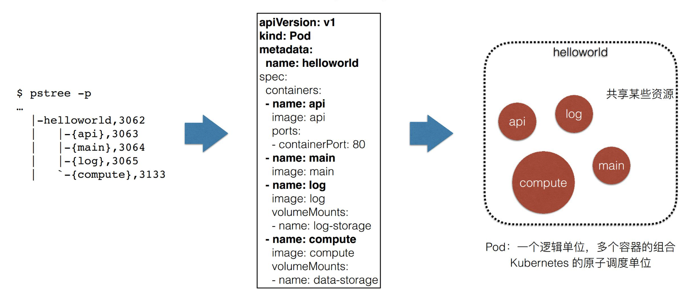
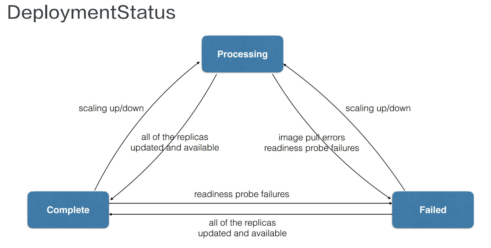
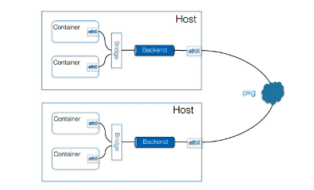

# 云原生技术基础

## 云原生概述

云原生其实是一套指导进行软件架构设计的思想。云原生认为未来的软件会从诞生起就生长在云上，并且遵循一种新的软件开发、发布和运维模式，从而使得软件能够最大化地发挥云的能力。

容器技术使得应用具有了一种“自包含”的定义方式。所以，这样的应用才能以敏捷的、以可扩展可复制的方式发布在云上。
可以说容器技术是云原生技术的核心。除此之外云原生的技术范畴还包括：

> * 云应用定义与开发流程。包括应用定义与镜像制作、配置 CI/CD、消息和 Streaming 以及数据库等。
> * 云应用的编排与管理流程。这也是 Kubernetes 比较关注的一部分，包括了应用编排与调度、服务发现治理、远程调用、API 网关以及 Service Mesh。
> * 监控与可观测性。这部分所强调的是云上应用如何进行监控、日志收集、Tracing 以及在云上如何实现破坏性测试，也就是混沌工程的概念。
> * 云原生的底层技术，比如容器运行时、云原生存储技术、云原生网络技术等。
> * 云原生工具集，比如流程自动化与配置管理、容器镜像仓库、云原生安全技术以及云端密码管理等。
> * 最后则是 Serverless。即无服务器运算，代码运行所需要的服务器服务皆由云端平台来提供。

云原生技术的本质是两个理论基础：

- **不可变基础设施**，其含义就是应用的基础设施应该是不可变的，是一个自包含、自描述可以完全在不同环境中迁移的东西；这一点目前是通过容器镜像来实现的；
- **云应用编排理论**：当前的实现方式就是 Google 所提出来的“容器设计模式”，这也是随后 Kubernetes 部分所需主要讲解的内容。

云原生技术的意义在于，可以通过镜像构建自描述的应用，这些应用可以更好地实现扩容。并且通过这些镜像运行的容器可以像`Kubernetes`的`Operator`技术一样做到自运维，所以整个应用系统本身都是自包含的。这使得能够非常方便的迁移在任何云上。


## 容器基本概念

在操作系统中，进程作为系统资源分配的基本单位，其相互之间可以互相通信、共用一套文件系统、共用系统资源。
这也导致了一些问题，比如：

> * 高级权限的进程可以攻击其他进程
> * 文件系统使用的冲突
> * 进程对CUP和内存等系统资源的抢占

针对以上三个问题，分别有一下方案来为进程提供独立的运行环境：

> * 使用 Namespace 技术来实现进程在资源的视图上进行隔离，这些系统资源包括进程ID、主机名、用户ID、网络访问、进程间通讯和文件系统等。
> * Linux 和 Unix 操作系统可以通过`chroot`系统调用将子目录变成根目录，达到视图级别的隔离；进程在 chroot 的帮助下可以具有独立的文件系统，对于这样的文件系统进行增删改查不会影响到其他进程；
> *  `Cgroup`可以用来限制进程的资源使用率，设置其能够使用的 CPU 以及内存量。

而以上提到的拥有**视图隔离、资源可限制、独立文件系统的进程集合**，就是所谓的**容器**。
与此同时，因为容器使用的是系统的资源，所以在独立的文件系统内不需要单独具备内核相关的代码或者工具。
由于容器基于操作系统内核运行，所以需要提供容器运行所需的二进制文件、配置文件以及依赖，而所有的这些描述文件集合称之为**容器镜像**

在构建镜像时，每个构建步骤都会对当前的文件系统进行操作，使得文件系统内容的变化，我们将这些变化称之为`changeset`。当我们把构建步骤所产生的变化依次作用到一个空文件夹上，就能够得到一个完整的镜像。
并且`changeset`的方式使得可以并行下载这些数据，提高分发效率；而且这些数据是在容器间共享的，可以节约大量的磁盘空间；并且下载镜像时只需要下载本地不存在的数据。

构建好的容器通常会上传到一个仓储中心（比如docker repository），以供测试/生产环境下载并使用。

在Docker中当一个容器开始运行时，会使用指定镜像所提供的文件系统，并指定一个`initial`进程来管理容器内的子进程，当容器需要推出时，initial 进程会让所有的子进程随之推出，防止资源的泄漏。
对于有状态的程序而言，产生的数据往往是需要持久化保存的（比如数据库），则需要一个独立于容器生命周期的存储方式。在Docker中，可以通过创建数据卷的方式，将宿主机的目录挂在到容器中，以实现数据的持久化保存。

moby 容器引擎架构 todo

相较于容器，VM可以在宿主机上建立一个独立的Guest OS，拥有独立的内核及系统资源。对应的代价就是消耗一部分的计算资源用于虚拟化以及大量的磁盘空间，但却可以提供一个更好的隔离效果。


## Kubernetes核心概念

Kubernetes 是一个自动化的容器编排平台，它负责应用的部署、应用的弹性以及应用的管理，这些都是基于容器的。
其具备以下几个核心功能：

* 服务的发现与负载的均衡
* 容器的自动装箱(scheduling)，也就是“调度”，即把一个容器放到一个集群的某一个机器上。Kubernetes 会帮助我们去做存储的编排，让存储的声明周期与容器的生命周期能有一个连接
* 自动化的容器的恢复。在一个集群中，当某些原因导致容器本身的不可用，Kubernetes 会自动尝试对这些不可用的容器进行恢复
* 应用的自动发布与应用的回滚，及应用相关的配置密文的管理
* 批量的 job 执行
* 应用的水平的伸缩

Kubernetes 架构是一个比较典型的二层架构和 server-client 架构。
Master 作为中央的管控节点，会去与 Node 进行一个连接。 所有 UI 、clients和user 侧的组件，只会和 Master 进行连接，把希望执行的命令发送给 Master，Master 会把这些命令下发给相应的节点，进行最终的执行。

### 架构

**Master**

Kubernetes 的 Master 包含四个主要的组件：API Server、Controller、Scheduler 以及 etcd。如下图所示：

- **API Server**：用于处理 API 操作的，Kubernetes 中所有的组件不会进行单独连接，而是和 API Server 进行连接，依赖于 API Server 传送消息；API Server本身也是一个可以水平扩展的一个部署组件；
- **Controller**：用于管理集群状态。比如自动对容器进行修复、自动进行水平扩张，都由 Controller 来进行完成；
- **Scheduler**：完成调度的操作。根据用户提交 Container 的 CPU， memory 请求大小等，找一台合适的节点，进行放置；
- **etcd**：是一个分布式的一个存储系统，API Server 中所需要的元信息都被放其中。etcd 本身是一个高可用系统，通过 etcd 保证整个 Kubernetes 的 Master 组件的高可用性。

**Node**

 Node 是真正运行业务负载的，每个业务负载会以`Pod`的形式运行。一个 Pod 中可以运行的一个或者多个容器，真正去运行这些 Pod 的组件的是叫做 `kubelet`，也是 Node 上最关键的组件。它通过 API Server 接收到所需要 Pod 运行的状态，然后提交到`Container Runtime`组件中：
Kubernetes 不会直接进行网络和存储的操作，而是通过 Storage Plugin 或 Network Plugin 来进行。用户自己或者云厂商都会去写相应的 **Storage Plugin** 或者 **Network Plugin**，去完成存储操作或网络操作。

在 Kubernetes 自己的环境中，也会有 Kubernetes 的 Network。其目的是为了提供 Service network 来进行搭网组网。真正完成 service 组网的组件的是 **Kube-proxy**，通过`iptable`来进行组建 Kubernetes 的 Network，就是`cluster network`。

下面这张图是Kubernetes 对一个 Pod 的部署流程，让我们看一下各组件之间是如何协作的：
首先一个 Pod 被 UI 或者 CLI 提交到 API Server。此时 API Server 会将这个信息写入 etcd，然后 Scheduler 通过 watch 到机制，获取到一个 Pod 需要被调度的信息。然后根据 Scheduler 的调度策略之后，Scheduler 会将该 Pod 需要被调度到哪个 Node 的信息发送给 API Server。API Server 将该信息写入 etcd， 然后相应节点的 Kubelet 也是通过 watch 机制获取到信息，调用 Container runtime 来真启动配置这个容器的运行环境和并启动容器，调度 Storage Plugin 来去配置存储，调用 Network Plugin 去配置网络。

### 核心概念

**Pod**
Pod 是 Kubernetes 的一个最小调度及资源单元。
用户通过 Kubernetes 的 Pod API 生产一个 Pod，并交由 Kubernetes 进行调度，即将其放在某一个 Kubernetes 管理的节点上运行起来。一个 Pod 通常是对**一组容器**的抽象，并为其中的容器提供共享的运行环境，即同一 Pod 中的容器可以通过`localhost`连接。

**Volume**
Volume 本身是一个抽象的概念，是声明在 Pod 中的容器可以访问的文件目录。
一个 Volume 可以被挂载在 Pod 中**一个或者多个**容器的指定路径下。其本身支持了本地存储、分布式存储及云存储等多种存储方式。

**Deployment**
Deployment 是在 Pod 之上更上层的抽象，Pod 是组成 Deployment 最小的单元。
Deployment 可以定义一组 Pod 的副本数目、及这个 Pod 的版本。通常用它来做真正的应用管理。Controller 会维护 Deployment 中 Pod 的数目，并帮助 Deployment 自动恢复失败的 Pod。通过 Deployment 和 Controller，我们也可以进行滚动升级或者进行版本回滚。

**Service**
Service 为一个或者多个 Pod 实例提供稳定访问地址，以达到对外部用户暴露服务的目的。
实现 Service 有多种方式， Cluster IP、 kuber-proxy 的组网、 nodePort、 LoadBalancer 等。

**Namespace**
Namespace 用于一个集群内部的逻辑隔离，包括鉴权、资源管理等。
Kubernetes 的每个资源，比 Pod、Deployment、Service 都必须属于一个 Namespace。同一个 Namespace 中的资源名称需要唯一。

**Kubernetes API**
Kubernetes API 通过 HTTP+JSON/YAML 的方式暴露。
command tool，Kubernetes UI，或者有时 curl 直接与 Kubernetes 进行沟通，都是使用这种方式。下面是一个提交 Pod， YAML 表达的例子：

```yaml
apiVersion: v1				# 指定版本
kind: Pod							# 指定资源类型
metadata:							# 对资源的一些用户层面的描述
	name: myPodName
	labels: 								# 可以被 selector
		mykey: myvalue
spec:									# 希望该资源的一个预期的状态
	containers:
	- name: myContainer
		image: myImage
		ports:
		- containerPort: 80
```


## Pod和容器设计模式

### Pod概述

在了解Pod之前我们可以通过操作系统来进行一个类比：
根据前面的章节我们知道容器的本质实际上是一个进程，是一个视图被隔离，资源受限的进程。假设在 Linux 中我们有一个 Hellowork 程序，这个程序是由多个线程组成的。这些线程共同协作，共享 Hellowork 程序分配到的资源。这是 Linux 里面进程组或者线程组中一个非常真实的例子。而如果我们想用容器来类比这里的操作系统，并将 Hellowork 程序跑起来，将会遇到一些问题。
首先容器的设计是“单进程”的，不是说容器只能启动一个进程，而是因为容器的应用等于进程，所以只能管理PID=1的这个进程。其他的进程应该由PID=1的进程进行管理。如果将PID=1的进程赋予 systemd 的能力去管理其他进程，将会面临更多的问题。比如，如果该该进程挂掉了，其管理的进程将会没有人能够管理它们，没有人能够回收它们的资源。此外，因为我的应用被 systemd 给接管了，那么这个时候应用状态的生命周期就不等于容器生命周期，这个管理模型实际上是非常复杂的。

Pod实际上正是 kubernetes 项目抽象出来的一个可以类比为进程组的概念。
上述提到的 Hellowork 程序在 k8s 中实际上会被定义为拥有多个容器的Pod，每个容器相当于 Hellowork 中的一个线程。也就是说，在 k8s 中启动 Hellowork 程序的时候，会有多个容器启动起来，而这些容器通过 Pod 这个逻辑概念联系起来，共享一些属于 Pod 的资源。我们可以通过如下的 yaml 文件比较清晰的看到这个逻辑关系：图中提到了 **Pod 是 k8s 的原子调度单位**。那么为什么 Pod 是原子调度单位呢？让我们通过下面的例子来看一下。

假设我们有两个容器，一个是 App 负责业务，产生日志，需要内存1G。一个是 LogCollector 负责将日志转发到 ElasticSearch 中，需要内存0.5G。目前我们有两个可用节点 NodeA 可用内存1.25G，NodeB 可用内存2G。试想一下，如果 App 先被调度到 NodeA 上之后，该节点上资源已经不够再部署 LogCollector 了。但是这两个容器因为需要相互协调，所以必须部署在统一节点上才能正常运行。
上述这个典型的例子英文叫做 Task co-scheduling 问题。当然对这个问题有一些解法，比如 Google Omega 采用的是乐观调度的方式，先不管冲突的情况，当冲突产生是通过回滚的机制来解决问题。而在 k8s 中使用 Pod 来作为原子调度单位，使得这个问题根本不存在。

### Pod的资源共享

现在我们已经知道 Pod 一个逻辑概念。并且通过 Pod 我们可以更好的解决以下一些问题：

> * 两个容器之间会发生直接的文件交换，前面提到的例子就是这样，一个写日志，一个读日志；
> * 两个容器之间需要通过 localhost 或者说是本地的 Socket 去进行通信；
> * 这两个容器或者是微服务之间，需要频繁的 RPC 调用，出于性能的考虑，也希望它们部署在同一节点；
> * 两个容器需要共享某些 Linux Namespace。比如：有一个容器需要加入另一个容器的 Network Namespace。以便能看到另一个容器的网络设备，和它的网络信息。

总结一下其实就是在同一个 Pod 中的容器，可以实现**网络和存储**的共享。

**共享网络**
在每个 Pod 里面，k8s 为我们内建了一个名为`Infra container`的容器，通过这个这个容器来共享整个 Pod 的 Network namespace。
Infra container 只有100多KB，其他所有容器都会通过 Join Namespace 的方式加入到 Infra container 的 Network Namespace 中。并且 Infra container 有一个IP地址，这也是 Pod 的IP地址。所以在 Pod 启动的时候，必然是 Infra container  第一个启动，整个 Pod 的生命周期是等同于 Infra container 的生命周期的。这也是为什么 k8s 能够允许我们单独更新 Pod 里某个镜像（Pod 不会重建也不会重启）的原因。

**共享存储**
Pod 共享存储的方式跟 Dokcer 类似，也是通过 volume 的方式在容器之间共享，只不过 k8s 支持更多类型的卷。
在 Pod 中通常需要先声明 volume ，然后再将其挂在到需要的容器上，以实现共享存储。下面是声明一个 hostPath 类型的 volume 并将其挂载到容器的例子：

```yaml
apiVersion: v1
kind: Pod
metadata:
  name: myPod
spec:
  volumes:
  - name: shared-data
    hostPath: 
      path: /data
  containers:
  - name: App
  	image: app
  	volumeMounts:
  	- name: shared-data
  		mountPath: /usr/share/log
  - name: LogCollector
  	image: log_collector
  	volumeMounts:
  	- name: shared-data
  		mountPath: /pod-data
```

### Sidecar 设计模式

我们还是先通过一个例子来看下：有一个 war 包需要在 Tomcat 中启动，我们应该怎么发布？
首先最简单的方式就是将 war 包和 Tomcat 打包成一个镜像。但是这样无论 war 包还是 Tomcat 更新，我们都需要重新制作镜像。
或者我们可以只将 Tomcat 打包成镜像，然后通过 volume 将宿主机上的 war 包挂载进 Tomcat 容器。但是这样我们需要保证在 Pod 启动之前， war 包已经存在在 volume 里了。我们可以单独编写一个 Kubernetes Volume 插件来实现这个功能。但其实还有更通用的方式。

k8s 提供了一个名叫 InitContainer 的特殊容器，这个容器将会将会在 Pod 内的应用容器启动之前运行，并且严格按照定义顺序来依次执行。我们可以借此来实现上述的例子：
```yaml
apiVersion: v1
kind: Pod
metadata:
  name: javaweb
spec:
  volumes:
  - name: app-volume
    emptyDir: {}
  initContainers:
  - image: sample
    name: war
    command: ["cp", "sample.war", "/app"]
    volumeMounts:
     - name: app-volume
       mountPath: /app
  containers:
  - name: Tomcat
  	image: tomcat
  	command: ["sh", "-c","/root/tomcat/bin/start.sh"]
  	volumeMounts:
  	- name: app-volume
  		mountPath: /root/tomcat/webapps
  	ports:
  	- containerPort: 8080
  		hostPort: 8001
```

首先我们定义了一个类型为 emptyDir 的数据卷，然后定义 initContainers 挂载该数据卷。并制定了命令将镜像中的 war 包拷贝到了 volume 中。在名为 Tomcat 的 container 中也挂在了该数据卷。因为 initContainer 会先于其他 container 执行，所以当发布并且名为 Tomcat 的 container 启动时，一定会在该数据卷中找到对应的 war 包。

所以像这种，定义一些专门的容器，来执行主业务容器所需要的一些辅助工作的方式被称为“**Sidecar**”。
这种做法一个非常明显的优势就在于，辅助功能和业务的结偶，并且可以将该功能重用。当然，利用这种模式我们还可以做更多的事情，比如以下功能都可以通过定义成单独的 container 来完成：

* 容器启动前需要执行的一些脚本
* 日志收集
* Debug应用 // [proxy、sidecar 还是 service mesh？](https://www.tetrate.io/blog/how-to-debug-microservices-in-kubernetes-with-proxy-sidecar-or-service-mesh/?lang=zh-hans)
* 应用监控

让我们来看一下更详细的 Sidercar 模式的例子：

**Sidecar：应用于日志收集**
就像之前在共享存储中我们提到的日志收集，业务容器将日志写入 volume 里面，通过 volume 共享给日志容器。这里的日志容器就是 Sidecar 容器。现在业界常用的 Fluentd 日志进程或日志组件，基本上都是这样的工作方式。


**Sidecar：代理容器**
如果有一个 Pod 需要访问外部的一个集群系统，我们可以在业务容器的代码里记录所有这些集群的地址。
但是更好的处理方式是通过一个代理容器，由代理容器来记录集群的地址，而业务容器的请求只需要发送到代理容器即可。这里的代理容器也就是 Sidecar 容器。值得注意的是，因为在一个 Pod 里面容器共享网络，所以这里的代理几乎没有性能耗损。


**Sidecar：适配器容器**
假如我们现在有一个服务对外提供 API 服务，但要求接收的格式是 A 格式。有一个外部系统只能以 B 格式的方式请求到业务容器。这个时候除了直接修改业务容器的代码，我们还可以通过一个 Adapter Container 来对外部请求进行处理然后转发至业务容器。比如，业务容器暴露的接口是 business/a，适配容器接收 business/b， 并通过 localhost 转发给业务容器。


## 应用编排与管理

### 核心原理概述

#### metadata

k8s 的资源对象主要包括以：spec 描述资源期望状态；status 描述资源当前状态; metadata 描述对象的一些元数据;
metadata 又主要分为以下部分：

**labels** 
资源标签，是一种 KV 类型的元数据，用于识别资源；
标签既可以打在 Pod 上也可以打在 Node 上，下面是一些标签的例子：

```yaml
environment: production
release: stable
app.kubernetes.io/version: 5.7.21
failure-domain.beta.kubernetes.io/region: cn-shanghai
```

selector 可以根据资源的 labels 来筛选资源，比如下图有四个 Pod ，我们可以使用`kubectl get pods -l Env in (test, gray)`或者`kubectl get pods -l Env notin (dev, prod)`筛选出虚线框中的 Pod 


**annotations**
一般是用来存储非标示性信息，可以用于扩充 spec/status 的描述。annotations 也是采用 KV 存储，但是通常会比 label 存储更长的信息，并且可以包含特殊字符，也支持结构化数据。下面一些例子：

```yaml
service.beta.kubernetes.io/alicloud-loadbalancer-cert-id: your-cert-id
nginx.ingress.kubernetes.io/service-weight: "new-nginx:20,old-nginx:60"
kubectl.kubernets.io/last-applied-configuration: {"apiVersion":"apps/v1","kind":"Deployment","metadata":{"annotations":{},"name":"nginx-deployment","namespace":"default"},"spec":{"selector":{"matchLabels":{"app":nginx}},"template":{"spec":{"containers":[{"image":"nginx1.7.9","name":"nginx"}]}}}}
```

**ownereference**
用于引用描述资源的属主对象。比如，replicaset 控制器创建来一个 Pod，该 Pod 的 ownerreference 就会指向该 replicaset，这让我们可以方便的找到一个资源的属主对象。此外，还可以用 ownerreference 来实现级联删除的效果。

#### 控制器模式

k8s 的控制器依赖声明式的 API，即用户不需要定义具体的操作，而只需要定义所有需要的资源和期望运行的方式。
相较于命令式 API ，该方式天然的记录了集群运行的状态。并且保证了操作一定是幂等的。同时不用担心命令式 API 的重复和并发指令等问题。
而控制器模型则通过**控制循环**（Control Loop）将 k8s 的资源调整为声明式 API 对象期望的样子。在控制循环中包括了控制器，被控制的系统，以及能够观测控制系统的传感器，三个逻辑组件。
外界通过修改 spec 来控制资源，控制器比较资源等 spec 和 status 从而计算出一个 diff，Controller 由此来决定对系统进行什么操作。并且会使得系统产生新的输出信息，被 sensor 以资源 status 的形式上报，从而不断让系统向 spec 表示终态趋近。

**Sensor**
主要由 Reflector、Informer、Indexer 三个组件构成：
Reflector 通过 list 和 watch k8s 的API server 来获取资源的数据。随后将资源对象以及对资源对象操作的类型一起添加到 Delta 队列中，该队列可以保证资源对象在列表中只有一条记录。
Infomer 会从 Delta 队列取出数据，并交给 Indexer 记录到缓存中。该缓存是线程安全的，可以被所有的 Controller 共享，并且默认设置下是用**资源的命名空间来做索引**的。并且 Informer 会将这次操作事件交给回调函数处理。

**Controller**
主要由事件处理函数以及 worker 组成:
回调函数由具体的 controller 实现，并根据自身业务需求在 k8s 中进行注册。回调函数会根据操作的类型来判读是否处理。对需要被处理的事件，会将**事件关联资源的命名空间以及名字**添加到 work 队列中，该队列也会进行去重保证资源唯一。
worker 会从队列中取出资源对象名称，并通过缓存可以获取到最新的资源数据。然后根据控制器的功能做相应的处理。如果更改了资源对象则需要将修改同步到 API Server。对于处理失败的情况，worker 会将消息重新放回队列，以便之后重试。

让我们通过一个 ReplicaSet 扩容的例子，完整的看一下控制循环的工作流程。
ReplicaSet 是一个用来描述无状态应用的扩缩容行为的资源，ReplicaSet controler 通过监听 ReplicaSet 资源来维持应用希望的状态数量。假设我们将下面的 ReplicaSet 资源副本数修改为3：

```yaml
apiVersion: apps/v1
kind: ReplicaSet
metadata:
	name: rsA
	namespace: nsA
spec:
	replicas: 2						# 2 => 3
	selector: 
		matchLabels:
			env: prod
	template:
		metadata:
			lables:
				env: prod
		spec:
			containers:
				image: myapp
				name: myapp
status:
	replicas: 2
```

首先 Reflector 会从 API Server 那里获取到 ReplicaSet 的变化，然后向 Delta 队列中推入 rsA 的对象，操作类型是更新。
Informer 会将最新的 ReplicaSet 信息存入缓存中，并用 nsA 作为索引，并调用 Update 的事件回调函数。
ReplicaSet 控制器会通过回调函数发现 ReplicaSet 发生了变化，然后将 nsA/rsA 字符串塞入到工作队列中。
某个 worker 从队列中获取到这条消息后，会从换缓存中获取到最新的 ReplicaSet 和 ReplicaSet 下所有对应的 Pod 的数据。通过比较 ReplicaSet 中 spec、 status 以及 Pod 发现，需要对这个 ReplicaSet 进行扩容。于是 ReplicaSet 的 Worker 创建了一个 pod，并让 ownereference 指向 ReplicaSet rsA。
创建 Pod 之后，会将消息同步到 API Server，Reflector 又会获取到 Pod 的变化。Informer 将 Pod 信息存入缓存中。 Informer 触发 Add 的回调函数。Add 回调函数通过 pod ownerreferences 获取到 ReplicaSet 命名空间，并推入工作队列中。 Worker 再次从缓存获取到 ReplicaSet 和对应的 Pod 的数据。通过比较 ReplicaSet 中 spec、 status 以及 Pod 发现，pod 已经满足 spec，于是更新 status 使得 spec 和 status 达成一致。

**k8s 中资源的修改会驱动控制器向设置的终态趋近，并且 k8s 中的控制器和资源都是可以自定义的，所以我们能够实现自动化运维操作。**

### Deployment

#### 概述

如果我们直接管理集群中的 Pod 必然会面临以下问题：

1. 如何保证集群内可用的 Pod 数量？
2. 如何为所有 Pod 更新镜像，并保证可用性？
3. 如何回滚？

如果要人为的去管控所有集群中的 Pod。那么当集群达到一定规模的时候，这必定是不太现实的。而 Deployment 正是用来管理部署发布的控制器。
Deployment 可以帮助我们维持 Pod 数量与预期数量一致，并且可以根据配置的策略实施滚动发布。而且也支持回滚。下面是一个 Deployment 的 yaml 文件：

```yaml
apiVersion: apps/v1
kind: Deployment
metadata:						# Deployment的元信息
	name: nginx-deployment
	labels:
		app: nginx
spec:
	replicas: 3				# 期望的Pod数量
	selector:					# Pod选择器
		matchLabels:
			app: nginx
	template:					# Pod模版
		metadata:
			labels:
				app: nginx
		spec:
			containers:
			- name: nginx
				image: nginx:1.7.9
				ports:
				- containerPort: 80
```

Deployment 作为 k8s 的资源，也拥有自己的元数据信息。在 Deployment.spec 中核心字段 replicas 用于定义期望运行的 Pod 数量为3。selector 用于匹配该 Deployment 管理的 Pod。template 中的内容是用来定义给 Deployment 控制器如何创建和管理一个我们需要的 Pod，其语法和普通的 Pod 基本一样，apiVersion 与 Deployment 一致。

当我们在 k8s 中创建以上资源之后，Deployment 会自动创建三个运行 nginx 容器的 Pod。这些 Pod 的名称会满足以下格式：
```
${deployment-name}-${template-hash}-${random-suffix}
```

并且 Pod 的 ownerReference 是 ReplicaSet 而非 Deployment。事实上所有的 Pod 都是由 ReplicaSet 创建出来的，并且这个 ReplicaSet 的 name 满足以下格式：

```
${deployment-name}-${template-hash}
```

通过以下一些命令也可以帮助我们快速实现开头提到的，更新 Pod 镜像和快速回滚的功能：

```bash
# 更新Deployment中Pod的镜像
kubectl set image deployment.v1.apps/[NAME] [NAME]=[IMAGE]:[VERSION]
# 快速回滚
kubectl rollout undo deployment.v1.apps/[NAME]
kubectl rollout history deployment.v1.apps/[NAME] # 查看历史版本
kubectl rollout undo deployment.v1.apps/[NAME] --to-version=[VERSION]
```

Deployment 拥有三种状态，并且转化关系如下：


#### 管理模式

我们刚刚提到，Deployment 中定义的 Pod 模版，最后创建者为 ReplicaSet。实际上，Deployment 只负责管理不同版本的 ReplicaSet，由 ReplicaSet 去管理 Pod 的副本数。我们每次修改 Deployment 的 template 都会生成一个新的 ReplicaSet 。


**ReplicaSet 控制器**
在上一章节中，我们详细描述过 ReplicaSet 控制器的原理，让我们通过下图再回忆一下：


**Deployment 控制器**
对于 Deployment 控制器来说，跟其他所有控制器一样，也是根据 Infomer 中的 Event 来执行 Handler。不过 Deployment 控制器只关注 Deployment 和 ReplicaSet 中的 event，收到事件会将其加入到队列中。

Deployment controller 从队列中取出事件后，会先检查是否需要新的发布。这里需要解释一下这个 paused。如果 Deployment 的 spec.paused 为 true 那么 PodTemplateSpec 的任何修改都不会触发新的上线。Deployment 在创建时默认不会处于暂停状态。所以我们对 Deployment 模版的修改会立即生效，即 Pod 会立即滚动更新。我们可以通过以下命令先暂停 Deployment 的发布，然后在设置好模版之后，再继续 Deployment 的上线。

```bash
kubectl rollout pause deployment.v1.apps/[NAME]
kubectl rollout resume deployment.v1.apps/[NAME]
```

如果 Deployment 已经被暂停的话，即 paused 为 true，则 Deployment controller 会直接去同步 replicas 到对应的 ReplicaSet。此时， Deployment 仍然可以进行原来 Pod 的扩展。然后回去更新 Deployment 的 status，并同步给 API Server。
当我们将暂停的 Deployment 继续时，spec 的修改会让 Deployment controller 再次执行，此时 paused 为 false。Deployment controller 会进行 Rollout，即通过 Create/Update/Delete 等方式更新 ReplicaSet。

我们再通过一些例子来看一下 Deployment 做了些什么：

**扩/缩容**
Deployment 的副本数由 ReplicaSet 来管理，当我们修改 replicas 时 Deployment controller 会直接将 replicas 同步给 ReplicaSet 由 ReplicaSet 来进行扩/缩容。


**发布**
Deployment 会根据的 template 创建对应的 ReplicaSet，我们假设为 t1 和 rs1。当我们修改 t1 为 t2 时，Deployment 会重新新建一个 rs2，并根据某些我们之后会讲到的一些配置**逐步**修改 rs1 和 rs2 的数量，最后使得 rs1 数量为0，rs2 数量为 replicas 所期望的数量。


**回滚**
回滚时 Deployment 也是直接根据需要回滚的版本找到对应的 ReplicaSet，然后逐步修改当前的 ReplicaSet 和指定版本的 ReplicaSet 的数量，最后使得指定版本的 ReplicaSet 数量为 replicas 所期望的数量。


#### 常用配置

* `.spec.minReadySeconds`：是一个可选字段，用于指定新创建的 Pod 在没有任意容器崩溃情况下的最小就绪时间， 只有超出这个时间 Pod 才被视为可用。默认值为 0
* `.spec.revisionHistoryLimit`：是一个可选字段，用来设定出于会滚目的所要保留的旧 ReplicaSet 数量。
* `.spec.progressDeadlineSeconds` 是一个可选字段，用于指定系统在报告 Deployment [进展失败](https://kubernetes.io/zh/docs/concepts/workloads/controllers/deployment/#failed-deployment) 之前等待 Deployment 取得进展的秒数。 
* `.spec.strategy.type`： 值为`RollingUpdate`时采取滚动更新的方式更新 Pods。
* `.spec.strategy.rollingUpdate.maxUnavailable` 是一个可选字段，用来指定 更新过程中不可用的 Pod 的个数上限。可以是数字，也可以时百分比，例如，10%。
* `.spec.strategy.rollingUpdate.maxSurge` 是一个可选字段，用来指定可以创建的超出期望 Pod 个数的 Pod 数量。也可以时数字或者百分比，但不能与`maxUnavailable`同时为0。

### Job

#### 概述

有些时候我们可能希望在系统中执行一些脚本任务，而 Pod 并不能够很好的满足我们的这种需求。比如：确保 Pod 的正确结束，并且如果失败要进行重试；多个任务之间有依赖的情况；控制任务在一定数量下并行执行；而 k8s 提供的 Job 正是为了解决这些问题的。下面是一个 Job 的 yaml 文件：
```yaml
apiVersion: batch/v1
kind: Job
metadata:
	name: pi
spec:
	completions: 8				# 执行次数
	parallelism: 2				# 并行执行的个数
	template:
		spec:			# 计算圆周率
			containers:	
			- name: pi
				image: perl
				command: ["perl", "-Mbignum=bpi","-wle", "print bpi(2000)"]
			restartPolicy: Never		# 重启策略
	backoffLimit: 4			# 重试次数
```

`.spec.template`依旧和之前的一样用于描述 Pod。新出现的一些配置
`.spec.completions`指定该 Job 的执行次数，未设置时默认等于`.spec.parallelism`的值
`.spec.parallelism`指定该 Job 可以并行执行的次数，未设置时默认等于1
`.spec.backoffLimit`用于设置该 Job 的重试次数
`.spec.template.spec.restartPolicy`是设置重试的策略，值可以是 Never、OnFailure、Always
可见 Job 的最后执行单元也是 Pod。由 Job 创建出来的 Pod 的 ownerReference 指向创建它的 Job，并且名称满足以下格式：

```
${job-name}-${random-suffix}
```

除此之外，Job 也支持 CronJob 方式的定义。下面是一个 CronJob 的 yaml 文件：
```yaml
apiVersion: batch/v1
kind: CronJob
metadata:
	name: hello
spec:
	schedule: "*/1 * * * *"		# 设置时间
	jobTemplate:
		spec:
			containers:	
			- name: hello
				image: busybox
				args: 
				- /bin/sh
				- -c
				- date; echo Hello from the k8s cluster
			restartPolicy: OnFailure
	startingDeadlineSeconds: 10
	concurrentPolicy: Allow
	successfulJobHistoryLimit: 3
```

`.spec.schedule`用于设置执行时间，格式与 Linux 的 crontime 一致
`.spec.startingDeadlineSeconds`设置该 Job 可以等待的最长时间。有时一个 Job 运行之后可能很久才启动，如果超出这个时间，这个 CronJob 就会停止这个 Job
`.spec.concurrentPolicy`设置 CronJob 创建的任务执行时发生重叠如何处理。值可以是 Allow，Forbid，Replace
`.spec.JobsHistoryLimit`设置执行 Job 的历史存留数。

#### 管理模式

Job 也是通过创建 Pod，然后去跟踪 Job 的状态，并且根据我们定义的配置进行重试等操作。


Job Controller 也是会通过注册回调函数 watch API Server。

然后通过回调函数讲事件传递到内存级的队列。Job controller 从队列中获取到事件之后，会根据我们定义的配置，进行判断是否需要对 Pod 进行扩容或者缩容。需要注意的是，这里 Scale Up 是通过异步声明去创建的 Pod，所以不会同步去更新 status，而 Scale down 是同步删除的，所以删除完后会立刻更新 Job 的 status。最后将 Job 的信息上报给 API Server。

### DaemonSet

#### 概述

DaemonSet 也是 k8s 提供的一个默认控制器，主要是帮我们在集群内的每一个节点都运行一组 Pod，并且在新加入节点或者移除节点时，自动创建或者移除 Pod。同时也会跟踪这些 Pod 的状态，并且在一场的时候进行 recovery 这些状态。这特别适用于集群存储进程、日志收集、监控等情况。下面是一个 DeamonSet 的 yaml 文件：

```yaml
apiVersion: apps/v1
kind: DaemonSet
metadata:
	name: fluentd-elasticsearch
	namespace: kube-system
	lables:
		k8s-app: fluent-logging
spec:
	selector:
		matchLables:
			name: fluentd-elasticsearch
	template:
		metadata:
			labels:
				name: fluentd-elasticsearch
		spec:
			containers:
			- name: fluentd-elasticsearch
				image: fluent/fluentd:v1.4-1
```

有了之前 deployment 的基础，再来看这个 yaml 其实就会比较好理解。首先定义一些版本，类型等基础信息，在`.spce.selector`中通过 matchlabes 来指定管理的 Pod。`.spec.template`跟之前提到的都是一样的。并且，也可以像 deployment 一样设置 RollingUpdate 更新策略，或者 OnDelete 仅在我们删除 Pod 后才会重建。

#### 管理模式

DaemonSet 也是一个 controller 还是会根据配置创建真正的业务单元 Pod，并监听 API Server 的状态，及时添加或者删除 Pod。


DaemonSet 的控制器和 Job 的控制器基本类似，不同的是，DaemonSet 的控制器会去监听 Node 的状态。

获取到事件后，DaemonSet 会先检查 Pod 是否有更新，如果有更新，即版本不一致，则会重新创建所有节点的 Pod。如果没有更新，即当前就是最新版本的 DeamonSet 则会去检查所有 Node 上的 Pod 状态，并更新 DeamonSet 的状态，并同步到 API Server 上。

## 应用配置管理

在使用容器部署的时候，我们实际上经常还会遇到如下一些问题：

* 一些容器中可变配置参数的处理；
* 一些敏感信息的存储，比如，私有容器仓库的身份认证信息；
* 容器要访问集群自身的身份认证，比如，需要访问 API Server；
* 容器在节点上运行的一个资源需求和限制；
* 容器在节点上是共享内核的，如何管控某个容器不会攻击其他容器；
* 方便的进行启动容器启动前的一些前置操作；

这些问题在 k8s 中都可以通过相应的配置进行解决：


### ConfigMap

主要用于管理容器所需要的配置文件、环境变量、命令行参数等可变配置。使得可变配置与容器节藕，保证了 Pod 的可移植性。下面是通过命令`kubectl get configmaps [ConfigMap name] -o yaml`获取到的一个 ConfigMap 的 yaml 文件：

```yaml
apiVersion: v1
kind: ConfigMap
metadata:
	labels:
		app: flannel
	name: kube-flannel-cfg
	namespace: kube-system
data:
	cni-conf.json: |
		{
			"name": "cbr0",
			"type": "flannel",
			"delegate": {
				"isDefaultGateway": true
			}
		}
	net-conf.json: |
		{
			"Network": "172.27.0.0/16",
			"Backend": {
				"Type": "vxlan"
			}
		}
```

其中主要包含两个部分，metadata 描述的 ConfigMap 的元数据信息，以及 data 描述的配置信息。可以看到 data 中以 KV 的形式定义了两个配置文件，Key 为文件名分别是 cni-conf.json 和 net-conf.json，Value 为文件的内容。

创建 ConfigMap 主要有两种方式，通过 kubectl  指定文件，或者 kubectl 指定键值对的方式。具体命令如下：

```bash
kubectl create configmap [NAME] --from-file=[FIlE_PATH] -n [NAMESPACE]
kubectl create configmap [NAME] --from-literal=[KEY=VALUE] -n [NAMESPACE]
```

ConfigMap 的使用主要有以下几种方式：
```yaml
apiVersion: v1
kind: Pod
metadata:
	name: cm-env-test
spec:
	containers:
	- name: test-container
	  image: busybox
	  command: ["/bin/sh", "-c", "env"]			# 通过env直接可以获取到
	  # command: ["/bin/sh", "-c", "echo $(SPECIAL_LEVEL_KEY)"]			# 也可以直接使用该环境变量
	  env:				# 将configMap引入成环境变量
	  	name: SPECIAL_LEVEL_KEY
	  	valueFrom:
	  		configMapKeyRef:
	  			name: special-config
	  			key: special.how
```

```yaml
apiVersion: v1
kind: Pod
metadata:
	name: cm-env-test
spec:
	containers:
	- name: test-container
	  image: busybox
	  command: ["/bin/sh", "-c", "ls /etc/config"]			# 查看引入到文件
	  volumeMounts:					# 将configMap的volume挂载到指定路径
	  - name: config-volume
	  	mountPath: /etc/config
	volumes:				# 指定configMap中的内容以文件的形式创建成volume
		- name: config-volume
		  configMap:
			  name:	special-config
	restartPolicy: Never
```

使用 ConfigMap 时需要注意：

* ConfigMap 会被放在 ETCD 中存储，根据 ETCD 的限制文件大小最大为 1MB；
* Pod 只能使用相同 namespace 下的 ConfigMap
* Pod 应用的 ConfigMap 不存在时，无法创建成功。如果使用 envFrom 的方式从 ConfigMap 创建环境变量时，如果 ConfigMap 中的 key 无效（比如key中带有数字），该环境变量不会被注入容器中，但 Pod 可以正常运行。
* 只有通过 k8s 创建的 Pod 才可以使用 ConfigMap。


### Secret

有些密码，token 等敏感信息，不太适合存储在 ConfigMap 中，而 Secret 正是 k8s 集群中用来存储这些信息的资源对象。但 Secret 使用的是 base-64 编码，所以也并不是绝对安全。下面是一个 secret 资源的 yaml 文件：

```yaml
apiVersion: v1
kind: Secret
metadata:
	name: mysecret
	namespace: kube-system
type: Opaque
data:
	username: YWRtaW4-
	password: MWYyZDFlMmU2N2Rm
```

secret 的数据是在 data 中以 KV 的形式存储的。Opaque 类型表示普通的 Secret 文件，常见的类型还有：

* service-account-token：用于 service-account 身份认证用的 Secret
* dockerconfigjson：拉取私有仓库镜像的用的一种 Secret
* bootstrap.token：是用于节点接入集群校验用的 Secret

Secret 的创建也有同过文件和通过字面量两种方式：
```bash
kubectl create secret generic [NAME] --from-file=[FILE_PATH] --type=[TYPE]
kubectl create secret generic [NAME] --from-literal=[KEY=VALUE]	# 默认类型是Opaque，base-64编码
```

使用 Secret 也可以通过类似 ConfigMap 的方式：
```yaml
apiVersion: v1
kind: Pod
metadata:
	name: mypod
spec:
	containers:
	- name: mypod
		image: redis
		volumeMounts:
		- name: foo
			mountPath: "/etc/foo"
			readOnly: "true"
volumes:
- name: foo
	secret:
		defaultMode: 420
		secretName: mysecret
```

还有就是私有仓库的认证信息也可以通过 Secret 来存储，并且可以在 Pod 中设置，或者通过 ServiceAccount 进行批量设置：
```yaml
apiVersion: v1
kind: Pod
metadata:
	name: private-reg
spec:
	containers:
	- name: private-reg-container
		image: private-image
	imagePullSecrets:
	- name: regSecret
```

```yaml
apiVersion: v1
kind: ServiceAccount
metadata:
	createTimestamp: 2022-01-01T01:01:01Z
	name: default
	namespace: default
	selflink: /api/v1/namespaces/default/serviceaccounts/default
	uid: 052fb0f4-3d50-11e5-b066-42010af0d7b6
secrets:				# 指定使用的所有secret
- name: default-token-uudge
imagePullSecrets:
- name: regSecret
```

使用 Secret 需要注意的是，其大小限制也是为 1MB，并且因为采用 base-64 编码，所以并不适用特别机密的信息，主要考虑谁会访问我们的集群，能访问集群就能够拿到 Secret，如果敏感要求很高可以使用开源的 vault 做一个解决方案。最后，读取  secret 时，不建议使用 list/watch 因为这会获取到 namespace 下所有的 secret，最好使用 get 的方式获取。


### ServiceAccount

ServiceAccount 主要是解决 Pod 在集群里的身份认证问题，身份认证信息就是通过刚刚提到的 Secret 来存储的。ServiceAccount 使用 Secrets 在上面的 yaml 中已经提到过了，这里就不再赘述了。让我们来看一个被默认 ServiceAccount 使用的 Secret 的 yaml：

```yaml
apiVersion: v1
data:
	ca.crt: Ld7sFD8j...			# 用于校验证书信息，base-64编码
	namespace: ZGVmYXVsdA==
	token: ZL8dsF9ds.. 			# Pod的身份校验，base-64编码
kind: Secret
metadata:
	annotations:				# 关联的ServiceAccount信息
		kubernetes.io/service-account.name: default
		kubernetes.io/service-account.uid: 320061cb-85da-11e9-909b-06b1d3b258c8
	createTimestamp: 2022-01-01T01:01:01Z
	name: default-token-34l9d
	namespace: default
	resourceVersion: "432435492"
	selflink: /api/v1/namespaces/default/secrets/default-token-34l9d
	uid: 052fb0f4-3d50-11e5-b066-42010af0d7b6
type: kubernetes.io/service-account-token
```

Pod 在创建时会把其 ServiceAccount 对应的 Secret(参考上面这个yaml)，挂载到容器的固定目录下(`/var/run/secrets/kubernetes.io/serviceaccount`)，其中包括 ca.crt 和 token。这个是 k8s 帮我们实现的。
Pod 在访问 k8s 集群时，回调用一个 InClusterConfig 方法来生成访问服务 Client 的一些信息。从这个方法中我们可以看到 ca.crt 和 token 是如何被使用的。

```go
// InClusterConfig returns a config object which uses the service account
// kubernetes gives to pods. It's intended for clients that expect to be
// running inside a pod running on kubernetes. It will return ErrNotInCluster
// if called from a process not running in a kubernetes environment.
func InClusterConfig() (*Config, error) {
  // 固定的路径和文件名
	const (
		tokenFile  = "/var/run/secrets/kubernetes.io/serviceaccount/token"
		rootCAFile = "/var/run/secrets/kubernetes.io/serviceaccount/ca.crt"
	)
	host, port := os.Getenv("KUBERNETES_SERVICE_HOST"), os.Getenv("KUBERNETES_SERVICE_PORT")
	if len(host) == 0 || len(port) == 0 {
		return nil, ErrNotInCluster
	}

	token, err := ioutil.ReadFile(tokenFile)
	if err != nil {
		return nil, err
	}

	tlsClientConfig := TLSClientConfig{}

  // 判断CA证书是否有效
	if _, err := certutil.NewPool(rootCAFile); err != nil {
		klog.Errorf("Expected to load root CA config from %s, but got err: %v", rootCAFile, err)
	} else {
		tlsClientConfig.CAFile = rootCAFile
	}

	return &Config{
		// TODO: switch to using cluster DNS.
		Host:            "https://" + net.JoinHostPort(host, port),
		TLSClientConfig: tlsClientConfig,
		BearerToken:     string(token),			// 将token作为认证信息
		BearerTokenFile: tokenFile,
	}, nil
}
```

认证完之后 Pod 的身份信息会有两部分：Group 和 User。默认情况下 Pod 只有 GET 权限，通过 RBAC 可以配置权限给 Group 或者 User，之后我们会了解如何通过 RBAC 配置更多的权限。


### Resource

Resource 即资源配置管理，可以用于定义容器所需要的资源，以及限制容器最大可用的资源。木来支持三种资源的管理：CPU、内存、临时存储。并且配置的资源数量必须是整数。下面是一个配置了资源管理的 Pod 的 yaml：

```yaml
apiVersion: v1
kind: Pod
metadata:
	name: frontend
spec:
	containers:
	- name: wp	
		image: wordpress
		resources:
			requests:
				memory: "64Mi"
				cpu: "250m"
				ephemeral-storage: "2Gi"
			limits:
				memory: "128Mi"
				cpu: "500m"
				ephemeral-storage: "4Gi"
```

当节点上的资源不足时，会按照 QoS 类将 Pod 按顺序驱逐出去。QoS 即对 Pod 服务质量进行的分类，按照驱逐顺序由后到前有以下三种：

* Guaranteed ：pod 里面每个容器都有内存和 CPU 的 request 以及 limit 的一个声明，且 request 和 limit 是一致的
* Burstable：pod 里面至少有一个容器存在内存和 CPU 的一个 request；
* BestEffort：只要不是 Guaranteed 和 Burstable，那就是 BestEffort。


### SecurityContext

为了限制容器行为避免容器攻击其他容器，k8s 为我们提供了 SecurityContext。这种限制时 k8s 通过用户配置，将配置的权限下传到系统内核，通过系统内核的机制实现的。权限和访问控制的设置项包括但不限于以下：

* 自主访问控制（Discretionary Access Control）： 基于用户 ID（UID）和组 ID（GID）来判定对对象（例如文件）的访问权限
* Linux 权能：为进程赋予 root 用户的部分特权而非全部特权
* `allowPrivilegeEscalation`：控制进程是否可以获得超出其父进程的特权
* `readOnlyRootFilesystem`：以只读方式加载容器的根文件系统

SecurityContext 可以分别对容器、Pod中所有容器、整个集群生效。下面的 yaml 展示了 Pod 级别和 Container 级别的 SecurityContext：
```yaml
apiVersion: v1
kind: Pod
metadata:
	name: security-context-demo
spec:
	securityContext:						# Pod级别的SecurityContext
		runAsUser: 1000
		runAsGroup: 3000
		fsGroup: 2000
	containers:
	- name: sec-ctx-demo
		image: busybox
		command: ["sh", "-c", "sleep 1h"]
		securityContext:					# 容器级别的SecurityContext
			allowPrivilegeEscalation: false
```


### InitContainer

关于 InitContainer 我们之前在 [Sidecar 设计模式](./云原生技术.md#Sidecar 设计模式)中有比较详细的介绍过，这里就不赘述了。


## 应用存储和持久化数据卷

### PV&PVC

之前在 Pod 中我们有简单提到过 Volumes 可以实现 Pod 中多个容器共享数据。其实 Volumes 能够实现的功能远不止于此。Pod  Volumes 的类型很多，不同类型的 Volumes 可以解决不同的问题。比如像之前提到的 secret 和 configmap 也是通过卷的形式挂载在容器中的。我们可以看看以下的一些场景：

* Pod 的销毁重建，新 Pod 如何复用旧 Pod 的数据？
* Node 宕机的时候，需要把 Pod 迁移，如何将数据一并迁移？
* 多个 Pod 之间的数据共享如何实现？
* 如何对数据卷做 resize，snapshot 等功能？

我们会发现，以上场景中 Pod Volumes 很难准确地表达它的复用/共享语义，对它的扩展也比较困难。因此，k8s 引入了 Persistent Volume 的概念，简称 PV，用于节藕 Pod 和 Volume 声明周期之间的关联。之前使用的 hostpath 也属于 PV 比较适用于用于在单节点集群上开发和测试。生产集群中通常会使用网络存储资源，即 out-of-tree。

**静态PV**
下面是利用阿里云存储创建一个 PV 的 yaml 文件：

```yaml
apiVersion: v1
kind: PersistentVolume
metadata:
	name: nas-csi-pv
spec:
	capacity:
		storage: 5Gi
	accessModes:			# 设置挂载后的读写权限
	- ReadWriteMany
	persistentVolumeReclaimPolicy: Retain		# 该volume被release之后的回收策略
	csi:			# cloud storage interface，网络存储服务提供商
		driver: nasplugin.csi.alibabacloud.com		# 指定对应网络存储的插件，需要提前在集群中提前安装
		volumehandle: data-id
		volumeAttributes:
			host: "***.cn-beijing.nas.aliyuncs.com"
			path: "/k8s"
			vers: "4.0"
```

可以看到上面这个 PV 的回收策略为 Retain，我们可以通过 PV 的生命周期来了解一下具体是什么意思：

PV 被创建之后，会进入 pending 然后进入 available 状态等待被使用。某个 Pod 需要使用 PV 时，需要先声明一个 Persistent Volume Claim 对象，简称 PVC，并制定存储需求。在该 Pod 启动之前 PersistentVolumeController 会将 PVC 与合适的 PV 绑定在一起，此时 PV 就将会进入 bound 状态。当 PVC 被删除时，PV 就会处于 release 状态，然后根据我们配置的回收策略，考虑是否需要删除 PV。
下面的两个 yaml 展示了 PVC 的创建，以及是如何被 Pod 使用的：

```yaml
apiVersion: v1
kind: PersistentVolumeClaim
metadata:
	name: nas-pvc
spec:
	accessModes:			# 设置需要的读写权限
	- ReadWriteMany
	resources:
		requests:
			storage: 5Gi
```

```yaml
apiVersion: v1
kind: Pod
metadata:
	name: nas-pvc
spec:
	containers:
	- name: pvc_test
    image: busybox
    volumeMounts:
    - name: nas-pvc
    	mountPath: /data
  volumes:
  - nmame: nas-pvc
  	persistentVolumeClaim:
  	claimName: nas-pvc		# 指定pvc的name
```

**动态供给**
以上的方式创建和使用 PV 被称为静态 PV，需要先由创建出一定大小的 PV，然后才能通过 PVC 进行绑定。更理想的状态是，当声明了一个 PVC，我们再创建合适的 PV 用于绑定，这种方式被称为 Dynamic Volume Provisioning，即动态供给。动态供给需要我们先配置一个包含创建 PV 所需要参数的 StorageClass 的模版，简称 SC。然后 k8s 中安装的网络存储服务提供商提供的插件会根据 PVC 和 SC 动态创建 PV。下面是创建一个 SC 的 yaml：

```yaml
apiVersion: storage.k8s.io/v1
kind: StorageClass
metadata:
	name: csi-disk
provisioner: diskplugin.csi.alibabacloud.com		# 指定创建PV的插件，需要提前在集群中提前安装
parameters:		# 插件需要的参数
	regionId: cn-Beijing
	zoneId: cn-beijing-b
	fsType: ext4
	type: cloud_ssd
reclaimPolicy: Delete		# 创建PV的回收策略
```

PVC 则还需要指定，由那个 SC 来创建 PV：
```yaml
apiVersion: v1
kind: PersistentVolumeClaim
metadata:
	name: disk-pvc
spec:
	accessModes:
	- ReadWriteMany
	resources:
		requests:
			storage: 5Gi
	storageClassName: csi-disk		# 指定SC
```

**PV&PVC架构设计**

上图展示了 PV 和 PVC 体系的完整处理流程，其中，csi-controller-server 和 csi-node-server 都是由云服务商提供的。csi-provisoner 和 csi-attacher 是 k8s 内建的。

首先用户提交 PVC yaml 的时候，会在集群中生产一个 PVC 对象，csi-provisioner 会通过 API Server 监听到，并结合 PVC 中声明的 SC 通过 gRPC 调用对于服务商提供的 csi-controller-server 创建真正的存储，并创建出 PV 对象。当 PV controller 通过 API Server 监听到到该 PV 后会将其与 PVC 绑定。csi-attacher 会监听集群中 PV 的状态，判断是否需要挂载或者删除对应的存储。
当 Pod 被创建提交后，会被调度到某个 Node 上创建，在 kubelet 创建 Pod 过程中，csi-node-server 会将之前创建的 PV 挂载到 Pod 对应的路径下，然后 kubelet 开始 create&start Pod 中的 container。


### 存储拓扑

通常，PV 的创建和 Pod 的创建是并发进行的，如果创建的网络存储 PV 有访问限制，比如对于指定节点的访问才被允许。可能会造成 Pod 被部署在了无法访问 PV 的节点，但 PV 依旧与 Pod 进行了绑定。我们可以通过设置 StorageClass 的`volumeBindingMode`来解决这个问题。默认情况下该参数的值是`Immediate`，我们可以将其设置为`WaitForFirstConsumer`。这样 PersistentVolume 的创建和绑定将会被延迟，直到使用该 PersistentVolumeClaim 的 Pod 被创建。并且会根据该 Pod 的调度约束条件来进行创建和绑定。
某些情况下我们仍然希望 PV 被创建在特定的拓扑结构，我们可以使用`allowedTopologies`。下面是一个动态创建 PV 并限制存储拓扑的例子：

```yaml
apiVersion: storage.k8s.io/v1
kind: StorageClass
metadata:
	name: csi-disk		#
provisioner: diskplugin.csi.alibabacloud.com		# 指定创建PV的插件，需要提前在集群中提前安装
parameters:	
	regionId: cn-Beijing
	zoneId: cn-beijing-b
	fsType: ext4
	type: cloud_ssd
volumeBindingMode: WaitForFirstConsumer		# 延迟PV的创建和绑定
allowedTopologies:		# 将PV的拓扑限制在特定的区域
- matchLabelExpressions:	# 筛选对应label的node
	- key: zone
		values:
		- cn-hangzhou-d
reclaimPolicy: Delete
```

```yaml
apiVersion: v1
kind: PersistentVolumeClaim
metadata:
	name: disk-pvc
spec:
	accessModes:
	- ReadWriteOnce
	resources:
		requests:
			storage: 5Gi
	storageClassName: csi-disk		# 
```


### **存储快照**

为了提高数据的容错，我们通常需要对线上的数据进行快照保存，并在出错时进行快速恢复。此外，对线上数据进行复制，迁移等操作也可以用快照来满足。在 k8s 中存储快照的设计跟 PV 和 PVC 的设计很类似：

通过 VolumeSnapshot 对象来声明，并指定相应的 VolumeSnapshotClass 对象，之后由集群中的相关组件动态生成存储快照以及存储快照对应的对象 VolumeSnapshotContent。
PVC 对象中有一个扩展字段`.spec.dataSource`可以指定为 VolumeSnapshot 对象，当生成 PV 时，就会根据 VolumeSnapshot 关联的 VolumeSnapshotContent 中的数据来生成 PV。


让我们看一个存储快照的例子：

```yaml
apiVersion: snapshot.storage.k8s.io/v1alpha1
kind: VolumeSnapshotClass
metadata:
	name: disk-snapshotclass	#
snapshotter: diskplugin.csi.alibabacloud.com		# 指定提供快照的插件，需要提前在集群中提前安装
```

```yaml
apiVersion: snapshot.storage.k8s.io/v1alpha1
kind: VolumeSnapshot
metadata:
	name: disk-snapshot	#
spec:
	snapshotClassName: disk-snapshotclass	#
	source:		# 需要指定基于哪个 PVC 进行快照存储
		name: dist-pvc
		kind: PersistentVolumeClaim
```

下面是通过快照恢复的例子：

```yaml
apiVersion: v1
kind: PersistentVolumeClaim
metadata:
	name: restore-pvc
	namespace: simple
spec:
	dataSource:			# 声明由此PVC创建的PV初始数据从以下VolumeSnapshot获取
		name: disk-snapshot	#
		kind: VolumeSnapshot
		apiGroup: snapshot.storage.k8s.io
	accessModes:
	- ReadWriteOnce
	resources:
		requests:
			storage: 20Gi
	storageClassName: csi-disk
```

**架构设计**
VolumeSnapshot 的架构设计与 PV&PVC 很类似：

关于创建快照，VolumeSnapshot 的创建会通过 API Server 传递到 csi-snapshotter。这是由 k8s 提供的组件，它会在物理的快照存储被创建后获得一个云服务商提供的存储 id，然后用这个 id 创建 VolumeSnapshotContent 并绑定到 VolumeSnapshot 。物理的快照存储创建是通过 gRPC 调用 csi-controller-server 完成的。
当需要从快照恢复时，创建的 PVC 同样通过 API Server 传递到 csi-provisioner，这也是由 k8s 提供的组件。还记得我们在声明 PVC 的时候需要指定的 dataSource 吗？从 dataSource 指定的 VolumeSnapshot 可以获取到 对应 VolumeSnapshotContent 中云服务商提供的存储 id。通过 gRPC 调用，并传递这个 id，云服务商就可以根据之前的数据快照恢复到一个新的数据存储中。然后 csi-provisioner 利用相关信息创建 PV 并绑定到 PVC 完成快照恢复。


## 网络概念及策略控制

### 基本网络模型

在 k8s 网络中，存在两种 IP ，Service Cluster IP 和 Pod IP。 Service Cluster IP 是一个虚拟 IP，是由 kube-proxy 使用 Iptables 规则重新定向到本地端口，再负载均衡到 Pod 上。本节的重点是 Pod IP，它是 k8s 网络中每个 Pod 独立的，并且是实际存在于某个网卡上的（可以是虚拟网卡）。
我们先看一下在 Docker 中默认的网络模型：

可以看到，Docker 在宿主机上创建了一个虚拟网桥 docker0 启动的容器会通过这个这个网桥进行连接。
而在 k8s 中，Pod 会被分配到不同的 Node 上，显然不能通过这种方式来连接。容器的网络发展复杂性就在于其是寄生在宿主机的网络上的。目前的容器网络方案大体分为 Underlay/Overlay 两类。Underlay 的特征就是容器的 IP 与宿主机的 IP 拥有相同网段，即来自同一中间分配。Overlay 则是独立于宿主机 IPM 管理的，一般只要不和宿主机 IP 不冲突都可以自由分配。
k8s 并没有提供容器网络方案的实现，而是交给第三方来实现的。因为通常在公有云中，云服务提供商都会对服务器提供现成的网络模型，而在私有云里搭建的 k8s 集群并不能假定这个网络已经存在。基于各集群所基于的不同的网络拓扑，并不能很好的实现一套标准的方案。
但 k8s 提供了标准的容器网络接口，以使得 Pod 之间能够直接通信。并对这些接口做出了以下约定：

* 任意两个 Pod 直接可以直接通信，无需经过显示的 NAT 来转换；
* Node 与 Pod 直接可以直接通信，无需显示的地址转换；
* Pod 看到自己的 IP 跟其他 Pod 看到它的 IP 是一致的，中间不能经过转换；


**Netns**
Network namespace 是实现网络虚拟化的内核基础，它能隔离多个不同的网络空间。这就相当于可以提供一个完全独立的网络，并且是与主机网络是隔离的。在 k8s 中，每个 Pod 都会有一个独立的网络空间。通过下图我们可以看到 Pod 与 Netns 的关系：

Pod 中的 Container 会共享这个网络空间，一般 k8s 会推荐选用 Loopback 接口，在 pod net container 之间进行通信，而所有的 container 通过 pod 的 IP 对外提供服务。对于宿主机上的 Root Netns 则可以看作一个特殊的网络空间。

**主流网络方案**
以下是比较主流的几个方案及特点：

* Flannel：提供了多种网络 backend，并实现了不同的拓扑，可以覆盖多种场景；
* Calico：采用了**策略路由**，节点之间采用 BGP 的协议，功能比较丰富，但是需要底层网络 mac 地址能直通；
* Canal： 对Flannel 的优点和 Calico 的优点做一些集成；
* WeaveNet：它的动态方案可以实现比较好的加密；

其中 Flannel 是目前最普遍的方案，通过将 backend 机制独立，目前已经支持多种数据路径，也适用于 overlay/underlay 等多种场景。下图是一个简单的 Flannel 结构图：

可以看到它首先解决的就是 container 的数据如何到达宿主机，这里是通过 Bridge 的方式。而 Backend 是独立的，也就是说可以选用不同的实现方式。

### Network Policy

目前为止，我们提到的 k8s 网络模型都是 Pod 之间全互联的，但是有些时候我们可能会希望在 k8s 中做一些网络隔离。这时候就需要用到 Network Policy 的概念。Network Policy 通过各种选择器（标签或 namespace）来筛选通信的资源，然后通过定义的规则决定是否可以互通。
但是 Network Policy 的使用需要网络插件的支持，比如 Calico，WeaveNet等，值得注意的是 Flannel 其实是不支持的。并且在使用 Network Policy 之前需要在 API Server 上开启：extensions、v1beta1、networkpolicies。下面是一个 Network Policy 的配置实例：

```yaml
apiVersion: networking.k8s.io/v1
kind: NetworkPolicy
metadata:
  name: test-network-policy
  namespace: default
spec:
  podSelector:
    matchLabels:
      role: db
  policyTypes:
  - Ingress
  - Egress
  ingress:			# 设置流入规则
  - from:
    - ipBlock:
        cidr: 172.17.0.0/16
        except:
        - 172.17.1.0/24
    - namespaceSelector:			# 控制对象
        matchLabels:
          project: myproject
    - podSelector:			# 控制对象
        matchLabels:
          role: frontend
    ports:
    - protocol: TCP
      port: 6379
  egress:				# 设置流出规则
  - to:
    - ipBlock:
        cidr: 10.0.0.0/24
    ports:
    - protocol: TCP
      port: 5978
```


## K8s Service

### 概述

我们之前有使用过 Deployment 来管理我们的 Pod ，但是还有一个问题就是 Pod 是会时时的创建和销毁的，IP 也是在实时变动，所以我们还需要为这些 Pod 提供一个统一的访问入口，并将流量负载均衡到这些 Pod 里面。k8s 的 Service 就是用来处理这一情况的。下图是 k8s 里 Service 的架构：

可以看到，Service 不仅可以为集群里的 Pod A 提供访问 Pod B 及其副本的统一入口，也可以为外部网络提供访问入口。下面是声明一个 Service 的 yaml 文件：

```yaml
apiVersion: v1
kind: Service
 metadata:
   name: my-service
   labels:
     app: my-service
spec:
  selector:		# 选择负载的 Pod
    app: MyApp
  ports:			# 定义服务发现的协议以及端口
  - protocol: TCP
    port: 80
    targetPort: 9376
```

通过`.spec.ports`指定了对该 Service 80 端口的访问，会被路由到被`.spec.selector`选中的 Pod 上。并且 Pod B 的创建和销毁都会在 Service 中注册或删除。
创建的 Service 可以通过一下命令查看详细信息：

其中 IP 是由 k8s 在集群中唯一生成的统一访问入口，其他 Pod 和 Node 可以通过这个 IP  访问到 Service 下的 Pod。当然 Service 也并不应该直接通过 IP 来访问，k8s 为我们在集群中提供这个 Service IP 相关的环境变量，以及 DNS 解析。我们可以在集群内的 Pod 中通过环境变量或者一定规则的域名来访问。

* DNS解析：同一个 namespace 下可以直接通过 service_name 来访问，不同的 namespace 可以通过：`{servicename}.{namespace}`来访问

* 环境变量：

  ```
  MY_SERVICE_PORT_80_TCP=tcp://172.29.3.27:80
  MY_SERVICE_SERVICE_HOST=172.29.3.27
  MY_SERVICE_PORT=tcp://172.29.3.27:80
  MY_SERVICE_SERVICE_PORT=80
  MY_SERVICE_PORT_80_TCP_ADDR=172.29.3.27
  MY_SERVICE_PORT_80_TCP_PORT=80
  MY_SERVICE_PORT_80_TCP_PROTO=tcp
  ```


### Headless Service

上面的方式，Service 替我们做了负载均衡，我们也可以通过 Headless Service 将访问的控制交给调用方去处理。我们需要指定创建的 Service 中`.spec.clusterIp`为`None`。这样通过 service_name 的 DNS 解析就会以 A 记录的方式返回这个 Service 筛选的 Pod 的 IP 地址。调用方可以根据自己的需求选择合适的地址来访问 Pod。

```yaml
  apiVersion: v1
kind: Service
 metadata:
   name: my-service
   labels:
     app: my-service
spec:
  selector:		# 选择负载的 Pod
    app: MyApp
  clusterIP: None		# 设置不通过虚拟IP来负载均衡
  ports:			# 定义服务发现的协议以及端口
  - protocol: TCP
    port: 80
    targetPort: 9376
```


### 对外暴露服务

通过`.spec.ServiceType`可以设置不同类型的 Service，默认情况下是`ClusterIP`。对于任意类型`Service`我们都可以设置`.spec.externalIPs`来设置外部访问的接口，当然这些 IP 需要路由到集群中的 Node 上。

```yaml
apiVersion: v1
kind: Service
metadata:
  name: my-service
spec:
  selector:
    app: MyApp
  ports:
    - name: http
      protocol: TCP
      port: 80
      targetPort: 9376
  externalIPs:
    - 80.11.12.10
```

我们还可以通过设置其他类型的 Service 来提供对外服务。比如`NodePort`，`NodePort`类型可以通过每个节点的 IP 和指定的静态端口来暴露服务，并路由到 k8s 自动创建的 ClusterIP 服务。比如如下的一个 Service：

```yaml
apiVersion: v1
kind: Service
metadata:
  name: my-service
spec:
  type: NodePort
  selector:
    app: MyApp
  ports:
      # 默认情况下，为了方便起见，`targetPort` 被设置为与 `port` 字段相同的值。
    - port: 80
      targetPort: 80
      # 默认情况下，为了方便起见，Kubernetes 控制平面会从某个范围内分配一个端口号（默认：30000-32767）
      nodePort: 30007
```

我们可以通过`<NodeIP>:.spec.ports[*].nodePort`来请求到 Service 所选择的 Pod。

此外，如果云提供商支持的话，我们还可以设置`loadBalancer`类型的 Service 来暴露服务。`loadBalancer`其实就相当于在所有的 Node 上又做了一个负载均衡。以阿里云提供的 SLB（Service LoadBalancer） 为例，首先需要使用阿里云的 ACK（Alibaba Cloud Container Service for Kubernetes） 服务，然后当我们设置一个`loadBalancer`的 Service 时，阿里云的 CMM 会为我们自动创建一个 SLB，我们可以在管理后台看到这个 SLB 的 IP 地址。同时我们备案的域名需要绑定到这个 SLB 的 IP 地址。**由 CMM 自动创建的 SLB 在 Service 被删除时，也会被删除。重新创建的时候 SLB 的 IP 可能会改变**。当然也可以在阿里云后台进行设置，绑定已经创建的 SLB，来避免 Service 被删除的时候同时删除 SLB。下面是在阿里云的 ACK 环境中，创建一个提供对外服务的`loadBalancer` Service 的 yaml 文件：

```yaml
apiVersion: v1
kind: Service
metadata:
  name: my-service
spec:
  type: LoadBalancer
  selector:
    app: MyApp
  ports:
    - port: 80
      targetPort: 80
```


### 架构设计

通过下图我们可以看一下 Service 的整体架构：

最关键的就是三个组件：

* 在 Worker 也就是 Node 中，Kube-Proxy 会通过 API Server 监听到 Service 及 Pod 的变化，然后去配置 ClusterIp 以及 NodePort；
* 然后是 Master 节点中的 Coredns 也会去监听 API Server ，获取 Service 和对应的 Pod 的变化，并去配置相关的 DNS 解析，以实现通过 Service 名称可以访问到 Service 的虚拟 IP，或者 Headless Service 的 IP 列表解析；
* Master 中的 Cloud Controller Manager 会去通过 API Service 监听 Service 的状态，并去配置 LoadBalancer 给外部访问；


