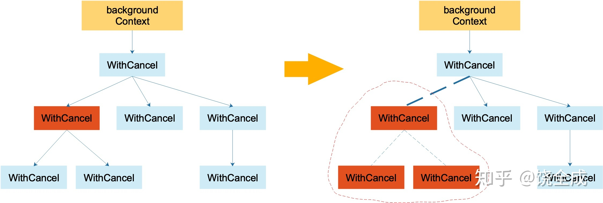

# Concurrency In Go

让我们先看一下列代码的输出：

```go
package main

import "sync"

func main() {
	var wg sync.WaitGroup
	for _, v := range [...]string{"Hello", "World", "Hello", "Work"} {
		wg.Add(1)
		go func() {
			defer wg.Done()
			print(v," ")
		}()
	}
	wg.Wait()
}
```

输出：

```go
Work Work Work Work 
```

这段代码并没有按照数组的顺序输出，而是输出了四个"Work"

而要解释其原因我们就得从Go语言的并发组件说起


## Go语言并发组件

### goroutine

`goroutine`是Go语言中最基本的组织单位之一。它们是一种被称为`协程`的对线程更高级的抽象。不同于OS线程和有语言运行时管理的绿色线程，`goroutine`与Go语言运行时深度集成，由`GMP`统一管理。`main()`函数也是由一个`goroutine`运行（`main goroutine`）

简单的说`goroutine`是一个并发的函数（不一定并行），可以简单的在某函数之前添加`go`关键字来触发。

所以我们可以尝试解释开始的那一段程序：遍历一个字符串数组，并将每个字符串在各自对应的`goroutine`中打印。而通常情况下，在`goroutine`开始执行开始执行之前，循环就已经结束了。但是这里有一个有趣的点，那就是既然循环已经结束，为什么还能访问到变量`v`？

这是因为Go语言运行时会将变量`v`的值由内存转移到堆中，这样`goroutine`就不会意外的访问被释放的内存。然而由于`v`始终执行同一块地址，所以每次循环都会覆盖上一次的值，最后`goroutine`开始执行时获取到的便是最后赋上的值，于是才会出现输出了四个相同的值。

如果想要程序按照顺序输出，则只需要将`v`的副本传入闭包即可：

```go
for _, v := range [...]string{"Hello", "World", "Hello", "Work"} {
    wg.Add(1)
    go func(str string) {
        defer wg.Done()
        print(str, " ")
    }(v)
}
```

此外`goroutine`还有一个特点就是轻量！`goroutine`之间的上下文切换（即一个被托管的并发程序必须保存他的状态以切换到另一个并发程序）的消耗远小于OS线程。


### sync包

`sync`包中包含了对内存同步访问最有用的并发原语。

#### `WaitGroup`

`WaitGroup`常用来等待一组并发操作的完成，特别使用于当我们不关心并发操作的结果，或者有其他方法来收集他们的结果时。

正如开头那段代码中所使用的那样：

```go
var wg sync.WaitGroup
for _, v := range [...]string{"Hello", "World", "Hello", "Work"} {
    wg.Add(1)
    go func() {
        defer wg.Done()
        print(v," ")
    }()
}
wg.Wait()
```

其中先创建了一个`sync.WaitGroup`类型的变量，然后再每次循环中通过`wg.Add()`方法增加计数器的增量，并在每个执行的`goroutine`中调用`wg.Done()`方法对计数器进行递减。而在`main goroutine`中通过`wg.Wati()`方法阻塞，直至计数器为0，然后结束程序。

#### 互斥锁和读写锁

`sync.Mutex`提供了一种安全的方式来表示对共享资源的独占访问，以此来保护临界区（即程序中需要独占访问共享资源的部分）。让我们看一下`Mutex`的使用，并解释一下什么是`饥饿`：

```go
var count int
var lock sync.Mutex
begin := make(chan struct{})

// increment
go func() {
    <-begin
    for begin := time.Now(); time.Since(begin) <= 1*time.Second; {
        for i := 0; i <= 3; i++ {
            lock.Lock()
            time.Sleep(1 * time.Millisecond)
            count++
            lock.Unlock()
        }
    }
}()

// decrement
go func() {
    <-begin
    for begin := time.Now(); time.Since(begin) <= 1*time.Second; {
        lock.Lock()
        time.Sleep(3 * time.Nanosecond)
        count -= 3
        lock.Unlock()
    }
}()

close(begin)
time.Sleep(2 * time.Second)
println(count)
```

我们先忽视创建的`begin`变量，其作用是用来让两个同时开始。

我们先创建了一个`count`用于计数，其默认值为0。然后开启了两个`goroutine`分别对其进行累加，和递减。不同之处在于递减操作每3ns执行一次，每次减3。累加操作每毫秒执行一次，每次累加1。两段代码都运行1s，然后在`main goroutine`中等待2s，并输出`count`的结果。

由于两个`goroutine`都对共享变量`count`进行了操作，所以需要在操作时通过`Mutex`进行加锁，操作完成后再解锁。

正常来说，两个`goroutine`等待的时间都是3ns，最后的输出应该差不多为0。但是多次运行后会发现，实际的数值往往小于0。

这是由于decrement的`goroutine`将临界区扩大之后导致了与increment的`goroutine`进行不公平的竞争，所产生的饥饿，这使得increment的`goroutine`无法高效的工作。

除此之外，饥饿还有可能产生于数据库连接、文件句柄、CPU等任何必须共享的资源。


`sync.RWMutex`概念上与`sync.Mutex`一样，但是它允许我们对内存的读写分别控制。通过其各自的方法签名就可以看出来：

```go
type Mutex
    func (m *Mutex) Lock()
    func (m *Mutex) Unlock()
type RWMutex
    func (rw *RWMutex) Lock()
    func (rw *RWMutex) RLock()
    func (rw *RWMutex) RLocker() Locker
    func (rw *RWMutex) RUnlock()
    func (rw *RWMutex) Unlock()
```

所以`RWMutex`本身也是一个`Locker`，通过以下代码我们可以看到读写锁的性能优势：

```go
test := func(count int, lock sync.Locker) time.Duration {
    var wg sync.WaitGroup
    wg.Add(count)
    begin := time.Now()
    for i := count; i > 0; i-- {
        go func(wg *sync.WaitGroup, locker sync.Locker) {
            defer wg.Done()
            lock.Lock()
            time.Sleep(1 * time.Nanosecond)
            lock.Unlock()
        }(&wg, lock)
    }
    wg.Wait()
    return time.Since(begin)
}

// format print
tw := tabwriter.NewWriter(os.Stdout, 0, 2, 2, ' ', 0)
defer tabw.Flush()
fmt.Fprintf(tw, "Counts\tRWMutext\tMutex\n")

var rwLock sync.RWMutex
for i := 0; i < 8; i++ {
    count := int(math.Pow(2, float64(i)))
    fmt.Fprintf(
        tw,
        "%d\t%v\t%v\n",
        count,
        test(count, rwLock.RLocker()),
        test(count, &rwLock))
}
```

首先我们创建了一个`test()`方法来计算循环count次休眠1ns所的时间，等所有`goroutine`执行完以后再返回所花费的时间。然后我们使用变量`rwLock`指向一个`sync.RWMutex`。然后我们分别将`RLocker`和`Locker`传入`test()`方法。

至于为什么可以将`sync.RWMutex`的指针传入 `test()`方法，我们可以在`sync`包中找到`Locker`接口的声明：

```go
type Locker interface {
	Lock()
	Unlock()
}
```

而`sync.RWMutex`的指针可以调用`Locker`接口的方法：

```go
func (rw *RWMutex) Lock()
func (rw *RWMutex) Unlock()
```

最后让我们来看一下结果：

```go
Counts  RWMutext   Mutex
1       12.944ms   15.5537ms
2       18.6419ms  40.2317ms
4       20.2131ms  81.3651ms
8       20.4274ms  122.8911ms
16      20.3875ms  263.979ms
32      20.2892ms  545.0835ms
64      20.4077ms  1.1188133s
128     20.5967ms  2.2073484s
```

可以看到读写锁的效率远高于互斥锁，其根本原因就在于，在请求一个读写锁用于读处理时，允许人与数量的读锁同时添加，而互斥锁则必须等待别的锁释放之后才能获取。

#### cond

`sync`包提供的`cond`提供了一种很好的方式去处理当某个`gouroutine`拿到锁吗，却不满足其他条件时的等待。

比如我们想要`f1`方法需要得到`f2`方法的允许才能打印`f2`告诉它的内容，所以即使当`f1`拿到锁也应该先让出来：

```go
var approved bool
var str string
var wg sync.WaitGroup
wg.Add(1)

cond := sync.NewCond(&sync.Mutex{})

f1 := func() {
    cond.L.Lock()
    for !approved {
        fmt.Println("Wait...")
        cond.Wait()
    }
    fmt.Println(str)
    cond.L.Unlock()
    wg.Done()
}

f2 := func() {
    time.Sleep(1)		// 减少f2的竞争，让f1极有可能先拿到锁
    cond.L.Lock()
    str = "Hello Work!"
    approved = true
    cond.L.Unlock()
    cond.Signal()
}

go f1()
go f2()

wg.Wait()
```

我们先通过`sync.NewCond(&sync.Mutex{})`创建了一个`cond`，由于`f2`休眠了以下，所以`f1 `极有可能先拿到锁。

并且在没得到允许的情况下执行了`cond.Wait()`来将得到的锁释放，该方法会释放当前拿到的锁并挂起等待，直到有调用`cond.Signal()`才会被唤醒。所以最后输出如下：

```go
Wait...
Hello Work!
```

通过`Wait()`等待的`goroutine`会被运行时维护在一个FIFO的列表中，等待信号。 `Signal()`会通知等待时间最长的`goroutine`。

而`Broadcast`则会同时通知所有等待的`goroutine`，对以上代码稍作修改：

```go
var approved bool
var str string
var wg sync.WaitGroup
// wg.Add(1)
wg.Add(3)

cond := sync.NewCond(&sync.Mutex{})

f1 := func(name string) {
    cond.L.Lock()
    for !approved {
        fmt.Printf("%v is waiting...\n", name)
        cond.Wait()
    }
    fmt.Println(str)
    cond.L.Unlock()
    wg.Done()
}

f2 := func() {
    time.Sleep(1)
    cond.L.Lock()
    str = "Hello Work!"
    approved = true
    cond.L.Unlock()
    // cond.Signal()
    cond.Broadcast()
}

go f1("zhangsan")
go f1("lisi")
go f1("wangwu")
go f2()

wg.Wait()
```

得到输出如下：

```go
lisi is waiting...
zhangsan is waiting...
wangwu is waiting...
wangwu said: Hello Work! 
lisi said: Hello Work! 
zhangsan said: Hello Work! 
```

#### once

让我们直接用下面几条代码片段和输出结果来了解以下`sycn.Once`：

```go
var count int
increment := func() { count++ }
var wg sync.WaitGroup
var once sync.Once

wg.Add(10)
for i:=10;i>0;i--{
    once.Do(increment)
    wg.Done()
}
wg.Wait()
fmt.Println(count)
```

 输出：

```go
1
```

再看看多次调用`once.Do()`

```go
var count int
increment := func() { count++ }
var once sync.Once

once.Do(increment)
once.Do(increment)

fmt.Println(count)
```

 输出：

```go
1
```

再看一下循环调用：

```go
var count int
increment := func() { count++ }

s := make([]sync.Once, 1, 1)

for _, once := range s {
    once.Do(increment)
}
s[0].Do(increment)

fmt.Println(count)
```

输出：

```go
2
```

最后再看一个死锁：

```go
var onceA, onceB sync.Once
var initB func()
initA := func(){onceB.Do(initB)}
initB = func(){onceA.Do(initA)}
onceA.Do(initA)
```

 综上所述：`sync.Once`只计算调用`Do()`方法的次数，而不是少次调用`Do()`方法，所以需要注意`sync.Once`副本的使用。

#### 池

当我们在程序中申请一块内存时，通常并不是直接向操作系统申请。Go语言会预先向操作系统申请一部分内存，然后由我们的程序直接使用，以提高性能。

相同的想法也被体现在`sync.Pool`中。让我们看一下下面的例子：

```go
connectToService := func() interface{} {
    time.Sleep(1 * time.Second)
    fmt.Println("Connect to Service...")
    return struct{}{}
}
serviceConnPool := func() *sync.Pool {
    p := &sync.Pool{
        New: connectToService,
    }
    for i := 0; i < 5; i++ {
        p.Put(p.New())		// 保存连接
    }
    return p
}

connPool := serviceConnPool()		// 创建连接池

for i := 100; i > 0; i-- {
    conn := connPool.Get()			// 从连接池取出连接
    fmt.Println(i, ": Get conn...")		
    connPool.Put(conn)				// 将实例放回连接池
}
```

我们通过`connectionToService`来模拟了一个生成连接的方法。然后将其设置为`sync.Pool`的`New`，并循环创建了5次，然后存入变量`p`中。最后，再模拟了100次获取连接，并在输出之后，将连接放回连接池。

当使用`sync.Pool`时需要记住以下几点：

* 实例化`sync.Pool`时通过传入一个生成资源的方法到`New`，通过`New()`生成资源时是线程安全的
* `sync.Pool`中`New()`创建的资源应该是无状态的
* 从`sync.Pool`通过`Get()`取出的对象一定要通过`Put()`放回，否则该实例将无法被复用


### channel

`channel`可以用来同步内存访问，但更多的被用于在`goroutine`之间传递信息。创建一个`channel`的方式如下：

```go
var c1 chan interface{}	
c1 = make(chan interface{})
```

 `c1` 是一个可以接收或者发送任意类型的`channel`（因为`interface{}`可以存储任意类型），而`chan`类型的变量还可以被定义为接收或者发送：

```go
var sendChan chan<- interface{}
var receiveChan <-chan interface{}
sendChan = c1
receiveChan = c1
```

由于发送和接收指的是`chan`数据的流向，`chan`变量名也通常被定义为以`Stream`结尾。

Go语言中`channel`是阻塞的，也就是说`channel`中的数据需要被消费后才可以写入，或者数据被写入后才会读取。所以以下代码即使在`main`函数中运行也会不立刻退出，而是在1s后输出"Hello Work!"然后在退出：

```go
strStream := make(chan string)
go func() {
    time.Sleep(1*time.Second)
    strStream <- "Hello Work!"
}()

str, ok := <-strStream
if ok{
    fmt.Println(str)
}
```

同时由于`channel`是阻塞的，所以如果没有向`channel`写入值，而一直尝试读取的话就会产生死锁。

此外以上的代码从`strStream`读取数据时返回了两个值，第二个值为`true`则表示此次从该`channel`取的值是新写入的数据，`false`表示此次从该`channel`取的值是由`close channel`时生成的默认值。所以`channel`的接收可以使用一个值接收，但通常应该在使用前先判断该值的返回方式。

而`close channel`可以禁止某个`channel`上的写入操作，但我们任然可以从该`channel`读取数据：

```go
intStream := make(chan int)
close(intStream)

i, ok := <-intStream
fmt.Printf("(%v): %v", ok, i)
```

输出：

```go
(false): 0
```

`range`和`for`一起使用也可以从`channel`中获取数据，并在`channel`关闭时退出循环：

 ```go
 dataStream := make(chan int)
 go func() {
     defer close(dataStream)
     for i := 0; i < 5; i++ {
         time.Sleep(1 * time.Second)
         dataStream <- i
     }
 }()
 
 for data := range dataStream {
     fmt.Print(data, " ")
 }
 ```

 输出：

```go
0 1 2 3 4 
```

此外利用`close channel`还可以使多个`goroutine`同时开始执行：

```go
begin := make(chan interface{})
var wg sync.WaitGroup

for i:=0;i<3;i++{
    wg.Add(1)
    go func(i int) {
        defer wg.Done()
        <- begin
        fmt.Printf("(%v) is beginning...\n", i)
    }(i)
}

fmt.Println("Start...")
close(begin)
wg.Wait()
```

输出：

```go
Start...
(0) is beginning...
(1) is beginning...
(2) is beginning...
```

除此之外，我们还可以使用`make`创建带有缓冲区的`channel`。缓冲`channel`是一个内存中的FIFO队列，用于并发程序通信。它能存储多个数据，直到数据满时阻塞写入，数据空时阻塞读取：

```go
bufferStream := make(chan int, 3)
bufferStream <- 1
bufferStream <- 2
bufferStream <- 3
fmt.Println(<-bufferStream)
fmt.Println(<-bufferStream)
fmt.Println(<-bufferStream)
```

`channel`的默认值是`nil`，如果没有初始化`channle`那么，对该`channel`的读取或写入操作都会被阻塞，而关闭`nil`的`channel`则会报`panic`

```go
var nilChan chan interface{}
close(nilChan)
```

输出：

```go
panic: close of nil channel
```


**`channel`行为准则**

`channel`为我们提供了很好的`goroutine`间通信，而我们需要做的则是再正确的环境中配置`channel`，即分配`channel`的所有权。换句话说就是我们需要明确哪个`gouroutine`，拥有哪些 `channel`，并对这些`channel`有哪些权限。

听起来可能会很复杂，但是单向`channel`使得`channel`的所有权的划分相当清晰。它将允许我们区分`channel`的所有者和使用者。我们需要先明确以下所有者和使用者的职责：

所有者：

> 1. 实例化`channel`
> 2. 执行写操作，或将所有权交给另一个`goroutine`
> 3. 关闭`channel`
> 4. 将该`channel`暴露为只读

由于所有者可以初始化`channel`，所以其可以消除操作`nil channel`的风险，由于所有者决定`channel`的关闭，所以消除了向关闭的`channel`写入数据，以及多次关闭`channel`的风险，由于所有者执行写入，所以消除了写入`channel`数据类型异常的风险。

消费者：

> 1. 知道`channel`是何时关闭的
> 2. 正确处理阻塞


让我们用下面的例子来帮助阐明一下这些概念：

```go
// producer
chanOwner := func() <-chan int {
    resultStream := make(chan int, 5)
    go func() {
        defer close(resultStream)
        for i := 0; i < 5; i++ {
            resultStream <- i
        }
    }()
    return resultStream
}

c := chanOwner()

// consumer
for v := range c{
    fmt.Println(v)
}
```

通过`chanOwner`所执行的函数的签名限制了返回的`channel`的类型为只读。在函数中，我们不会创建`nil channel`并写入或关闭它，或者多次关闭所创建的`channel`。而在消费者中，`range`可以阻塞`channel`并知道`chanenl`何时关闭。

同时在我们的程序中，应该尽可能的缩小`channel`的所有权范围，这将使我们的系统更容易梳理。


### select

`select`语句将`channel`于诸如取消、超时、等待和默认值之类的概念结合起来。`select`可以阻塞并等待多个`channel`直到某个`channel`可以使用。用法很类似`switch`语句，但`select`中的`case`没有顺序，即使不满足任何一个`case`执行也不会失败。

以下是一个关于`select`语法的简单示例：

```go
c1 := make(chan int)
c2 := make(chan int)
c3 := make(chan<- int)
c3 <- 0

select {
    case <-c1:
    // do something
    case v2 := <-c2:
    fmt.Println(v2)
    case c3 <- 0:
    // do something
}
```

以上例子将会阻塞，直到`c1`或者`c2`有数据传入或者`c3`有数据读取。

对于`select`还有两个有趣的问题：

* 多个`case`同时可用`select`将会如何处理？
* 没有`case`可用将会如何处理？

对于第一个问题我们可以看一下下面的代码输出：

```go
c1 := make(chan int); close(c1)
c2 := make(chan int); close(c2)
var count1,count2 int 

for i:=0;i<10000;i++ {
    select {
        case <-c1:
        count1++
        case <-c2:
        count2 ++
    }
}
println(count1,count2)
```

输出：

```go
4970 5030
```

多次运行后会发现，两个`case`执行大致是平均的。其原因很简单，因为Go语言运行时不能确定哪一个`case`中的是更需要被执行的，所以平均是最好的选择。

对于第二个问题，我们也可以看一个简单的例子：

```go
c := make(chan int)
select {
    case <-c:
}
```

 输出：

```go
fatal error: all goroutines are asleep - deadlock!
```

对于没有可用的`case`的情况，通常有两种常见的方式：

第一种设置默认退出时间：

```go
c := make(chan int)
select {
    case <-c:
    	// do something
    case <-time.After(1 * time.Second):
    fmt.Println("timeout")
}
```

第二种是利用`for`循环和`select`一起使用来处理，这样可以在某一个`case`等待的过程中，执行一些别的操作：

```go
c := make(chan int)
go func() { time.Sleep(3 * time.Second); close(c) }()

var i int
loop:
for {
    select {
        case <-c:
        break loop
        default:
        // do something
    }
    i++
    time.Sleep(1 * time.Second)
}
fmt.Printf("cycle times: %v", i)
```

 最后看一个`select`将会永远阻塞的用法：

```go
select {}
```


### context包

`context`包是Go1.7版本引入的。假设我们将一个`goroutine`称为父`goroutine`，其创建的其他`goroutine`称为子`goroutine`，`context`为我们在父`goroutine`**单向**的同步信号，以及传递信息提供了极大的便利。

此外，`context`还允许各子`goroutine`在父`goroutine`的控制下，采用各自不同的控制程序的方式。

`context`包相当简单：

```go
var Canceled = errors.New("context canceled")
var DeadlineExceeded error = deadlineExceededError{}

type CancelFunc func()
type Context interface {}
```

```go
type emptyCtx int
type cancelCtx struct {}
type timerCtx struct {}
type valueCtx struct {}
```

```go
func Background() Context
func TODO() Context

func WithCancel(parent Context) (ctx Context, cancel CancelFunc)
func WithDeadline(parent Context, d time.Time) (Context, CancelFunc)
func WithTimeout(parent Context, timeout time.Duration) (Context, CancelFunc)
func WithValue(parent Context, key, val interface{}) Context
```

除了定义的常量和类型，四个以`Ctx`为后缀的类型除了`emptyCtx`以外，都是对`Context`的封装。`Background()`和`TODO()`都是用来返回一个空的`Context`类型的实例。

`Context`可以用来承载一个，deadline，取消的信号，或者其他值。
`WithValue()`可以将一个键值对存入新返回的`valueCtx`实例
`WithCancel`返回一个`cancelCtx`
`WithDeadline()`和`WithTimeout()`都会返回一个`timerCtx`


其余三个`With`前缀的方法除了都接收一个`Context`类型的参数，然后返回一个`Context`的实例和一个可以取消该返回`Context`的`CancelFunc`类型的方法。

除了`emptyCtx`，其余的`Context`创建都是基于一个`Context`创建。通常用`Background()`来获取一个根`Context`，基于这个`Context`来衍生出其他的`Context`。而衍生出来的`Context`将被添加到原有`Context`的`children`字段中。基于每个`Context`可以创建多个`Context`，由此形成一棵树：


我们可以在`Context`接口的定义中看到，取消一个`Context`有什么用：

```go
type Context interface {
	Deadline() (deadline time.Time, ok bool)
    // Done returns a channel that's closed when work done on behalf of this
	// context should be canceled.
	Done() <-chan struct{}
	Err() error
	Value(key interface{}) interface{}
}
```

`Done()`方法返回一个当`Context`被取消时，将会关闭的通道。再扒一下`cancel()`的代码：

```go
func (c *cancelCtx) cancel(removeFromParent bool, err error) {
	// ...
	if c.done == nil {
		c.done = closedchan
	} else {
		close(c.done)
	}
	for child := range c.children {
		child.cancel(false, err)
	}
	// ...
}
```

当调用`cancel()`时，关闭了`done`通道，随后调用了`children`的`cancel()`。这里的`children`即是通过`WithCancel()`等方法返回的`Context`实例对应的`cancelCtx`。

所以说`context`是单向同步信号的，因为衍生的`Context`可以其原有的`Context`取消，而不能取消原有的`Context`。



`valueCtx`通过封装`Context`并添加额外键值对的方式来存储数据：

```go
type valueCtx struct {
	Context
	key, val interface{}
}
```

其寻找数据的规则也可以通过`Value()`方法看到：

```go
func (c *valueCtx) Value(key interface{}) interface{} {
	if c.key == key {		// 首先在自己保存的数据中找
		return c.val
	}
	return c.Context.Value(key) 	// 然后在父Context中找
}
```

此外`Context`的数据流动是单项的，所以不是试图修改`valueCtx`里的值。
我们还可以看到，`valueCtx`只能存一对值，并且父`Context`无法查找子`Context`的值。而且如果父子`Context`的`key`冲突时，无法获取到父`Context`的值。所以建议使用自定义类型作为key：

```go
type keyctxa string
type keyctxb string
ctx := context.Background()
var k1 keyctxa = "KeyA"
ctxA := context.WithValue(ctx, k1, 1)
var k2 keyctxb = "KeyA"
ctxB := context.WithValue(ctxA, k2, 2)

fmt.Println(ctxA.Value(k1))
fmt.Println(ctxB.Value(k2))
```

最后是一个使用`context`启用多个`goroutine`搜索切片中某个值的简单例子：

```go
func Search(slice []int, target int) (bool, error) {
	done := make(chan bool)		// 由子goroutine向上传递完成信号
    ctx := context.Background()	// 获取一个根Context
	ctx, cancel := context.WithTimeout(ctx, 3*time.Second)	// 设置超时
	defer cancel()

	length := len(slice)
	index := length/2 + 1
	go gSearch(ctx, done, slice[:index], target)
	go gSearch(ctx, done, slice[index:], target)

	select {
	case <-ctx.Done():	// 超时或被取消时将会返回关闭的通道
		return false, ctx.Err()
	case <-done:		// goroutine 完成所返回的信号
		cancel()		// 向所有子goroutine发送取消信号
		return true, nil
	}
}
```

```go
func gSearch(ctx context.Context, done chan<- bool, slice []int, target int) {
	var count int
BEGIN:
	for _, v := range slice {
		select {
		case <-ctx.Done():	// 接收到取消信号将结束搜索
			fmt.Println(ctx.Err())
			break BEGIN
		default:
			if v == target {
				done <- true	// 搜索到将会返回完成信号
				break BEGIN
			}
		}
		count++
	}
	fmt.Println("goroutine find: ", count, "times")
}
```


## GMP

正如我们在`groutine`一节中提到的，Go语言关于并发处理的强大之处在于语言本身对线程的抽象。Go语言的调度器则专门用于处理`goroutine`和OS线程之间的调度。

让我们先了解以下Go调度器的三个主要概念：

> G:  `groutine`
> M: OS线程（源码中也被称为机器） 
> P:  上下文（源码中也被称为处理器）

其关系如下图所示：


有一点需要提到，通过`runtime.GOMAXPROCS()`方法可以设置Go语言运行时的上下文数量。在1.5版本之前默认为1，通常通过：

```go
runtime.GOMAXPROCS(runtime.NumCPU())
```

来充分利用机器上的所有CPU核心，而随后的版本默认设置为主机上的逻辑CPU数量。


### 工作窃取

现在我们知道P将会为我们调度G到M上运行，而具体是如何调度的则是通过一种被称为**工作窃取**的策略。

在了解工作窃取之前，让我们先了解以下，公平调度策略。假设有n个处理器，还有x个任务需要被执行，那么每个处理器在公平调度策略下都会分到x/n个任务。
这看起来似乎很合理，但是在Go语言中采用的是`fork-join`模型。`fork-join`模型可以使得程序在指定一点上“分叉”而开始并行执行，在随后的一点上“合并”并恢复顺序执行。

假设我们现在有四个任务，分配给两个处理器执行。T1依赖于T4的执行，而T2的执行时间比T1和T3的执行时间总和都要长。与此同时T1和T3分配给处理器P1，T2和T4分配给了P2，那么两个处理器运行的时间将会如下所示：

```bash
Time        P1          P2
n+a         T1          T2
n+b         (blocked)   T2
n+b+d       (blocked)   T4
n+b+d+a     T1          (idle)
n+b+d+a+c   T3          (idle)
```

我们可以看到，P1在T1等待T4完成的时候是出于阻塞状态的，而且P2在完成T4后T3在等待被处理，而P2却是空闲状态。由此我们可以看到公平调度策略下存在一些问题。

工作窃取算法基于每个处理器独自的任务处理队列，并允许某个处理器从别的处理器准备处理的任务中获取任务并处理。该算法遵循以下一些基本原则，对于给定的线程：

> 1. 在`fork`点将任务添加到于线程关联的队列的尾部
>
> 2. 如果有线程空闲，则选取一个随机的线程，从它关联的队列的头部窃取工作
>
> 3. 如果在未准备好的`join-point`(即与之同步的`goroutine`还没有完成)，则将工作从线程队列的尾部出栈。
>
> 4. 如果线程的任务队列是空的，则：
>
>    a. 暂停加入
>
>    b. 从别的线程队列中随机窃取工作

让我们通过一个Fibonacci数列的计算来看看工作窃取算法是如何工作的：

```go
var fib func(n int) <-chan int
fib = func(n int) <-chan int {
    result := make(chan int)
    go func() {
        defer close(result)
        if n <= 2 {
            result <- 1
            return
        }
        result <- <-fib(n-1) + <-fib(n-2)
    }()
    return result
}

fmt.Println(<-fib(4))
```

首先T1将`fib(4)`创建在自己的队列，此时有可能T2从T1的队列中盗取了`fib(4)`，这里我们假设T1执行了`fib(4)`。然后由于`+`操作符从左到右计算，所有在T1的队列中先创建`fib(3)`然后创建`fib(2)`

```bash
Step   T1 Stack                      T1 Queue   T2 Stack            T2 Queue
1      (main goroutine)                                              
2      (main goroutine)              fib(4)                          
3      (main goroutine)(wait join)                                   
       fib(4)                                                        
4      (main goroutine)(wait join)   fib(3)                          
       fib(4)                        fib(2)                  
```

此时T2依然是空闲的，它将会从T1的队列头部取出`fib(3)`并执行。（通常`fib(3)`会更有可能被T1执行，之后会讨论其原因，这里为了演示方便假设取出的是`fib(3)`）T1的`fib(4)`进入等待后取出`fib(2)`执行

```go
Step   T1 Stack                      T1 Queue   T2 Stack            T2 Queue
5      (main goroutine)(wait join)   fib(2)     fib(3)               
       fib(4)                                                        
6      (main goroutine)(wait join)              fib(3)               
       fib(4)(wait join)                                             
       fib(2)                                                        
7      (main goroutine)(wait join)              fib(3)              fib(2)
       fib(4)(wait join)                                            fib(1)
       fib(2)                                                     
```

T2执行`fib(3)`后同样创建了`fib(2)`和`fib(1)`在自己的队列，此时T1执行完自己的任务后，从T2中窃取了任务`fib(2)`，并执行

```go
Step   T1 Stack                      T1 Queue   T2 Stack            T2 Queue
8      (main goroutine)(wait join)              fib(3)(wait join)   fib(2)
       fib(4)(wait join)                        fib(1)               
       (return 1)                                                    
9      (main goroutine)(wait join)              fib(3)(wait join)    
       fib(4)(wait join)                        fib(1)               
       fib(2)                                                        
10     (main goroutine)(wait join)              fib(3)(wait join)    
       fib(4)(wait join)                        (return 1)           
       (return 1)                                                                 
```

T2执行的`fib(3)`完成join，返回后T1上的`fib(4)`也完成了join

```go
Step   T1 Stack                      T1 Queue   T2 Stack            T2 Queue
11     (main goroutine)(wait join)              (return 2)           
       fib(4)(wait join)                                             
12     (main goroutine)(wait join)                                   
       (return 3)    
```

最后继续执行`main goroutine`并将`<-fib(4)`打印出来。

总的来说这种任务调度方式在性能上有很多隐含的好处


### 续体窃取

由于在Go语言中`goroutine`很好的封装了一个工作体，所以我们会很自然的认为Go会将任务或者`goroutine`进行排队。实际上这并不是Go语言工作窃取算法的原理

Go语言工作窃取算法是对**续体**进行入队和窃取的。在Go语言中，`goroutine`就是任务，而`goroutine`之后的都被称为续体

当一个执行线程到达一个`join point`时，该线程必须暂停执行，并等待回调，这被称为`延迟join`。任务窃取和续体窃取都存在`延迟join`，但发生频率有显著差异。

试想一下：当创建一个`goroutine`时，通常我们会希望该`goroutine`会被立即执行，以尽快到达`join point`。同时，执行其续体的`goroutine`也会想尽快join回原来的`goroutine`。在新创建的`goroutine`完成之前，续体尝试join的情况也并不罕见。

对于这些情况有一条公理，即在调度`goroutine`时，最合理的是立即开始执行这个`goroutine`

同样是刚才的Fibonacci函数，我们先做一下约定：

* 使用`cont.of X`来表示某续体
* 当续体被执行时，将其转换成下一次的`fib()`调用

再让我们采用续体窃取的方式模拟一下运行过程：

首先T1执行`main()`，然后创建并执行`fib(4)`，将续体`conf.of main`放入队列

```bash
Step   T1 Stack     T1 Queue         T2 Stack                  T2 Queue
1      main                                                   
2      fib(4)     	conf.of main                
```

随后续体`conf.of main`被T2窃取，T1执行`fib(4)`后将续体`conf.of fib(4)`加入队列尾部，T1继续执行`fib(3)`

```bash
Step   T1 Stack     T1 Queue         T2 Stack                  T2 Queue
3      fib(3)       conf.of fib(4)   conf.of main               
```

T2到达到续体`conf.of main`的`join point`后，继续从T1的队列中窃取任务`conf.of fib(4)`执行，T1也同时执行`fib(3)`并将执行`fib(3)`产生的续体放入队列，接着执行`fib(3)`创建的`fib(2)`

```bash
Step   T1 Stack     T1 Queue         T2 Stack                  T2 Queue
4      fib(2)     	conf.of fib(3)   conf.of main(wait join)    
                                   	 conf.of fib(4)   
```

随后T1执行完`fib(2)`准备返回，T2从续体`conf.of fib(4)`中执行`fib(2)`

```go
Step   T1 Stack     T1 Queue         T2 Stack                  T2 Queue
5      (return 1)   conf.of fib(3)   conf.of main(wait join)   conf.of fib(4)
                                     fib(2)   
```

T1继续从队列取出续体`conf.of fib(3)`执行其中的`fib(1)`，T2也返回了`fib(2)`的计算，并完成续体`conf.of fib(4)`的运行，在`fib(4)`的`join point`等待

```bash
Step   T1 Stack     T1 Queue         T2 Stack                  T2 Queue
6      fib(1)                        conf.of main(wait join)   conf.of fib(4)
                                     (return 1)  
7      (return 1)                    conf.of main(wait join)    
                                     fib(4)(wait join)     
```

最后T1完成`fib(1)`后返回并完成join，T2打印结果

```go
Step   T1 Stack     T1 Queue         T2 Stack                  T2 Queue
8                                    conf.of main(wait join)    
                                     (return 3)                 
9                                    main(print 3)     
```


我们可以看到，通过续体窃取，在线程上的`延迟join`都发生在空闲的线程上，并且调用栈的最大深度也低于任务窃取。并如果我们让同样的代码在单个线程上执行之后会发现，它的运行就像我们使用普通函数一样。从理论上来说，续体窃取是被任务优于任务窃取的。


### 全局上下文

了解完Go语言的窃取之后，还有最后一个问题。当执行`goroutine`的系统线程阻塞时，Go语言将如何处理？

从逻辑上讲，当执行G的M阻塞时，对应G也将被阻塞。这似乎很合理，但是，从性能上看，Go语言应该尽可能多的保证P活跃。

在上述情况中，Go语言会将阻塞的M与该P分离，并将该P切换到另一个无阻塞的M上，阻塞的G任然与阻塞的M关联。当G阻塞结束时，操作系统会尝试使用另一个M来回退P，以便能执行这个阻塞的G。但是，这并不总是能顺利进行，如果失败，线程会把该G放在**全局上下文**中，然后线程休眠，并放回Go运行时的线程池，以供将来使用。（例如`goroutine`被再次阻塞）

在窃取算法中，P也会定期检查全局上下文，一查看是否有可执行的G。

