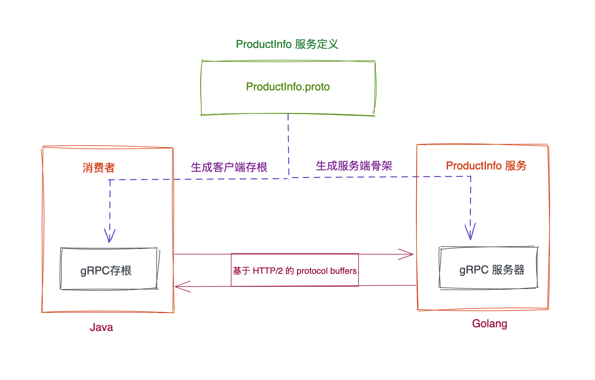
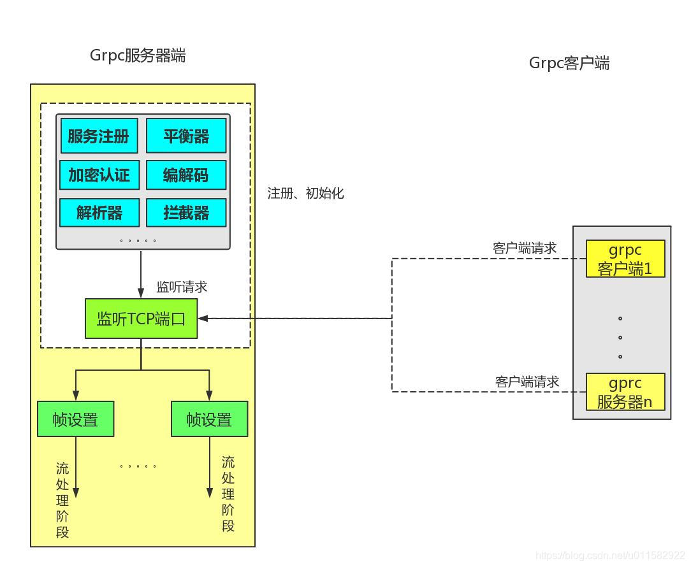

# Protocol Buffer

`Protocol Buffer`是Google开发的一种与语言无关、平台无关、可扩展的用于序列化结构化数据的机制。
使用`protobuf`有以下几个步骤：

1. 首先我们需要按照[《Language Guide》](https://developers.google.com/protocol-buffers/docs/overview)定义一个`.proto`的文件，来描述我们希望存储的数据结构
2. 使用`protobuf compiler`编译`.proto`文件生成对应语言的数据结构代码
3. 序列化和反序列化定义的数据结构

我这里使用的Go，让我们跟着官方的[《Protocol Buffer Basics: Go》](https://developers.google.com/protocol-buffers/docs/gotutorial)来使用一下`protobuf`

---

## Hello Protobuf

### 定义proto文件

首先先创建一个`grpc/helloproto`目录，并在`grpc`使用`go mod`初始化

```bash
$ mkdir -p grpc/helloproto && cd grpc
$ go mod init grpc
```

然后在`grpc/helloproto`目录下创建`hellp_proto.proto`文件：

```protobuf
syntax = "proto3";

package helloproto;	// proto文件不是通过每个文件来区分命名空间的，而是通过package

import "google/protobuf/timestamp.proto";

option go_package = "grpc/helloproto";

message Person {
  string name = 1;
  int32 id = 2;
  string email = 3;

  enum PhoneType {
    MOBILE = 0;
    HOME = 1;
    WORK = 2;
  }

  message PhoneNumber {
    string number = 1;
    PhoneType type = 2;
  }

  repeated PhoneNumber phones = 4;

  google.protobuf.Timestamp last_updated = 5;
}

message AddressBook {
  repeated Person people = 1;
}
```

这里需要注意的是，我们引入了一个官方提供的`proto`文件`import "google/protobuf/timestamp.proto";`之后这将会影响到使用`protobuf compiler`编译。其他官方提供的类型可以在[《Package google.protobuf》](https://developers.google.com/protocol-buffers/docs/reference/google.protobuf)找到
此外我这里使用的Go，添加了可选的配置`option go_package = "grpc/helloproto";`，这也会影响到`protobuf complier`的编译

### 编译proto文件

首先我们需要安装`protobuf compiler`：

```bash
$ brew install protobuf
$ protoc --version                                                 
libprotoc 3.17.3
```

然后由于我这里使用的Go，则需要安装Go相关的插件，其他语言也可以在[这里](https://developers.google.com/protocol-buffers/docs/tutorials)找到：

```bash
$ go install google.golang.org/protobuf/cmd/protoc-gen-go@latest
```

然后运行compiler：

```bash
$ cd ~/grpc
$ protoc --proto_path=. \		# 指定扫描import文件的路径
				 --go_out=../ \			# 指定生成文件的路径
					./helloproto/hello_proto.proto google/protobuf/timestamp.proto # 指定编译的文件
```

运行完以后生成了文件`hello_proto.pb.go`其中包含了我们定义的数据结构，和其他相关代码。

这里需要解释一下，`--proto_path`选项制定了扫描proto文件中国import文件的路径。但是对于我们引入的`google/protobuf/timestamp.proto`这个文件，在我们本地并没有，于是在最后指定编译文件的时候需要额外引入。
此外，让我们先看一下当前`~/grpc`下的目录结构：

```bash
$ tree     
.
├── go.mod
├── go.sum
└── helloproto
    ├── hello_proto.pb.go
    └── hello_proto.proto
```

`--go_out`选项指定了，生成文件的开始路径。我们是在`~/grpc`路径下执行的，此时`protoc`生成文件的路径就是从`~`同级目录开始的。然而我们发现生成的文件却在`~/grpc/helloproto`目录下，这就是之前设置了`option go_package = "grpc/helloproto";`的结果。
`prorotc`插件`google.golang.org/protobuf/cmd/protoc-gen-go`要求我们必须设置`option go_package`参数并且指定有效的Go导入路径。一下的提示信息将会在设置错误的`go_package`时提示出来：

```bash
protoc-gen-go: invalid Go import path "helloproto" for "helloproto/hello_proto.proto"

The import path must contain at least one period ('.') or forward slash ('/') character.
```

也就是说，在`--go_out`设置的同级目录中，`import`生成的`XXX_pb.go`文件时指定的包名就是在`proto`文件中设置的`option go_package`包名。

为了方便之后修改`proto`文件的时候重新编译，这里稍作修改，并将命令写入了`Makefile`文件：

```bash
$ touch ~/grpc/Makefile
$ cat Makefile
PROTO_FILES=$(shell find ./helloproto/* -name *.proto)
proto:
	protoc --proto_path=. --go_out=../ $(PROTO_FILES) google/protobuf/timestamp.proto
```

### 序列化结构体

然后编写测试`hello_proto_test.go`：

```go
package grpc

import (
	"github.com/stretchr/testify/assert"
	"google.golang.org/protobuf/proto"
	pb "grpc/helloproto"
	"testing"
)

func TestHelloProto(t *testing.T) {
	// The whole purpose of using protocol buffers is to serialize your data
	bookOut := &pb.AddressBook{
		People: []*pb.Person{{
			Id:    1234,
			Name:  "John Doe",
			Email: "jdoe@example.com",
			Phones: []*pb.Person_PhoneNumber{
				{Number: "555-4321", Type: pb.Person_HOME},
			},
		}},
	}
	data, err := proto.Marshal(bookOut)
	assert.NoError(t, err)

	bookIn := &pb.AddressBook{}
	assert.NoError(t, proto.Unmarshal(data, bookIn))
}
```


## 其他序列化方式

其他还有如`XML`、`JSON`等比较通用的序列化方式。`XML`一直被人诟病的就是信息密度太低，`JSON`由于采用字符串保存数据，可读性很高，性能却不太理想。
`protobuf`推出之后相较于以上两者性能有了很大提升，但是在官方推出的第一版`protobuf`之后，社区有了性能更强的魔改版本[`gogoprotobuf`](https://github.com/gogo/protobuf)。

[go_serialization_benchmarks](https://github.com/alecthomas/go_serialization_benchmarks)比较了Go中多种序列化方式的性能。

2020年3月份，`protobuf`官方又发文[《A new Go API for Protocol Buffers》](https://go.dev/blog/protobuf-apiv2)推出了一个v2版本，性能上与`gogoprotobuf`相比依然不尽人意。具体可参考[《go protobuf v1败给了gogo protobuf，那v2呢？》](https://tonybai.com/2020/04/24/gogoprotobuf-vs-goprotobuf-v1-and-v2/)。但是在官方推出的v2版本支持了动态反射，这使得我们生成一些编译时未知的message。
关于官方发文的翻译可以参考一下：[《Go Protobuf APIv2 动态反射 Protobuf 使用指南》](https://farer.org/2020/04/17/go-protobuf-apiv2-reflect-dynamicpb/)这篇文章中也介绍了`protoreflect`的一些使用。接下来让我们用两个例子简单看一下v2的动态反射。


## Protoreflect

第一个例子很简单，直接在`hello_proto_test.go`中添加如下代码：

```go
func TestHelloProtoReflect(t *testing.T) {
	book := &pb.AddressBook{
		People: []*pb.Person{{
			Id:    1234,
			Name:  "John Doe",
			Email: "jdoe@example.com",
			Phones: []*pb.Person_PhoneNumber{
				{Number: "555-4321", Type: pb.Person_HOME},
			},
		}},
	}
	data, err := proto.Marshal(book)
	assert.NoError(t, err)

	// Get message type by full name
	msgType, err := protoregistry.GlobalTypes.FindMessageByName("helloproto.AddressBook")
	assert.NoError(t, err)

	// Deserialize into helloproto.AddressBook message
	msg := msgType.New().Interface()
	err = proto.Unmarshal(data, msg)
	assert.NoError(t, err)

	t.Log(msg)
}
```

我们直接根据字面量`"helloproto.AddressBook"`从`protoregistry.GlobalTypes`获取了一个`protoreflect.MessageType`，并将提前准备好的序列化数据，反序列化到由`msgType`新生成的实例中。
需要提一下的是，`protoregistry.GlobalTypes`是根据生成的`hello_proto.pb.go`文件来反射生成实例的。

第二个例子是通过反射，遍历`helloproto.Person`的所有字段，并将名字改成`"zhangsan"`：

```go
func TestHelloProtoReflect2(t *testing.T) {
	person := &pb.Person{
		Id:    1234,
		Name:  "John Doe",
		Email: "jdoe@example.com",
		Phones: []*pb.Person_PhoneNumber{
			{Number: "555-4321", Type: pb.Person_HOME},
		},
	}
  
  // 获取Massage
	msg := person.ProtoReflect()
	msg.Range(func(fd protoreflect.FieldDescriptor, v protoreflect.Value) bool {
		if fd.Name() == "name" {
			msg.Set(fd, protoreflect.ValueOfString("zhangsan"))
		}
		return true
	})

	t.Log(msg.Interface())
}
```

甚至我们还可以利用`Message.Clear()`在`Range`中删除指定的字段，具体可以参考《A new Go API for Protocol Buffers》。

通过下图可以看到`ProtoMessage`和`Message`之间的转换关系

```bash
  ┌──────────────── New() ─────────────────┐
  │                                        │
  │         ┌─── Descriptor() ─────┐       │   ┌── Interface() ───┐
  │         │                      V       V   │                  V
╔═════════════╗  ╔═══════════════════╗  ╔═════════╗  ╔══════════════╗
║ MessageType ║  ║ MessageDescriptor ║  ║ Message ║  ║ ProtoMessage ║
╚═════════════╝  ╚═══════════════════╝  ╚═════════╝  ╚══════════════╝
       Λ           Λ                      │ │  Λ                  │
       │           └──── Descriptor() ────┘ │  └─ ProtoReflect() ─┘
       │                                    │
       └─────────────────── Type() ─────────┘
```


## gogo/protobuf

最后简单介绍一下[`gogo/protobuf`](https://github.com/gogo/protobuf)的使用。该项目提供了`protoc-gen-gofast`的生成工具，配套需要引入一下mod：

```bash
go get github.com/gogo/protobuf/protoc-gen-gofast
```

```bash
go get github.com/gogo/protobuf/proto
go get github.com/gogo/protobuf/gofast
go get github.com/gogo/protobuf/gogoproto
```

`protoc`命令也需要做相应的修改：

```makefile
PROTO_FILES=$(shell find ./helloproto/* -name *.proto)
gofast_proto:
  protoc --proto_path=. \
         --gofast_out=Mgoogle/protobuf/timestamp.proto=github.com/gogo/protobuf/types:../ \
         $(PROTO_FILES)
```

需要注意的是，这里我们使用到了`google/protobuf/*.proto`文件，需要将其替换成`gogo/protobuf/types`
除此之外，`gogo/protobuf`还提供多种不同的生成工具，来适应不同的场景：

```
protoc-gen-gogofast (same as gofast, but imports gogoprotobuf)
protoc-gen-gogofaster (same as gogofast, without XXX_unrecognized, less pointer fields)
protoc-gen-gogoslick (same as gogofaster, but with generated string, gostring and equal methods)
```

具体可以到其github仓库查看。

最后想再提一下，官方提供的两个`protobuf`版本在两个不同的仓库。v1版本在`https://github.com/golang/protobuf`，v2版本在`https://github.com/protocolbuffers/protobuf-go`。`gogo/protobuf`目前并没有兼容v2版本，也就是说，如果需要使用反射等功能则不能使用`gogo/protobuf`

# gRPC

>RPC 全称 (Remote Procedure Call)，远程过程调用，指的是一台计算机通过网络请求另一台计算机的上服务，RPC 是构建在已经存在的协议（TCP/IP，HTTP 等）之上的，RPC 采用的是客户端，服务器模式。

> gRPC 是一款能运行在多平台上开源高效的RPC框架，可以有效地连接数据中心和跨数据中心的服务，支持负载均衡、链路跟踪、心跳检查和身份验证等特点。

## Hello gRPC

gRPC利用proto文件，在服务器和客户端之间定义请求的方法和参数，并通过protobuf序列化和反序列化数据。


让我们定义一个最简单的proto文件来实现gRPC调用。首先我们需要安装protocl插件：

```bash
$ go install google.golang.org/protobuf/cmd/protoc-gen-go@v1.26
$ go install google.golang.org/grpc/cmd/protoc-gen-go-grpc@v1.1
```

然后定义名为`hellogrpc.proto`的文件，内容如下：

```protobuf
syntax = "proto3";

package helloworld;

option go_package = "grpc/hellogrpc";

// The greeting service definition.
service Greeter {
  // Sends a greeting
  rpc SayHello (HelloRequest) returns (HelloReply) {}
}

// The request message containing the user's name.
message HelloRequest {
  string name = 1;
}

// The response message containing the greetings
message HelloReply {
  string message = 1;
}
```

编译生成文件：

```bash
$ protoc --go_out=. --go_opt=paths=source_relative --go-grpc_out=. --go-grpc_opt=paths=source_relative hellogrpc.proto

$ tree -L 1  
.
├── hellogrpc.pb.go
├── hellogrpc.proto
├── hellogrpc_grpc.pb.go
```

可以看到，除了生成了我们熟知的`helogrpc.pb.go`文件，还生成了`hellogrpc_grpc.pb.go`文件。

接下来，在服务端我们需要实现定义的方法，然后将其注册为grpc服务。我们可以引入生成的文件包`"grpc/hellogrpc"`并继承其中的`UnimplementedGreeterServer`接口体，然后实现`SayHello()`方法：

```go
type Server struct {
	Addr string
	UnimplementedGreeterServer
}

// SayHello implements hellogrpc.GreeterServer
func (s *Server) SayHello(ctx context.Context, in *HelloRequest) (*HelloReply, error) {
	log.Printf("Received: %v", in.GetName())
	return &HelloReply{Message: s.Addr + ":Hello " + in.GetName()}, nil
}
```

然后我们需要初始化一个grpc服务，并为其注册我们的server实现，然后绑定监听端口：

```go
const addr = "localhost:50055"
func TestGrpcServer(t *testing.T) {
	var s *grpc.Server
	// Create the insecure server
	{
		s = grpc.NewServer()
	}
	pb.RegisterGreeterServer(s, &Server{})
	
	lis, _ := net.Listen("tcp", addr)

	log.Printf("server listening at %v", lis.Addr())
	s.Serve(lis)
}
```

在客户端这边，我们需要创建一个grpc链接，并通过`hellogrpc_grpc.pb.go`中提供的代码生成一个grpc客户端：

```go
const addr = "localhost:50055"
func TestGrpcClient(t *testing.T) {
	var conn *grpc.ClientConn
	var err error
  
	//Set up a connection to the server.
	{
		conn, _ = grpc.Dial(addr, grpc.WithTransportCredentials(insecure.NewCredentials()))
	}
	c := pb.NewGreeterClient(conn)

	// Contact the server and print out its response.
	ctx, cancel := context.WithTimeout(context.Background(), time.Second)
	defer cancel()

	const name = "zhangsan"
	r, _ := c.SayHello(ctx, &pb.HelloRequest{Name: name})
	log.Printf("Greeting: %s", r.GetMessage())
}
```

可以看到，gRPC的调用非常简单。

## 流式调用

得益于http2.0的流式响应，除了上面例子中的简单调用，gRPC还有提供了三种流式调用*server-side streaming RPC*、*client-side streaming RPC*、*bidirectional streaming RPC*。让我们直接看一个*bidirectional streaming RPC*的例子。

首先我们在刚才`hellogrpc.proto`文件的基础上添加一个新的方法，并执行编译：

```protobuf
// The greeting service definition.
service Greeter {
  // Sends a greeting
  rpc SayHello (HelloRequest) returns (HelloReply) {}
  // Sends more greetings
  rpc SayMoreHello (stream HelloRequest) returns (stream HelloReply) {}
}
```

然后在服务端实现`SayMoreHello()`方法：

```go
// SayMoreHello implements hellogrpc.GreeterServer
func (s *server) SayMoreHello(stream pb.Greeter_SayMoreHelloServer) error {
	for {
		in, err := stream.Recv()
		if err == io.EOF {
			return nil
		}
		if err != nil {
			return err
		}

		log.Printf("Received: %v", in.GetName())
		reply := &pb.HelloReply{Message: "Hello " + in.GetName()}
		for i := 0; i < 3; i++ {
			if err := stream.Send(reply); err != nil {
				return err
			}
			time.Sleep(time.Second)
		}
	}
}
```

客户端也需要相应的修改为流式调用的方式：

```go
func TestGrpcClient2(t *testing.T) {
	//Set up a connection to the server.
	conn, _ := grpc.Dial(addr, grpc.WithInsecure())
	c := pb.NewGreeterClient(conn)

	// Contact the server and print out its response.
	stream, _ := c.SayMoreHello(context.Background())

	waitc := make(chan struct{})
	go func() {
		for {
			in, err := stream.Recv()
			if err == io.EOF {
				// read done.
				close(waitc)
				return
			}
			if err != nil {
				log.Fatalf("could not greet: %v", err)
			}
			log.Printf("Greeting: %s", in.GetMessage())
		}
	}()

	names := []string{"zhangsan", "lisi", "wangwu"}
	for _, name := range names {
		if err := stream.Send(&pb.HelloRequest{Name: name}); err != nil {
			log.Fatalf("Failed to send a req: %v", err)
		}
		time.Sleep(time.Second)
	}
	stream.CloseSend()
	<-waitc
}
```


## gRPC插件

gRPC还提供了完备的插件接口，可以通过下图看到：



gRPC默认使用protobuf作为数据传输格式，并采用gzip进行数据压缩。我们可以通过`google.golang.org/grpc/encoding`包下的`proto`和`gzip`的`init()`方法中看到：

```go
package proto
...
func init() {
	encoding.RegisterCodec(codec{})
}
```

```go
package gzip
...
func init() {
	c := &compressor{}
	...
	encoding.RegisterCompressor(c)
}
```

在`ServerOption`和`DialOption`中也提供了方法，设置我们自定义的编码和压缩方式：

```go
// ServerOption
func ForceServerCodec(codec encoding.Codec) ServerOption
func RPCCompressor(cp Compressor) ServerOption 

// DialOption
func WithCodec(c Codec) DialOption
func WithCompressor(cp Compressor) DialOption
```

当然其他的插件gRPC也提供了一系列接口，提供我们自己去实现，接下来让我们自己来实现一些常用的接口。


## 服务发现 & 负载均衡

常用的方式有两种，一种是集中式LB方案，Consumer直接请求代理服务器，由代理服务器去处理服务发现逻辑，并根据负载均衡策略转发请求到对应的ServiceProvider：


Consumer和ServiceProvider通过LB解藕，通常由运维在LB上配置注册所有服务的地址映射，并为LB配置一个DNS域名，提供给Consumer发现LB。当收到来自Consumer的请求时，LB根据某种策略（比如Round-Robin）做负载均衡后，将请求转发到对应的ServiceProvider。
这种方式的缺点就在于，单点的LB成了系统的瓶颈，如果对LB做分布式处理，部署多个实例会增加系统的维护成本。

另一种是进程内LB方案，将处理服务发现和负载均衡的策略交由Consumer处理：


这种方式下，需要有一个额外的服务注册中心，ServiceProvider的启动，需要主动到ServiceRegistry注册。并且，ServiceRegistry需要时时的向Consumer推送，ServiceProvider的服务节点列表。Consumer发送请求时，根据从ServiceRegistry获取到的服务列表，然后使用某种配置做负载均衡后请求到对应的ServiceProvider。

gRPC的服务发现和负载均衡可以通过下图看到，使用的是第二种方式：


其基本实现原理如下：

> 1、当服务端启动的时候，会向注册中心注册自己的IP地址等信息
> 2、客户端实例启动的时候会通过Name Resolver将连接信息，通过设置的策略获取到服务端地址
> 3、客户端的LB会为每一个返回的服务端地址，建立一个channel
> 4、当进行rpc请求时会根据LB策略，选择其中一个channel对服务端进行调用，如果没有可用的服务，请求将会被阻塞

### Resolver

首先我们来看一下，gRPC的服务发现，让我们定位到`google.golang.org/grpc/resolver`包下的`resolver.go`文件，看一看gRPC提供的接口。其中最核心的两个接口如下：

```go
type Builder interface {
	Build(target Target, cc ClientConn, opts BuildOptions) (Resolver, error)
	Scheme() string
}

// Resolver watches for the updates on the specified target.
// Updates include address updates and service config updates.
type Resolver interface {
	ResolveNow(ResolveNowOptions)
	Close()
}
```

`Builder`可用根据在客户端`Dial()`方法传入的`target`和一些配置信息创建一个`Resolver`，`Resolver`用于监听和更新服务节点的变化，并在处理完相应逻辑以后，将得到一个`target`所对应的IP地址上报给`ClientConn`。
进入`ClientConn`接口，可以看到其中有一个`UpdateState(State) `方法，就是用于上报地址状态的。如果我们的服务发现是静态的话，可以直接在`Builder`的`Build()`方法中直接配置一套规则，并通过`ClientConn`上报。
让我看看一个静态`Resolver`的简单实现：

```go
/*
	Server discovery
*/
const scheme = "myresolve"

// Implement ResolveBuilder
type MyResolveBuilder struct{}

func (self *MyResolveBuilder) Build(target resolver.Target, cc resolver.ClientConn, opts resolver.BuildOptions) (resolver.Resolver, error) {
	// 发现服务
	var state resolver.State
	if target.Endpoint == "mytarget" {
		state = resolver.State{
			Addresses: []resolver.Address{{Addr: "localhost:50055"}, {Addr: "localhost:50056"}},
		}
	}
	err := cc.UpdateState(state)
	if err != nil {
		cc.ReportError(errors.Wrapf(err, "更新State失败："))
	}
	return &MyResolver{}, nil
}
func (self *MyResolveBuilder) Scheme() string { return scheme }

// Implement Resolver
type MyResolver struct{}

func (self *MyResolver) ResolveNow(resolver.ResolveNowOptions) {}
func (self *MyResolver) Close()                                {}
```

使用的时候我们需要将其注册到grpc中，并在建立客户端连接到时候指定`target`的`schema`：

```go
func init() {
	resolver.Register(&MyResolveBuilder{})
}

func main() {
	var conn *grpc.ClientConn
	var err error

	conn, _ = grpc.Dial("myresolve:///mytarget",
		grpc.WithTransportCredentials(insecure.NewCredentials()),
	)
	c := hellogrpc.NewGreeterClient(conn)
	r, _ := c.SayHello(context.Background(), &hellogrpc.HelloRequest{Name: "zhangsan"})
	log.Printf("Greeting: %s", r.GetMessage())
}
```

这里`target`到解析规则，可以在`google.golang.org/grpc/clientconn`包中的`parseTarget()`方法查看。我们将原来的`Server`相关代码稍作修改单独作为一个包下面的main函数启动起来，并启动：

```go
var addr = flag.String("addr", "localhost:50055", "http service address")

func main() {
	flag.Parse()
	var s *grpc.Server
  s = grpc.NewServer()
  hellogrpc.RegisterGreeterServer(s, &hellogrpc.Server{Addr: *addr})

	lis, _ := net.Listen("tcp", *addr)
	log.Printf("server listening at %v", lis.Addr())
	s.Serve(lis)
}
```

```bash
$ go build .
$ ./server
```

然后运行客户端代码，即可看到调用返回的信息：

```bash
$ go build .
$ ./client
2022/02/17 18:01:53 Greeting: localhost:50055:Hello zhangsan
```


### Load Balancer

gRPC负载均衡相关的代码在`google.golang.org/grpc/balancer`包下，其中最关键的两个接口：

```go
type Picker interface {
	Pick(info PickInfo) (PickResult, error)
}
type Balancer interface {
	UpdateClientConnState(ClientConnState) error
	ResolverError(error)
	UpdateSubConnState(SubConn, SubConnState)
	Close()
}
```

和`Resolver`一样，`Balancer`也是由`Builder`创建。进入`LientConnState`结构体我们可以看到有两个参数，其中`ResolverState`正是我们上一节中根据`target`去解析的`resolver.State`。进入这个接口方法的`baseBalancer`实现，我们可以看到：

```go
for _, a := range s.ResolverState.Addresses {
		addrsSet.Set(a, nil)
		if _, ok := b.subConns.Get(a); !ok {
			// a is a new address (not existing in b.subConns).
			sc, err := b.cc.NewSubConn([]resolver.Address{a}, balancer.NewSubConnOptions{HealthCheckEnabled: b.config.HealthCheck})
			...
			sc.Connect()
		}
	}
```

每一个`ResolverState`中的`Address`都被建立了连接。`UpdateSubConnState()`方法顾名思义就是每个连接状态变化时，用于上报的方法。

`Picker`接口则是用于真正去实现负载均衡算法的接口。我们进入`baseBalancer`可以看到，其`Build()`方法的实现中，成员变量`picker`定义成了一个`ErrPicker`，并且在`baseBuilder`中有个接口类型的成员变量`pickerBuilder`。找到该接口我们可以发现，这个接口是用于创建`Picker`的。
所以关于自定义LB我们只需要实现Picker接口并将其用于创建一个`baseBuilder`即可。

首先，我们需要实现`Picker`, 这里就做一个简单的轮训。需要两个字段，一个是当前所有连接的数组，一个是下一次应该被请求的index：

```go
// Implement Picker
type MyPicker struct {
	subConns []balancer.SubConn
	next     int
}

func (self *MyPicker) Pick(_ balancer.PickInfo) (balancer.PickResult, error) {
	sc := self.subConns[self.next]
	self.next = (self.next + 1) % len(self.subConns)
	return balancer.PickResult{SubConn: sc}, nil
}
```

`balancer.SubConn`我们可以根据接口`PickerBuilder`的`Build()`方法如参得到。
然后，我们需要实现`PickerBuilder`即可：

```go
// Implement PickerBuilder
type MyPickerBuilder struct{}

func (self *MyPickerBuilder) Build(info base.PickerBuildInfo) balancer.Picker {
	scs := make([]balancer.SubConn, 0, len(info.ReadySCs))
	for sc := range info.ReadySCs {
		scs = append(scs, sc)
	}
	return &MyPicker{subConns: scs}
}
```

让我们来试验一下。为了验证，我们在之前的`MyResolverBuilder`中，添加两个`Address`：

```go
func (self *MyResolveBuilder) Build(target resolver.Target, cc resolver.ClientConn, opts resolver.BuildOptions) (resolver.Resolver, error) {
	// 发现服务
	//state = resolver.State{
	//	Addresses: []resolver.Address{{Addr: addrM[target.Endpoint]}},
	//}
	var state resolver.State
	if target.Endpoint == "mytarget" {
		state = resolver.State{
			Addresses: []resolver.Address{{Addr: "localhost:50055"}, {Addr: "localhost:50056"}},
		}
	}
	err := cc.UpdateState(state)
	if err != nil {
		cc.ReportError(errors.Wrapf(err, "更新State失败："))
	}
	return &MyResolver{}, nil
}
```

之后我们启动两个Server分别监听以上两个端口：

```bash
$ ./server -addr="localhost:50055"
$ ./server -addr="localhost:50056"
```

在客户端，我们首先需要将自定义的`baseBalancer`注册到grpc中：

```go
const lbName = "mybalancer"

func init() {
	resolver.Register(&MyResolveBuilder{})
	balancer.Register(newMyBalanceBuilder())
}
func newMyBalanceBuilder() balancer.Builder {
	return base.NewBalancerBuilder(lbName, &MyPickerBuilder{}, base.Config{HealthCheck: true})
}
```

然后在建立grpc客户端连接到时候，需要指定Balancer：

```go
	conn, err = grpc.Dial("myresolve:///mytarget",
		grpc.WithTransportCredentials(insecure.NewCredentials()),
		grpc.WithDefaultServiceConfig(`{"loadBalancingPolicy":"mybalancer"}`),
		//grpc.WithBalancerName("mybalancer"),			// same as above
	)
```

完整客户端代码如下：

```go
func init() {
	resolver.Register(&MyResolveBuilder{})
	balancer.Register(newMyBalanceBuilder())
}
func main() {
	var conn *grpc.ClientConn
	var err error

	conn, err = grpc.Dial("myresolve:///mytarget",
		grpc.WithTransportCredentials(insecure.NewCredentials()),
		grpc.WithDefaultServiceConfig(`{"loadBalancingPolicy":"mybalancer"}`),
		//grpc.WithBalancerName("mybalancer"),			// same as above
	)
	if err != nil {
		log.Fatalf("failed to Dial: %v", err)
	}
	c := hellogrpc.NewGreeterClient(conn)

	for i := 0; i < 5; i++ {
		r, err := c.SayHello(context.Background(), &hellogrpc.HelloRequest{Name: "zhangsan"})
		if err != nil {
			log.Fatal(err)
		}
		log.Printf("Greeting: %s", r.GetMessage())
	}
}
```

启动之后可以看到两个服务返回的消息：

```go
2022/02/17 20:22:17 Greeting: localhost:50055:Hello zhangsan
2022/02/17 20:22:17 Greeting: localhost:50056:Hello zhangsan
2022/02/17 20:22:17 Greeting: localhost:50055:Hello zhangsan
2022/02/17 20:22:17 Greeting: localhost:50056:Hello zhangsan
2022/02/17 20:22:17 Greeting: localhost:50055:Hello zhangsan
```

其实，以上的`Balancer`就是`google.golang.org/grpc/balancer`包下`roundrobin` 的简易版。

