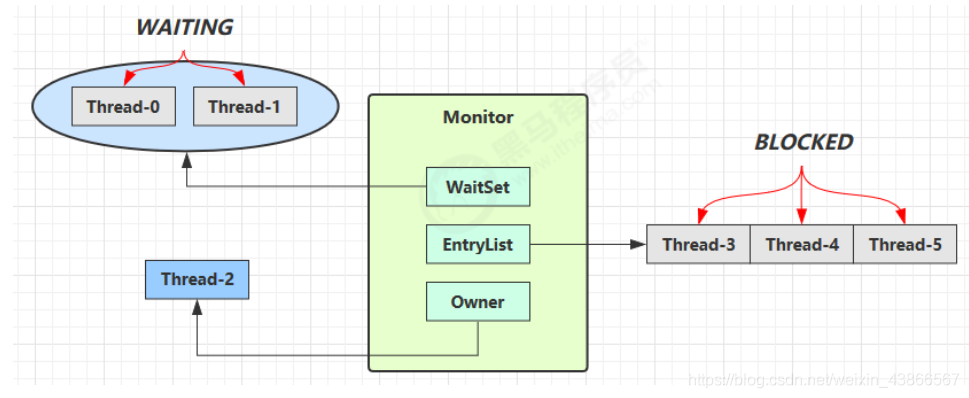
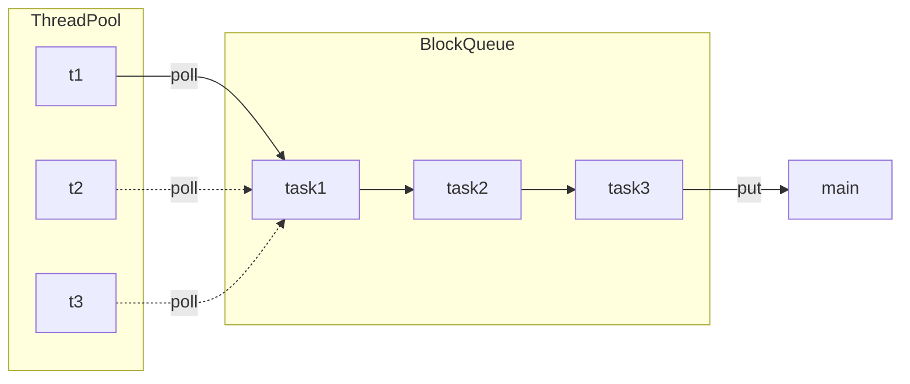
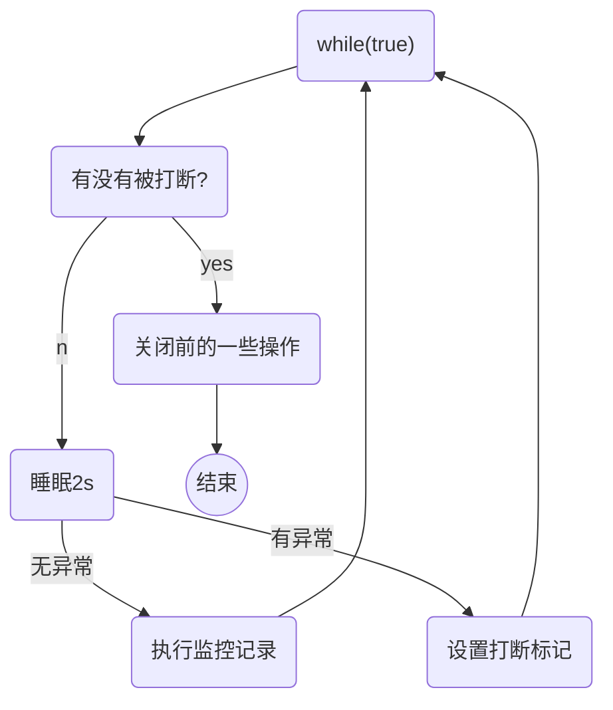

# 并发编程

## 相关概念

* **进程（Process）**

  > *进程*（Process）是一个具有一定独立功能的程序在一个数据集上的一次动态执行的过程，是操作系统进行资源分配和调度的一个独立单位，是应用程序运行的载体。
  >
  > 进程就是用来加载指令，管理内存，管理IO。
  >
  > 进程为线程提供共享内存空间。
  >
  > 当要一个程序被运行，从磁盘加载这个程序的代码到内存，这时就开启了一个进程。

* **线程（thread）**

  >*线程*（thread）是操作系统能够进行运算调度的最小单位。
  >
  >一个进程可以包含多个线程
  >
  >一个线程就是一个指令流，并以一定顺序交给CPU执行

* **并发（concurrent）** & **并行（parallel）**

  > *并发*（concurrent）是同一时间应对（dealing with）多件事情的能力。
  >
  > *并行*（parallel）是同一时间动手做（doing）多间事情的能力。

* **同步（Synchronous）** & **异步（Asynchronous）**

  > *同步*（Synchronous） 需要等待结果返回才可以继续运行。
  >
  > *异步* （Asynchronous）不需要等待结果的返回就可以继续运行。

**注：** 

1. 单核CPU下多线程不能实际提高程序运行效率，只是可以再不同线程直接切换，轮流执行。
2. IO操作不占用CPU，但是需要等待IO结束。所有需要使用【非阻塞式IO】和【异步IO】 


## Java 线程

### 创建和运行

* `Thread`内部会有一个`Runnable`对象，通过构造函数传入。`Thread.run()`会调用`Runnable`接口具体实现的`run()`，即程序员编写的实现方法。

  ```java
  //创建线程的方法一
  //只有一个方法的接口，添加@FunctionalInterface注解后可以使用lamda表达式
  Thread thread1 = new Thread(() -> log.debug("thread2 running"));
  
  thread1.setName("thread1"); 	//设置线程名
  thread1.start();				//开启线程
  
  //创建线程的方法二（更解耦)
  Runnable runnable = () -> log.debug("thread2 running");
  Thread thread2 = new Thread(runnable, "thread2");
  //可进一步简化
  //Thread thread2 = new Thread(() -> log.debug("thread3 running"), "thread3");
  
  thread2.start();
  ```

* 利用`FuntureTask`对象创建线程。

  ```java
  //创建线程的方法三
  //FutureTask接收一个Callable<V>类型的参数，在线程完成时返回值。
  //FutureTask本身实现了Runnable接口
  FutureTask<Integer> futureTask = new FutureTask<Integer>(() -> {
      log.debug("futureTask running");
      return 1;
  });
  
  Thread thread3 = new Thread(futureTask, "thread3");
  thread3.start();
  ```

  

### 查看

**Windows **

* 任务管理器可以查看进程和线程
* 控制台`tasklist`命令查看进程，`taskkill`杀死进程

**Linux**

* `ps  -fe` 查看所有进程
* `ps -fT -p <PID> `查看某个进程
* `kill` 杀死进程
* top 查看所有进程

**Java**

* 控制台输入`jps`查看所有Java进程
* `jstack <PID>`查看某个Java进程的线程状态
* `jconsole`查看Java进程中线程的运行情况


### 线程运行原理

**栈与栈帧 Java Virtual Machine Stacks （Java 虚拟机栈）**

我们都知道 JVM中由堆、栈、方法区所组成，其中栈内存提供给线程使用，每个线程启动后，虚拟机就会为其分配一块栈内存。 

* 每个栈由多个**栈帧（Frame）**组成，对应着每次方法调用时所占用的内存 

* 每个线程只能有一个活动栈帧，对应着当前正在执行的那个方法 


**线程上下文切换（Thread Context Switch） **

因为以下一些原因导致 CPU不再执行当前的线程，转而执行另一个线程的代码

* 线程的 CPU时间片用完 

* 垃圾回收 

* 有更高优先级的线程需要运行 

* 线程自己调用了 `sleep`、`yield`、`wait`、`join`、`park`、`synchronized`、`lock` 等方法 

当 Context Switch 发生时，需要由操作系统保存当前线程的状态，并恢复另一个线程的状态.

* 状态包括程序计数器、虚拟机栈中每个栈帧的信息，如局部变量、操作数栈、返回地址等

Java 中的程序计数器（Program Counter Register）是线程私有的，用于记住下一条 JVM指令的执行地址。


### 常用方法

#### start & run

* 调用`run()`，并没有开启线程运行，只是当前线程调用了`run()`的方法实现

  ```java
  Thread thread = new Thread(() -> log.debug("thread2 running"),"t1");
  
  thread.run();
  log.debug("---------");
  ```

  输出结果：

  ```
  11:42:33.727 [main] DEBUG c.ThreadTest2 - t1 running
  11:42:33.731 [main] DEBUG c.ThreadTest2 - ---------
  ```

* 调用`start()`，开启一个新的线程运行。

  ```java
  Thread thread = new Thread(() -> log.debug("t2 running"),"t2");
  
  thread.start();
  log.debug("---------");
  ```

  输出结果：

  ```
  11:45:25.138 [main] DEBUG c.ThreadTest2 - ---------
  11:45:25.138 [t1] DEBUG c.ThreadTest2 - t1 running
  ```


#### sleep & yield

* **sleep**

  * 调用`sleep`会让当前线程从 **Running **进入 **Timed Waiting（阻塞） **状态 
  * 其它线程可以调用**Timed Waiting **状态线程发` interrupt()`方法来打断该线程的阻塞，这时 `sleep` 方法会抛出`InterruptedException `
  * 睡眠结束后的线程未必会立刻得到执行 
  * 建议用`TimeUnit`的`sleep()`代替`Thread`的 `sleep()` 来获得更好的可读性

  ```java
  Thread thread = new Thread(() -> {
      try {
          TimeUnit.SECONDS.sleep(1);
          log.debug("t1 running");
      } catch (InterruptedException e) {
          e.printStackTrace();
      }
  },"t1");
  
  thread.start();
  log.debug("---------");
  thread.interrupt();
  ```

  输出结果：

  ```java
  11:55:54.736 [main] DEBUG c.ThreadTest3 - ---------
  java.lang.InterruptedException: sleep interrupted
  	at java.lang.Thread.sleep(Native Method)
  	at java.lang.Thread.sleep(Thread.java:340)
  	at java.util.concurrent.TimeUnit.sleep(TimeUnit.java:386)
  	at test.ThreadTest3.lambda$main$0(ThreadTest3.java:17)
  	at java.lang.Thread.run(Thread.java:748)
  ```

* **yield**

  * 调用`yiedl()`方法会让当前线程从 **Running** 进入 **Runnable（就绪）** 状态
  * 操作系统的任务调度器会自己决定下一个 **Runnable** 的线程的运行。

  

* **线程优先级**

  * 线程优先级会提示（hint）调度器优先处理，具体还是看调度器运行那个线程。
  * 如果CPU较忙，优先级高的线程会获得更多的时间片，CPU较闲时，优先级几乎没作用。

  ```java
  t1.setPriority(Thread.NORM_PRIORITY);
  t1.start();
  t2.setPriority(Thread.MAX_PRIORITY);
  t2.start();
  ```

  输出结果：

  ```
  12:25:32.206 [t2] DEBUG c.ThreadTest4 - ----->74796
  12:25:32.204 [t1] DEBUG c.ThreadTest4 - -------->24937
  12:25:32.206 [t2] DEBUG c.ThreadTest4 - ----->74797
  12:25:32.206 [t2] DEBUG c.ThreadTest4 - ----->74798
  12:25:32.206 [t2] DEBUG c.ThreadTest4 - ----->74799
  ```

  

#### join

* 该方法用于等待线程结束，以实现**同步**。且可设置最大等待时间。

* 原理可见保护性暂停 <a id="join" href="#joinSource">Join源码分析</a>

  ```java
  Thread t1 = new Thread(() -> {
      TimeUnit.SECONDS.sleep(1);
      i = 10;
  });
  
  Thread t2 = new Thread(() -> {
      TimeUnit.SECONDS.sleep(2);
      j = 10;
  });
  //开启线程
  t1.start();
  t2.start();
  
  //记录时间
  long start = System.currentTimeMillis();
  t2.join(); 		//t2.join(300)可以设置最长等待时间，单位为毫秒，超时则放弃等待。
  t1.join();
  long end = System.currentTimeMillis();
  
  log.debug("i->{}，j->{} timeuse:{}",i,j,end - start);
  ```

  输出结果：

  ```
  12:48:21.692 [main] DEBUG c.Test5Join - i->10，j->10 timeuse:2044
  ```


#### interrupt

* 可以打断**阻塞**状态的线程。打断**阻塞**状态的线程会将其属性`interrupted`设置会初始值`false`

* `sleep()`，`wait()`，`join()`等方法可以让线程进入**阻塞**状态。

* 也可以打断**运行**中的线程，但对于正常运行的线程，只是将其属性`interrupted`设置为`true`，不会终止其运行。可以用来停止线程。

  ```java
  //打断阻塞状态线程
  Thread t1 = new Thread(() -> {
      try {
          TimeUnit.SECONDS.sleep(5);
          log.debug("thread is interrupted"); //被打断后的代码不会执行
      } catch (InterruptedException e) {
          e.printStackTrace();
      }
  });
  
  t1.start();
  Thread.sleep(500);
  log.debug("interrupting");
  t1.interrupt();
  //打断阻塞状态的线程会讲其interrepted属性设置为初始值 false
  log.debug("t1.interrpted:{}",t1.isInterrupted()); 
  ```

  输出结果：

  ```
  13:04:58.357 [main] DEBUG c.Test6Interrupt - interrupting
  java.lang.InterruptedException: sleep interrupted
  	at java.lang.Thread.sleep(Native Method)
  	at java.lang.Thread.sleep(Thread.java:340)
  	at java.util.concurrent.TimeUnit.sleep(TimeUnit.java:386)
  	at test.Test6Interrupt.lambda$main$0(Test6Interrupt.java:15)
  	at java.lang.Thread.run(Thread.java:748)
  13:04:58.865 [main] DEBUG c.Test6Interrupt - t1.interrpted:false
  ```

  

  ```java
  //打断正常运行的线程
  Thread t1 = new Thread(() -> {
      while(!Thread.interrupted()){
          log.debug("waiting for interrupting");
      }
      log.debug("the interrupted thread is still running....");
  },"t1");
  
  t1.start();
  TimeUnit.MICROSECONDS.sleep(1);
  log.debug("interrupting");
  t1.interrupt();
  //打断阻塞状态的线程会讲其interrepted属性置空
  log.debug("t1.interrpted:{}",t1.isInterrupted());
  ```

  输出结果：

  ```
  13:15:45.681 [main] DEBUG c.Test6Interrupt - interrupting
  13:15:45.681 [t1] DEBUG c.Test6Interrupt - waiting for interrupting
  13:15:45.681 [t1] DEBUG c.Test6Interrupt - waiting for interrupting
  13:15:45.689 [t1] DEBUG c.Test6Interrupt - the interrupted thread is still running....
  13:15:45.689 [main] DEBUG c.Test6Interrupt - t1.interrpted:true
  ```


* 利用`interrupt()`打断`park()`方法

  ```java
  Thread t1 = new Thread(() -> {
      log.debug("park...");
      LockSupport.park(); //暂停程序
      log.debug("unpark...");
  
      LockSupport.park(); //当线程的interrupted为true时无法生效
      log.debug("unpark...");
  }, "t1");
  
  TimeUnit.SECONDS.sleep(1);
  t1.interrupt();
  ```

  

##### 两阶段终止模式

详见模式-><a id="BTwoPhaseTermination" href="#TwoPhaseTermination">两阶段终止模式</a>。

### 守护线程

* 默认情况下，Java进程需要等待所有线程都运行结束才会结束。但守护线程只要等到其他的非守护线程运行结束了，即使守护线程的代码没有执行完，也会强制结束。


### 线程状态

* **操作系统层面**

  

  初始状态: 线程刚刚创建, 这个时候它只是对象, 没有执行start函数

  可运行状态: 线程执行了start函数, 但是还未获得时间片

  运行状态: 线程获得了时间片

  阻塞状态: 线程读取文件或者IO操作, 该线程不会实际使用到cpu, 会导致上下文切换, 进入阻塞状态

  终止状态: 线程结束, 生命周期已经结束

  

* **Java线程状态**

  

  NEW： 线程对象已经创建，但是尚未启动的线程。

  RUBBABLE： 正在 Java 虚拟机中执行的线程处于该状态。

  BLOCKED：受阻塞并等待某个监视器锁的线程处于该状态。

  WAITING：无限期地等待另一个线程来执行某个特定操作的线程处于该状态。

  TIMED_WAITING：等待另一个线程来执行，取决于指定等待时间的操作的线程处于该状态。

  TERMINATED：已经退出的线程处于该状态；

  

  代码演示：

  ```java
  Thread t1 = new Thread(() -> {
      log.debug("waiting for running");
  },"t1");
  
  Thread t2 = new Thread(() -> {
      while(true){
      }
  },"t2");
  t2.start();
  
  Thread t3 = new Thread(() -> {
  },"t3");
  t3.start();
  
  Thread t4 = new Thread(() -> {
      synchronized (Test8ThreadStatus.class){
          try {
              TimeUnit.SECONDS.sleep(60);
          } catch (InterruptedException e) {
              e.printStackTrace();
          }
      }
  },"t4");
  t4.start();
  
  Thread t5 = new Thread(() -> {
      try{
          t2.join();
      } catch (InterruptedException e) {
          e.printStackTrace();
      } ;
  },"t5");
  t5.start();
  
  Thread t6 = new Thread(() -> {
      synchronized (Test8ThreadStatus.class){
          log.debug("t6 is bolcked");
      }
  },"t6");
  t6.start();
  
  TimeUnit.SECONDS.sleep(1);
  
  log.debug("t1 state: {}",t1.getState());
  log.debug("t2 state: {}",t2.getState());
  log.debug("t3 state: {}",t3.getState());
  log.debug("t4 state: {}",t4.getState());
  log.debug("t5 state: {}",t5.getState());
  log.debug("t6 state: {}",t6.getState());
  ```

  输出结果：

  ```
  10:01:40.381 [main] DEBUG c.Test8ThreadStatus - t1 state: NEW
  10:01:40.385 [main] DEBUG c.Test8ThreadStatus - t2 state: RUNNABLE
  10:01:40.385 [main] DEBUG c.Test8ThreadStatus - t3 state: TERMINATED
  10:01:40.385 [main] DEBUG c.Test8ThreadStatus - t4 state: TIMED_WAITING
  10:01:40.385 [main] DEBUG c.Test8ThreadStatus - t5 state: WAITING
  10:01:40.385 [main] DEBUG c.Test8ThreadStatus - t6 state: BLOCKED
  ```


## 共享模型之管程

* **临界区 （Critical Section）**

  一段代码块内如果存在对**共享资源**的多线程读写操作，就会出现问题，这段代码就被称为**临界区**

* **竞态条件 （Race Condition）**

  多个线程再临界区内执行，由于代码的执行顺序不同而导致结果无法预测，称之为发生了**竟态条件**


### synchronized

synchronized实际是用**对象锁**保证了临界区内代码的原子性，保证临界区代码不会被线程切换所打断。

* 语法

  ```java
  //方式一
  synchronized(“对象”){
  	...临界区
  }
  ```

  ```java
  //方式二
  public synchronized void test(){
      ...临界区
  }
  //等价于
  public void test(){
      synchronized(this){
          ...临界区
      }
  }
  ```

  ```java
  //方式三
  class Test{
      public synchronized static void test(){
          ...临界区
  	}
  }
  //等价于
  class Test{
      public static void test(){
          synchronized(Test.class){
              ...临界区
          }
      }
  }
  ```

  

### 变量的线程安全分析

**成员变量和静态变量**

* 如果没有共享，则线程安全
* 如果有共享：
  * 如果都只读，则线程安全
  * 如果有读写，则这段代码是临界区，则需要考虑线程安全

**局部变量**

* 局部变量是安全的
* 但局部变量引用的对象未必安全
  * 如果该对象没有逃离方法的作用范围，则线程安全
  * 如果该对象逃离了方法的作用范围，则需要考虑线程安全


从以下例子可以看出 private 或 final 提供【安全】的意义所在，体现了开闭原则中的【闭】

```java
class ThreadSafe { 
    public final void method1(int loopNumber) {  //final关键字可防止子类重写该方法
    ArrayList list = new ArrayList<>(); 
    for (int i = 0; i < loopNumber; i++) { 
        method2(list); method3(list); 
    } 
} 
    private void method2(ArrayList list) { // private关键字可防止子类调用该方法
        list.add("1");                                    
    }
    public void method3(ArrayList<String> list) { //被称为外星方法，可被子类重新
     	list.remove(0);
    }
}
class ThreadSafeSubClass extends ThreadSafe{
    @Override
        public void method3(ArrayList<String> list) {
        	new Thread(() -> {
        		list.remove(0);
        }).start();
    }
}
```


### 常见线程安全类

* `String`
* `Integer`等包装类
* `StringBuffer`
* `Random`
* `Vector`
* `Hashtable`
* `java.util.concurrent`包下的类

**注1：**这里说的线程安全是类的各个方法是线程安全的，但是方法的组合并不是安全的。

**注2：**`final`修饰基本数据类型的变量时，必须赋予初始值且不能被改变，修饰引用变量时，该引用变量不能再指向其他对象


### Monitor 

**Java对象头**

以32位虚拟机位例

* 普通对象 

  ```ruby
  |-------------------------------------------------------|
  |                Object Header (64 bits)                |
  |-----------------------------|-------------------------|
  |         Mark Word (32 bits) | Klass Word (32 bits)    |
  |-----------------------------|-------------------------|
  ```

* 数组对象

  ```ruby
  |----------------------------------------------------------------------|
  |                       Object Header (96 bits)                        |
  |---------------------|-----------------------|------------------------|
  |  Mark Word(32bits)  |  Klass Word(32bits)   |  array length(32bits)  |
  |---------------------|-----------------------|------------------------|
  
  ```

* 其中Mark Word结构为

  ```ruby
  |------------------------------------------------------|--------------------|
  |                 Mark Word (32 bits)         		   |        State       |
  |------------------------------------------------------|--------------------|
  |  hashcode:25         | age:4 | biased_lock:0 | 01    |        Normal      |
  |------------------------------------------------------|--------------------|
  |  thread:23 | epoch:2 | age:4 | biased_lock:1 | 01    |        Biased      |
  |------------------------------------------------------|--------------------|
  |      ptr_to_lock_record:30				   | 00    | Lightweight Locked |
  |------------------------------------------------------|--------------------|
  | 	   ptr_to_heavyweight_monitor:30 		   | 10    | Heavyweight Locked |
  |------------------------------------------------------|--------------------|
  | 											   | 11    |    Marked for GC   |
  |------------------------------------------------------|--------------------|
  ```

每个Java对象都可以关联一个操作系统提供的`Monitor`对象，如果使用`synchronized`关键字以后，该对象的Mark Word字段会被设置只想Monitor对象的指针。

Monitor结构：



* Thread-2执行`synchronized(obj)`时就会成为`obj`关联的`Monitor`唯一的`Owner`。

* 当Thread-3，Thread-4，Thread-5也来执行`synchronized(obj)`时，就会进入`obj`关联的`Monitor`的`EntryList`队列进行等待,成为`BLOCKED`状态。
* 当Thread-2完成同步代码块时，会唤醒`EntryList`中的其他线程来竞争该`Monitor`，但竞争是非公平的。
* Thread-0，Thread-1是之前获得过锁，但条件不满足，进入`WatiSet`，成为`WAITING`状态


### synchronized原理

#### 轻量级锁 

如果一个对象虽然有多线程要加锁，但加锁的时间是错开的（也就是没有竞争），那么可以使用轻量级锁来优化。

轻量级锁对使用者是透明的，语法仍然是 `synchronized` 

* 创建锁记录（Lock Record）对象，每个线程都的栈帧都会包含一个锁记录的结构，内部可以存储锁定对象的 Mark Word

* 让锁记录中 Object reference 指向锁对象，并尝试用 cas 替换 Object 的 Mark Word，将 Mark Word 的值存 入锁记录

* 如果 cas 替换成功，对象头中存储了 锁记录地址和状态 00 ，表示由该线程给对象加锁，这时图示如下

* 如果 cas 失败，有两种情况 

  * 如果是其它线程已经持有了该 Object 的轻量级锁，这时表明有竞争，进入锁膨胀过程 
  * 如果是自己执行了 synchronized 锁重入，那么再添加一条 Lock Record 作为重入的计数

  

#### 锁膨胀

* 如果在尝试加轻量级锁的过程中，CAS 操作无法成功，这时一种情况就是有其它线程为此对象加上了轻量级锁（有竞争），这时需要进行锁膨胀，将轻量级锁变为重量级锁。

  * 即为 Object 对象申请 Monitor 锁，让 Object 指向重量级锁地址

  * 然后自己进入 Monitor 的 `EntryList` BLOCKED


#### 自旋优化 

重量级锁竞争的时候，还可以使用自旋来进行优化，如果当前线程自旋成功（即这时候持锁线程已经退出了同步 块，释放了锁），这时当前线程就可以避免阻塞。

* 自旋会占用 CPU 时间，单核 CPU 自旋就是浪费，多核 CPU 自旋才能发挥优势。
* Java 7 之后不能控制是否开启自旋功能

#### 偏向锁 

轻量级锁在没有竞争时（就自己这个线程），每次重入仍然需要执行 CAS 操作。 

Java 6 中引入了偏向锁来做进一步优化：只有第一次使用 CAS 将线程 ID 设置到对象的 Mark Word 头，之后发现 这个线程 ID 是自己的就表示没有竞争，不用重新 CAS。以后只要不发生竞争，这个对象就归该线程所有。

**偏向锁的撤销**

* 调用了被锁对象的`hashCode()`方法。
* 当有其它线程使用偏向锁对象时，会将偏向锁升级为轻量级锁
* 调用`wait()/notify()`方法

#### 批量重偏向 

* 以class为单位，为每个class维护一个偏向锁撤销计数器，每一次该class的对象发生偏向撤销操作时，该计数器+1，当这个值达到重偏向阈值（默认20）时，JVM就认为该class的偏向锁有问题，因此会进行批量重偏向。

* 将类的偏向标记关闭，之后当该类**已存在的实例获得锁时，就会升级为轻量级锁**；**该类新分配的对象的`Mark Word`则是无锁模式**。

#### 批量撤销

* 当达到重偏向阈值后，假设该class计数器继续增长，当其达到批量撤销的阈值后（默认40），JVM

  就认为该class的使用场景存在多线程竞争，会标记该class为不可偏向，之后，对于该class的锁，

  直接走轻量级锁的逻辑。

**参考资料：**

​	[死磕Synchronized底层实现--概论](https://github.com/farmerjohngit/myblog/issues/12)

​	[死磕Synchronized底层实现--偏向锁](https://github.com/farmerjohngit/myblog/issues/13)

​	[死磕Synchronized底层实现--轻量级锁](https://github.com/farmerjohngit/myblog/issues/14)

​	[死磕Synchronized底层实现--重量级锁](https://github.com/farmerjohngit/myblog/issues/15)


### wait & notify

* `Owner` 线程发现条件不满足，调用 `wait()` 方法，即可进入 `WaitSet` 变为 `WAITING` 状态 
* `BLOCKED` 和 `WAITING` 的线程都处于阻塞状态，不占用 CPU 时间片 
* `BLOCKED` 线程会在 `Owner` 线程释放锁时唤醒 
* `WAITING` 线程会在 `Owner` 线程调用 `notify()` 或 `notifyAll()` 时唤醒，但唤醒后并不意味者立刻获得锁，仍需进入 `EntryList` 重新竞争

#### API 介绍

* 用法如下：

  ```java
  obj.wait() 		//让进入 object 监视器的线程到 waitSet 等待 
  obj.wait(1000) 	//让进入 object 监视器的线程到 waitSet 等待 1000毫秒，然后进入EntryList
  obj.notify() 	//在 object 上正在 waitSet 等待的线程中挑一个唤醒
  obj.notifyAll() //让 object 上正在 waitSet 等待的线程全部唤醒
  ```

#### 使用方式

* **`sleep(long n)`和`wait(long n)` 区别**

  * `sleep()` 是 `Thread`方法，而` wait()` 是 `Object`的方法 
  * `sleep()`不需要强制和 `synchronized` 配合使用，但 ` wait()` 需要 和 `synchronized` 一起用
  * `sleep()`在睡眠的同时，不会释放对象锁的，但 ` wait()` 在等待的时候会释放对象锁

* 共同点

  * 他们的状态都是`TIME_WAITING`

* 建议使用格式

  ```java
  //建议锁对象设置为 final 以防止引用发生变化从而使线程锁住不同对象
  private final Object lock = new Object()
  
  synchronized(lock){
      while(条件不成立){
      	lock.wait();
      }
      //do something...
  }
  
  //另外一个线程
  synchronized(lock){
      lock.notifyAll();
  }
  
  ```

  ```java
  private static final Object lock = new Object();
  private static boolean hasTobacco = false;
  private static boolean hasTakeout = false;
  
  public static void main(String[] args){
  
      Thread t1 = new Thread(() -> {
          synchronized (lock){
              while(!hasTobacco){
                  try {
                      //不满足条件就等待
                      lock.wait();
                  } catch (InterruptedException e) {
                      e.printStackTrace();
                  }
                  log.debug("Get tobacco, do smoking");
              }
          }
      },"t1");
      t1.start();
  
      Thread t2 = new Thread(() -> {
          synchronized (lock){
              while(!hasTakeout){
                  try {
                      //如果不满足条件就等待
                      lock.wait();
                  } catch (InterruptedException e) {
                      e.printStackTrace();
                  }
              }
              log.debug("Get takeout, do eating.");
              log.debug("And then do delivery.");
              hasTobacco = true;
          }
      },"t2");
      t2.start();
  
      //睡眠1s后打开t2条件，并唤醒所有线程
      TimeUnit.SECONDS.sleep(1);
      synchronized (lock){
          log.debug("take takeout to t2");
          hasTakeout = true;
          lock.notifyAll();
      }
  }
  ```

  输出结果：

  ```
  00:07:54.978 [main] DEBUG c.Test9WaitNotify - take takeout to t2
  00:07:54.981 [t2] DEBUG c.Test9WaitNotify - Get takeout, do eating.
  00:07:54.981 [t2] DEBUG c.Test9WaitNotify - And then do delivery
  00:07:54.982 [t1] DEBUG c.Test9WaitNotify - Get tobacco, do smoking
  ```

  

### 保护性暂停

详见模式-><a id="BGuardedSuspension" href="#GuardedSuspension">保护性暂停模式</a>

该模式与`join()`相比较，`join()`必须等到线程结束，而保护性暂停模式只需要等待某线程传递回返回值。

#### join原理分析

* `join()`源码分析<a id="joinSource" href="#join">↵</a>

  ```java
  public final synchronized void join(long millis)
      throws InterruptedException {
      long base = System.currentTimeMillis(); 	//调用方法时间
      long now = 0; 	//已等待时间
  
      if (millis < 0) { 	//验证等待时间不能为负数
          throw new IllegalArgumentException("timeout value is negative");
      }
  
      if (millis == 0) {	//设置等待时间为0则一直等待
          while (isAlive()) {		//如果线程存活
              wait(0);
          }
      } else {
          while (isAlive()) {		//如果线程存活
              long delay = millis - now;
              if (delay <= 0) {
                  break;
              }
              wait(delay);
              now = System.currentTimeMillis() - base; //设置已等待时间
          }
      }
  }
  ```

对于以上模式两个线程之间直接对`GuardedObject`进行操作，必须保证`GuardedObject`为同一对象，我们可以通过一个中间类统一管理所有`GuardedObject`。

* 扩展

  ```java
  public static void main(String[] args) throws InterruptedException {
  
      Random random = new Random();
      new People(random.nextInt(5000),"people1").start();
      new People(random.nextInt(5000),"people2").start();
      new People(random.nextInt(500),"people3").start();
  
      TimeUnit.SECONDS.sleep(2);
  
      MailCenter.getIds().forEach( integer -> {
          new Postman(integer,"消息"+integer,"postman"+integer).start();
      });
  }
  ```

  ```java
  @Slf4j(topic = "c.People")
  class People extends Thread{
      private long timeout;
  
      public People(long timeout,String threadName) {
          this.timeout = timeout;
          super.setName(threadName);
      }
  
      @Override
      public void run() {
          GuardedObject guardedObject = MailCenter.createGuardedObject();
          log.debug("{} 开始等消息....",super.getName());
          String s = guardedObject.get(timeout);
          if(s != null)
              log.debug("收到消息了：{}",s);
          else {
              log.debug("未收到消息");
          }
      }
  }
  ```

  ```java
  @Slf4j(topic = "c.Postman")
  class Postman extends Thread{
      private int id;
      private String response;
  
      public Postman(int id, String response,String threadName) {
          this.id = id;
          this.response = response;
          super.setName(threadName);
      }
  
      @Override
      public void run() {
          GuardedObject guarded = MailCenter.getGuardedObject(id);
          log.debug("{} 发消息{}了。。。。",super.getName(),id);
          guarded.setResponse(response);
      }
  }
  ```

  ```java
  class MailCenter{
      private static Map<Integer,GuardedObject> boxes = new Hashtable<>();
      private static int id = 1;
  
      //添加synchronized 保证id自增安全
      private static synchronized int generateId(){ return id++;}
  
      //创建guardedObject对象
      public static GuardedObject createGuardedObject(){
          GuardedObject guarded = new GuardedObject(generateId());
          boxes.put(guarded.getId(),guarded);
          return guarded;
      }
  
      //取走guardedObject对象
      public static GuardedObject getGuardedObject(Integer id){
          //boxes.get(id); get之后对象依旧会存在于map中
          return boxes.remove(id);
      }
  
      public static Set<Integer> getIds(){return boxes.keySet();}
  }
  ```

  ```java
  @Slf4j(topic = "c.GuardedObject")
  class GuardedObject{
  
      private int id;     //标识
      private String response;
  
      public GuardedObject(int id) {this.id = id;}
  
      public int getId() {return id;}
  
      public String get(long timeout){
          final long start = System.currentTimeMillis();
          long waitTime;
          synchronized (this){
              while(response == null){    //循环等待直到有结果
                  long current = System.currentTimeMillis();
                  waitTime = (current - start);
                  if(waitTime > timeout) {
                      return null;
                  }
                  try {
                      this.wait(timeout - waitTime);
                  } catch (InterruptedException e) {
                      e.printStackTrace();
                  }
              }
          }
          return response;
      }
  
      public synchronized void setResponse(String response){
          this.response = response;
          this.notifyAll();   //设置结果提醒所有线程
      }
  }
  ```


### 生成者/消费者模式

详见模式-><a id="BProducerConsumer" href="#ProducerConsumer">生产者/消费者模式</a>。

### park & unpark

属于`Locksupport`类中的方法，与`Object` 的 `wait()` & `notify()`相比

* `wait()`,`notify()`和`notifyAll()`必须配合Object Monitor使用，而`park()`,`unprk()`不用。

* `park()`,`unpark()`是以线程为单位来**阻塞**和**唤醒**线程，而`notify()`是以锁，并随机唤醒线程。

* `unpark()`可以在`park()`之前执行，此后的`park()`则无效

  ```java
  Thread t1 = new Thread(() -> {
      log.debug("start.....");
      ThreadSleep.sleep(1);
      log.debug("park...");
      LockSupport.park();     //暂停当前线程
      log.debug("resume.....");
  },"t1");
  t1.start();
  
  ThreadSleep.sleep(2);
  log.debug("unpark....");
  LockSupport.unpark(t1);     //恢复t1线程
  ```

#### park & unpark原理

每个线程都有自己的一个 Parker 对象，由三部分组成 `_counter` ,` _cond` 和 ` _mutex`

* 当前线程调用 `Unsafe.park() `方法

  1. 检查 `_counter` ，如果为 0，这时，获得 ` _mutex`互斥锁 

  2. 线程进入` _cond `条件变量阻塞 

  3. 设置` _counter = 0`

* 当现线程调用` Unsafe.unpark(thread_0)`方法

  * 先调用`park()`的情况：
    1. 调用 `Unsafe.unpark(thread_0) `方法，设置` _counter = 1 `
    2. 唤醒 `_cond` 条件变量中的` thread_0 `
    3. `thread_0 `恢复运行 
    4.  设置 `_counter = 0`

  * 先调用`unpark()`的情况：
    1. 调用 `Unsafe.unpark(thread_0)` 方法，设置 ` _counter = 1 `
    2. 当前线程调用 `Unsafe.park()` 方法 
    3. 检查`_counter`，如果为 1，这时线程无需阻塞，继续运行 
    4. 设置 `_counter = 0`


### Java线程间的相互转换


假设有线程 `Thread t`


**`NEW --> RUNNABLE` **

**情况 1 **

* 当调用 `t.start()` 方法时，由 `NEW --> RUNNABLE`


**`RUNNABLE <--> WAITING`**

**情况 2 **

t 线程用 `synchronized(obj)` 获取了对象锁后 

* 调用 `obj.wait()` 方法时，t 线程从 `RUNNABLE --> WAITING `
* 调用 `obj.notify()` ， `obj.notifyAll() `，` t.interrupt() `时 
  * 竞争锁成功，t 线程从 `WAITING --> RUNNABLE` 
  * 竞争锁失败，t 线程从 `WAITING --> BLOCKED`

**情况 3**

* 当前线程调用 `t.join() `方法时，当前线程从` RUNNABLE --> WAITING `
  * 注意是当前线程在t 线程对象的监视器上等待 
* t 线程运行结束，或调用了当前线程的` interrupt() `时，当前线程从 `WAITING --> RUNNABLE`

**情况 4**

* 当前线程调用` LockSupport.park()` 方法会让当前线程从 `RUNNABLE --> WAITING`
* 调用 `LockSupport.unpark(目标线程)`或调用了线程 的 `interrupt()` ，会让目标线程从 `WAITING --> RUNNABLE`


**`RUNNABLE <--> TIMED_WAITING`**

**情况 5 **

t 线程用 `synchronized(obj) `获取了对象锁后 

* 调用 `obj.wait(long n)` 方法时，t 线程从 `RUNNABLE --> TIMED_WAITING`
*  t 线程等待时间超过了 n 毫秒，或调用` obj.notify() `， `obj.notifyAll() `，` t.interrupt()` 时
  * 竞争锁成功，t 线程从 `TIMED_WAITING --> RUNNABLE` 
  * 竞争锁失败，t 线程从 `TIMED_WAITING --> BLOCKED`

**情况 6**

* 当前线程调用 `t.join(long n)` 方法时，当前线程从 `RUNNABLE --> TIMED_WAITING`
  *  注意是当前线程在t 线程对象的监视器上等待 
* 当前线程等待时间超过了 n 毫秒，或t 线程运行结束，或调用了当前线程的` interrupt()` 时，当前线程从` TIMED_WAITING --> RUNNABLE`

**情况 7**

* 当前线程调用` Thread.sleep(long n) `，当前线程从 `RUNNABLE --> TIMED_WAITING`
* 当前线程等待时间超过了 n 毫秒，当前线程从 `TIMED_WAITING --> RUNNABLE`

**情况 8**

* 当前线程调用 `LockSupport.parkNanos(long nanos)` 或 `LockSupport.parkUntil(long millis)` 时，当前线 程从 `RUNNABLE --> TIMED_WAITING `
* 调用 `LockSupport.unpark(目标线程) `或调用了线程的 `interrupt() `，或是等待超时，会让目标线程从 `TIMED_WAITING--> RUNNABLE`


**RUNNABLE <--> BLOCKED**

**情况 9** 

* t 线程用 `synchronized(obj) `获取了对象锁时如果竞争失败，从 `RUNNABLE --> BLOCKED `
* 持 obj 锁线程的同步代码块执行完毕，会唤醒该对象上所有 `BLOCKED` 的线程重新竞争，如果其中 t 线程竞争 成功，从 `BLOCKED --> RUNNABLE` ，其它失败的线程仍然 `BLOCKED`


**RUNNABLE <--> TERMINATED**

**情况 10 **

* 当前线程所有代码运行完毕，进入 `TERMINATED`


### 线程活跃性

#### 死锁

两个或两个以上的进程在执行过程中，因争夺资源而造成的一种互相等待的现象。

**四个必要条件**

* 互斥条件：一个资源每次只能被一个进程使用。

*  占有且等待：一个进程因请求资源而阻塞时，对已获得的资源保持不放。

* 不可强行占有:进程已获得的资源，在末使用完之前，不能强行剥夺。

* 循环等待条件:若干进程之间形成一种头尾相接的循环等待资源关系。

  ```java
  Object a = new Object();
  Object b = new Object();
  
  Thread t1 = new Thread(() -> {
      synchronized (a){
          ThreadSleep.sleep(1);
          synchronized (b){
              log.debug("ti do something ....");
          }
      }
  },"t1");
  t1.start();
  
  Thread t2 = new Thread(() -> {
      synchronized (b){
          ThreadSleep.sleep(1);
          synchronized (a){
              log.debug("t2 do something ....");
          }
      }
  },"t2");
  t2.start();
  ```

**定位死锁**

* 可以通过jps定位进程id，再用jstack定位死锁

  ```java
  Z:\idea\concurrent>jps
  12644 Test13DeadLock
  6260 RemoteMavenServer36
  13880 Jps
  8764 KotlinCompileDaemon
  9116 Launcher
  ```

  ```java
  Z:\idea\concurrent>jstack 12644
  ```

  ```java
  Found one Java-level deadlock:
  =============================
  "t2":
    waiting to lock monitor 0x000000000386b528 (object 0x00000000eb7c0ba0, a java.lang.Object),
    which is held by "t1"
  "t1":
    waiting to lock monitor 0x0000000003867488 (object 0x00000000eb7c0bb0, a java.lang.Object),
    which is held by "t2"
  
  Java stack information for the threads listed above:
  ===================================================
  "t2":
          at test.Test13DeadLock.lambda$main$1(Test13DeadLock.java:33)
          - waiting to lock <0x00000000eb7c0ba0> (a java.lang.Object)
          - locked <0x00000000eb7c0bb0> (a java.lang.Object)
          at test.Test13DeadLock$$Lambda$2/1232367853.run(Unknown Source)
          at java.lang.Thread.run(Thread.java:748)
  "t1":
          at test.Test13DeadLock.lambda$main$0(Test13DeadLock.java:23)
          - waiting to lock <0x00000000eb7c0bb0> (a java.lang.Object)
          - locked <0x00000000eb7c0ba0> (a java.lang.Object)
          at test.Test13DeadLock$$Lambda$1/2117255219.run(Unknown Source)
          at java.lang.Thread.run(Thread.java:748)
  
  Found 1 deadlock.
  ```

* 或者使用jconsole工具

  连接运行的进程，选择线程界面查看。

#### 活锁

任务或者执行者没有被阻塞，由于某些条件没有满足，导致一直重复尝试，失败，尝试，失败。

#### 饥饿

一个或者多个线程因为种种原因无法获得所需要的资源，导致一直无法执行的状态。


### ReentrantLock

和`synchronized`一样都支持可重入，即获得锁之后可以再次获得该锁。但相对于`synchronized`，`ReentrantLock`具有以下特性

* 可中断

* 可设置超时时间

* 可设置公平锁

* 支持多个条件变量

  基本语法：

  ```java
  ReentrantLock reentrantLock = new ReentrantLock();
  /**
   * 可以通过构造函数设置true 获得公平锁
   * 公平锁可以保证线程在获得锁时按照先等待先获得的规则获得锁
   */
  //ReentrantLock reentrantLock = new ReentrantLock(true);
  //获得锁
  reentrantLock.lock();
  try{
      //临界区
  }finally{
      //释放锁
      reentrantLock.unlock();
  }
  ```

  利用`ReentrantLock`解决哲学家问题

  ```java
  class Chopstick extends ReentrantLock{
      String name;
  
      public Chopstick(String name){
          this.name = name;
      }
  }
  ```

  ```java
  @Slf4j(topic = "c.Philosopher")
  class Philosopher extends Thread{
      Chopstick left;
      Chopstick right;
  
      public Philosopher(String name,Chopstick left, Chopstick right) {
          super.setName(name);
          this.left = left;
          this.right = right;
      }
  
      @Override
      public void run() {
          while(true) {
              if (left.tryLock()) { //尝试获得左边锁
                  try {
                      if (right.tryLock()) {	//尝试获得右边锁
                          try {
                              eat();	//获得锁，吃东西
                          } finally {
                              right.unlock();	//吃完释放锁
                          }
                      }
                  } finally {
                      left.unlock();	//吃完释放锁
                  }
              }
              //吃完后释放锁休息一秒钟
              ThreadSleep.sleep(1);
          }
      }
  
      private void eat() { log.debug("eating.....");}
  }
  ```

  ```java
  public static void main(String[] args){
      Chopstick c1 = new Chopstick("c1");
      Chopstick c2 = new Chopstick("c2");
      Chopstick c3 = new Chopstick("c3");
      Chopstick c4 = new Chopstick("c4");
  
      new Philosopher("苏格拉底",c1,c2).start();
      new Philosopher("柏拉图",c2,c3).start();
      new Philosopher("亚里士多德",c3,c4).start();
      new Philosopher("赫拉克里特",c4,c1).start();
  }
  ```

  输出结果：

  ```java
  12:57:30.377 [赫拉克里特] DEBUG c.Philosopher - eating.....
  12:57:30.377 [柏拉图] DEBUG c.Philosopher - eating.....
  12:57:31.383 [亚里士多德] DEBUG c.Philosopher - eating.....
  12:57:31.383 [苏格拉底] DEBUG c.Philosopher - eating.....
  12:57:31.383 [赫拉克里特] DEBUG c.Philosopher - eating.....
  12:57:31.383 [柏拉图] DEBUG c.Philosopher - eating.....
  ```

**条件变量**

`Synchronized`也有条件变量，即`waitSet`，当不满足条件时进入`waitSet`等待。

`ReentrantLock`支持多个条件变量。可以指定具体唤醒哪些条件变量。

* 用`ReentrantLock`修改`wait`& `notify`中的案例

  ```java
  private static boolean hasTobacco = false;
  private static boolean hasTakeout = false;
  private static ReentrantLock reentrantLock = new ReentrantLock();
  private static Condition waitCigaretteSet = reentrantLock.newCondition();
  private static Condition waitTakeoutSet = reentrantLock.newCondition();
  
  public static void main(String[] args){
  
      new Thread(() -> {
          reentrantLock.lock();
          try {
              while(!hasTobacco){
                  try {
                      //如果没烟，则到waitCigaretteSet中等待
                      waitCigaretteSet.await(); 
                  } catch (InterruptedException e) {
                      e.printStackTrace();
                  }
                  log.debug("Get tobacco, do smoking");
              }
          } finally {
              reentrantLock.unlock();
          }
      },"t1").start();
  
      new Thread(() -> {
          reentrantLock.lock();
          try {
              while(!hasTakeout){
                  try {
                      //如果没外卖，则到waitTakeoutSet中等待
                      waitTakeoutSet.await();
                  } catch (InterruptedException e) {
                      e.printStackTrace();
                  }
              }
              log.debug("Get takeout, do eating. And then do delivery");
              hasTobacco = true;
              //唤醒waitTakeoutSet中等待的线程
              waitCigaretteSet.signal();
          } finally {
              reentrantLock.unlock();
          }
      },"t2").start();
  
      ThreadSleep.sleep(1);
      reentrantLock.lock();
      try {
          log.debug("take takeout to t2");
          hasTakeout = true;
          //唤醒waitTakeoutSet中等待的线程
          waitTakeoutSet.signal();
      } finally {
          reentrantLock.unlock();
      }
  }
  ```

  


## 共享模型之内存

### Java内存模型

JMM 即 java Memory Model，它定义了主存、工作内存抽象概念，底层对应着CPU寄存器、缓存、硬件内存、CPU指令优化等。

JMM体现在以下几个方面

* 原子性-保证指令不会受到线程上下文切换的影响
* 可见性-保证指令不会受CPU缓存的影响
* 有序性=保证指令不会受CPU指令并行优化的影响


### 可见性

**退不出的循环**

* main线程对`flag`变量修改对于`t1`线程不可见导致无法退出循环

  ```java
  static boolean flag = true;
  
      public static void main(String[] args) {
  
          new Thread(() -> {
              while(flag){
  
              }
          },"t1").start();
  
          ThreadSleep.sleep(1);
          flag = false; //循环不会退出，程序不会结束。
      }
  ```

* 原因：

  1. `t1`线程刚开始从主内存中读取了`flag`的值到工作内存中。
  2. 因为`t1`线程要频繁的从主内存中读取`flag`值， JIT编译器会将`flag`的值缓存到自己的工作内存中，以减少对主存的访问，提高效率。
  3. 1秒后`main`线程修改了`flag`的值，但是`t1`线程依旧从自己的工作内存中取值。

* 解决方法：

  `volatile`关键字可以修饰成员变量和静态成员变量，线程操作`volatile	`修饰的变量都是直接操作主存。

  ```java
  volatile static boolean flag = true;
  ```

  **注：**`volatile`只能保证成员变量的可见性，并不能保证原子性。

  

**两阶段终止模式的`volatile`实现**

详见模式-><a id="BTwoPhaseTerminate2" href="#BTwoPhaseTerminate2">两阶段终止模式-`volatile`</a>


### 有序性

* JVM会在不影响正确性的前提下，可以调整语句的执行顺序。

  ```java
  i = 1;
  j = 2;
  ```

  对于以上代码先后执行顺序不会对结果产生影响。

  这种特性称之为**指令重排**，多线程下指令重排会影响正确性。

**指令级并行原理 **

* **Clock Cycle Time （时钟周期时间）**

  等于主频的倒数，CPU 能 够识别的最小时间单位。

* **CPI（Cycles Per Instruction）**

  指令平均时钟周期数 

* **IPC （Instruction Per Clock Cycle）**

  即 CPI 的倒数，表示每个时钟周期能够运行的指令数 

* **CPU 执行时间 **

  程序的CPU 执行时间，即我们前面提到的 user + system 时间，可以用下面的公式来表示

  ```
  程序 CPU 执行时间 = 指令数 * CPI * Clock Cycle Time 
  ```

现代处理器会设计为一个时钟周期完成一条执行时间最长的 CPU 指令。

指令还可以再划分成一个个阶段，例如，每条指令都可以分为：

```
取指令 - 指令译码 - 执行指令 - 内存访问 - 数据写回
```

> 术语参考：
>
> * instruction fetch (IF) 
> * instruction decode (ID) 
> * execute (EX) 
> * memory access (MEM) 
> * register write back (WB)

在不改变程序结果的前提下，这些指令的各个阶段可以通过重排序和组合来实现指令级并行


### Java中的重排序

* 现有代码如下，可能存在`m2()`中1，2指令重排序，r1结果为0

  ```java
  int num = 0;
  boolean ready = false;
  
  //线程1执行
  public void m1(I_Result r){
      if(ready) r.r1 = num + num;
      else
          r.r1 = 1;
  }
  
  //线程2执行
  public void m2(I_Result r){
      num = 2;		//1
      ready = true;	//2
  }
  ```

  可以通过 `volatile` 修饰 `ready` 来添加写屏障以防止 `ready` 的赋值操作和之前的指令进行重排

  ```java
  volaitle boolean ready = false;
  ```

  

### Volatile原理

**保证可见性**

* 写屏障（sfence）保证该屏障之前对共享变量的改动，都同步到主存中。

* 读屏障（lfence）保证该屏障之后对共享变量的读取，是从主存中加载。

**保证有序性**

* 写屏障会确保指令重排时，写屏障之前的代码不会被重排到写屏障后面。

* 读屏障会确保指令重排时，读屏障之后的代码不会被重排到读屏障前面。

  ```java
  public void m2(I_Result r){
      num = 2;
      ready = true; //运行后会将ready和num的值都存到主存中，以保证可见性
      //写屏障
  }
  ```

  ```java
  public void m1(I_Result r){
      //读屏障
      if(ready) //运行时ready和num都将从主存中加载
          r.r1 = num + num;
      else
          r.r1 = 1;
  }
  ```

`volatile` 的底层原理是内存屏障，Memory Barrier（Memory Fence）

* 对`volatile`变量的写指令后会加入写屏障
* 对`volatile`变量的读指令前会加入读屏障


**double-checked locking问题**

* 双重校验代码如下：

  ```java
  public class Singleton {  
      private static Singleton singleton;  
      private Singleton (){}  
      
          public static Singleton getSingleton() {  
              if (singleton == null) {  //2
                  synchronized (Singleton.class) {  //1
                      if (singleton == null) {  
                          singleton = new Singleton();  //3
                      }  
                  }  
              }  
          return singleton;
      }  
  }
  ```

  在`synchronized`的代码块中也有可能存在指令重排，对于以上代码3可能存在先将引用地址赋值给`singleton`。如果此时有另外一个线程进入获取`singleton`发现不为空，于是返回了`singleton`并使用，但此时并没有调用`singleton`的构造函数。

* 解决

  ```java
  private volatile static Singleton singleton;  
  ```

  添加`volatile`之后代码2就不会再被重排。


### happens-before

happens-before 规定了对共享变量的写操作对其它线程的读操作可见，它是可见性与有序性的一套规则总结。

* 线程解锁 m 之前对变量的写，对于接下来对 m 加锁的其它线程对该变量的读可见

  ```java
  static int x;
  static Object m = new Object();
  
  new Thread(()->{
      synchronized(m) {
          x = 10;
      }
  },"t1").start();
  
  new Thread(()->{
      synchronized(m) {
          System.out.println(x);
      }
  },"t2").start();
  ```

* 线程对 volatile 变量的写，对接下来其它线程对该变量的读可见

  ```JAVA
  volatile static int x;
  
  new Thread(()->{
      x = 10;
  },"t1").start();
  
  new Thread(()->{
      System.out.println(x);
  },"t2").start();
  ```

* 线程 start 前对变量的写，对该线程开始后对该变量的读可见

  ```java
  static int x;
  x = 10;
  
  new Thread(()->{
      System.out.println(x);
  },"t2").start();
  ```

* 线程结束前对变量的写，对其它线程得知它结束后的读可见。

  ```java
  static int x;
  
  Thread t1 = new Thread(()->{
      x = 10;
  },"t1").start();
  
  t1.join();
  System.out.println(x);
  ```

* 线程 `t1` 打断` t2`（interrupt）前对变量的写，对于其他线程得知` t2` 被打断后对变量的读可见。

  ```java
  static int x;
  
  public static void main(String[] args) {
      Thread t2 = new Thread(()->{
          while(true) {
              if(Thread.currentThread().isInterrupted()) {
                  System.out.println(x);
                  break;
              }
          }
      },"t2")start();
      
      new Thread(()->{
          sleep(1);
          x = 10;
          t2.interrupt();
      },"t1").start();
      
      while(!t2.isInterrupted()) {
          Thread.yield();
      }
      System.out.println(x);
  }
  ```

* 对变量默认值（0，false，null）的写，对其它线程对该变量的读可见

* 具有传递性，如果` x hb-> y` 并且 `y hb-> z `那么有` x hb-> z` ，配合 volatile 的防指令重排

  ```java
  volatile static int x;
  static int y;
  
  new Thread(()->{
      y = 10;
      x = 20;
  },"t1").start();
  
  new Thread(()->{
      // x=20 对 t2 可见, 同时 y=10 也对 t2 可见
      System.out.println(x);
  },"t2").start();
  ```

  

### 单例模式的一些问题

* 实现一

  ```java
  // 问题1：为什么加 final （防止子类继承修改方法）
  // 问题2：如果实现了序列化接口, 还要做什么来防止反序列化破坏单例 
  public final class Singleton implements Serializable {
      // 问题3：为什么设置为私有? 是否能防止反射创建新的实例? （防止实例化，不能）
      private Singleton() {}
      // 问题4：这样初始化是否能保证单例对象创建时的线程安全? （可以）
      private static final Singleton INSTANCE = new Singleton();
      // 问题5：为什么提供静态方法而不是直接将 INSTANCE 设置为 public, 说出你知道的理由	（体现封装，可以提供泛型支持，可以对创建过程更多的控制等）
      public static Singleton getInstance() {
          return INSTANCE;
      }
      
      //（防止反序列化）
      public Object readResolve() {
          return INSTANCE;
      }
  }
  ```

* 实现二

  ```java
  // 问题1：枚举单例是如何限制实例个数的	（定义的枚举对象个数）
  // 问题2：枚举单例在创建时是否有并发问题	(没有)
  // 问题3：枚举单例能否被反射破坏单例	（不能）
  // 问题4：枚举单例能否被反序列化破坏单例	（不可以）
  // 问题5：枚举单例属于懒汉式还是饿汉式	（饿汉式）
  // 问题6：枚举单例如果希望加入一些单例创建时的初始化逻辑该如何做	（枚举的构造方法）
  enum Singleton {
   INSTANCE;
  }
  ```


## 共享模式之无锁

### 无锁解决线程安全问题

* 利用`AtomicInteger`实现线程安全

  ```java
  interface Account{
  
      Integer getBalance();
      void withdraw(Integer amount);
  
      static void run(Account account){
          ArrayList<Thread> threads = new ArrayList<>();
          for(int i=0;i<100;i++){
              threads.add(new Thread(() -> {
                  account.withdraw(10);
              }));
          }
          threads.forEach(Thread::start);
          threads.forEach(thread -> {
              thread.join();
          });
          System.out.println(account.getBalance());
      }
  }
  
  ```

  ```java
  class AccountSafe implements Account{
      private AtomicInteger balance;
  
      public AccountSafe(Integer balance) {
          this.balance = new AtomicInteger(balance);
      }
  
      @Override
      public Integer getBalance() {
          return balance.get();
      }
  
      @Override
      public void withdraw(Integer amount) {
          while(true){
              int prev = balance.get();
              int next = prev - amount;
              if(balance.compareAndSet(prev,next)) break;
          }
      }
  }
  ```

  ```java
  public static void main(String[] args) {
      Account account = new AccountSafe(1000);
      Account.run(account);
  }
  ```


### CAS & volatile

* 对于上面的解决办法，关键在于`compareAndSet()`方法，也就是CAS。

  ```java
  //prev为共享内存中的期望值，如果一样则将next设置到主存中，并返回true
  //compareAndSet具有原子性
  balance.compareAndSet(prev,next)
  ```

**注：**`synchronized`上锁过程中对`Class Word`的操作也是通过一种CAS操作实现的。

CAS 操作必须要有`volatile`来保证修改值和获取值对其他线程的可见性。

无锁状态下就算CAS操作失败，线程依旧在运行。`synchronized`中，如果没有或得到锁，或导致上下文切换，消耗较大。

但再无锁的情况下也需要CPU的运行支持，如果没有分到时间片依然会导致上下文切换。

**CAS 的特点** 

结合 CAS 和 volatile 可以实现无锁并发，适用于线程数少、多核 CPU 的场景下。

*  CAS 是基于乐观锁的思想：最乐观的估计，不怕别的线程来修改共享变量。 
* `synchronized` 是基于悲观锁的思想：最悲观的估计，得防着其它线程来修改共享变量。
* CAS 体现的是无锁并发、无阻塞并发：
  * 因为没有使用 `synchronized`，所以线程不会陷入阻塞，这是效率提升的因素之一 
  * 但如果竞争激烈，可以想到重试必然频繁发生，反而效率会受影响


### 原子对象

`java.util.concurrent.atomic.*;`包下提供了一些列原子对象

#### 原子整数

* 以AtomicInteger为例

  ```java
  public static void main(String[] args) {
      
      AtomicInteger i = new AtomicInteger();//可以传入int对象，默认为0
  
      i.incrementAndGet(); //++i
      i.getAndIncrement(); //i++;
  
      i.getAndAdd(5); //先获取再加5
      i.addAndGet(5); //先加5再获取
  
      //可以重写传入getAndUpdate的方法，返回任何值
      i.getAndUpdate( x -> x * 10);
      i.updateAndGet( x -> x * 10);
  
      updateAndGet(i,p -> p * 10);
  
      i.get();
  }
  
  
  //getAndUpdate模拟实现
  public static int updateAndGet(AtomicInteger i, IntUnaryOperator operator){
      while(true){
          int prev = i.get();
          int next = operator.applyAsInt(prev);
          if (i.compareAndSet(prev,next)) return next;
      }
  }
  ```

#### 原子引用类型

* `AtomicReference`包括一个泛型，可以传入任意类型对象。

  ```java
  private AtomicReference<T> reference;
  ```

  虽然调用其`compareAndSet(prev,next)`会检测预期值，但是如果与气质被修改过再被修改回来，`AtomicReference`无法发现其中的修改。

* `AtomicStampedReference`相较于`AtomicReference`在其构造方法中可以传入版本号，更新时也需要传入版本号以验证是否为最新一次修改。

  ```java
  AtomicStampedReference stampedReference = new AtomicStampedReference(object,i);
  ```

  ```java
  //AtomicStampedReference的compareAndSet会验证传入的版本号。
  int stamp = stampedReference.getStamp();
  stampedReference.compareAndSet(prev,next,stamp,newStamp);
  ```

* `AtomicMarkableReference`是`AtomicStampedReference`的简化，该方法会验证期望值是否被修改过。

  ```java
  AtomicMarkableReference markableReference = new AtomicMarkableReference(prev, status);
  ```

  ```java
  Object next = markableReference.getReference();
  //如果newStatus和status不一致，则修改失败。
  markableReference.compareAndSet(prev,next,status,newStatus);
  ```

#### 原子数组

* `AtomicIntegerArray`

* `AtomicLongArray`

* `AtomicReferenceArray`

  ```java
  /**
       * Supplier  ()->结果
       * Function  (参数)->结果   BigFunction (参数1，参数2)->结果
       * Consumer  (参数)->void   BigConsumer (参数1，参数2)->结果
       */
  private static <T> void demo(
      Supplier<T> arraySupplier,
      Function<T, Integer> lengthFun,
      BiConsumer<T, Integer> putConsumer,
      Consumer<T> printConsumer ) {
      List<Thread> ts = new ArrayList<>();
      T array = arraySupplier.get();
      int length = lengthFun.apply(array);
      for (int i = 0; i < length; i++) {
          // 每个线程对数组作 10000 次操作
          ts.add(new Thread(() -> {
              for (int j = 0; j < 10000; j++) {
                  putConsumer.accept(array, j%length);
              }
          }));
      }
      ts.forEach(t -> t.start()); // 启动所有线程
      ts.forEach(t -> {
          try {
              t.join();
          } catch (InterruptedException e) {
              e.printStackTrace();
          }
      }); // 等所有线程结束
      printConsumer.accept(array);
  }
  ```

  ```java
  demo(
   ()-> new AtomicIntegerArray(10),
   (array) -> array.length(),
   (array, index) -> array.getAndIncrement(index),
   array -> System.out.println(array)
  );
  ```

  输出结果：

  ```java
  [10000, 10000, 10000, 10000, 10000, 10000, 10000, 10000, 10000, 10000] 
  ```

**字段更新器**

* 字段更新器可以针对对象的某个域（Field）即属性，进行原子操作，同样必须配合`volatile`使用。

  ```java
  class Student{
      volatile String name;
  }
  ```

  ```java
   public static void main(String[] args) {
       Student student = new Student();
  
       AtomicReferenceFieldUpdater<Student, String> updater
           = AtomicReferenceFieldUpdater.newUpdater(Student.class, String.class, "name");
       updater.compareAndSet(student,null,"张三");
   }
  ```

**原子累加器**

* 相较于`AtomicLong`，累加器`LongAdder`效率更高。

  ```java
  private static <T> void demo(Supplier<T> adderSupplier, Consumer<T> action) {
      T adder = adderSupplier.get();
      long start = System.nanoTime();
      List<Thread> ts = new ArrayList<>();
      // 4 个线程，每人累加 50 万
      for (int i = 0; i < 40; i++) {
          ts.add(new Thread(() -> {
              for (int j = 0; j < 500000; j++) {
                  action.accept(adder);
              }
          }));
      }
      ts.forEach(t -> t.start());
      ts.forEach(t -> {
          try {
              t.join();
          } catch (InterruptedException e) {
              e.printStackTrace();
          }
      });
      long end = System.nanoTime();
      System.out.println(adder + " cost:" + (end - start)/1000_000);
  }
  ```

  ```java
  for (int i = 0; i < 5; i++) {
      demo(() -> new LongAdder(), adder -> adder.increment());
  }
  for (int i = 0; i < 5; i++) {
      demo(() -> new AtomicLong(), adder -> adder.getAndIncrement());
  }
  ```

  性能提升的原因：在有竞争时，设置多个累加单元，`Therad-0` 累加`Cell[0]`，而 `Thread-1` 累加` Cell[1]`... 最后将结果汇总。这样它们在累加时操作的不同的 `Cell` 变量，因此减少了 CAS 重试失败，从而提高性能。


### LongAdder

#### CAS锁

* 使用CAS也可也实现上锁

  ```java
  // 不要用于实践！！！
  public class LockCas {
      private AtomicInteger state = new AtomicInteger(0);
      public void lock() {
          while (true) {
              if (state.compareAndSet(0, 1)) {
                  break;
              }
          }
      }
      public void unlock() {
          log.debug("unlock...");
          state.set(0);
      }
  }
  ```

#### 伪共享

由于CPU访问内存速度较慢，普遍采用的方案是在内存和CPU直接添加缓存，如果CPU没有从缓存中读取到需要的数据，再到内存中读取。

* 缓存是以缓存行为单位存储的，一般是64bit

* 多核CPU必须为各自设置一份缓存。

* 要保证数据的一致性就必须在一个CPU更新数据后，让其他CPU重新到内存取得对应的缓存行。

**防止为共享**

* `@sun.misc.Contended`注解会在对象或者字段前后各添加128字节的padding，CPU将对象预读到缓存时，就会将该对象预读到不同的缓存行，以防止一个数据的修改导致整个缓存行失效。

* `LongAdder`中的`Cell`累加单元

  ```java
  // 防止缓存行伪共享
  @sun.misc.Contended
  static final class Cell {
  	volatile long value;
  	Cell(long x) { value = x; }
  
  	// 最重要的方法, 用来 cas 方式进行累加, prev 表示旧值, next 表示新值
  	final boolean cas(long prev, long next) {
  		return UNSAFE.compareAndSwapLong(this, valueOffset, prev, next);
  	}
  	// 省略不重要代码
  }
  ```

#### LongAdder源码解析

* `Long Adder`类中几个关键域：

  ```java
  //如果有竞争在各自cell里面进行累加
  transient volatile Cell[] cells;
  
  //如果没有竞争的情况下直接用base累加
  transient volatile long base;
  
  //锁标记，与cas实现原子操作
  transient volatile int cellsBusy;
  ```

  

* `add(long x)`：

  

  ```java
  public void add(long x) {
      Cell[] as; long b, v; int m; Cell a;
      //如果cells不为空 或者 casBase操作失败
      if ((as = cells) != null || !casBase(b = base, b + x)) {
          boolean uncontended = true;
          if (as == null || (m = as.length - 1) < 0 ||
              (a = as[getProbe() & m]) == null || //判断当前线程是否有cell
              !(uncontended = a.cas(v = a.value, v + x))) //如果已经创建了cell，就执行累加单元a的cas
              longAccumulate(x, null, uncontended);
      }
  }
  ```

* `longAccumulate()`：

  ```java
  final void longAccumulate(long x, LongBinaryOperator fn,
                            boolean wasUncontended) {
      int h;
      if ((h = getProbe()) == 0) {
          ThreadLocalRandom.current(); // force initialization
          h = getProbe();
          wasUncontended = true;
      }
      boolean collide = false;                // True if last slot nonempty
      for (;;) {
          Cell[] as; Cell a; int n; long v;
          //如果已经存在cells数组，则执行 1
          if ((as = cells) != null && (n = as.length) > 0){}	//1
          //如果没被锁 且 没有其他线程创建了cells数组 且 加锁成功，执行 2
          else if (cellsBusy == 0 && cells == as && casCellsBusy()){} //2
          //否则对base进行累加的cas操作
          else if (casBase(v = base, ((fn == null) ? v + x :
                                      fn.applyAsLong(v, x))))
              break;   // Fall back on using base
      }
  }
  ```

  2：

  ```java
  //加锁成功后
  try {
      if (cells == as) { //再次判断没有其他线程创建cells数组
          //创建数组并将累加值x添加
          Cell[] rs = new Cell[2];
          rs[h & 1] = new Cell(x);
          cells = rs;
          init = true;
      }
  } finally {
      cellsBusy = 0;
  }
  ```

  1：

  ```java
  //如果已经存在累加单元cells数组
  if ((a = as[(n - 1) & h]) == null) { //如果cells中没有有该线程累加单元cell
      if (cellsBusy == 0) {       // Lock and Try to attach new Cell
          Cell r = new Cell(x);   // create 累加单元
          if (cellsBusy == 0 && casCellsBusy()) { //加锁
              boolean created = false;
              try {               // Recheck under lock
                  Cell[] rs; int m, j;
                  if ((rs = cells) != null &&
                      (m = rs.length) > 0 &&
                      rs[j = (m - 1) & h] == null) { //Slot is non-empty
                      rs[j] = r;	//将新建的cell放入cells
                      created = true;
                  }
              } finally {
                  cellsBusy = 0;
              }
              if (created)
                  break;
              continue;           // Slot is now non-empty
          }
      }
      collide = false;
  }
  
  //如果累加成功，退出循环
  else if (a.cas(v = a.value, ((fn == null) ? v + x :
                               fn.applyAsLong(v, x))))
      break;
  //判断cells数组长度是否大于CPU个数
  else if (n >= NCPU || cells != as)
      collide = false;            // At max size or stale
  else if (!collide)				//防止执行下一个执行扩容的else if
      collide = true;				
  else if (cellsBusy == 0 && casCellsBusy()) {
      try {
          if (cells == as) {      // Expand table unless stale
              Cell[] rs = new Cell[n << 1]; 
              for (int i = 0; i < n; ++i)
                  rs[i] = as[i];
              cells = rs;
          }
      } finally {
          cellsBusy = 0;
      }
      collide = false;
      continue;                   // Retry with expanded table
  }
  h = advanceProbe(h);	//CPU超过上限，尝试改变线程累加单元累加
  ```

  

* `sum()`：

  ```java
  public long sum() {
      Cell[] as = cells; Cell a;
      long sum = base;	//从基础中先获取值
      if (as != null) {
          for (int i = 0; i < as.length; ++i) {
              if ((a = as[i]) != null)
                  sum += a.value;	//把所有Cell中的值加在一起
          }
      }
      return sum;
  }
  ```

  


### Unsafe

* `Unsafe`对象提供了非常底层的操作内存、线程的方法，切不能直接调用，只能通过反射获得。

  ```java
  Field theUnsafe = Unsafe.class.getDeclaredField("theUnsafe");
  theUnsafe.setAccessible(true);
  Unsafe unsafe = (Unsafe)theUnsafe.get(null);
  ```

  ```java
  //获取域的偏移量
  long idOffset = unsafe.objectFieldOffset(Teacher.class.getDeclaredField("id"));
  long nameOffset = unsafe.objectFieldOffset(Teacher.class.getDeclaredField("name"));
  
  Teacher teacher = new Teacher();
  //执行cas操作
  unsafe.compareAndSwapInt(teacher,idOffset,0,1);
  unsafe.compareAndSwapObject(teacher,nameOffset,null,"张三");
  ```

* 利用`Unsafe`实现`AtomicInteger`

  ```java
  class MyAtomicInteger{
      private volatile int value;
      private static final long valueOffset;	//保存域的偏移量
      private static final Unsafe UNSAFE;
  
      public MyAtomicInteger(int value) {
          this.value = value;
      }
  
      static{
          UNSAFE = UnsafeAccessor.getUnsafe();
          try {
              valueOffset = UNSAFE.objectFieldOffset(MyAtomicInteger.class.getDeclaredField("value"));
          } catch (NoSuchFieldException e) {
              e.printStackTrace();
              throw new RuntimeException(e);
          }
      }
  
      public int getValue(){
          return value;
      }
  
      public void decrement(int amount){
          while(true){
              int prev = this.value;
              int next = prev - amount;
              if (UNSAFE.compareAndSwapInt(this,valueOffset,prev,next)) {
                 break;
              }
          }
      }
  }
  ```

  

## 共享模式之不可变

### 不可变设计

* `String`也是不可变的：

  ```java
  //final修饰，防止子类继承重写方法
  public final class String{
      /** The value is used for character storage. */
      //final修饰防止char数组的引用被修改
      private final char value[];
  
      /** Cache the hash code for the string */
      //私有，不设置set方法，使hash不可变
      private int hash; // Default to 0
      
      //其所有构造方法都会将传入对象的值复制给value指针
      public String(String original) {
          this.value = original.value;
          this.hash = original.hash;
      }
      
      
      //保护性拷贝
      public String substring(int beginIndex) {
          ... //校验
          //返回的是一个新的字符串
          return (beginIndex == 0) ? this : new String(value, beginIndex, subLen);
      }
  ...
  }
  ```

### final原理

* `final`变量的设置
  * 在`final`修饰的对象赋值时，会为其添加写屏障，保证对final对象读取值时出现读取到初始值。
* `final`变量的获取
  * 对添加了`final`修饰的对象访问时，会将其复制一份到栈中。
  * 如果对象较大，会复制到使用类的常量池中。
  * 如果没有添加`final`修饰则是到堆中查找。


### 享元模式

享元模式（Flyweight pattern）：尽可能的对相同值对象进行共享，已达到最小内存的使用。

* 包装类中都体现了享元模式。以`Long`为例

  ```java
  public static Long valueOf(long l) {
      final int offset = 128;
      if (l >= -128 && l <= 127) { // will cache
          return LongCache.cache[(int)l + offset];
      }
      return new Long(l);
  }
  ```

  >**注：** 
  >
  >* `Byte`,` Short`,` Long` 缓存的范围都是 -128~127 
  >* `Character `缓存的范围是 0~127 
  >* `Integer`的默认范围是 -128~127 
  >  * 最小值不能变 
  >  * 但最大值可以通过调整虚拟机参数 ` -Djava.lang.Integer.IntegerCache.high` 来改变
  >*  `Boolean` 缓存了 `TRUE` 和 `FALSE`


**享元模式实现连接池**

详见模式-><a id="BFlyweightPattern" href="#FlyweightPattern">享元模式</a>


### 无状态

成员变量保存的数据称为状态信息，没有成员变量称为无状态。

没有任何成员变量的类是线程安全的。


## 共享模式之工具

### 自定义线程池



* 自定义线程池需要在线程池中创建多个线程实例执行`BlockQueue`中的任务，同时`BlockQueue`的任务数量超过`capcity`时，添加拒绝策略。

  阻塞队列：

  ```java
  //定义阻塞队列
  @Slf4j(topic = "c.BlockQueue")
  class BlockQueue<T> {
  
      //阻塞队列容量
      private int capcity;
      //队列，双链表结构
      private Deque<T> queue = new LinkedList<>();
      //锁
      private ReentrantLock lock = new ReentrantLock();
      //解锁条件
      private Condition fullWait = lock.newCondition();
      private Condition emptyWait = lock.newCondition();
  
      public BlockQueue(int capcity) {this.capcity = capcity;}
  
      public T take(long timeout, TimeUnit timeUnit) {
          lock.lock();
          try {
              //判断阻塞队列是否为空
              long nanos = timeUnit.toNanos(timeout);
              while (queue.isEmpty()) {
                  //超时判断
                  if (nanos <= 0) return null;
                  nanos = emptyWait.awaitNanos(nanos);
              }
              //从阻塞队列取得任务，并唤醒阻塞等待
              T first = queue.removeFirst();
              fullWait.signal();
              return first;
          } finally {
              lock.unlock();
          }
      }
  
      public boolean put(T t, long timeout, TimeUnit timeUnit) {
          lock.lock();
          try {
              long nanos = timeUnit.toNanos(timeout);
              //判断阻塞队列是否已满
              while (queue.size() >= capcity) {
                  if(nanos <= 0) return false;
                  nanos = fullWait.awaitNanos(nanos);
              }
              //添加任务到阻塞队列，并唤醒空等待
              queue.addLast(t);
              log.debug("任务阻塞，将任务：添加到阻塞队列中{}",t);
              emptyWait.signal();
              return true;
          } finally {
              lock.unlock();
          }
      }
  
      public void tryPut(RejectPolicy<T> rejectPolicy, T task) {
          lock.lock();
          try {
              if(queue.size() >= capcity){
                  //执行策略
                  rejectPolicy.reject(this,task);
              }else {
                  queue.addLast(task);
                  log.debug("任务阻塞，将任务：添加到阻塞队列中{}",task);
                  emptyWait.signal();
              }
          } finally {
              lock.unlock();
          }
      }
  }
  ```

  策略接口：

  ```java
  @FunctionalInterface
  interface RejectPolicy<T>{
      void reject(BlockQueue<T> queue, T task);
  }
  ```

  线程池：

  ```java
  @Slf4j(topic = "c.ThreadPool")
  class ThreadPool {
  
      //阻塞队列
      private BlockQueue<Runnable> taskQueue;
      //核心运行的线程数
      private int coreSize;
      //线程队列
      private HashSet<Worker> workers = new HashSet<>();
      //等待任务超时时间
      private long timeout;
      private TimeUnit timeUnit;
      //任务队列满时的拒绝策略
      private RejectPolicy<Runnable> rejectPolicy;
  
      //构造函数
  	...
          
      //执行任务
      public void execute(Runnable task) {
          synchronized (workers) {
              //新建线程执行
              if (workers.size() < coreSize) {
                  Worker worker = new Worker(task);
                  log.debug("新建worker:{} 绑定task: {}",worker,task);
                  workers.add(worker);
                  worker.start();
              }else {//尝试将任务放入阻塞队列，传入拒绝策略
  				//taskQueue.put(task);
                  taskQueue.tryPut(rejectPolicy,task);
              }
          }
      }
  
      class Worker extends Thread {
          private Runnable task;
  
          public Worker(Runnable task) {this.task = task;}
  
          @Override
          public void run() {
              while (task != null || (task = taskQueue.take(timeout,timeUnit)) != null) {
                  try {
                      log.debug("worker：开始执行任务{}",task);
                      task.run();
                  } catch (Exception e) {
                      log.debug("{}", e);
                  } finally {
                      task = null;
                  }
              }
              synchronized (workers) {
                  log.debug("worker：{}执行完成，移除threadPool",this);
                  workers.remove(this);
              }
          }
      }
  }
  ```

  测试代码：

  ```java
  public static void main(String[] args) {
      ThreadPool threadPool = new ThreadPool(1, 1000, TimeUnit.MILLISECONDS, 1, (queue,task) -> { //拒绝策略
          //死等
  //            queue.put(task);
          //超时等待
  //            queue.put(task,500,TimeUnit.MILLISECONDS);
          //让调用者放弃
          log.debug("放弃任务:{}",task);
          //让调用者抛出异常
  //            throw new RuntimeException("任务执行失败：" + task);
          //执行调用者的其他任务
  //            task.run();
      });
      for (int i = 0; i < 5; i++) {
          int j = i;
          threadPool.execute(() -> {
              log.debug("执行任务：{}",j);
              ThreadSleep.sleep(3);
          });
      }
  }
  ```

  输出结果：

  ```java
  12:54:21.170 [main] DEBUG c.ThreadPool - 新建worker:Thread[Thread-0] 绑定task:@5d6f64b1
  12:54:21.181 [Thread-0] DEBUG c.ThreadPool - worker：开始执行任务@5d6f64b1
  12:54:21.181 [Thread-0] DEBUG c.Test1ThreadPool - 执行任务：0
  12:54:21.181 [main] DEBUG c.BlockQueue - 任务阻塞，将任务：添加到阻塞队列中@f2a0b8e
  12:54:21.182 [main] DEBUG c.Test1ThreadPool - 放弃任务:@593634ad
  12:54:21.182 [main] DEBUG c.Test1ThreadPool - 放弃任务:@20fa23c1
  12:54:21.182 [main] DEBUG c.Test1ThreadPool - 放弃任务:@3581c5f3
  12:54:31.185 [Thread-0] DEBUG c.ThreadPool - worker：开始执行任务@f2a0b8e
  12:54:31.185 [Thread-0] DEBUG c.Test1ThreadPool - 执行任务：1
  12:54:42.187 [Thread-0] DEBUG c.ThreadPool - worker：Thread[Thread-0]执行完成，移除threadPool
  ```


### ThreadPoolExecutor

#### 线程池状态

`ThreadPoolExecutor`使用`int`的高三位来表示线程池状态， 低29位表示线程数量。

这些信息存储再要给原子变量`ctl`中，以实现一次CAS操作完成赋值。

| 状态名     | 高三位 | 接收新任务 | 处理阻塞队列任务 | 说明                 |
| ---------- | ------ | ---------- | ---------------- | -------------------- |
| RUNNING    | 111    | Y          | Y                |                      |
| SHUTDOWN   | 000    | N          | Y                | 不会接收新任务       |
| STOP       | 001    | N          | N                | 会中断正在执行的任务 |
| TIDYING    | 010    | -          | -                | 即将进入终结         |
| TERMINATED | 011    | -          | -                | 终结状态             |

#### 构造方法

* `corePoolSize`： 核心线程数

* `maximumPoolSize`：最大线程数

* `keepAliveTime`：生存时间-针对救急线程

* `unit`：时间单位

* `workQueue`：阻塞队列

* `thhreadFactory`：线程工厂-可以位线程创建时起一个好名字

* `handler`：拒绝策略，如果线程到达 `maximumPoolSize` 仍然有新任务这时会执行拒绝策略。拒绝策略 JDK 提供了 4 种实现，其它著名框架也提供了实现

  * `AbortPolicy` 让调用者抛出 `RejectedExecutionException` 异常，这是默认策略
  * `CallerRunsPolicy` 让调用者运行任务
  * `DiscardPolicy` 放弃本次任务
  * `DiscardOldestPolicy` 放弃队列中最早的任务，本任务取而代之
  * `Dubbo` 的实现，在抛出 `RejectedExecutionException` 异常之前会记录日志，并 `dump` 线程栈信息，方便定位问题
  * `Netty` 的实现，是创建一个新线程来执行任务
  * `ActiveMQ` 的实现，带超时等待（60s）尝试放入队列，类似我们之前自定义的拒绝策略
  * `PinPoint` 的实现，它使用了一个拒绝策略链，会逐一尝试策略链中每种拒绝策略

  ```java
   public ThreadPoolExecutor(int corePoolSize,
                             int maximumPoolSize,
                             long keepAliveTime,
                             TimeUnit unit,
                             BlockingQueue<Runnable> workQueue,
                             ThreadFactory threadFactory,
                             RejectedExecutionHandler handler) 
  ```

  救急线程数 = `maximumPoolSize` - `corePoolSize`，当阻塞队列满时，救急线程会被创建。在其完成任务后，等待一定时间会被销毁。

* **固定大小线程池`newFixedThreadPool`**

  ```java
  public static ExecutorService newFixedThreadPool(int nThreads) {
      return new ThreadPoolExecutor(nThreads, nThreads,
                                    0L, TimeUnit.MILLISECONDS,
                                    new LinkedBlockingQueue<Runnable>());
  }
  ```

* **缓存线程池`newCachedThreadPool`**

  ```java
  public static ExecutorService newCachedThreadPool() {
      return new ThreadPoolExecutor(0, Integer.MAX_VALUE,
                                    60L, TimeUnit.SECONDS,
                                    new SynchronousQueue<Runnable>());
  }
  ```

  核心线程数为0，最大线程为`MAX_VALUE`意味着创建的全是救急线程。

  队列采用了 `SynchronousQueue` ,它没有容量，必须要有线程取任务，才可以存进去。

  ```java
  SynchronousQueue<Integer> integers = new SynchronousQueue<>();
  new Thread(() -> {
      try {
          log.debug("putting {} ", 1);
          integers.put(1);
          log.debug("{} putted...", 1);
          log.debug("putting...{} ", 2);
          integers.put(2);
          log.debug("{} putted...", 2);
      } catch (InterruptedException e) {
          e.printStackTrace();
      }
  },"t1").start();
  sleep(1);
  new Thread(() -> {
      try {
          log.debug("taking {}", 1);
          integers.take();
      } catch (InterruptedException e) {
          e.printStackTrace();
      }
  },"t2").start();
  sleep(1);
  new Thread(() -> {
      try {
          log.debug("taking {}", 2);
          integers.take();
      } catch (InterruptedException e) {
          e.printStackTrace();
      }
  },"t3").start();
  ```

  输出结果：

  ```java
  11:48:15.500 c.TestSynchronousQueue [t1] - putting 1
  11:48:16.500 c.TestSynchronousQueue [t2] - taking 1
  11:48:16.500 c.TestSynchronousQueue [t1] - 1 putted...
  11:48:16.500 c.TestSynchronousQueue [t1] - putting...2
  11:48:17.502 c.TestSynchronousQueue [t3] - taking 2
  11:48:17.503 c.TestSynchronousQueue [t1] - 2 putted...
  ```

* **单线程连接池`newSingleThreadExecutor`**

  ```java
  public static ExecutorService newSingleThreadExecutor() {
      return new FinalizableDelegatedExecutorService
          (new ThreadPoolExecutor(1, 1,
                                  0L, TimeUnit.MILLISECONDS,
                                  new LinkedBlockingQueue<Runnable>()));
  }
  ```

  用于多个任务需要串行执行时。线程固定为1，任务执行完毕线程不会被释放。

  * 自己创建的单线程执行任务如果失败，之后的任务不会执行。单线程池会创建一个新的线程来继续执行之后的任务。
  * `newSingleThreadExecutor()`返回的是线程池的装饰类`FinalizableDelegatedExecutorService`，在该类中可以限制调用线程池特有的方法。如在固定线程池中，直接返回的是`ThreadPoolExecutor`对象，可以强转后调用`setCoreSize()`等方法修改其中参数。而装饰类则不行。


***

# 模式

## 两阶段终止模式

* 两阶段终止模式（Two Phase Termination）：在一个线程中终止另外一个线程时，给予被终止线程处理终止前的一些操作。<a id="TwoPhaseTermination" href="#BTwoPhaseTermination">↵</a>

  ```java
  @Slf4j(topic = "c.Test7TwoPhaseTermination")
  public class Test7TwoPhaseTermination {   
  	public static void main(String[] args) throws InterruptedException {
          TwoPhaseTermination thread = new TwoPhaseTermination();
  
          thread.start();
          TimeUnit.MILLISECONDS.sleep(10);
          thread.stop();
      }
  
  }
  
  @Slf4j(topic = "c.TwePhaseTermination")
  class TwoPhaseTermination{
      private Thread monitor;
  
     public void start(){
         monitor = new Thread(() -> {
                 Thread current = Thread.currentThread();
                 while(true){
                 if(current.isInterrupted()){
                     log.debug("执行结束线程的一系列操作....");
                     break;
                 }
                 log.debug("执行监控记录...."); //正常运行时被打断
                 try {
                     TimeUnit.SECONDS.sleep(1);  //睡眠时被打断
                 } catch (InterruptedException e) {
                     e.printStackTrace();
                     current.interrupt();
                 }
             }
  
         },"monitor");
         monitor.start();
     }
  
     public void stop(){
         monitor.interrupt();
     }
  }
  ```

  



## 保护性暂停

* 用于结果在线程之间的传递。

* 如果有结果不断的从一个线程到另一个线程可以使用消息队列。

* JDK中的`join`、`Futrue`都是采用此模式。<a id="GuardedSuspension" href="#BGuardedSuspension">↵</a>

  ```java
  public static void main(String[] args){
  
      GuardedObject guardedObject = new GuardedObject();
  
      new Thread(() -> {
          String s = guardedObject.get(500);
          log.debug("t1 print response:{}.",s);
      },"t1").start();
  
      new Thread(() -> {
          log.debug("i have to sleep");
          TimeUnit.SECONDS.sleep(2);
          log.debug("i have finished");
          guardedObject.setResponse("hello world!");
      },"t2").start();
  }
  ```

  ```java
  @Slf4j(topic = "c.GuardedObject")
  class GuardedObject{
      private String response; //线程间传递的对象
  
      public String get(long timeout){
          final long start = System.currentTimeMillis(); //记录开始时间
          long waitTime; //等待时间
          synchronized (this){
              while(response == null){    //循环等待直到有结果
                  long current = System.currentTimeMillis(); //获取每次得到锁的时间
                  waitTime = (current - start);
                  if(waitTime > timeout) { //如果超时
                      log.error("overtime waiting..return null");
                      return null;
                  }
                  this.wait(timeout - waitTime);
              }
          }
          return response;
      }
  
      public void setResponse(String response){
          synchronized (this){
              this.response = response;
              this.notifyAll();   //设置结果提醒所有线程
          }
      }
  }
  ```


## 生产者消费者模式

* 相较于保护性暂停模式，不需要产生结果和消费结果的线程之间一一对应。

* 消费队列可以用来平衡生成和消费的线程资源。

* JDK中的各种阻塞队列，采用的就是这种模式。<a id="ProducerConsumer" href="#BProducerConsumer">↵</a>。

  ```java
  //消息类，被定义为final 防止子类重载方法
  final class Message{ 
      private int id;
      private Object value;
  
      public Message(int id, Object value) {
          this.id = id;
          this.value = value;
      }
  
      //只设置get，方式发送修改保证线程安全
      public int getId() { return id; }
      public Object getValue() { return value; }
  }
  ```

  ```java
  //消息队列类，缓冲生产者和消费者中间的Message
  class MessageQueue{
      private LinkedList<Message> list = new LinkedList<>();
      private int capcity;
  
      public MessageQueue(int capcity) {
          this.capcity = capcity;
      }
  
      public Message take(){
          synchronized (list){
              while(list.isEmpty()){
                  log.debug("队列已空，请等待生产者生产");
                  list.wait();
              }
              Message message = list.removeFirst();
              log.debug("消费："+message);
  
              list.notifyAll(); 	//唤醒因调用put方法而阻塞的线程
              return message;
          }
      };
  
      public void put(Message message){
          synchronized (list){
              while(list.size() >= capcity){
                  log.debug("队列已满，请等待消费者消费");
                  list.wait();
              }
              list.add(message);
              log.debug("生产"+message);
  
              list.notifyAll();	//唤醒因调用take方法而阻塞的线程
          }
      }
  }
  ```

  ```java
  public static void main(String[] args){
      //创建消息队列，初始化容量为2
      MessageQueue messageQueue = new MessageQueue(2);
  
      for (int i =0 ;i < 3 ;i++){
          int id = i;
          new Thread(() -> {
              messageQueue.put(new Message(id,"产品"+id));
          },"生产者"+id).start();
      }
  
      new Thread(() -> {
          while(true){
              ThreadSleep.sleep(1);
              Message take = messageQueue.take();
          }
      },"消费者").start();
  }
  ```

  输出结果：

  ```java
  09:27:59.040 [生产者1] DEBUG c.MessageQueue - 生产Message{id=1, value=产品1}
  09:27:59.050 [生产者0] DEBUG c.MessageQueue - 生产Message{id=0, value=产品0}
  09:27:59.050 [生产者2] DEBUG c.MessageQueue - 队列已满，请等待消费者消费
  09:28:00.032 [消费者] DEBUG c.MessageQueue - 消费：Message{id=1, value=产品1}
  09:28:00.032 [生产者2] DEBUG c.MessageQueue - 生产Message{id=2, value=产品2}
  09:28:01.049 [消费者] DEBUG c.MessageQueue - 消费：Message{id=0, value=产品0}
  09:28:02.056 [消费者] DEBUG c.MessageQueue - 消费：Message{id=2, value=产品2}
  09:28:03.057 [消费者] DEBUG c.MessageQueue - 队列已空，请等待生产者生产
  ```


## 两阶段终止模式-`volatile`

* 对于两阶段终止模式要点在于判断退出条件，对于之前的模式，通过线程的`interrupted`判断是否退出。通过`volatile`修饰的变量，对于线程间是可见的可以用作两阶段终止模式的退出条件判断。

  ```java
  @Slf4j(topic = "c.TwePhaseTermination")
  class TwoPhaseTermination{
      private Thread monitor;
      private volatile boolean staring = false;
      volatile private boolean stopFlag = false;
  
      public void start(){
          synchronized (this){
              if(!staring) return;
              staring = true;
          }
          monitor = new Thread(() -> {
              while(true) {
                  if (stopFlag) {
                      log.debug("执行结束线程的一系列操作....");
                      break;
                  }
                  log.debug("执行监控记录...."); //正常运行时被打断
                  staring = false;
                  ThreadSleep.sleep(2);
              }
          },"monitor");
          monitor.start();
      }
  
     public void stop(){
         stopFlag = true;
         monitor.interrupt();
     }
  }
  ```

  ```java
  public static void main(String[] args){
      TwoPhaseTermination thread = new TwoPhaseTermination();
  
      thread.start();
      ThreadSleep.sleep(3);
      thread.stop();
  }
  ```

  输出结果：

  ```java
  17:13:21.009 [monitor] DEBUG c.TwePhaseTermination - 执行监控记录....
  17:13:23.018 [monitor] DEBUG c.TwePhaseTermination - 执行监控记录....
  17:13:24.005 [monitor] DEBUG c.TwePhaseTermination - 执行结束线程的一系列操作....
  ```


## 享元模式

* 用享元模式实现连接池，请求时从连接池获取连接，结束后归还连接。<a id="FlyweightPattern" href="#BFlyweightPattern">↵</a>。

  ```java
  @Slf4j(topic = "c.Pool")
  class Pool{
      
      private final int poolSize; //连接池大小
      private Connection[] connections;   //保存连接池
      private AtomicIntegerArray states;  //连接池中连接的使用状态
  
      public Pool(int poolSize) {
          this.poolSize = poolSize;
          this.connections = new Connection[poolSize];
          this.states = new AtomicIntegerArray(new int[poolSize]);
  
          //循环实例化对应个数的连接池
          for (int i = 0;i < poolSize; i++){
              this.connections[i] = new MyConnection();
          }
      }
  
      public Connection getConnection(){
          while(true){
              for (int i = 0; i < poolSize;i++){
                  //找到可用的连接池并取出
                  if (states.get(i) == 0 && states.compareAndSet(i,0,1)){
                      log.debug("获取到了连接 connection{}", i+1);
                      return connections[i];
                  }
              }
              //未找到可用连接池，等待
              synchronized (this){
              	this.wait();
              }
          }
      }
  
      public void resetConnection(Connection connection){
          for (int i = 0;i < poolSize; i++){
              if(connections[i] == connection){
                  states.set(i,0);
                  synchronized (this){
                      log.debug("归还连接。。。");
                      this.notifyAll();
                  }
                  break;
              }
          }
      }
  }
  ```

  ```java
  public static void main(String[] args) {
      Pool pool = new Pool(2);
  
      for(int i = 0;i < 4;i++){
          new Thread(() ->{
              Connection connection = pool.getConnection();
              ThreadSleep.sleep(1);
              pool.resetConnection(connection);
          }).start();
      }
  }
  ```

  输出结果：

  ```java
  22:13:11.681 [Thread-3] DEBUG c.Pool - 未获取连接，等待中。。。。
  22:13:11.680 [Thread-2] DEBUG c.Pool - 获取到了连接 connection2
  22:13:11.680 [Thread-1] DEBUG c.Pool - 获取到了连接 connection1
  22:13:11.689 [Thread-0] DEBUG c.Pool - 未获取连接，等待中。。。。
  22:13:12.690 [Thread-1] DEBUG c.Pool - 归还连接。。。
  22:13:12.690 [Thread-0] DEBUG c.Pool - 获取到了连接 connection1
  22:13:12.690 [Thread-3] DEBUG c.Pool - 获取到了连接 connection2
  22:13:12.690 [Thread-2] DEBUG c.Pool - 归还连接。。。
  22:13:13.691 [Thread-0] DEBUG c.Pool - 归还连接。。。
  22:13:13.691 [Thread-3] DEBUG c.Pool - 归还连接。。。
  ```

  