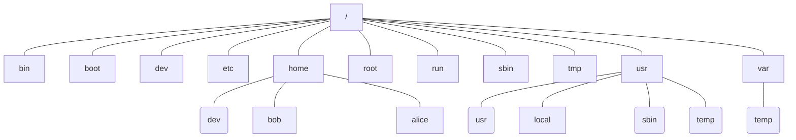

# Linux文件

标准目录结构

> /  --- 根目录
>
> * boot --- 存放引导数据
> * dev --- 设备文件目录
> * etc --- 配置文件
>   - skel --- home目录建立，该目录初始化
>   - sysconfig --- 网络，时间，键盘等配置目录
> * home --- 存储普通用户的数据
> * bin --- 所有用户可执行的二进制文件
> * sbin --- root 管理员可执行的二进制文件
> * tmp --- 临时文件目录，系统启动后的临时文件存放在/var/tmp
> * var --- 存放变量，缓存等
>   - file
>   - lib --- 该目录下的文件在系统运行时，会改变
>   - local --- 安装在/usr/local的程序数据，变化的
>   - lock --- 文件使用特定外设或文件，为其上锁，其他文件暂时不能访问
>   - log --- 记录日志
>   - run --- 系统运行合法信息
>   - spool --- 打印机、邮件、代理服务器等假脱机目录
>   - tmp
>   - catman --- 缓存目录
> * root --- 启动[Linux](http://linux-wiki.cn/wiki/Linux)时使用的一些核心文件。如操作系统[内核](http://linux-wiki.cn/index.php?title=内核&action=edit&redlink=1)、引导程序[Grub](http://linux-wiki.cn/wiki/Category:Grub)等。
> * usr --- 用户目录，存放用户级的文件
>   - bin --- 几乎所有用户所用命令，另外存在与/bin，/usr/local/bin
>   - sbin --- 系统管理员命令，与用户相关，例如，大部分服务器程序
>   - local --- 本地安装软件保存位置
>   - tmp ---  临时文件
> * proc --- 虚拟，存在linux内核镜像；保存所有内核参数以及系统配置信息
>   - 1 --- 进程编号
> * mnt --- 用于临时挂载文件系统。

文件有两类数据：

* 元数据：用于描述文件
* 数据：即存放的内容

**文件名规则**

* 文件名最多255个字节
* 包括路径最长4095个字节

