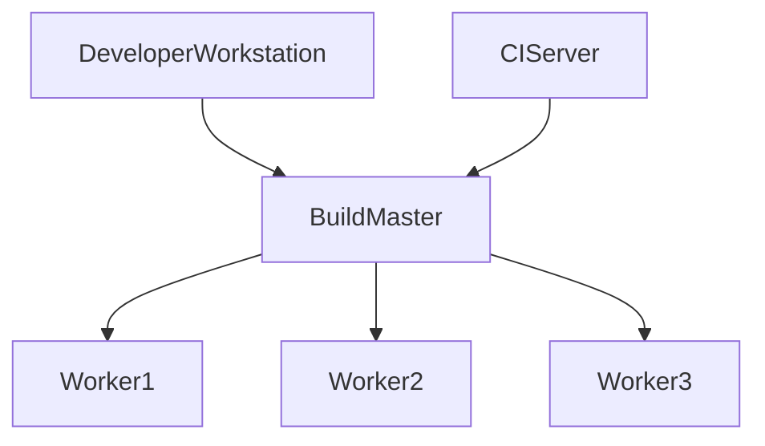
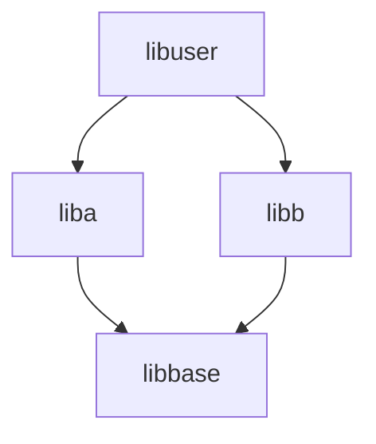

# Software Engineering at Google

# Part I. Thesis

## What Is  Software Enginerring？

Software engineering isn’t programming. Programming is certainly a significant part of software engineering. The latter not only include development but also modification, maintenance, etc.      
One way to see impact of time on a program is to think about the question, “What is the expected life span of your code?”—— We don’t mean “execution lifetime,” we mean “maintenance lifetime”—how long will the code continue to be built, executed, and maintained? How long will this software provide value? One time? One hour? Or decades? This distinction is at the core of what we call sustainability for software. If your project is capable of reacting to whatever valuable change comes along, for either technical or business reasons. When you are incapable of reacting to change, you’re placing a high-risk bet on the hope that such a change never becomes critical. For short-term projects, that might be a safe bet. Over multiple decades, it probably isn’t.    
Another way to look at software engineering is to consider scale. A programming task is often an act of individual creation, but a software engineering task is a team effort. Team collaboration presents new problems. Such scale issues are fundamental to the question of software sustainability: cost and output.The job of a software engineer, is to aim for sustainability and management of the scaling costs for the organization, the product, and the development workflow. With those inputs in mind, we might defer maintenance changes, or even embrace policies that don't scale well. Those choices should be explicit and clear about the deferred costs, but we are regularly forced to evaluate the trade-offs between several paths forward, sometimes with high stakes and often with imperfect value metrics.

### Time and Change

When a novice is learning to program, the life span of the resulting code is usually one hour or day. For most Google projects, must assume that they will live indefinitely. But for most Engineers at an early-stage startup might rightly choose to focus on immediate goals over long-term investmentss: the company might not live long enough to reap the benefits of an infrastructure investment that pays off slowly. Over time, we need to be much more aware of the difference between “happens to work” and “is maintainable.” That is unfortunate, because keeping software main‐ tainable for the long-term is a constant battle.

#### Hyrum’s Law

> With a sufficient number of users of an API, it does not matter what you promise in
> the contract: all observable behaviors of your system will be depended on by
> somebody.

As a API owner, you will gain some flexibility and freedom by being clear about interface promises, but in practice, the complexity and difficulty of a given change also depends on how useful a user finds some observable. If users cannot depend on such things, your API will be easy to change. Given enough time and enough users, even the most innocuous change will break something. Your  analysis of the value of that change must incorporate the difficulty in investigating, identifying, and resolving those breakages.    
Most programmers know that hash tables are non-obviously ordered. Per Hyrum’s Law, programmers will write programs that depend on the order in which a hash table is traversed, if they have the ability to do so. In fact over the past decade or two, the computing industry’s experience using such types has evolved. Also per Hyrum’s Law, there is code that use hash iteration ordering as an inefficient random-number generator. Removing such randomness now would break those users.Just as entropy increases in every thermodynamic system, Hyrum’s Law applies to every observable behavior.    
Thinking over the differences between code written with a “works now” and a “works indefinitely” mentality. Looking at code as an artifact with a highly variable lifetime requirement, the same code may be described "hacky", "sample", or "complicated","Dose not confrom Knuth's optimization principle". This difference depend on your varies, lifetime. 

#### Why Not Just Aim for “Nothing Changes”?

>  In this world nothing can be said to be certain, except death and taxes.


### Scale and Efficiency

Everything your organization relies upon to produce and maintain code should be scalable in terms of overall cost and resource consumption. In particular, everything your organization must do repeatedly should be scalable in terms of human effort. 

#### Policies That Don’t Scale

The traditional use of development branches is an example of policy that has built-in scaling problems. Whenever any branch is decided to be “complete,” it is tested and merged into trunk, triggering some potentially expensive work for other engineers still working on their dev branch, in the form of resyncing and testing. We’ll need a different approach as we scale up, and we will discuss that in later chapter.

#### Policies That Scale Well

One of internal policies at Google is a great enabler of infrastructure teams, pro‐tecting their ability to make infrastructure changes safely, which is called “The Beyoncé Rule".    

> If a product experiences outages or other problems as a result of infrastructure changes, but the issue wasn’t surfaced by tests in our Continuous Integration (CI) system, it is not the fault of the infrastructure change.

#### Shifting Left

The Beyoncé Rule did not avoid compatibility issues, but throw them earlier.     
Consider a timeline of the developer workflow for a feature that progresses from left to right, starting from conception and design, progressing through implementation, review, testing, commit, canary, and eventual production deployment. Shifting problem detection to the “left” earlier on this timeline makes it cheaper to fix than waiting longer.     

<svg width="240" height="140" xmlns="http://www.w3.org/2000/svg">
 <!-- Created with Method Draw - http://github.com/duopixel/Method-Draw/ -->
 <g>
  <title>background</title>
  <rect fill="#fff" id="canvas_background" height="142" width="242" y="-1" x="-1"/>
  <g display="none" overflow="visible" y="0" x="0" height="100%" width="100%" id="canvasGrid">
   <rect fill="url(#gridpattern)" stroke-width="0" y="0" x="0" height="100%" width="100%"/>
  </g>
 </g>
 <g>
  <title>Layer 1</title>
  <line stroke-linecap="undefined" stroke-linejoin="undefined" id="svg_2" y2="122.817463" x2="227.666503" y1="122.817463" x1="10.333761" stroke-width="2" stroke="#000" fill="none"/>
  <line stroke-linecap="undefined" stroke-linejoin="undefined" id="svg_3" y2="121.844065" x2="11.333757" y1="19.484533" x1="11.333757" fill-opacity="null" stroke-opacity="null" stroke-width="2" stroke="#000" fill="none"/>
  <path id="svg_5" d="m-66.332607,45.817764" opacity="0.5" fill-opacity="null" stroke-opacity="null" stroke-width="3" stroke="#000" fill="none"/>
  <path id="svg_10" d="m20.333722,106.150862c162.999364,0.333332 190.332591,-82.666344 190.332126,-82.817619" opacity="0.5" fill-opacity="null" stroke-opacity="null" stroke-width="3" stroke="#000" fill="none"/>
  <text stroke="#000" transform="matrix(0.4719219025577672,0,0,0.39729771036214956,106.52899520367028,85.15398309883545) " xml:space="preserve" text-anchor="start" font-family="Helvetica, Arial, sans-serif" font-size="24" id="svg_11" y="135.817452" x="201.99968" fill-opacity="null" stroke-opacity="null" stroke-width="0" fill="#000000"/>
  <text xml:space="preserve" text-anchor="start" font-family="Helvetica, Arial, sans-serif" font-size="10" id="svg_12" y="134.484123" x="188.333067" fill-opacity="null" stroke-opacity="null" stroke-width="0" stroke="#000" fill="#000000">workflow</text>
  <text xml:space="preserve" text-anchor="start" font-family="Helvetica, Arial, sans-serif" font-size="10" id="svg_13" y="15.151256" x="6.333777" fill-opacity="null" stroke-opacity="null" stroke-width="0" stroke="#000" fill="#000000">defect cost</text>
 </g>
</svg>

So when we scale can assume a defense-in-depth approach, hopefully catching as many defects on the left side of the graph as possible. 


### Trade-offs and Costs

This seems obvious: in software engineering, as in life, good choices lead to good out‐ comes. So it's important that we should be able to explain how we can come to that choice when deciding between the general costs for two engineering options. It's a distaste “because everyone else does it this way”. The choice should always be the result of a trade-off based on known factors. These factors are usually cost and typically involve any or all of these factors:     

* Financial costs (e.g., money) 
* Resource costs (e.g., CPU time) 
* Personnel costs (e.g., engineering effort) 
* Transaction costs (e.g., what does it cost to take action?) 
* Opportunity costs (e.g., what does it cost to not take action?) 
* Societal costs (e.g., what impact will this choice have on society at large?)

#### Inputs to Decision Making

For some scenarios it's easy to measure costs and benefits. Such as "If I spend two weeks changing this linked-list into a higher-performance structure, I’m going to use five gibibytes more production RAM but save two thou‐ sand CPUs." At this time, we can do trade-offs"Should I do?".    
For more scenarios is that we don’t know how to measure costs and benefits. For example, “We don’t know how much engineer-time this will take.” or how do you measure the engineering cost of a poorly designed API? Or the societal impact of a product choice? We rely on experience, lead‐ership, and precedent to negotiate these issues. They are often just as important, but more difficult to manage.


#### Revisiting Decisions, Making Mistakes

A decision will be made at some point, based on the currently available data. As new data comes in, contexts change,  or assumptions are dispelled, it might become clear that a decision was in error or that it made sense at the time but no longer does. We believe strongly in data informing decisions, but the data will change over time. This means, inherently, that decisions will need to be revisited from time to time over the life span of the system in question. For long-lived projects, it’s often critical to have the ability to change directions after an initial decision is made. And, importantly, it means that the deciders need to have the right to admit mistakes. 


### Software Engineering Versus Programming

As said at the beginning, software engineering isn’t programming. Our point is not that software engineering is superior, merely that these represent two different problem domains with distinct constraints, values, and best practices. We believe it is important to differentiate between the related-but-distinct terms “programming” and “software engineering.” Much of that difference stems from the management of code over time, the impact of time on scale, and decision making in the face of those ideas. Programming is the immediate act of producing code. Software engineering is the set of policies, practices, and tools that are necessary to make that code useful for as long as it needs to be used and allowing collaboration across a team.


# Part II. Culture

## How to Work Well on Teams

### Help Me Hide My Code

The answer is insecurity. People are afraid of others seeing and judging their work in progress. In one sense, insecurity is just a part of human nature—nobody likes to be criticized, especially for things that aren’t finished. Recognizing this theme tipped us off to a more general trend within software development: insecurity is actually a symptom of a larger problem.


### The Genius Myth

Many humans have the instinct to find and worship idols. For software engineers, those might be Linus Torvalds, Guido Van Rossum, Bill Gates—all heroes who changed the world with heroic feats.     
Actually, what Linus did was write just the beginnings of a proof-of-concept Unix-like kernel. That was definitely an impressive achievement, but it was just the tip of the iceberg. Linux is hundreds of times bigger than that initial kernel and was developed by thousands of smart people. Linus’ real achievement was to lead these people and coordinate their work; Linux is the shining result not of his original idea, but of the collective labor of the community.

Humans have a natural instinct to find leaders and role models, idolize them, and attempt to imitate them. The phenomenon of “techie-celebrity” has almost spilled over into mythology. We all want to write something world-changing like Linux. Deep down, many engineers secretly wish to be seen as geniuses. This fantasy goes something like this: 

* You are struck by an awesome new concept.
* You vanish into your cave for weeks or months, slaving away at a perfect imple‐ mentation of your idea.
* You then “unleash” your software on the world, shocking everyone with your genius.
* Your peers are astonished by your cleverness.

But most people probably not a genius. And the vast majority of the work at most companies doesn’t require genius-level intellect, but 100% of the work requires a minimal level of social skills. Many programmers are afraid to share work they’ve only just started because it means peers will see their mistakes and know the author of the code is not a genius.     
Have you ever get insecure about people looking before something is done? Like they are going to seriously judge you and think you are an idiot. This is an extremely common feeling among programmers, and the natural reaction is to hide  away until your code is perfect.    
In this case, we assert that you’re doing it wrong, and it is a big deal. Here’s why.


### Hiding Considered Harmful

If you spend all of your time working alone, you’re increasing the risk of unnecessary failure and cheating your potential for growth.

#### Early Detection

If you keep coding alone until the implementation is polished, you’re taking a huge gamble.  It’s easy to make fundamental design mistakes early on. This is why people dip their toes in the water before jumping in the deep end: you need to make sure that you’re working on the right thing, you’re doing it correctly. The more feedback you solicit early on, the more you lower this risk. 

#### The Bus Factor

> Bus factor (noun): the number of people that need to get hit by a bus before your project is completely doomed.

How dispersed is the knowledge and know-how in your project? If somebody the only person who understands how the prototype code works, he might enjoy good job security—but if he gets hit by a bus, the project is toast.     
Hopefully most engineers recognize that it is better to be one part of a successful project than the critical part of a failed project(What does Marx think about this?).

Beyond the bus factor, there’s the issue of overall pace of progress. Working with other people directly increases the collective wisdom behind the effort. When you become stuck on something absurd, how much time do you waste pulling yourself out of the hole? And think about e if you had a couple of peers to look over your shoulder and tell you—instantly—how you goofed and how to get past the problem. This is exactly why teams sit together (or do pair programming) in software engineering companies. 

#### Pace of Progress

Think about one case: do you spend days writing 10,000 lines of code, and compile very first time?  Of course you don’t. I think you can imagine what sort of disaster would result. Programmers work best in tight feedback loops: write a new function, compile. Add a test, compile. Refactor some code, compile. This way, we discover and fix typos and bugs as soon as possible after generating code. The current DevOps philosophy toward tech productivity is explicit about these sorts of goals: get feedback as early as possible, test as early as possible. This is all bundled into the idea of “shifting left” in the developer workflow; the earlier we find a problem, the cheaper it is to fix it.    

The same sort of rapid feedback loop at the whole-project level, too. Projects run into unpredictable design obstacles or political hazards, or we simply discover that things aren’t working as planned. How do you get that feedback loop so that you know the instant your plans or designs need to change? Answer: by working in a team. People working in caves awaken to discover that while their original vision might be complete, the world has changed and their project has become irrelevant.

> Don’t misunderstand us—we still think engineers need uninterrupted time to focus on writing code, but we think they need a high-bandwidth, low-friction connection to their team just as much.

#### In Short, Don’t Hide

-


### It’s All About the Team

> software engineering is a team endeavor

#### The Three Pillars of Social Interaction

 These three principles aren’t just about greasing the wheels of relationships; they’re the foundation on which all healthy interaction and collaboration are based:

* Pillar 1 Humility: You are not the center of the universe (nor is your code!). You’re neither omnis‐ cient nor infallible. You’re open to self-improvement.    
* Pillar 2 Respect: You genuinely care about others you work with. You treat them kindly and appreciate their abilities and accomplishments.
* Pillar 3 Trust: You believe others are competent and will do the right thing, and you’re OK with letting them drive when appropriate.5

#### Why Do These Pillars Matter?

When you’ve got richer relationships with your coworkers, they’ll be more willing to go the extra mile when you need them.

#### Humility, Respect, and Trust in Practice

Criticism is almost never per‐ sonal—it’s usually just part of the process of making a better project. The trick is to make sure you (and those around you) understand the difference between a constructive criticism of someone’s creative output and a flat-out assault against some‐ one’s character. The latter is useless—it’s petty and nearly impossible to act on. The former can (and should!) be helpful and give guidance on how to improve. And, most important, it’s imbued with respect.

> "What’s this?" asks the CEO.
> "My resignation,” says the executive. “I assume you called me in here to fire me."
> "Fire you?" responds the CEO, incredulously. "Why would I fire you? I just spent $10 million training you!"

At Google, one of our favorite mottos is that “Failure is an option.”    

#### Blameless Post-Mortem Culture

The key to learning from your mistakes is to document your failures. Take extra care to make sure the postmortem document isn’t just a useless list of apologies or excuses or finger-pointing—that’s not its purpose. A proper postmortem should keep others avoid some mistakes on similar issues. So, don’t erase your tracks—light them up like a runway for those who follow you. 

The more open you are to influence, the more you are able to influence. There is someone that no matter how much people try to persuade them, they dig their heels in even more. In our experience, people stop listening to their opinions or objections gradully. So keep this idea in your head: it’s OK for someone else to change your mind. We said that engineering is inherently about trade-offs, and it’s impossible for you to be right about everything all the time, so of course you should change your mind when presented with new evidence.

The more vulnerable you are, the stronger you appear. In fact, the willingness to express vulnera‐ bility is an outward show of humility, it demonstrates accountability and the willing‐ ness to take responsibility, and it’s a signal that you trust others’ opinions. Sometimes, the best thing you can do is just say, “I don’t know.” Professional politicians  admitting error may are constantly under attack by their opponents. But when you’re writing software, however, you don’t need to be continually on the defensive—your teammates are collaborators, not competitors. You all have the same goal. 

#### Being Googley

At Google, we have our own internal version of the principles of “humility, respect, and trust” when it comes to behavior and human interactions. Google eventually  defining a rubric for what we mean by “Googleyness”—a set of attributes and behaviors that we look for that represent strong leadership and exemplify “humility, respect, and trust”:

* Thrives in ambiguity: Can deal with conflicting messages or directions, build consensus, and make progress against a problem, even when the environment is constantly shifting.
* Values feedback: Has humility to both receive and give feedback gracefully and understands how valuable feedback is for personal (and team) development.
* Challenges status quo: Is able to set ambitious goals and pursue them even when there might be resist‐ ance or inertia from others.
* Puts the user first: Has empathy and respect for users of Google’s products and pursues actions that are in their best interests. 
* Cares about the team: Has empathy and respect for coworkers and actively works to help them without being asked, improving team cohesion.
* Does the right thing: Has a strong sense of ethics about everything they do; willing to make difficult or inconvenient decisions to protect the integrity of the team and product.


## Knowledge Sharing

Your organization understands your problem domain better than some random person on the internet; your organization should be able to answer most of its own questions and permits people to admit to a lack of knowledge.

### Challenges to Learning

Sharing expertise across an organization is not an easy task. Google has experienced a number of these challenges, especially as the company has scaled:    

* Lack of psychological safety: 
  An environment in which people are afraid to take risks or make mistakes in front of others because they fear being punished for it.
  
* Information islands: 
  Knowledge fragmentation that occurs in different parts of an organization that don’t communicate with one another, each group develops its own way of doing things, and and these might or might not conflict.
  
* Single point of failure (SPOF):
  A bottleneck that occurs when critical information is available from only a single person. This is related to bus factor.
  
* All or nothing expertise: 
  A group of people that is split between people who know “everything” and novices. This problem often reinforces itself if experts always do everything themselves and don’t take the time to develop new experts through mentoring or documentation. This cause knowledge continue to accumulate on those who already have expertise and and new team members ramp up more slowly.

* Parroting:
  Mimicry without understanding, or code is needed for unknown reasons.

* Haunted graveyards:

  Places, often in code, that people avoid touching or changing because they are afraid that something might go wrong. 

### Philosophy

Software engineering can be defined as the multiperson development of multiversion programs.2 People are at the core of software engineering: code is an important output but only a small part of building a product. Code and expertise does not emerge spontaneously out of nothing. An organization’s success depends on growing and investing in its people.

Personalized, one-to-one advice from an expert is always invaluable. And although one person might be able to provide personalized help for one-to-many, this doesn’t scale and is limited to small numbers of “many.” Documented knowledge, on the other hand, can better scale not just to the team but to the entire organization. If we document that knowledge, it is now available to anybody who can view the documentation and to find answers or they might know who does.

### Setting the Stage: Psychological Safety

In a healthy environment, people feel comfortable asking questions, being wrong, and learning new things. A mentor—someone who is not their manager or tech lead—whose responsibilities explicitly include answering questions and helping the new team member ramp up. This mentor is not on the same team as the mentee, which can make the mentee feel more comfortable about asking for help in tricky situations. 
We find the [Recurse Center’s social](https://www.recurse.com/manual#sub-sec-social-rules) rules to be helpful.

### Growing Your Knowledge

If you take away only a single thing from this chapter, it is this: always be learning; always be asking questions.

### Scaling Your Questions: Ask the Community

-

### Scaling Your Knowledge: You Always Have Something to Teach

Office hours are a regularly scheduled (typically weekly) event during which one or more people make themselves available to answer questions about a particular topic. 

Documentation is written knowledge whose primary goal is to help its readers learn something. You can then make it easier for others to follow in your path by pointing them at your document and make sure there’s a mechanism for feedback.

Code documentation is one way to share knowledge; clear documentation not only benefits consumers of the library, but also future maintainers. Code reviews  are often a learning opportunity for both author and reviewer(s).

### Scaling Your Organization’s Knowledge

Good culture must be actively nurtured, and encouraging a culture of knowledge sharing requires a commitment to recognizing and rewarding it at a systemic level.

Canonical sources of information are centralized, company-wide corpuses of information that provide a way to standardize and propagate expert knowledge. Providing centralized references counters problems with information fragmentation that can arise when multiple teams grappling with similar problems produce their own—often conflicting—guides. 
Not all content needs to be shared at an organizational level. When considering how much effort to invest in this resource, consider your audience. Who benefits from this information? You? Your team? Your product area? All engineers?

Static analysis tools are a powerful way to share best practices that can be checked programmatically. When a check for a best practice is added to a tool, every engineer using that tool becomes aware of that best practice. This also frees up engineers to teach other things. 

### Readability: Standardized Mentorship Through Code Review

At Google. Every changelist(CL) requires readability approval. This requirement was added after Google grew to a point where it was no longer possible to enforce that every engineer received code reviews that taught best practices to the desired rigor.

Anyone with readability is welcome to selfnominate to become a readability reviewer. They are expected to treat readability as first and foremost a mentoring and cooperative process, not a gatekeeping or adversarial one. Reviewers provide relevant citations for their comments so that authors can learn about the rationales that went into the style guidelines.

Code is read far more than it is written. An important feature of documented best practices is that they provide consistent standards for all Google code to follow. Readability is both an enforcement and propagation mechanism for these standards, it easier to enforce consistency, avoid islands, and drifting from established norms.

These benefits come with some costs: readability is a heavyweight human-driven process, and is potential for additional rounds of code review for authors. 
But as with most—or perhaps all—engineering processes, there’s always room for improvement. As we continue to invest in static analysis, readability reviewers can increasingly focus on higher-order areas.


## Engineering for Equity

-


## How to Lead a Team

### Managers and Tech Leads (and Both)

At Google, we recognize two different leader‐ ship roles. A Manager is a leader of people, whereas a Tech Lead leads technology efforts.

### Moving from an Individual Contributor Role to a Leadership Role

“servant leadership,” which is a nice way of saying the most important thing you can do as a leader is to serve your team. As a servant leader, you should strive to create an atmosphere of humility, respect, and trust. This might mean removing bureaucratic obstacles that a team member can’t remove by themselves, helping a team achieve consensus, or even buying dinner for the team when they’re working late at the office.

#### The Engineering Manager

The present-day concept of the pointy-haired manager is partially a carryover, first from military hierarchy and later adopted by the Industrial Revolution—more than a hundred years ago! Factories began popping up everywhere, and workers required supervisors to manage them, and because it was easy to replace these workers, the managers had little motivation to treat their employees well or improve conditions for them. And this method worked well for many years.

The [carrot-and-stick](https://zh.wikipedia.org/zh-tw/%E8%83%A1%E8%98%BF%E8%94%94%E5%8A%A0%E5%A4%A7%E6%A3%92) method of management survived the transition from the factory to the modern office in the middle part of the twentieth century when employees would work at the same job for years and years. This continues today in some industries. 

Unlike the replaceable assembly-line worker, software engineers need nurturing, time, and space to think and create. If there’s one thing you remember from this chapter, make it this:

> Traditional managers worry about how to get things done, whereas great managers worry about what things get done (and trust their team to figure out how to do it).


### Antipatterns

And nowhere is hope more overused as a strategy than in dealing with a low performer. Most team leaders grit their teeth, avert their eyes, and just hope that the low performer either magically improves or just goes away. The benefit of dealing with a low performer as quickly as possible is that you can put yourself in the position of helping them up or out. 

Many leads sometimes work extra hard to maintain friendships with their team members. This can be a recipe for disaster. Don’t confuse friendship with leading with a soft touch: when you hold power over someone’s career, they might feel pressure to artificially reciprocate gestures of friendship. Remember that you can lead a team and build consensus without being a close friend of your team.  If the friend who is being managed is not selfmanaging and is not a hard worker, it can be stressful for everyone. 

Big personal egos are difficult to handle on any team, especially in the team’s leader. 


### Positive Patterns

You’ll usually gain respect from people when you apologize, because apologizing tells people that you are level headed, good at assessing situations, and—coming back to humility, respect, and trust—humble.

Another way of thinking about this is the maxim that the leader is always on stage. You are always being watched: not just when you run a meeting or give a talk, but even when you’re just sitting at your desk answering emails. Your peers are watching you for subtle clues in your body language, your reactions to small talk, and your signals as you eat lunch.

When a team member asks you for advice, you usually go leaping into solution mode, but that is the last place you should be. The person asking for advice typically doesn’t want *you* to solve their problem, but rather to help them solve it.

One of the most common things a team leader does is to build consensus, it’s one way you can lead without any actual authority. If your team is looking to move quickly, sometimes it will voluntarily concede authority and direction to one or more team leads. Even though this might look like a dictatorship or oligarchy, when it’s done voluntarily, it’s a form of consensus.

 “I won’t lie to you, but I will tell you when I can’t tell you something or if I just don’t know.”

Giving a little extra slack to a team member who is currently having a tough time at home can make them a lot more willing to put in longer hours when your team has a tight deadline to hit later.

There are two types of motivation: *extrinsic* and *intrinsic*. In his book *Drive*, Dan Pink explains that the way to make people the happiest and most productive isn’t to motivate them extrinsically (e.g., throw piles of cash at them); rather, you need to work to increase their intrinsic motivation(e.g., make them make them want something).

Of course, all the autonomy and mastery in the world isn’t going to help motivate someone if they’re doing work for no reason at all, which is why you need to give their work purpose.


## Leading at Scale

Leading a team of teams is often more about organizing people rather than being a technical wizard.


## Measuring Engineering Productivity

### Why Should We Measure Engineering Productivity?

Adding more people will be necessary to increase the scope of your business, but, the communication overhead costs will not scale linearly as you add additional personnel. As a result, you won’t be able to scale the scope of your business linearly to the size of your engineering organization.
So let's think about: What should we measure? How identifies meaningful metrics that will identify the problematic. And how to use this metric to track improvements to productivity.

### Triage: Is It Even Worth Measuring?

Before measuring, we must consider followering questions: 

* If the data supports your expected result, what action will be taken?
* Who is going to decide to take action on the result, and when would they do it?

For most time, you will found there are many good reasons to not measure:

* You can’t afford to change the process/tools right now
* Any results will soon be invalidated by other factors
* The only metrics available are not precise enough to measure the problem and can be confounded by other factors

### Selecting Meaningful Metrics with Goals and Signals

Google uses the Goals/Signals/Metrics (GSM) framework to guide metrics creation.

* A goal is a desired end result(It should be written in terms of a desired property, without reference to any metric).
* A signal is how you might know that you’ve achieved the end result(It is the way that we will know we’ve achieved our goal). 
* A metric is proxy for a signal witch we actually can measure(It is where we finally determine how we will measure the signal.).

The GSM framework encourages several desirable properties when creating metrics. First, by creating goals first, then signals, and finally metrics, it prevents the streetlight effect(If you look only where you can see, you might not be looking in the right place). 
There is not a 1:1 relationship between signals and goals. And usually, neither of metrics really provide the underlying truth.  If some metrics show different results, it signals that possibly one of them is incorrect and we need to explore further. If they are the same, we just have more confidence that we have reached some kind of truth. Additionally, some signals might not have any associated metric, so that the metrics selected are not telling the complete story. Google uses qualitative data to validate metrics and ensure that they are capturing the intended signal.

### Using Data to Validate Metrics

-

### Taking Action and Tracking Results

We should always assume that engineers will make the appropriate trade-offs if they
have the proper data available and the suitable tools at their disposal.


# Part III. Processes

## Style Guides and Rules

### Why Have Rules?

As an organization grows, the established rules and guidelines shape the common vocabulary of coding. A common vocabulary allows engineers to concentrate on what their code needs to say rather than how they’re saying it.
The interpretation of “good” and “bad” varies by organization, depending on what the organization cares about. We must first recognize what a given organization values; we use rules and guidance to encourage and discourage behavior accordingly. So when defining a set of rules, the first question is "What goal are we trying to advance?".

### Creating the Rules

#### Guiding Principles

There is a number of overarching principles that guide the development of our rules, which must:

* Pull their weight
* Optimize for the reader
* Be consistent
* Avoid error-prone and surprising constructs
* Concede to practicalities when necessary

**Pull their weight**: Not everything should go into a style guide. There is a nonzero cost in asking all of the engineers in an organization to learn and adapt to any new rule that is set. If just one or two engineers are getting something wrong, adding to everyone’s mental load by creating new rules doesn’t scale.

**Optimize for the reader**: Given the passage of time, our code will be read far more frequently than it is written. Google engineers value “simple to read” over “simple to write.” Given the style guide rule, require that engineers leave explicit evidence of intended behavior in their code.  We aim for local reasoning, where the goal is clear understanding of what’s happening at the call site without needing to find and reference other code, including the function’s implementation.
Most style guide rules covering comments are also designed to support this goal of in-place evidence for readers. Documentation comments describe the design or intent of the code that follows. Implementation comments justify or highlight nonobvious choices, explain tricky bits, and underscore important parts of the code. 

**Be consistent**: Consistency is what enables any engi‐ neer to jump into an unfamiliar part of the codebase and get to work fairly quickly. A local project can have its unique personality, but its tools are the same, its techniques are the same, its libraries are the same, and it all Just Works.

**Avoid error-prone and surprising constructs**: Complex features often have subtle pitfalls not obvious at first glance. Using these features without thoroughly understanding their complexities makes it easy to misuse them and introduce bugs. 

**Concede to practicalities**: Some of the rules in our style guides will encounter cases that warrant exceptions, and that’s OK. 

#### The Style Guide

Google's style guides also include limitations on new and not-yet-well-understood language features. For these new features, at the outset, we are sometimes not sure of the proper guidance to give. The goal is to preemptively install safety fences around a feature’s potential pitfalls while we all go through the learning process. At the same time, before everyone takes off running, limiting use gives us a chance to watch the usage patterns that develop and extract best practices from the examples we observe. As adoption spreads, engineers wanting to use the new features in different ways discuss their examples with the style guide owners, asking for allowances to permit additional use cases beyond those covered by the initial restrictions. Watching the waiver requests that come in, we get a sense of how the feature is getting used and eventually collect enough examples to generalize good practice from bad. After we have that information, we can circle back to the restrictive ruling and amend it to allow wider use.

### Changing the Rules

If a rule is causing engineers to invest effort to circumvent it, we might need to reexamine the benefits the rule was supposed to provide. Noticing when a rule is ready for another look is an important part of the process that keeps our rule set relevant and up to date. 
Documenting the reasoning behind a given decision gives us the advantage of being able to recognize when things need to change. With influencing factors clearly noted, we are able to identify when changes related to one or more of these factors warrant reevaluating the rule.

### The Process

Proposals for style guide updates are framed with this view, identifying an existing problem and presenting the proposed change as a way to fix it. “Problems,” in this process are proven with patterns found in existing code. Given a demonstrated problem, because we have the detailed reasoning behind the existing style guide decision, we can reevaluate, checking whether a differ‐ ent conclusion now makes more sense.

At Google, most changes to our style guides begin with community discussion. In fact, the C++ style arbiter group currently consists of four members. This might seem strange: having an odd number of committee members would prevent tied votes in case of a split decision. However, because of the nature of the decision making approach, where nothing is “because I think it should be this way” and everything is an evaluation of trade-off, decisions are made by consensus rather than by voting. The four-member group is happily functional as-is.

### Applying the Rules

Automated rule enforcement ensures that rules are not dropped or forgotten as time passes or as an organization scales up. An engineer checking for rule compliance depends on either memory or documentation, both of which can fail. As long as our tooling stays up to date, in sync with our rule changes, we know that our rules are being applied by all our engineers for all our projects.

Many rules covering language usage can be enforced with static analysis tools. 
Error checking tools take a set of rules or patterns and verify that a given code sample fully complies. Everybody must comply with the rules, so everybody uses the tools that check them.
Automated style checkers and formatters enforce consistent formatting within code. Everybody enforce use of these formatters with presubmit checks.


## Code Review

A well-designed code review process and a culture of taking code review seriously provides the following benefits:

* Checks code correctness 
* Ensures the code change is comprehensible to other engineers 
* Enforces consistency across the codebase 
* Psychologically promotes team ownership 
* Enables knowledge sharing 
* Provides a historical record of the code review itself

**Code correctness**
A reviewer shouldn’t propose alternatives because of personal opinion. Reviewers can propose alternatives, but only if they improve comprehension (by being less complex, for example) or functionality (by being more efficient, for example). In general, engineers are encouraged to approve changes that improve the codebase rather than wait for consensus on a more “perfect” solution. This focus tends to speed up code reviews.

**Comprehension of Code**
Unlike the deference reviewers should give authors regarding design decisions, it’s often useful to treat questions on code comprehension using the maxim “the customer is always right.” This doesn’t mean that you need to change your approach or your logic in response to the criticism, but it does mean that you might
need to explain it more clearly.

**Code Consistency**
A readability approver is tasked with reviewing code to ensure that it follows agreedon best practices for that particular programming language, is consistent with the codebase for that language within Google’s code repository, and avoids being overly complex. Having code that is consistent across the codebase improves comprehension for all of engineering, and this consistency even affects the process of code review itself. 

**Psychological and Cultural Benefits**
The code review process forces an author to not only let others have input, but to compromise for the sake of the greater good.  The code review process provides a mechanism to mitigate what might otherwise be an emotionally charged interaction. Code review, when it works best, provides not only a challenge to an engineer’s assumptions, but also does so in a prescribed, neutral manner, acting to temper any criticism which might otherwise be directed to the author if provided in an unsolicited manner. 
The process of initiating a code review also forces all authors to take a little extra care with their changes. Many software engineers are not perfectionists; most will admit that code that “gets the job done” is better than code that is perfect but that takes too long to develop. Without code review, it’s natural that many of us would cut corners, even with the full intention of correcting such defects later. 

**Knowledge Sharing**
Part of the code review process of feedback and confirmation involves asking ques‐ tions on why the change is done in a particular way. This exchange of information facilitates knowledge sharing. 

### Code Review Best Practices

In general, reviewers should defer to authors on particular approaches and only point out alternatives if the author’s approach is deficient. Reviewers should be careful about jumping to conclusions based on a code author’s particular approach. It’s better to ask questions on why something was done the way it was before assuming that approach is wrong.

To write code for peers. Remember that part of the responsibility of an author is to make sure this code is understandable and maintainable for the future. 

If you disagree with a reviewer’s comment, let them know, and let them know why and don’t mark a comment as resolved until each side has had a chance to offer alternatives. One common way is to offer an alternative and ask the reviewer to PTAL(please take another look). Remember that code review is a learning opportunity for both the reviewer and the author.

The first line of change description should be a summary of the entire change. And the description should still go into detail on what is being changed and why. A description of “Bug fix” is not helpful to a reviewer or a future code archeologist. 

### Types of Code Reviews

* Greenfield reviews and new feature development 
* Behavioral changes, improvements, and optimizations 
* Bug fixes and rollbacks 
* Refactorings and large-scale changes

**Greenfiedl Code Reviews**:
A greenfield review should ensure that an API matches an agreed design and is tested fully, with all API endpoints having some form of unit test, and that those tests fail when the code’s assumptions change.    

Of course, the introduction of entirely new code should not come as a surprise. 
A code review is not the time to debate design decisions already made in the past.    

**Bug fixes and rollbacks**:
At Google, we’ve seen developers start to depend on new code very quickly after it is submitted, and rollbacks sometimes break these developers as a result.


## Documentation

### What Qualifies as Documentation?

When we refer to “documentation,” we’re talking about every supplemental text that an engineer needs to write to do their job: not only standalone documents, but code comments as well.

### Why Is Documentation Needed

Unlike testing, which quickly provides benefits to a programmer, documentation generally requires more effort up front and doesn’t provide clear benefits to an author until later. But, like investments in testing, the investment made in documentation will pay for itself over time. After all, you might write a document only once, but it will be read hundreds, perhaps thousands of times afterward; its initial cost is amortized across all the future readers. Documentation should help answer questions like these:

* Why were these design decisions made?
* Why did we implement this code in this manner?
* Why did I implement this code in this manner, if you’re looking at your own code two years later?

Even to the writer, documentation provides the following benefits:

* Often, the writing of the documentation itself leads engineers to reevaluate design decisions that otherwise wouldn’t be questioned. If you can’t explain it and can’t define it, you probably haven’t designed it well enough.
* Tricks in code should be avoided, in any case, but good comments help out a great deal when you’re staring at code you wrote two years ago, trying to figure out what’s wrong.

### Documentation Is Like Code

Documentation should be no different: it’s a tool, written in a different language (usually English) to accomplish a particular task. Like a programming language, it has rules, a particular syntax, and style decisions, often to accomplish a similar purpose as that within code: enforce consistency, improve clarity, and avoid (comprehension) errors. Within technical documentation, grammar is important not because one needs rules, but to standardize the voice and avoid confusing or distracting the reader. 
Of course, documents with different owners can still conflict with one another (like most code style conflict). In those cases (also like most code style conflict), it is important to designate canonical documentation: determine the primary source and consolidate other associated documents into that primary source (or deprecate the duplicates). 
One other way to promote canonical documents is to associate them directly with the code they document by placing them directly under source control and alongside the source code itself.

The more engineers treat documentation as “one of ” the necessary tasks of software development, the less they will resent the upfront costs of writing, and the more they will reap the long-term benefits.

> #### Case Study: The Google Wiki
>
> When Google was much smaller and leaner, it had few technical writers. The easiest way to share information was through our own internal wiki (GooWiki). But as Google scaled, problems with a wiki-style approach became apparent.
> There were no true owners for documents, many became obsolete, only a few of which seemed to be maintained, and most were specific to certain teams with certain permissions and assumptions.
> The people who could fix the documents were not the people who used them. New users discovering bad documents either couldn’t confirm that the documents were wrong or didn’t have an easy way to report errors.
> The way to improve the situation was to move important documentation under the same sort of source control that was being used to track code changes. Documents began to have their own owners.

### Know Your Audience

One of the most important mistakes that engineers make when writing documentation is to write only for themselves. Think about writing like you do about testing or any other process you need to do as an engineer. Write to your audience, in the voice and style that they expect. 

#### Types of Audiences

In some cases, different audiences require different writing styles, but in most cases, the trick is to write in a way that applies as broadly to your different audience groups as possible. Write descriptively enough to explain complex topics to people unfamiliar with the topic, but don’t lose or annoy experts. Writing a short document often requires you to write a longer one (getting all the information down) and then doing an edit pass, removing duplicate information where you can.
Another important audience distinction is based on how a user encounters a document:

* Seekers are engineers who know what they want and want to know if what they are looking at fits the bill. 
* Stumblers might not know exactly what they want. They might have only a vague idea of how to implement what they are working with.

It’s also useful to identify when a doc is not appropriate for an audience. A lot of documents at Google begin with a “TL;DR statement” such as “TL;DR: if you are not interested in C++ compilers at Google, you can stop reading now.”

### Documentation Types

Design documents, code comments, how-to documents, project pages, and more. These all count as “documentation.” Make sure your document has a singular purpose, and if adding something to that page doesn’t make sense, you probably want to find, or even create, another document for that purpose.

#### Reference Documentation

Reference documentation should be single-sourced as much as possible. Most reference documentation, even when provided as separate documentation from the code, is generated from comments within the codebase itself.
The key win for seekers(who know what they want) is a consistently commented codebase so that they can quickly scan an API and find what they are looking for. The key win for stumblers(who don’t know what they want) is clearly identifying the purpose of an API, often at the top of a file header.

**File comments**
Generally, a file comment should begin with an outline of what’s contained in the code you are reading.(Any API that cannot be succinctly described in the first paragraph or two is usually the sign of an API that is not well thought out.)

```
// -----------------------------------------------------------------------------
// str_cat.h
// -----------------------------------------------------------------------------
//
// This header file contains functions for efficiently concatenating and appending
// strings: StrCat() and StrAppend(). Most of the work within these routines is
// actually handled through use of a special AlphaNum type, which was designed
// to be used as a parameter type that efficiently manages conversion to
// strings and avoids copies in the above operations.
```

**Class comments**
Generally, class com‐ ments should be “nouned” with documentation emphasizing their object aspect. That is, say, “The Foo class contains x, y, z, allows you to do Bar, and has the following Baz aspects,” and so on.

```
// -----------------------------------------------------------------------------
// AlphaNum
// -----------------------------------------------------------------------------
//
// The AlphaNum class acts as the main parameter type for StrCat() and
// StrAppend(), providing efficient conversion of numeric, boolean, and
// hexadecimal values (through the Hex type) into strings.
```

**Function comments**
Function comments should stress the active nature of their use, beginning with an indicative verb describing what the function does and what is returned.

```
// StrCat()
//
// Merges the given strings or numbers, using no delimiter(s),
// returning the merged result as a string.
```

#### Design Docs

The development of a design document is one of the first processes an engi‐ neer undertakes before deploying a new system. A good design document should cover the goals of the design, its implementation strategy, and propose key design decisions with an emphasis on their individual trade-offs.

#### Tutorials

Every software engineer, when they join a new team, will want to get up to speed as quickly as possible. 
Often, the best time to write a tutorial, if one does not yet exist, is when you first join a team. Get a notepad to take notes, and write down everything you need to do along the way; try not to assume any particular setup, permissions, or domain knowledge(or state that clearly in the beginning of the tutorial as a set of prerequisites.).

**Example: A bad tutorial** 

1. Download the package from our server at http://example.com 
2. Copy the shell script to your home directory 
3. Execute the shell script 
4. The foobar system will communicate with the authentication system 
5. Once authenticated, foobar will bootstrap a new database named “baz” 
6. Test “baz” by executing a SQL command on the command line 
7. Type: CREATE DATABASE my_foobar_db;

Steps 4 and 5 happen on the server end. It’s unclear whether the user needs to do anything(but actually they don’t), so those side effects can be mentioned as part of step 3. As well, it’s unclear whether step 6 and step 7 are different. (Actually they aren’t.) Combine all atomic user operations into single steps so that the user knows they need to do something at each step in the process.

**Example: A bad tutorial made better** 

1. Download the package from our server at http://example.com: 
   ```bash
   $ curl -I http://example.com 
   ```

2. Copy the shell script to your home directory: 
   ```bash
   $ cp foobar.sh 
   ```

3. Execute the shell script in your home directory:
   ```bash
   $ cd ~; foobar.sh
   ```

   The foobar system will first communicate with the authentication system. Once authenticated, foobar will bootstrap a new database named “baz” and open an input shell.

4. Test “baz” by executing a SQL command on the command line:
   ```bash
   baz:$ CREATE DATABASE my_foobar_db;
   ```

#### Conceptual Documentation

One problem engineers face when writing conceptual documentation is that it often cannot be embedded directly within the source code because there isn’t a canonical location to place it. The only logical place to document such complex behavior is through a separate conceptual document. (The package comments provided by godoc in the Go allow to write conceptual documents very well. Such as [doc.go](https://go.dev/src/pkg/encoding/gob/doc.go))

### Documentation Philosophy

#### Deprecating Documents

When a document no longer serves any purpose, either remove it or identify it as obsolete (and, if available, indicate where to go for new information). 
At Google, documents note the last time a document was reviewed.


## Testing Overview

Teams with good tests can review and accept changes to their project with confidence because all important behaviors of their project are continuously verified. 

We define a "flaky" test result as a test that exhibits both a passing and a failing result with the same code. If test flakiness continues to grow, team will experience a loss of confidence in the tests. After that happens, engi‐ neers will stop reacting to test failures, eliminating any value the test suite provided.

Tests should assume as little as possible about the outside environment.(Such as the order in which the tests are run;  should not rely on a shared database).
“a test should be obvious upon inspection.” Because there are no tests for the tests themselves, they are often revisited only when something breaks and require manual review as an important check on correctness. So so make sure you write the test you’d like to read!

There are two distinct dimensions for every test case: size and scope. Size refers to the resources that are required to run a test case: things like memory, processes, and time. Scope refers to the specific code paths we are verifying. 

### Designing a Test Suite

To recap, size refers to the resources consumed by a test and what it is allowed to do, and scope refers to how much code a test is intended to validate.

#### Test Size

A test’s size is determined not by its number of lines of code, but by how it runs, what it is allowed to do, and how many resources it consumes. In brief, small tests run in a single process, medium tests run on a single machine, and large tests run wherever they want.

**Small tests:** The primary constraint is that small tests must run in a single shread. This means that you can’t run a server and have a separate test process connect to it. And they aren’t allowed to sleep, perform I/O operations, and access the network or disk. All this is to make sure the tests can effectively run as fast as the CPU can handle.
**Medium tests:** It can span multiple processes, use threads, and can make blocking calls, including network calls, to localhost(but aren’t allowed to make network calls to any system which isn’t something we can guarantee in general). 
**Large tests:** Large tests remove the localhost restriction. Teams at Google will frequently isolate their large tests from their small or medium tests, running them only during the build and release process so as not to impact developer workflow.

#### Test Scope

**Narrow-scoped tests:** Commonly called “unit tests”, are designed to focus an individual class or method.
**Medium-scoped tests:** Commonly called integration tests, are designed to verify interactions between a small number of components; It’s possible to write a business logic.
**Large-scoped tests:** Commonly referred to by names like functional tests, end-to-end tests, or system tests, are designed to validate the interaction of several distinct parts of the system.

Google recommended mix of tests is determined by our two primary goals: engineering productivity and product confidence. When considering your own mix, you might want a different balance.

#### The Beyoncé Rule

“If you liked it, then you shoulda put a test on it.” The Beyoncé Rule is often invoked by infrastructure teams that are responsible for making changes across the entire codebase. If unrelated infrastructure changes pass all of your tests but still break your team’s product, you are on the hook for fixing it and adding the additional tests.

#### A Note on Code Coverage

Code coverage is often held up as the gold standard metric for understanding test quality, and that is somewhat unfortunate. It is possible to exercise a lot of lines of code with a few tests, never checking that each line is doing anything useful. That’s because code coverage only measures that a line was invoked, not what happened as a result. 
It is common for teams to establish a bar for expected code coverage—for instance, 80%. At first, that sounds eminently reason‐ able; surely you want to have at least that much coverage. In practice, what happens is that instead of treating 80% like a floor, engineers treat it like a ceiling. Soon, changes begin landing with no more than 80% coverage. After all, why do more work than the metric requires? 
A better way to approach the quality of your test suite is to think about the behaviors that are tested.

### Testing at Google Scale

#### The Pitfalls of a Large Test Suite

Brittle tests—those that over-specify expected outcomes or rely on extensive and complicated boilerplate—can actually resist change. These poorly written tests can fail even when unrelated changes are made(Brittle tests usually appear in an abuse of mocking frameworks). 
If a test suite is causing more harm than good, eventually engineers will find a way to get their job done, tests or no tests.

### History of Testing at Google

#### Orientation Classes

The pioneers of automated testing at Google knew that at the rate the company was growing, new engineers would quickly outnumber existing team members. If they could reach all the new hires in the company, it could be an extremely effective avenue for introducing cultural change. 
The new hires had no idea that they were being used as trojan horses to sneak this idea into their unsuspecting teams. As Nooglers joined their teams following orientation, they began writing tests and questioning those on the team who didn’t.

#### Testing on the Toilet

The goal of TotT was fairly simple: actively raise awareness about testing across the entire company. The Testing Grouplet considered the idea of a regular email newsletter, but given the heavy volume of email everyone deals with at Google, it was likely to become lost in the noise. But the bathroom is one place that everyone must visit at least once each day, no matter what. 
To say the reaction was polarized is an understatement; some saw it as an invasion of personal space, and they objected strongly. Mailing lists lit up with complaints, but the TotT creators were content: the people complaining were still talking about testing.
A good TotT episode contains something an engineer can take back to the desk immediately and try. 

### The Limits of Automated Testing

Automated testing is not suitable for all testing tasks. For example, testing the quality of search results often involves human judgment. 
Exploratory Testing does not apply either. Exploratory Testing is a fundamentally creative endeavor in which someone treats the application under test as a puzzle to be broken, maybe by executing an unexpected set of steps or by inserting unexpected data. 


## Unit Testing

Compared to broader-scoped tests, unit tests have many properties that make them an excellent way to optimize productivity:

* They can serve as documentation and examples, showing engineers how to use the part of the system being tested and how that system is intended to work.

### The Importance of Maintainability

Imagine this scenario: 

> Mary wants to add a simple new feature to the product. Perhaps requiring only a couple dozen lines of code. But when she goes to check in her change, she gets a screen full of errors back from the automated testing system. 
> She spends the rest of the day going through those failures one by one. In each case, the change introduced no actual bug, but broke some of the assumptions that the test made about the internal structure of the code, requiring those tests to be updated. 
> Often, she has difficulty figuring out what the tests were trying to do in the first place, and the hacks she adds to fix them make those tests even more difficult to understand in the future. Ultimately, what should have been a quick job ends up taking hours or even days of busywork.

Here, testing had the opposite of its intended effect by draining productivity rather than improving it while not meaningfully increasing the quality of the code under test. The problems Mary ran into weren’t her fault, and there was nothing she could have done to avoid them: bad tests must be fixed before they are checked in, lest they impose a drag on future engineers.  
Broadly speaking, the issues she encountered fall into two categories. First, the tests she was working with were brittle: they broke in response to a harmless and unrelated change that introduced no real bugs. Second, the tests were unclear: after they were failing, it was difficult to determine what was wrong, how to fix it, and what those tests were supposed to be doing in the first place.

### Preventing Brittle Tests

A brittle test is one that fails in the face of an unrelated change to production code that does not introduce any real bugs. Such tests must be diagnosed and fixed by engineers as part of their work. If a team regularly writes brittle tests, test maintenance will inevitably consume a larger and larger proportion of the team’s time as they are forced to comb through an increasing number of failures in an ever-growing test suite.

#### Strive for Unchanging Tests

The ideal test is unchanging: after it’s written, it never needs to change unless the requirements of the system under test change. Fundamentally, there are four kinds of changes and we should expect tests to respond to:

* *Pure refactorings:* The system’s tests shouldn’t need to change. 
* *New features:* The engineer must write new tests to cover the new behaviors, but they shouldn’t need to change any existing tests.
* *Bug fixes:* The bug fix should include that missing test case. Typically shouldn’t require updates to existing tests .
* *Behavior changes:* Note that such changes tend to be significantly more expensive than the other three types. It's the one case when we expect to have to make updates to the system’s existing tests.

#### Test via Public APIs

Consider follows example, which validates a transaction and saves it to a database.

```java
public void processTransaction(Transaction transaction) {
    if (isValid(transaction)) {
        saveToDatabase(transaction);
    }
}
private boolean isValid(Transaction t) {
    return t.getAmount() < t.getSender().getBalance();
}
private void saveToDatabase(Transaction t) {
    String s = t.getSender() + "," + t.getRecipient() + "," + t.getAmount();
    database.put(t.getId(), s);
}
public void setAccountBalance(String accountName, int balance) {
    // Write the balance to the database directly
}
public void getAccountBalance(String accountName) {
    // Read transactions from the database to determine the account balance
}
```

A tempting way to test this code would be to remove the “private” visibility modifiers and test the implementation logic directly, as follows:

```java
@Test
public void emptyAccountShouldNotBeValid() {
    assertThat(processor.isValid(newTransaction().setSender(EMPTY_ACCOUNT)))
        .isFalse();
}
@Test
public void shouldSaveSerializedData() {
    processor.saveToDatabase(newTransaction()
        .setId(123)
        .setSender("me")
        .setRecipient("you")
        .setAmount(100));
    assertThat(database.get(123)).isEqualTo("me,you,100");
}
```

This test is brittle. It interacts with the transaction processor in a much different way than its real users would: it peers into the system’s internal state and calls methods that aren’t publicly exposed as part of the system’s API. And almost any refactoring of the system under test would cause the test to break(such as renaming its methods, factoring them out into a helper class, or changing the serialization format), even if such a change would be invisible to the class’s real users. 
Instead, the same test coverage can be achieved by testing only against the class’s pub‐ lic API, as follows:

```java
@Test
public void shouldTransferFunds() {
    processor.setAccountBalance("me", 150);
    processor.setAccountBalance("you", 20);
    processor.processTransaction(newTransaction()
        .setSender("me")
        .setRecipient("you")
        .setAmount(100));
    assertThat(processor.getAccountBalance("me")).isEqualTo(50);
    assertThat(processor.getAccountBalance("you")).isEqualTo(120);
}
@Test
public void shouldNotPerformInvalidTransactions() {
    processor.setAccountBalance("me", 50);
    processor.setAccountBalance("you", 20);
    processor.processTransaction(newTransaction()
        .setSender("me")
        .setRecipient("you")
        .setAmount(100));
    assertThat(processor.getAccountBalance("me")).isEqualTo(50);
    assertThat(processor.getAccountBalance("you")).isEqualTo(20);
}
```

Such tests are more realistic and less brittle because they form explicit contracts: if such a test breaks, it implies that an existing user of the system will also be broken. Testing only these contracts means that you’re free to do whatever internal refactoring of the system you want without having to worry about making tedious changes to tests. 

It’s not always clear what constitutes a “public API,” and the question really gets to the heart of what a “unit” is in unit testing. **Units can be as small as an individual function or as broad as a set of several related packages/modules.** When we say “public API” in this context, we’re really talking about the API exposed by that unit to third parties outside of the team that owns the code(This doesn’t align with the notion of visibility provided by some programming languages; Such as implicit and explicit in Go). 

Defining an appropriate scope for a unit and hence what should be considered the public API is more art than science, but here are some rules of thumb:

* If a method or class exists only to support one or two other classes (i.e., it is a “helper class”), it probably shouldn’t be considered its own unit, and its function‐ ality should be tested through those classes instead of directly.
* If a package or class is designed to be accessible by anyone without having to consult with its owners, it almost certainly constitutes a unit that should be tested directly, where its tests access the unit in the same way that the users would.
* If a package or class can be accessed only by the people who own it, but it is designed to provide a general piece of functionality useful in a range of contexts (i.e., it is a “middleware”), it should also be considered a unit and tested directly. Without this unit test, a gap in test coverage could be introduced if one of the library’s users (and its tests) were ever removed.

At Google, we’ve found that engineers sometimes need to be persuaded that testing via public APIs is better than testing against implementation details. The reluctance is understandable because it’s often much easier to write tests focused on the piece of code you just wrote rather than figuring out how that code affects the system as a whole. Nevertheless, it valuable to encourage such practices, as the extra upfront effort pays for itself many times over in reduced maintenance burden. Testing against public APIs make ensure that your tests fail only in the event of meaningful changes to your system.

#### Test State, Not Interactions

 In general, there are two ways to verify that a system under test behaves as expected. *With state testing*, you observe the system itself to see what it looks like after invoking with it(Such as test a function with a success return). *With interaction testing*, you instead check that the system took an expected sequence of actions on its collaborators in response to invoking it(Such as test a function return different errors). 
Interaction tests tend to be more brittle than state tests for the same reason that it’s more brittle to test a private method than to test a public method: interaction tests check *how* a system arrived at its result, whereas usually you should care only *what* the result is. For example: 

```java
@Test
public void shouldWriteToDatabase() {
    accounts.createUser("foobar");
  
    // just verify is database put 'foobar' into storage
    verify(database).put("foobar"); 
}
```

There are a couple different ways it could go wrong:

* If a bug in the system under test causes the record to be deleted from the data‐ base shortly after it was written, the test will pass even though we would have wanted it to fail.
* If the system under test is refactored to call a slightly different API to write an equivalent record, the test will fail even though we would have wanted it to pass.

It’s much less brittle to directly test against the state of the system, as demonstrated in follows:

```java
@Test
public void shouldCreateUsers() {
    accounts.createUser("foobar");
    assertThat(accounts.getUser("foobar")).isNotNull();
}
```

The most common reason for problematic interaction tests is an over reliance on mocking frameworks. We tend to prefer the use of real objects in favor of mocked objects, as long as the real objects are fast and deterministic.

### Writing Clear Tests

Failure is a good thing—test failures provide useful signals to engineers, and are one of the main ways that a unit test provides value. Test failures happen for one of two reasons:

* The system under test has a problem or is incomplete. This is exactly what tests are designed for. 
* The test itself is flawed, this means that the test is brittle. 

When a test fails, an engineer’s first job is to identify which of these cases the failure falls into and then to diagnose the actual problem. A clear test is one whose purpose for existing and reason for failing is immediately clear to the engineer diagnosing a failure. 
As code database, it’s entirely possible that a failing test might have been written years ago by an engineer no longer on the team, leaving no way to figure out its purpose. In the worst case, these obscure tests just end up getting deleted when engineers can’t figure out how to fix them. It indicates that the test has been providing zero value for perhaps the entire period it has existed (which could have been years).

#### Make Your Tests Complete and Concise

Two high-level properties that help tests achieve clarity are completeness and conciseness. It means *a test’s body should contain all of the information needed to understand it without containing any irrelevant or distracting information.* The following two can be used for comparison:

```java
@Test
public void shouldPerformAddition() {
    Calculator calculator = new Calculator(new RoundingStrategy(),
        "unused", ENABLE_COSINE_FEATURE, 0.01, calculusEngine, false);
    int result = calculator.calculate(newTestCalculation());
    assertThat(result).isEqualTo(5); // Where did this number come from?
}
```

```java
@Test
public void shouldPerformAddition() {
    Calculator calculator = newCalculator();
    int result = calculator.calculate(newCalculation(2, Operation.PLUS, 3));
    assertThat(result).isEqualTo(5);
}
```

The implementation of a method or class greatly affects how to write test methods. Good code should make it easy to write tests. In other words, our code should be designed with testing in mind. When a function or class can be easily tested, its functionality is clear and can be described.

#### Test Behaviors, Not Methods

Consider the snippet of code as follows:
```java
public void displayTransactionResults(User user, Transaction transaction) {
    ui.showMessage("You bought a " + transaction.getItemName());
    if (user.getBalance() < LOW_BALANCE_THRESHOLD) {
        ui.showMessage("Warning: your balance is low!");
    }
}
```

```java
// A method-driven test
@Test
public void testDisplayTransactionResults() {
    transactionProcessor.displayTransactionResults(
        newUserWithBalance(
            LOW_BALANCE_THRESHOLD.plus(dollars(2))),
        new Transaction("Some Item", dollars(3)));
    assertThat(ui.getText()).contains("You bought a Some Item");
    assertThat(ui.getText()).contains("your balance is low");
}
```

With such tests, it’s likely that the test started out covering only the first method. Later, an engineer expanded the test when the second message was added (This would violate the idea of immutable testing we discussed earlier). This modification sets a bad precedent: as the method under test becomes more complex and implements more functionality, its unit test will become increasingly convoluted and grow more and more difficult to work with.

There’s a better way: rather than writing a test for each method, write a test for each behavior. A behavior is any guarantee that a system makes about how it will respond to a series of inputs while in a particular state. Behaviors can often be expressed using the words “given,” “when,” and “then”: “Given that a bank account is empty, when attempting to withdraw money from it, then the transaction is rejected.” For example:

```java
// A behavior-driven test
@Test
public void displayTransactionResults_showsItemName() {
    transactionProcessor.displayTransactionResults(
        new User(), new Transaction("Some Item"));
    assertThat(ui.getText()).contains("You bought a Some Item");
}
@Test
public void displayTransactionResults_showsLowBalanceWarning() {
    transactionProcessor.displayTransactionResults(
        newUserWithBalance(
            LOW_BALANCE_THRESHOLD.plus(dollars(2))),
        new Transaction("Some Item", dollars(3)));
    assertThat(ui.getText()).contains("your balance is low");
}
```

Behavior-driven tests tend to be clearer than method-oriented tests for several reasons. 

* First, they read more like natural language. 
* Second, they more clearly express cause and effect because each test is more limited in scope. 
* Finally, each test is short and descriptive makes it easier to see what functionality is already tested and encourages engineers to add new streamlined test methods instead of piling onto existing methods.

##### Structure tests to emphasize behaviors

Remember that every behavior has three parts: a “given” component that defines how the system is set up, a “when” component that defines the action to be taken on the system, and a “then” component that validates the result. *Be careful to ensure that you’re not inadvertently testing multiple behaviors at the same time.* 
There are two examples:

```java
@Test
public void transferFundsShouldMoveMoneyBetweenAccounts() {
    // Given two accounts with initial balances of $150 and $20
    Account account1 = newAccountWithBalance(usd(150));
    Account account2 = newAccountWithBalance(usd(20));
  
    // When transferring $100 from the first to the second account
    bank.transferFunds(account1, account2, usd(100));
  
    // Then the new account balances should reflect the transfer
    assertThat(account1.getBalance()).isEqualTo(usd(50));
    assertThat(account2.getBalance()).isEqualTo(usd(120));
}
```

```java
@Test
public void shouldTimeOutConnections() {
    // Given two users
    User user1 = newUser();
    User user2 = newUser();
    // And an empty connection pool with a 10-minute timeout
    Pool pool = newPool(Duration.minutes(10));
  
    // When connecting both users to the pool
    pool.connect(user1);
    pool.connect(user2);
  
    // Then the pool should have two connections
    assertThat(pool.getConnections()).hasSize(2);
  
    // When waiting for 20 minutes
    clock.advance(Duration.minutes(20));
  
    // Then the pool should have no connections
    assertThat(pool.getConnections()).isEmpty();
    // And each user should be disconnected
    assertThat(user1.isConnected()).isFalse();
    assertThat(user2.isConnected()).isFalse();
}
```

##### Name tests after the behavior being tested

The test name is the first or only token visible in failure reports, so it’s your best opportunity to communicate the problem when the test breaks. For examples: 

```
multiplyingTwoPositiveNumbersShouldReturnAPositiveNumber
multiply_postiveAndNegative_returnsNegative
divide_byZero_throwsException
```

A good trick if you’re stuck is to try starting the test name with the word “should.” Such names also help ensure that the test stays focused on a single behavior: if you need to use the word “and” in a test name, there’s a good chance that you’re actually testing multiple behaviors and should be writing multiple tests! 

#### Don’t Put Logic in Tests

```java
@Test
public void shouldNavigateToAlbumsPage() {
    String baseUrl = "http://photos.google.com/";
    Navigator nav = new Navigator(baseUrl);
    nav.goToAlbumPage();
    assertThat(nav.getCurrentUrl()).isEqualTo(baseUrl + "/albums");
}
```

There only one logic here, string concatenation(`baseUrl + "/albums"`). But if we simplify the test by removing that one bit of logic, a bug immediately becomes clear. 

```java
@Test
public void shouldNavigateToPhotosPage() {
        Navigator nav = new Navigator("http://photos.google.com/");
        nav.goToPhotosPage();
        assertThat(nav.getCurrentUrl()))
    .isEqualTo("http://photos.google.com//albums"); // Oops!
}
```

#### Write Clear Failure Messages

One last aspect of clarity has to do with what an engineer sees when it fails.  It should clearly express the desired outcome, the actual outcome, and any relevant parameters. Consider the follows  failure message:

```
Test failed: account is closed
```

```
Expected an account in state CLOSED, but got account:
 <{name: "my-account", state: "OPEN"}
```

Another example in java:
```java
Set < String > colors = ImmutableSet.of("red", "green", "blue");
assertTrue(colors.contains("orange")); // JUnit
assertThat(colors).contains("orange"); // Truth
```

The first assertion only receives a Boolean value,  it is only able to give a generic error message like “expected  but was false”. The second assertion explicitly receives the subject of the assertion, it is able to give a much more useful error message: AssertionError: [red, green, blue] should have contained orange.”
It should always be possible to manually specify the important information in the failure message, even if languages havn't such helpers. Such as, test assertions in Go:

```go
result := Add(2, 3)
if result != 5 {
  t.Errorf("Add(2, 3) = %v, want %v", result, 5)
}
```

### Tests and Code Sharing: DAMP, Not DRY

Different with production code should achieve DRY—"Don’t Repeat Yourself". Good tests are designed to be stable, and in fact you usually want them to break when the system being tested changes. So test code should often strive to be DAMP—"Descriptive And Meaningful Phrases."

#### Shared Values

Many tests are structured by defining a set of shared values to be used by tests and then by defining the tests that cover various cases for how these values interact.  But it causes problems as the test suite grows. For one, it can be difficult to understand *why a particular value was chosen for a test*. A better way to avoid verbose is to construct data using helper methods. 
```go
func newTestPerson(opts ...func(people *Person)) *Person {
	p := &Person{
		Name:  "default name",
		Phone: "default phone",
		Addr:  "default addr",
	}
	for _, opt := range opts {
		opt(p)
	}

	return p
}
```

#### Shared Setup

A related way that tests shared code is via setup/initialization logic. Many test frameworks allow engineers to define methods to execute before each test in a suite is run. It is useful when the majority of tests don’t care about the specific arguments used to construct those objects and can let them stay in their default states.
One risk in using setup methods is that a reader of the test needs to go hunting to discover where has done something. 

#### Defining Test Infrastructure

It can also be valuable to share code(helper method and so on) across multiple test suites, we refer to this sort of code as test infrastructure. Carefully designed test infrastructure can make unit tests much easier to write. 
Most of the test infrastructure that most engineers use comes in the form of well-known third-party libraries like JUnit. A huge number of such libraries are available, and standardizing on them within an organization should happen as early and universally as possible.

### Conclusion

With great power comes great responsibility, and careless use of unit testing can result in a system that requires much more effort to maintain and takes much more effort to change without actually improving our confidence in said system.


## Test Doubles

A test double is an object or function that can stand in for a real implementation in a test and behaves similarly to the real implementation. The use of test doubles is often referred to as mocking, but we avoid that term in this chapter because, as we’ll see, that term is also used to refer to more specific aspects of test doubles. 

### The Impact of Test Doubles on Software Development

The concepts introduced here are discussed in more depth throughout this chapter:

* *Testability*: It should be possible for tests to swap out real implementations with test doubles. 
* *Applicability*:  In many cases, test doubles are not suitable and engineers should prefer to use real implementations instead.
* *Fidelity*: Fidelity refers to how closely the behavior of a test double resembles the behavior of the real implementation that it’s replacing. 

### Test Doubles at Google

It wasn’t until several years that mocking frameworks first came into use at Google, googlers realized though these tests were easy to write, we suffered greatly given that they required constant effort to maintain while rarely finding bugs.

### Basic Concepts

#### An Example Test Double

Imagine an ecommerce site that needs to process credit card payments.
```java
class PaymentProcessor {
    private CreditCardService creditCardService;
    ...
    boolean makePayment(CreditCard creditCard, Money amount) {
        if (creditCard.isExpired()) {
            return false;
        }
        boolean success =
            creditCardService.chargeCreditCard(creditCard, amount);
        return success;
    }
}
```

It would be infeasible to use a real credit card service in a test, but a test double could be used in its place to simulate the behavior of the real system. The follows is the simplest test double:

```java
class TestDoubleCreditCardService implements CreditCardService {
    @Override
    public boolean chargeCreditCard(CreditCard creditCard, Money amount) {
        return true;
    }
}
```

Although this test double doesn’t look very useful, using it in a test still allows us to test some of the logic in the makePayment() method. We can validate that the method behaves properly when the credit card is expired:

```java
@Test public void cardIsExpired_returnFalse() {
    boolean success = paymentProcessor.makePayment(EXPIRED_CARD, AMOUNT);
    assertThat(success).isFalse();
}
```

#### Seams

Code is said to be testable if it is written in a way that makes it possible to write unit tests for the code. A seam is a way to make code testable by allowing for the use of test doubles—it makes it possible to use different dependencies for the system under test rather than the dependencies used in a production environment. 
Dependency injection is a common technique for introducing seams. In short, when a class utilizes dependency injection, any classes it needs to use are passed to it rather than instantiated directly, making it possible for these dependencies to be substituted in tests. As follows:

```java
class PaymentProcessor {
    private CreditCardService creditCardService;
    PaymentProcessor(CreditCardService creditCardService) {
            this.creditCardService = creditCardService;
        }
        ...
}
```

```java
PaymentProcessor paymentProcessor =
 new PaymentProcessor(new TestDoubleCreditCardService());
```

To reduce boilerplate associated with manually specifying constructors, automated dependency injection frameworks can be used for constructing object graphs automatically. For example, Guice and Dagger for Java code, [wire](https://github.com/google/wire) for Go.
With dynamically typed languages such as Python or JavaScript, dependency injection is less important in these languages. It is possible to dynamically replace individual functions or object methods. 

Writing testable code requires an upfront investment. It is especially critical early in the lifetime of a codebase because the later testability is taken into account, the more difficult it is to apply to a codebase. Code written without testing in mind typically needs to be refactored or rewritten before you can add appropriate tests.

#### Mocking Frameworks

A mocking framework is a software library that makes it easier to create test doubles within tests; it allows you to replace an object with a mock, which is a test double whose behavior is specified inline in a test. The follows demonstrate the use of Mockito, a mocking framework for Java. 

```java
class PaymentProcessorTest {
    ...
    PaymentProcessor paymentProcessor;
    // Create a test double of CreditCardService with just one line of code.
    @Mock CreditCardService mockCreditCardService;
    @Before public void setUp() {
        // Pass in the test double to the system under test.
        paymentProcessor = new PaymentProcessor(mockCreditCardService);
    }
    @Test public void chargeCreditCardFails_returnFalse() {
        // Give some behavior to the test double: it will return false
        // anytime the chargeCreditCard() method is called. The usage of
        // “any()” for the method’s arguments tells the test double to
        // return false regardless of which arguments are passed.
        when(mockCreditCardService.chargeCreditCard(any(), any())
            .thenReturn(false); boolean success = paymentProcessor.makePayment(CREDIT_CARD, AMOUNT); assertThat(success).isFalse();
        }
    }
}
```

### Techniques for Using Test Doubles

#### Faking

A fake is a lightweight implementation of an API that behaves similar to the *real implementation* but isn’t suitable for production; Writing a fake can be challenging because you need to ensure that it has similar behavior to the real imple‐ mentation, now and in the future. For example:

```java
// Creating the fake is fast and easy.
AuthorizationService fakeAuthorizationService =
    new FakeAuthorizationService();
AccessManager accessManager = new AccessManager(fakeAuthorizationService):

// Unknown user IDs shouldn’t have access.
assertFalse(accessManager.userHasAccess(USER_ID));

// The user ID should have access after it is added to
// the authorization service.
fakeAuthorizationService.addAuthorizedUser(new User(USER_ID));
assertThat(accessManager.userHasAccess(USER_ID)).isTrue();
```

#### Stubbing

Stubbing is the process of giving behavior to a function that otherwise has no behavior on its own—you specify to the function exactly what values to return (that is, you stub the return values). For example:

 ```java
 // Pass in a test double that was created by a mocking framework.
 AccessManager accessManager = new AccessManager(mockAuthorizationService):
 
 // The user ID shouldn’t have access if null is returned.
 when(mockAuthorizationService.lookupUser(USER_ID)).thenReturn(null);
 assertThat(accessManager.userHasAccess(USER_ID)).isFalse();
 
 // The user ID should have access if a non-null value is returned.
 when(mockAuthorizationService.lookupUser(USER_ID)).thenReturn(USER);
 assertThat(accessManager.userHasAccess(USER_ID)).isTrue();
 ```

#### Interaction Testing

Interaction testing is a way to validate how a function is called without actually calling the implementation of the function. Interaction testing is sometimes called mocking. We avoid this terminology in this chapter because it can be confused with mocking frameworks. 
A test should fail if a function isn’t called the correct way(called times, arguments). For example, the `verify(...)` method from the Mockito mocking framework is used to validate that `lookupUser()` is called as expected.

```java
// Pass in a test double that was created by a mocking framework.
AccessManager accessManager = new AccessManager(mockAuthorizationService);
accessManager.userHasAccess(USER_ID);

// The test will fail if accessManager.userHasAccess(USER_ID) didn’t call
// mockAuthorizationService.lookupUser(USER_ID).
verify(mockAuthorizationService).lookupUser(USER_ID);
```

#### Real Implementations

Preferring real implementations in tests is known as classical testing. There is also a style of testing known as mockist testing, in which the preference is to use mocking frameworks instead of real implementations. 
Our first choice for tests is to use the real implementations of the system under test’s dependencies; that is, the same implementations that are used in production code. 

> **Case Study: @DoNotMock**
>
> At Google, If an engineer attempts to use a mocking framework to create an instance of a class or interface that has been annotated as @DoNotMock, as demonstrated as follow, they will see an error directing them to use a more suitable test strategy:
> ```java
> @DoNotMock("Use SimpleQuery.create() instead of mocking.")
> public abstract class Query {
>     public abstract String getQueryValue();
> }
> ```
>
> Why would an API owner care? In short, it severely constrains the API owner’s ability to make changes to their implementation over time.

However, for more complex code, using a real implementation often isn’t feasible.

**Execution time**
Real implementation usually cost more time, if a real implementation cost you could sustain?

**Determinism**
A test is deterministic if, for a given version of the system under test, running the test always results in the same outcome; that is, the test either always passes or always fails. In contrast, a test is nondeterministic if its outcome can change, even if the system under test remains unchanged. 
A common cause of nondeterminism is code that is not hermetic; A real implementation can be much more complex compared to a test double, which increases the likelihood that it will be nondeterministic.

**Dependency construction**
When using a real implementation, you need to construct all of its dependencies. A test double often has no dependencies(Although it should). As an extreme example, imagine trying to create the object it would be time consuming to determine how to construct each individual object. 

```
Foo foo = new Foo(new A(new B(new C()), new D()), new E(), ..., new Z());
```

How tempting the follow is:

```
@Mock Foo mockFoo;
```

But a trade-off still needs to be made when considering whether convinece or fidelity. *Rather than manually constructing the object in tests, the ideal solution is to use the same object construction code that is used in the production code.*

### Faking

If using a real implementation is not feasible within a test, the best option is often to use a fake in its place. Fake execute quickly and allow you to effectively test your code. At the other end of the spectrum, in a software organization where fakes are rare, velocity will be slower because engineers can end up struggling with using real implementations that lead to slow and flaky tests. 
The follow illustrates a fake file system.

```c++
// This fake implements the FileSystem interface. This interface is also
// used by the real implementation.
public class FakeFileSystem implements FileSystem {
	// Stores a map of file name to file contents. The files are stored in
	// memory instead of on disk since tests shouldn’t need to do disk I/O.
	private Map<String, String> files = new HashMap<>();
	@Override
	    public void writeFile(String fileName, String contents) {
		// Add the file name and contents to the map.
		files.add(fileName, contents);
	}
	@Override
	    public String readFile(String fileName) {
		String contents = files.get(fileName);
		// The real implementation will throw this exception if the
		// file isn’t found, so the fake must throw it too.
		if (contents == null) {
			throw new FileNotFoundException(fileName);
		}
		return contents;
	}
}
```

#### When Should Fakes Be Written?

A fake also requires maintenance: whenever the behavior of the real implementation changes, the fake must also be updated to match this behavior. Because of this, the team that owns the real implementation should write and maintain a fake.

Maintaining a fake can be burdensome if its implementation needs to be duplicated across programming languages, such as for a service that has client libraries that allow the service to be invoked from different languages. One solution for this case is to create a single fake service implementation and have tests configure the client libraries to send requests to this fake service. This approach is more heavyweight compared to having the fake written entirely in memory.  However, it can be a reasonable trade-off to make, as long as the tests can still execute quickly.

#### The Fidelity of Fakes

*fidelity*: To describe how closely the behavior of a fake matches the behavior of the real implementation. 

#### Fakes Should Be Tested

One approach to writing tests for fakes involves writing tests against the API’s public interface and running those tests against both the real implementation and the fake (these are known as contract tests).

#### What to Do If a Fake Is Not Available

If a fake is not available, first ask the owners of the API to create one. 

### Stubbing

Stubbing is a way for a test to hardcode behavior for a function that otherwise has no behavior on its own. For example:
```c++
@Test public void getTransactionCount() {
	transactionCounter = new TransactionCounter(mockCreditCardServer);
	// Use stubbing to return three transactions.
	when(mockCreditCardServer.getTransactions()).thenReturn(
	        newList(TRANSACTION_1, TRANSACTION_2, TRANSACTION_3));
	assertThat(transactionCounter.getTransactionCount()).isEqualTo(3);
}
```

#### The Dangers of Overusing Stubbing

* Tests become unclear
* Tests become brittle: a good test should need to change only if user-facing behavior of an API changes; 
* Tests become less effective

#### When Is Stubbing Appropriate?

To ensure its purpose is clear, each stubbed function should have a direct relationship with the test’s assertions. As a result, a test typically should stub out a small number of functions because stubbing out many functions can lead to tests that are less clear. 

### Interaction Testing

Interaction testing is a way to validate how a function is called without actually calling the implementation of the function.

#### Prefer State Testing Over Interaction Testing

With state testing, you call the system under test and validate that either the correct value was returned. For example:

```c++
@Test public void sortNumbers() {
	NumberSorter numberSorter = new NumberSorter(quicksort, bubbleSort);
	// Call the system under test.
	List sortedList = numberSorter.sortNumbers(newList(3, 1, 2));
	// Validate that the returned list is sorted. It doesn’t matter which
	// sorting algorithm is used, as long as the right result was returned.
	assertThat(sortedList).isEqualTo(newList(1, 2, 3));
}
```

The follow illustrates a similar test scenario but instead uses interaction testing.
```c++
@Test public void sortNumbers_quicksortIsUsed() {
	// Pass in test doubles that were created by a mocking framework.
	NumberSorter numberSorter =
	        new NumberSorter(mockQuicksort, mockBubbleSort);
	// Call the system under test.
	numberSorter.sortNumbers(newList(3, 1, 2));
	// Validate that numberSorter.sortNumbers() used quicksort. The test
	// will fail if mockQuicksort.sort() is never called (e.g., if
	// mockBubbleSort is used) or if it’s called with the wrong arguments.
	verify(mockQuicksort).sort(newList(3, 1, 2));
}
```

The primary issue with interaction testing is that it can’t tell you that the system under test is working properly; it can only validate that certain functions are called as expected.

#### When Is Interaction Testing Appropriate?

Differences in the number or order of calls to a function would cause undesired behavior.

#### Best Practices for Interaction Testing

**Prefer to perform interaction testing only for state-changing functions**

*State-changing* like `POST` or  `PUT` method whick in HTTP and *Non-state-changing* like `GET`. In general, you should perform interaction testing only for functions that are state-changing. Performing interaction testing for non-state-changing functions makes your test brittle because you’ll need to update the test anytime the pattern of interactions changes. By contrast, state-changing interactions represent something useful that your code is doing to change state somewhere else. 

```java
@Test public void grantUserPermission() {
	UserAuthorizer userAuthorizer =
	 new UserAuthorizer(mockUserService, mockPermissionDatabase);
	when(mockPermissionService.getPermission(FAKE_USER)).thenReturn(EMPTY);
	// Call the system under test.
	userAuthorizer.grantPermission(USER_ACCESS);
	// addPermission() is state-changing, so it is reasonable to perform
	// interaction testing to validate that it was called.
	verify(mockPermissionDatabase).addPermission(FAKE_USER, USER_ACCESS);
	// getPermission() is non-state-changing, so this line of code isn’t
	// needed. One clue that interaction testing may not be needed:
	// getPermission() was already stubbed earlier in this test.
	verify(mockPermissionDatabase).getPermission(FAKE_USER);
}
```


## Larger Testing

### What Are Larger Tests?

Unit tests can give you confidence about individual functions, objects, and modules, but large tests provide more confidence that the overall system works as intended.

#### Fidelity

 Fidelity is the property by which a test is reflective of the real behavior of the system under test (SUT).

#### Why Not Have Larger Tests?

Larger tests present two other challenges. First, there is a challenge of ownership. A larger test spans multiple units and thus can span multiple owners. Who is responsible for maintaining the test and who is responsible for diagnosing issues when the test breaks? 
The second challenge for larger tests is one of standardization. Larger tests differ in implementation from team to team. The infrastructure does not have a standard way to run those tests.  

### Larger Tests at Google

Unit tests are not capable of testing a complex system with true fidelity. For example, many functional testing scenarios interact with a given binary differently than with classes inside that binary, and these functional tests require separate SUTs and thus are canonical, larger tests.


## Deprecation

We refer to the process of orderly migration away from and eventual removal of obsolete systems as deprecation. The age of a system alone doesn’t justify its deprecation. Something is old, it does not follow that it is obsolete.

### Why Deprecate?

Our discussion of deprecation begins from the fundamental premise that code is a liability, not an asset. After all, if code were an asset, why should we even bother spending time trying to turn down and remove obsolete systems? Code itself doesn’t bring value: it is the functionality that it provides that brings value. That functionality is an asset if it meets a user need: the code that implements this functionality is simply a means to that end. Code itself carries a cost, instead of focusing on how much code we can produce, we should instead focus on how much functionality it can deliver per unit of code. One of the easiest ways to do so isn’t writing more code and hoping to get more functionality; it’s removing excess code and systems that are no longer needed. Deprecation policies and procedures make this possible.

### Why Is Deprecation So Hard?

One reason is it can be difficult to convince the relevant stakeholders that deprecation efforts are worthwhile, particularly if they negatively impact new feature development.

#### Deprecation During Design

The concept of designing systems so that they can eventually be deprecated might be radical in software engineering, but it is common in other engineering disciplines. Consider the example of a nuclear power plant, its eventual decommissioning after a lifetime of productive service must be taken into account. 

So, what kinds of considerations should we think about when designing systems that we can more easily deprecate in the future? Here are a couple of the questions we encourage engeneering teams at Google to ask:

* How easy will it be for my consumers to migrate from my product to a potential replacement?
* How can I replace parts of my system incrementally?

In short, don't start projects that your organization isn’t committed to support for the expected lifespan of the organization. Even if the organization chooses to deprecate and remove the project, there will still be costs, but they can be mitigated through planning and investments in tools and policy.

### Types of Deprecation

Deprecation isn’t a single kind of process, but a continuum of them. Broadly speaking, we divide this continuum into two separate areas: advisory and compulsory.

#### Advisory Deprecation

About advisory deprecations,  the team knows the system has been replaced, and although they hope clients will eventually migrate to the new system. This kind of deprecation often lacks enforcement: we hope that clients move, but can’t force them to. As our friends in SRE will readily tell you: “Hope is not a strategy.”

Advisory deprecations are a good tool for advertising the existence of a new system and encouraging early adopting users to start trying it out. One scenario we’ve seen at Google in which advisory deprecations have strong benefits is when the new system offers compelling benefits to its users. However, the benefits must be transformative. Users will be hesitant to migrate on their own for marginal benefits, and even new systems with vast improvements will not gain full adoption using only advisory deprecation efforts. 

Advisory deprecation allows system authors to nudge users in the desired direction, but they should not be counted on to do the majority of migration work. The experience at Google has been that this can lead to fewer new uses of an obsolete system, but it rarely leads to teams actively migrating away from it. The old system will continue to require maintenance and other resources unless its users are more actively encouraged to migrate.

#### Compulsory Deprecation

For compulsory deprecation to actually work, its schedule needs to have an enforcement mechanism. This empower the team running the deprecation process to break noncompliant users after they have been sufficiently warned through efforts to migrate them. Without this power, it becomes easy for customer teams to ignore deprecation work. 

Google’s monolithic repository and dependency graph gives us tremendous insight into how systems are used across our ecosystem. Even so, some teams might not even know they have a dependency on an obsolete system. It’s also possible to find them dynamically through tests of increasing frequency and duration during which the old system is turned off temporarily. These intentional changes provide a mechanism for discovering unintended dependencies by seeing what breaks, thus alerting teams to a need to prepare for the upcoming deadline. Within Google, we occasionally change the name of implementation-only symbols to see which users are depending on them unaware.

#### Deprecation Warnings 

For both advisory and compulsory deprecations, it is often useful to have a programmatic way of marking systems as deprecated so that users are warned about their use and encouraged to move away. It’s often tempting to just mark something as deprecated and hope its uses eventually disappear, but remember: “hope is not a strategy.”

What usually happens in practice is that these warnings accumulate over time.  If they are used in a transitive context, these warnings can soon overwhelm users of a system to the point where they ignore them altogether. In health care, this phenomenon is known as “alert fatigue.”

Any deprecation warning issued to a user needs to have two properties: actionability and relevance. 
A warning is actionable if the user can use the warning to actually perform some relevant action, not just in theory, but in practical terms, given the expertise in that problem area that we expect for an average engineer.
A warning is relevant if it surfaces at a time when a user actually performs the indicated action. It’s important to resist the urge to put deprecation warnings on everything possible. As discussed in Chapter 20, we limit these warnings to newly changed lines as a way to warn people about new uses of the deprecated symbol.

### Managing the Deprecation Process

#### Process Owners

We’ve learned at Google that without explicit owners, a deprecation process is unlikely to make meaningful progress. Having explicit project owners who are tasked with managing and running the deprecation process might seem like a poor use of resources, but the alternatives are even worse: delegate deprecation efforts to the users of the system. The case becomes simply an advisory deprecation, which will never organically finish. Centralizing deprecation efforts helps better assure that expertise actually reduces costs by making them more transparent.

Abandoned projects often present a problem that projects are still actively used but nobody clearly owns or maintains. Projects sometimes enter this state because: they are deprecated: the original owners have moved on to a successor project, leaving the obsolete one chugging along in the basement, still a dependency of a critical project, and hoping it just fades away eventually. But such projects are unlikely to fade away on their own. 
In the case of competing priorities, deprecation work will almost always be perceived as having a lower priority and rarely receive the attention it needs. These sorts of important-not-urgent cleanup tasks are a great use of 20% time and provide engineers exposure to other parts of the codebase.

#### Milestones

When building a new system, project milestones are generally pretty clear: “Launch the frobnazzer features by next quarter.” Incremental milestones help give the team a sense of progress. In contrast, it can often feel that the only milestone of a deprecation process is removing the obsolete system entirely. Similar to building a new system, managing a team working on deprecation should involve concrete incremental milestones, which are measurable and deliver value to users.

#### Deprecation Tooling

These tools can be categorized as discovery, migration, and backsliding prevention tooling.

**Discovery**
It is useful to know how and by whom an obsolete system is being used. Much of the initial work of deprecation is determining who is using the old system—and in which unanticipated ways. Depending on the kinds of use, this process may require revisiting the deprecation decision once new information is learned.


# Part IV. Tools

## Version Control and Branch Management

### What Is Version Control?

#### Why Is Version Control Important?

A VCS removes the question of “which is more recent?” Use of modern version control automates error-prone operations like track‐ ing which set of changes have been applied.

#### Distributed VCS

Distributed Version Control System (DVCS, the dominant source control system today is Git) does not constraint of a central repository: if you have a copy (clone, fork) of the repository, you have a repository that you can commit to as well as all of the metadata necessary to query for information about things like revision history. A standard workflow is to clone some existing repository, make some edits, commit them locally, and then push some set of commits to another repository, which may or may not be the original source of the clone. 
Any notion of centrality is purely conceptual, a matter of policy, not fundamental to the technology or the underlying protocols. Most DVCS ecosystems define a central repository for a project as a matter of policy.

#### Source of Truth

There is no inherent notion of which copy of the distributed repository is the single source of truth in DVCS systems. Well-managed projects using DVCS declare one specific branch in one specific repos‐ itory to be the source of truth and thus avoid the more chaotic possibilities. We see this in practice with the spread of hosted DVCS solutions like GitHub or GitLab—users can clone and fork the repository for a project, but there is still a single primary repository.
Usually, we’re assigning special significance to the trunk branch. 

### Branch Management

Being able to track different revisions in version control opens up a variety of different approaches for how to manage those different versions. Collectively, these different approaches fall under the term *branch management*, in contrast to a single "trunk".

#### Work in Progress Is Akin to a Branch

Every piece of work-in-progress in the organization is equivalent to a branch.

#### Dev Branches

We believe that a version control policy that makes extensive use of dev branches as a means toward product stability is inherently misguided. 

#### Release Branches 发布分支

When there are multiple branches being developed in isolation for long periods, coordinating merge operations becomes significantly more expensive (and possibly riskier) than they would be with trunk-based development.
That same DORA research also suggests a strong positive correlation between “trunk- based development,” “no long-lived dev branches,” and good technical outcomes. In many cases we think complex branch and merge strategies are a perceived safety crutch—an attempt to keep trunk stable. As we see throughout this book, there are other ways to achieve that outcome.

### Version Control at Google 谷歌的版本控制

At Google, the vast majority of our source is managed in a single repository (monorepo) shared among roughly 50,000 engineers. We have a notion of granular ownership in the monorepo: at every level of the file hierarchy, we can find OWNERS files that list the usernames of engineers that are allowed to approve commits within that subtree of the repository. 

#### One Version

One key feature of Google’s version control policy is what we’ve come to refer to as “One Version.” This likes notion of "For every dependency in our repository, there must be only one version of that dependency to choose."
Let's look at a counterexample:  some team discovers a bug in common infrastructure code. Rather than fix it in place, the team decides to fork that infrastructure and tweak it to work around the bug—without renaming the library or the symbols. It informs other teams near them. And a few other teams build libraries that themselves rely on this new fork. When this happens multiple times, there will be many different versions of dependency existing in the code base. That's a dangerous situation.

#### The “One-Version” Rule 

On top of the Single Source of Truth model, we can hopefully understand the depth of this seemingly simple rule for source control and branch management:

> Developers must never have a choice of “What version of this component should I depend upon?”

Consistency has a profound importance at all levels in an organization. 

#### (Nearly) No Long-Lived Branches

Development branches should be minimal, or at best be very short lived. Work should be done in small increments against trunk, committed regularly. New development must not have a choice when adding a dependency. That new should be committed to trunk, disabled from the runtime until it’s ready, and hidden from other developers by visibility if possible. 

### Monorepos

The monorepo is usually more difficult to violate One Version. And consistency helps scale up the impact of introducing new tools and optimizations. 
What is important is not whether we focus on monorepo; it’s to adhere to the One- Version principle to the greatest extent possible: developers must not have a *choice* when adding a dependency onto some library that is already in use in the organization. 
After all, your choice of filesystem format really doesn’t matter as much as what you write to it.

### Future of Version Control

The other major argument against monorepos is that it doesn’t match how development happens in the Open Source Software (OSS) world. Although true, many of the practices in the OSS world come (rightly) from prioritizing freedom, lack of coordination, and lack of computing resources. Separate projects in the OSS world are effectively separate organizations that happen to be able to see one another’s code. Within the boundaries of an organization, we can make more assumptions: we can assume the availability of compute resources, we can assume coordination, and we can assume that there is some amount of centralized authority.


## Code Search

Code Search is a tool for browsing and searching code at Google that consists of a frontend UI and various backend elements. 
That integration changed its focus from searching to browsing code, and later development of Code Search was partly guided by a principle of "**answering the next question about code in a single click**." Now such questions as "Where is this symbol defined?", "Where is it used?", "How do I include it?", "When was it added to the codebase?", and even ones like "Fleet-wide, how many CPU cycles does it consume?" are all answerable with one or two clicks.
In contrast to integrated development environments (IDEs) or code editors, Code Search is optimized for the use case of reading, understanding, and exploring code at scale.

### How Do Googlers Use Code Search?

About 16% of Code Searches try to answer the question of where a specific piece of information exists in the codebase; for example, a function definition or configuration, all usages of an API, or just where a specific file is in the repository. 
About 25% of Code Searches are classic file browsing, to answer the question of what a specific part of the codebase is doing. This is using Code Search to read the source, to better understand code before making a change, or to be able to understand someone else’s change.
The most frequent use case—about 33% of Code Searches—are about seeing examples of how others have done something. 
About 16% of Code Searches try to answer the question of why a certain piece of code was added, or why it behaves in a certain way.
About 8% of Code Searches try to answer questions around who or when someone introduced a certain piece of code, interacting with the version control system.

### Why a Separate Web Tool?

The first answer is that the Google codebase is so large. A centralized search index means doing this work once, upfront, and means investments in the process benefit everyone. 
For IDEs that construct indices at startup, there is a pressure to have a small project or visible scope to reduce this time and avoid flooding tools like autocomplete with noise. 
The user experience (UX) can be optimized for browsing and understanding code, rather than editing it. For example, because there isn’t an editor’s text cursor, every mouse click on a symbol can be made meaningful(e.g., show all usages or jump to definition).
It allows to integrate with other developer tools and perform code analysis. And exposes its search, cross-reference, and syntax highlighting APIs to tools. 

### Impact of Scale on Design

#### Search Query Latency

For one million queries, an increase of just one second per search request corresponds to about 35 idle full-time engineers every day. 
In reality, the productivity loss doesn’t simply increase linearly with latency. A UI is considered responsive if latencies are below 200 ms. But after just one second, the developer’s attention often begins to drift. If another 10 seconds pass, the developer is likely to switch context completely, which is generally recognized to have high productivity costs. The best way to keep a developer in the productive “flow” state is by targeting sub–200 ms end-to-end latency for all frequent operations and investing in the corresponding backends.


## Build Systems and Build Philosophy

### Purpose of a Build System

Build systems aren’t just for humans; they also allow machines to create builds automatically, whether for testing or for releases to production. In fact, the large majority of builds at Google are triggered automatically rather than directly by engineers. 

### What Happens Without a Build System

#### But All I Need Is a Compiler!

The need for a build system might not be immediately obvious. After all, most of us probably didn’t use a build system when we were first learning to code—we probably started by invoking tools like gcc or javac directly from the command line, or the equivalent in an integrated development environment (IDE). 

As soon as we end up having to deal with code from multiple languages or multiple compilation units, building code is no longer a one-step process. We need to think about what our code depends on and build those pieces in the proper order, possibly using a different set of tools for each piece.
The compiler also doesn’t know anything about how to handle external dependencies.

#### Shell Scripts to the Rescue?

Maybe you still don’t think you need a real build system and can automate away the tedious parts using some simple shell scripts that take care of building things in the correct order. This helps out for a while, but pretty soon you start run‐ ning into even more problems:

* As your system grows more complex, you begin spending almost as much time working on your build scripts as on real code.
* You need to go through the same painful bootstrapping process every time a new developer joins your team. And despite your best efforts, there are still small differences in each person’s system.

You’ve run into a classic problem of scale. For a single developer working on at most a couple hundred lines of code for at most a week or two, a compiler is all you need. Scripts can maybe take you a little bit farther. But as soon as you need to coordinate across multiple developers and their machines. 
At this point, this simple approach breaks down and it’s time to invest in a real build system.

### Modern Build Systems

#### It’s All About Dependencies

The idea of “I need that before I can have this” (e.g., “push the documentation before I mark a release as complete”) is something that recurs repeatedly in the design of build systems, and managing dependencies is per‐ haps the most fundamental job of a build system. 

#### Task-Based Build Systems

In a task-based build system, the fundamental unit of work is the task. Each task is a script of some sort that can execute any sort of logic, and tasks specify other tasks as dependencies that must run before them.

Instead of shell scripts, most modern build systems require engineers to create build‐ ‡les that describe how to perform the build. Take this example from the Ant manual: 

```xml
<project name="MyProject" default="dist" basedir=".">
 <description>
 simple example build file
 </description>
 <!-- set global properties for this build -->
 <property name="src" location="src"/>
 <property name="build" location="build"/>
 <property name="dist" location="dist"/>
  
 <target name="init">
   <!-- Create the time stamp -->
   <tstamp/>
   <!-- Create the build directory structure used by compile -->
   <mkdir dir="${build}"/>
 </target>
  
 <target name="compile" depends="init"
   	description="compile the source">
   <!-- Compile the Java code from ${src} into ${build} -->
   <javac srcdir="${src}" destdir="${build}"/>
 </target>
  
 <target name="dist" depends="compile"
   	description="generate the distribution">
   <!-- Create the distribution directory -->
   <mkdir dir="${dist}/lib"/>
   <!-- Put everything in ${build} into the MyProject-${DSTAMP}.jar file -->
   <jar jarfile="${dist}/lib/MyProject-${DSTAMP}.jar" basedir="${build}"/>
 </target>
  
 <target name="clean"
   	description="clean up">
   <!-- Delete the ${build} and ${dist} directory trees -->
   <delete dir="${build}"/>
   <delete dir="${dist}"/>
 </target>
</project>
```

The buildfile is written in XML and each task executes a list of possible commands defined by Ant. Users perform builds by providing tasks to Ant’s command-line tool, Ant takes the following steps:

1. Loads a file named `build.xml` in the current directory and parses it.
2. Looks for the task named `dist` that was provided on the command line and discovers that it has a dependency on the task named compile. 
3. Looks for the task named `compile` and discovers that it has a dependency on the task named `init`. 
4. Looks for the task named `init` and discovers that it has no dependencies. 
5. Executes the commands defined in the `init` task. 
6. Executes the commands defined in the `compile` task given that all of that task’s dependencies have been run.
7. Executes the commands defined in the `dist` task given that all of that task’s dependencies have been run.

In the end, the code executed by Ant when running the dist task is equivalent to the following shell script:

```shell
./createTimestamp.sh
mkdir build/
javac src/* -d build/
mkdir -p dist/lib/
jar cf dist/lib/MyProject-$(date --iso-8601).jar build/*
```

When the syntax is stripped away, the buildfile and the build script actually aren’t too different. But we’ve already gained a lot by doing this. We can create new buildfiles in other directories and link them together. We can easily add new tasks that depend on existing tasks in arbitrary and complex ways. 

**The dark side of task-based build systems**. Because these tools essentially let engineers define any script as a task, they are extremely powerful. But that power comes with drawbacks. The problem with such systems is that they actually end up giving `too much power to engineers and not enough power to the system`.
**Difficulty of parallelizing build steps.**
**Difficulty performing incremental builds.** A good build system will allow engineers to perform reliable incremental builds such that a small change doesn’t require the entire codebase to be rebuilt from scratch. But task-based build systems struggle here. Because tasks can do anything, there’s no way in general to check whether they’ve already been done. 
**Difficulty maintaining and debugging scripts** 

We need to take some power in the hands of the system and reconceptualize the role of the system not as running tasks, but as producing artifacts. 

#### Artifact-Based Build Systems

Maybe instead of letting engineers define tasks, we can have a small number of tasks defined by the system that engineers can configure in a limited way. Engineers would still need to tell the system what to build, but the how of doing the build would be left to the system.

Buildfiles in artifact-based build systems(such as Blaze) are a declarative manifest describing a set of artifacts to build, their dependencies, and a limited set of options that affect how they’re built.

**Getting concrete with Bazel**
Bazel is the open source version of Google’s internal build tool, Blaze, and is a good example of an artifact-based build system. Here’s what a buildfile (normally named BUILD) looks like in Bazel:

```bazel
java_binary(
   name = "MyBinary",
   srcs = ["MyBinary.java"],
   deps = [
     ":mylib",
   ],
)
java_library(
   name = "mylib",
   srcs = ["MyLibrary.java", "MyHelper.java"],
   visibility = ["//java/com/example/myproduct:__subpackages__"],
   deps = [
     "//java/com/example/common",
     "//java/com/example/myproduct/otherlib",
     "@com_google_common_guava_guava//jar", 
   ],
)
```

In Bazel, BUILD files define targets—the two types of targets here are java_binary and java_library. Every target corresponds to an artifact that can be created by the system: binary targets produce binaries that can be executed directly, and library targets produce libraries that can be used by binaries or other libraries. 
Every target has a `deps`, which define other targets that must be built before this target and linked into it. 
Each source hierarchy is called a workspace and is identified by the presence of a special WORKSPACE file at the root.

To build the MyBinary target, a user would run bazel build `:MyBinary`. Bazel would do the following:

1. Parse every `BUILD` file in the workspace to create a graph of dependencies among artifacts.
2. Use the graph to determine the transitive dependencies of MyBinary; 
3. Build each of those dependencies, in order. Bazel starts by building each target that has no other dependencies and keeps track of which dependencies still need to be built for each target. As soon as all of a target’s dependencies are built, Bazel starts building that target.
4. Build MyBinary to produce a final executable binary that links in all of the depen‐ dencies that were built in step 3.

It might not seem like what’s happening here is that much different than what happened when using a task-based build system. But there are critical differences. In step 3: because Bazel knows that each target will only produce a Java library(rather than user-defined script), so it knows that it’s safe to run these steps in parallel. 

The next thing that when the developer types bazel build `:MyBinary` a second time without making any changes: Bazel will exit in less than a second with a message saying that the target is up to date —Bazel knows that each target is the result only of running a Java compiler, and it knows that the output from the Java compiler depends only on its inputs, so as long as the inputs haven’t changed, the output can be reused. 

**Tools as dependencies** 
One problem we ran into earlier was that builds depended on the tools installed on our machine, and reproducing builds across systems could be difficult due to different tool versions or locations. The problem becomes even more difficult when your project uses languages that require different tools based on which platform they’re being built on or compiled for (e.g., Windows versus Linux),
Bazel solves the first part of this problem by treating tools as dependencies to each target.
Bazel solves the second part of the problem, platform independence, by using toolchains. Rather than having targets depend directly on their tools, they actually depend on types of toolchains. A toolchain contains a set of tools and other proper‐ ties defining how a type of target is built on a particular platform. 

**Extending the build system**
Bazel allows its supported target types to be extended by adding custom rules.  The rule author declares the inputs that the rule requires and the fixed set of outputs that the rule produces. The author also defines the actions that will be generated by that rule. This means that actions are the lowest-level composable unit in the build system —an action can do whatever it wants so long as it uses only its declared inputs and outputs, and Bazel will take care of scheduling actions and caching their results as appropriate.

**Isolating the environment**
Every action in Bazel is isolated from every other action via a filesystem sandbox. This is enforced by systems such as LXC on Linux, the same technology behind Docker.

**Making external dependencies deterministic**
Depending on files outside of the current workspace is risky. The fundamental problem is that we want the build system to be aware of these files without having to check them into source control. Bazel and some other build systems address this problem by requiring a workspacewide manifest file that lists a cryptographic hash for every external dependency in the workspace(Such as `go.sum`). 
Of course, it can still be a problem if a remote server becomes unavailable or starts serving corrupt data—this can cause all of your builds to begin failing if you don’t have another copy of that dependency available. To avoid this problem, we recom‐ mend that, for any nontrivial project, you mirror all of its dependencies onto servers or services that you trust and control.

#### Distributed Builds

For enormous codebase e, it’s simply impossible to complete a build in a reasonable amount of time on a single machine. The only way to make this work is with a build system that supports distributed builds wherein the units of work being done by the system are spread across an arbitrary and scalable number of machines. 

**Remote caching**
At Google, many artifacts are served from a cache rather than built from scratch, vastly reducing the cost of running our build system. Of course, for there to be any benefit from a remote cache, downloading an artifact needs to be faster than building it.

**Remote execution**




The build master breaks the requests into their component actions and schedules the execution of those actions over a scalable pool of workers. Each worker performs the actions asked of it with the inputs specified by the user and writes out the resulting artifacts.

For this to work, all of the parts of the artifact-based build systems described earlier need to come together. Build environments must be completely self-describing so that we can spin up workers without human intervention. Build processes themselves must be completely self-contained because each step might be executed on a different machine. Outputs must be completely deterministic so that each worker can trust the results it receives from other workers.


#### Time, Scale, Trade-Offs


### Dealing with Modules and Dependencies

Projects that use artifact-based build systems like Bazel are broken into a set of mod‐ ules, with modules expressing dependencies on one another via BUILD files. Proper organization of these modules and dependencies can have a huge effect on both the performance of the build system and how much work it takes to maintain.

#### Using Fine-Grained Modules and the 1:1:1 Rule

The first question that comes up when structuring an artifact-based build is deciding how much functionality an individual module should encompass. At one extreme, the entire project could be contained in a single module. At the other extreme, nearly every source file could be made into its own module, effectively requiring each file to list in a BUILD file every other file it depends on. 
Google tends to favor significantly smaller modules. For languages like Java that have a strong builtin notion of packaging, each directory usually contains a single package, target, and BUILD file (Pants, another build system based on Blaze, calls this the 1:1:1 rule). Languages with weaker packaging conventions will frequently define multiple targets per BUILD file.
The benefits of smaller build targets really begin to show at as finer-grained targets mean that the build system can be much smarter about running only a limited subset of tests that could be affected by any given change. Google believes in the systemic benefits of using smaller targets, we’ve made some strides in mitigating the downside by investing in tooling to automatically manage BUILD files to avoid burdening developers. 

#### Minimizing Module Visibility

Bazel and other build systems allow each target to specify a visibility: a property that specifies which other targets may depend on it. It is usually best to minimize visibility as much as possible.

#### Managing Dependencies

**Internal dependencies**
Internal dependencies are built from source. This also means that there’s no notion of “version” for internal dependencies—a target and all of its internal dependencies are always built at the same commit/revision in the repository. 
One issue that should be handled carefully with regard to internal dependencies is how to treat `transitive dependencies`. Suppose target A depends on target B, which depends on a common library target C. If allow A use C via B, and if B’s dependency on C was then removed, A and any other target that used C via a dependency on B would break. Effectively, a target’s dependencies became part of its public contract and could never be safely changed.
Google eventually solved this issue by introducing a “strict transitive dependency mode” in Blaze. In this mode, Blaze detects whether a target tries to reference a symbol without depending on it directly and, if so, fails with an error and a shell command that can be used to automatically insert the dependency. 

**External dependencies**
External dependencies are those on artifacts that are built and stored outside of the build system. External dependencies have versions, and those versions exist independently of the project’s source code.

**Automatic versus manual dependency management**
The problem with automatically managed dependencies(such as declared version as "1.+") is that you have no control over when the version is updated. There’s no way to guarantee that external parties won’t make breaking updates. 
Manually managed dependencies require a change in source con‐ trol, they can be easily discovered and rolled back, and it’s possible to check out an older version of the repository to build with older dependencies.

**The One-Version Rule**
Google enforce a strict One-Version Rule for all third-party dependencies in their internal codebase

**Transitive external dependencies**
Build tools like Maven or Gradle will often recursively download each transitive dependency by default.  This is very convenient: when adding a dependency on a new library, it would be a big pain to have to track down each of that library’s transitive dependencies and add them all manually. 
But if your target depends on two external libraries that use different versions of the same dependency, there’s no telling which one you’ll get([diamond dependency problem](https://jlbp.dev/what-is-a-diamond-dependency-conflict)). For this reason, Bazel’s alternative is to require a global file that lists every single one of the repository’s external dependencies and an explicit version used for that dependency throughout the repository. 
Yet again, the choice here is one between convenience and scalability. It depends on whether your project is large enough to frequently have conflicts with external dependencies.

**Caching build results using external dependencies**
As described earlier, A better way to solve the problem of artifacts taking a long time to build is to use a build system that supports remote caching. Such a build system will save the resulting artifacts from every build to a location that is shared across engineers, so if a developer depends on an artifact that was recently built by someone else, the build system will automatically download it instead of building it.

**Security and reliability of external dependencies**
Both problems can be mitigated by mirroring any artifacts you depend on onto servers you control and blocking your build system from accessing third-party arti‐ fact repositories like Maven Central.
Another alternative that completely sidesteps the issue is to vendor your project’s dependencies. When a project vendors its dependencies, it checks them into source control alongside the project’s source code, either as source or as binaries. This effectively means that all of the project’s external dependencies are converted to internal dependencies.


## Critique: Google’s Code Review Tool

In this chapter, we’ll look at what makes successful code review tooling via Google’s well-loved in-house system, *Critique*. 

### Code Review Tooling Principles

Critique was designed to emphasize: 
*Simplicity*： Critique’s user interface (UI) is based around making it easy to do code review without a lot of unnecessary choices, and with a smooth interface.
*Foundation of trust*: Code review is not for slowing others down. Trusting colleagues as much as possible makes it work.
*Generic communication*: Critique prioritizes generic ways for users to comment on the code changes, instead of complicated protocols. 
*Workflow integration*

### Code Review Flow

Code reviews can be executed at many stages of software development. Typical review steps go as follows:

1. Create a change
2. Reqeust review
3. Comment
4. Modify change and reply to comments
5. Change approval
6. Commit a change

#### Notifications

As a change moves through the stages outlined earlier, Critique publishes event noti‐ fications that might be used by other supporting tools. This notification model allows Critique to focus on being a primary code review tool instead of a general purpose tool, while still being integrated into the developer workflow. 

### Stage 1: Create a Change

#### Tight Tool Integration

In Critique, the author needs to click only once to start editing the change further in Cider. There is support to navigate between cross-references using Kythe or view the mainline state of the code in Code Search (see Chapter 17). Critique links out to the release tool so that users can see whether a submitted change is in a specific release. For these tools, Critique favors links rather than embedding so as not to distract from the core review experience. 

Note that tight integration between Critique and a developer’s workspace is possible because of the fact that workspaces are stored in a FUSE-based filesystem, accessible beyond a particular developer’s computer. The Source of Truth is hosted in the cloud and accessible to all of these tools.

### Stage 2: Request Review

### Stages 3 and 4: Understanding and Commenting on a Change

Comments in Critique are drafted as-you-go, but then “published” atomically. This allows authors and reviewers to ensure that they are happy with their comments before sending them out.

##### Understanding the State of a Change

Critique provides a number of mechanisms to make it clear where in the comment-and-iterate phase a change is currently located. These include a feature for determining who needs to take action next, and a dashboard view of review/author status for all of the changes with which a particular developer is involved.

#### "Whose turn" feature

This feature also emphasizes the turn-based nature of code review; it is always at least one person’s turn to take action.

#### Dashboard and search system

Critique’s landing page is the user’s dashboard page. 
To optimize the user experience (UX), Critique’s default dashboard setting is to have the first section display the changes that need a user’s attention, although this is customizable.

### Stage 5: Change Approvals (Scoring a Change)

At Google, the scoring for a change is divided into three parts:

* LGTM ("looks good to me")
* Approval
* The number of unresolved comments

Every change requires an LGTM regardless of approval status, ensuring that at least two pairs of eyes viewed the change.

Reviewers cannot just thumbs-down a change with no useful feedback;

### Stage 6: Commiting a Change


## Static Analysis

Static analysis refers to programs analyzing source code to find potential issues such as bugs, antipatterns, and other issues that can be diagnosed *without executing the program*.

### Key Lessons in Making Static Analysis Work

An issue is an “effective false positive” if developers did not take some positive action after seeing the issue. 

### Tricorder: Google’s Static Analysis Platform

#### Integrated Feedback Channels

With Tricorder, we display the option to click a “Not useful” button on an analysis result; Code reviewers can also ask change authors to address analysis results by clicking a “Please fix” button. Before established clear feedback channels, many developers would just ignore analysis results they did not understand. 

#### Per-Project Customization

Focus on project-level customization, not user-level customization. Project-level customization ensures that all team members have a consistent view of analysis results for their project and prevents situations in which one developer is trying to fix an issue while another developer introduces it.


## Dependency Management

Dependency management—the management of networks of libraries, packages, and dependencies that we don’t control—is one of the least understood and most challenging problems in software engineering. 

Dependency management focuses on the problems that arise when changes are being made outside of your organization, without full access or visibility. Because your upstream dependencies can’t coordinate with your private code, they are more likely to break your build and cause your tests to fail.

Scale makes questions more complex. It is easy to construct scenarios in which your organization’s use of two dependencies becomes unsatisfiable at some point in time. Generally, this happens because one dependency stops working without some requirement, the other is incompatible with the same requirement.

#### Why Is Dependency Management So Difficult?

##### Conflicting Requirements and Diamond Dependencies

Much of the difficulty stems from one problem: what happens when two nodes in the dependency network have conflicting requirements, and your organization depends on them both? The diamond dependency problem, as demonstrated in the follows:



In this simplified model, `libbase` is used by both `liba` and `libb`, and `liba` and `libb` are both used by `libuser`. If `libbase` ever introduces an incompatible change, there is a chance that `liba` and `libb`, don’t update simultaneously. If `liba` depends on the new `libbase` version and `libb` depends on the old version, there’s no general way for `libuser` (aka your code) to put everything together. 
(Keep in mind that `libbase` might actually be absolutely any piece of software involved in the construction of two or more nodes in your dependency network.)
Different programming languages tolerate the diamond dependency problem to different degrees. For some languages, it is possible to embed multiple (isolated) versions of a dependency within a build (For example Java).  Meanwhile, C++ has nearly zero tolerance for diamond dependencies in a normal build, and they are very likely to trigger arbitrary bugs and undefined behavior (UB) as a result of a clear violation of C++’s [One Definition Rule](https://oreil.ly/VTZe5). 
As Java’s shading to hide some symbols in a dynamic-link library can provide some cushion for diamond dependency problems, but are not a solution in the general case. If there are *types* that are passed around between dependencies, all bets are off.

If you encounter a conflicting requirement problem, when find compatible versions isn't possible, we must resort to locally patching the dependencies in question, which is particularly challenging because the cause of the incompatibility in both provider and consumer is probably not known to the engineer that first discovers the incompatibility. This is inherent: `liba` developers are still working in a compatible fashion with `libbase` v1, and `libb` devs have already upgraded to v2. Only a dev who is pulling in both of those projects has the chance to discover the issue, and it’s certainly not guaranteed that they are familiar enough with `libbase` and `liba` to work through the upgrade. The easier answer is to downgrade `libbase` and `libb`, although that is not an option if the upgrade was originally forced because of security issues.

Systems of policy and technology for dependency management largely boil down to the question, “How do we avoid conflicting requirements while still allowing change among noncoordinating groups?”

#### Importing Dependencies

In programming terms, it’s clearly better to reuse some existing infrastructure rather than build it yourself.

##### Compatibility Promises

When we start considering time, the situation gains some complicated trade-offs. Just because you get to avoid a *development* cost doesn’t mean importing a dependency is the correct choice. In a software engineering organization that is aware of time and change, we need to also be mindful of its ongoing maintenance costs. Even if we import a dependency with no intent of upgrading it, discovered security vulnerabilities, changing platforms, and evolving dependency networks can conspire to force that upgrade, regardless of our intent. When that day comes, how expensive is it going to be?

We suggest that a dependency provider should be clearer about the answers to these questions. 

##### Considerations When Importing

When engineers at Google try to import dependencies, we encourage them to ask this (incomplete) list of questions first:

* Does the project have tests that you can run?
* Do those tests pass?
* Who is providing that dependency?
* What sort of compatibility is the project aspiring to?
* Does the project detail what sort of usage is expected to be supported?
* How popular is the project?
* How long will we be depending on this project?
* How often does the project make breaking changes?
* How complicated would it be to implement that functionality within Google?
* How difficult do we expect it to be to perform an upgrade?

#### Dependency Management, In Theory

If a solution to dependency management prevents conflicting requirement problems among your dependencies, it’s a good solution. If it does so without assuming stability in dependency version or dependency fan-out, coordination or visibility between organizations, or significant compute resources, it’s a great solution.

##### Semantic Versioning

SemVer is the nearly ubiquitous practice of representing a version number for some dependency (especially libraries) using three decimal-separated integers, such as 2.4.72 or 1.1.4.  In the most common convention, the three component numbers represent major, minor, and patch versions, with the implication that a changed major number indicates a change to an existing API that can break existing usage, a changed minor number indicates purely added functionality that should not break existing usage, and a changed patch version is reserved for non-API-impacting implementation details and bug fixes that are viewed as particularly low risk. 
Commonly, we’ll see “Requires `libbase` ≥ 1.5,” that requirement would be compatible with any `libbase` in 1.5, including 1.5.1, and anything in 1.6 onward, but not `libbase` 1.4.9 (missing the API introduced in 1.5) or 2.x (some APIs in `libbase` were changed incompatibly).

We can conceptualize a dependency network as a collection of software components (nodes) and the requirements between them (edges). The requirements labels in this network change as a function of the version of the source node, either as dependencies are added (or removed) or as the SemVer requirement is updated because of a change in the source node (requiring a newly added feature in a dependency, for instance). Now finding a mutually compatible set of dependencies that satisfy all the transitive requirements of your application can be challenging. 
Version-satisfiability solvers for SemVer are very much akin to SAT-solvers in logic and algorithms research: given a set of constraints (version requirements on dependency edges), can we find a set of versions for the nodes in question that satisfies all constraints?

Version selection is a matter of running some algorithm to find an assignment of versions for dependencies in the network that satisfies all of the version-requirement constraints. SemVer and its SAT-solvers aren’t in any way promising that there *exists* a solution to a given set of dependency constraints. When no such satisfying assignment of versions exists, we colloquially call it “dependency hell.” 

##### Bundled Distribution Models

As an industry, we’ve seen the application of a powerful model of managing dependencies for decades now: an organization gathers up a collection of dependencies, finds a mutually compatible set of those, and releases the collection as a single unit. This is what happens, for instance, with Linux distributions. 

Although the maintainers of all of the individual dependencies may have little or no knowledge of the other dependencies, these higher-level *distributors* are involved in the process of finding, patching, and testing a mutually compatible set of versions to include. 

For an outside user, rather than saying, "I depend on these 72 libraries at these versions," this is, "I depend on Red Hat version N".

##### Live at Head

Live at Head rely on dependency providers to test changes against the entire ecosystem before committing. It always depend on the current version of everything, and never change anything in a way. A change that (unintentionally) alters API or behavior will in general be caught by CI on downstream dependencies, and thus should not be committed. For cases in which such a change *must* happen (i.e., for security reasons), such a break should be made only after either the downstream dependencies are updated or an automated tool is provided to perform the update in place. (This tooling is essential for closed-source downstream consumers: the goal is to allow any user the ability to update use of a changing API without expert knowledge of the use or the API.) This philosophical shift in responsibility in the open source ecosystem is difficult to motivate initially: putting the burden on an API provider to test against and change all of its downstream customers is a significant revision to the responsibilities of an API provider.

#### The Limitations of SemVer

Means of dotted-triple version number is not a promise. 
If we acknowledge that SemVer is a lossy estimate and represents only a subset of the possible scope of changes, we can begin to see it as a blunt instrument. 

##### SemVer Might Overconstrain

If SemVer overconstrains, either because of an unnecessarily severe version bump or insufficiently fine-grained application of SemVer numbers, automated package managers and SAT-solvers will report that your dependencies cannot be updated or installed, even if everything would work together flawlessly by ignoring the SemVer checks. For instance, imagine that `libbase` is indeed composed of only two functions, Foo and Bar. Our mid-level dependencies `liba` and `libb` use only Foo. If the maintainer of `libbase` makes a breaking change to Bar, it is incumbent on them to bump the major version of `libbase` in a SemVer world. `liba` and `libb` are known to depend on `libbase` 1.x—SemVer dependency solvers won’t accept a 2.x version of that dependency. However, in reality these libraries would work together perfectly: only Bar changed, and that was unused.

##### SemVer Might Overpromise

On the flip side, SemVer makes the explicit assumption that an API provider’s estimate of compatibility can be fully predictive and that changes fall into three buckets: breaking (by modification or removal), strictly additive, or non-API-impacting. But how do we characterize a change that adds a one-millisecond delay to a time-sensitive API? What if the documentation said “This may change in the future”? 
There are changes that are theoretically safe but break client code in practice (any of our earlier Hyrum’s Law examples). 
There is no absolute truth in the notion of “This is a breaking change” *A change in isolation isn’t breaking or nonbreaking—*that statement can be evaluated only in the context of how it is being used. The reality of how we evaluate a change inherently relies upon information that isn’t present in the SemVer formulation of dependency management: how are downstream users consuming this dependency?

##### Motivations

In Go standard package management ecosystems, the equivalent of a major-version bump is expected to be a fully new package. This has a certain sense of justice to it: if you’re willing to break backward compatibility for your package, why do we pretend this is the same set of APIs?

##### Minimum Version Selection

MVS makes the opposite choice: when `liba`’s specification requires `libbase` ≥1.7, we’ll try `libbase` 1.7 directly, even if a 1.8 is available. This “produces high-fidelity builds in which the dependencies a user builds are as close as possible to the ones the author developed against.” There is a critically important truth revealed in this point: when `liba` says it requires `libbase` ≥1.7, that almost certainly means that the developer of `liba` had `libbase` 1.7 installed. Assuming that the `libbase` maintainer performed even basic testing before publishing, we have at least evidence of interoperability testing for that version of `liba` and version 1.7 of `libbase`.
MVS just walks forward each affected dependency only as far as is required and says, "OK, I’ve walked forward far enough to get what you asked for (and not farther).
Inherent in the idea of MVS is the admission that a newer version might introduce an incompatibility in practice. 

#### So, Does SemVer Work?

It’s deeply important, however, to recognize what it is actually saying and what it cannot. SemVer will work fine provided that:

* Your dependency providers are accurate and responsible (to avoid human error in SemVer bumps)
* Your dependencies are fine grained (to avoid falsely overconstraining when unused/unrelated APIs in your dependencies are updated, and the associated risk of unsatisfiable SemVer requirements)
* All usage of all APIs is within the expected usage (to avoid being broken in surprising fashion by an assumed-compatible change, either directly or in code you depend upon transitively)

#### Dependency Management with Infinite Resources

If most (or at least a representative sample) of our dependencies are publicly visible, we run the tests for those dependencies with every proposed change. With a sufficiently large number of such tests, we have at least a statistical argument that the change is safe in the practical Hyrum’s-Law sense. The tests still pass, the change is good—it doesn’t matter whether this is API impacting, bug fixing, or anything in between; there’s no need to classify or estimate.
We might also be able to use information from the change authors to help estimate risk and select an appropriate testing strategy.

##### Exporting Dependencies

It’s also worth thinking about how we build software that can be *used* as a dependency. 
First, it can eventually become a drag on the reputation of your organization if implemented poorly or not maintained properly. As the Apache community saying goes, we ought to prioritize “community over code.”
Second, a well-intentioned release can become a tax on engineering efficiency if you can’t keep things in sync. Given time, all forks will become expensive.

Sharing code with the outside world, either as an open source release or as a closed-source library release, is not a simple matter of charity (in the OSS case) or business opportunity (in the closed-source case). Dependent users that you cannot monitor, in different organizations, with different priorities, will eventually exert some form of Hyrum’s Law inertia on that code. When evaluating whether to release something, be aware of the long-term risks: externally shared dependencies are often much more expensive to modify over time and external users of an API cost a lot more to maintain than internal ones.


## Large-Scale Changes

#### Who Deals with LSCs?

As just indicated, the infrastructure teams that build and manage our systems are responsible for much of the work of performing LSCs, but the tools and resources are available across the company. It for several follows reasons.
First, the infrastructure teams that build and manage the underlying systems are also the ones with the domain knowledge required to fix the hundreds of thousands of references to them.
Second, if the new system is important enough to migrate to, the costs of migration will be borne somewhere in the organization. But in our experience, organic migrations are unlikely to fully succeed, in part because engineers tend to use existing code as examples when writing new code.

#### Barriers to Atomic Changes

In an ideal world, all logical changes could be packaged into a single atomic commit that could be tested, reviewed, and committed independent of other changes. Unfortunately, as a repository grows, that ideal becomes less feasible. It can be completely infeasible even at small scale when using a set of distributed or federated repositories.

#### The LSC Process

##### Authorization

Many first-time LSC authors tend to assume that local project owners should review everything, but for most mechanical LSCs, it’s cheaper to have a single expert understand the nature of the change and build automation around reviewing it properly.


## Continuous Integration

> Continuous Integration: the continuous assembling and testing of our entire complex and rapidly evolving ecosystem.

### CI Concepts

#### Fast Feedback Loops

To minimize the cost of bugs, CI encourages us to use *fast feedback loops.* Feedback can take many forms; following are some common ones (in order of fastest to slowest):

* The edit-compile-debug loop of local development
* Automated test results to a code change author on presubmit
* An integration error between changes to two projects, detected after both are submitted and tested together (i.e., on post-submit)
* An incompatibility between our project and an upstream microservice dependency, detected by a QA tester in our staging environment, when the upstream service deploys its latest changes
* Bug reports by internal users who are opted in to a feature before external users
* Bug or outage reports by external users or the press

Any feedback from CI tests should not just be accessible but actionable—easy to use to find and fix problems. 

#### Automation

CI, specifically, automates the *build* and *release* processes, with a Continuous Build and Continuous Delivery. 
The *Continuous Build* (CB) integrates the latest code changes at head and runs an automated build and test.

The first step in Continuous Delivery (CD) is *release automation*, which continuously assembles the latest code and configuration from head into release candidates.

> Release candidate (RC): A cohesive, deployable unit created by an automated process, assembled of code, configuration, and other dependencies that have passed the continuous build.

Note that we include configuration in release candidates, even though it can slightly vary between environments as the candidate is promoted, so that it can undergo testing along with its corresponding code. We’re not necessarily advocating you compile configuration into your binaries—actually, we would recommend dynamic configuration. At Google, static configuration is in version control along with the code, and hence goes through the same code review process.

We then define CD as follows:

> Continuous Delivery (CD): a continuous assembling of release candidates, followed by the promotion and testing of those candidates throughout a series of environments—sometimes reaching production and sometimes not.

Again, one of our key objectives in CI is determining *what* to test *when* in this progression.

