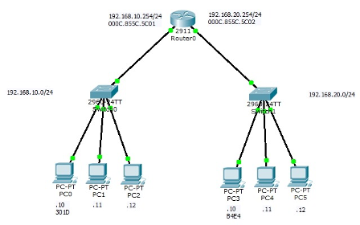
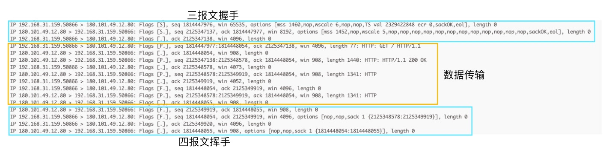
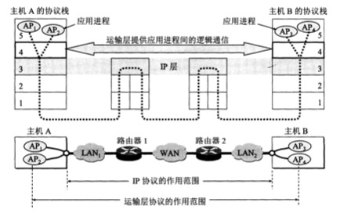

# 一个HTTP请求在计算机网络的世界里经历了什么？

> "Without the container, there would be no globalization.", *The Economist*	

## 引言

信息都以二进制数据传输，协议是对二进制数据意义的**约定**

各种协议通过其约定好的格式，将二进制数据通过物理信道从一台设备传输到另一台设备，接收设备根据约定的格式来获取传递的信息。

各层模型各司其职，数据被封装之后交由下一层处理

网络模型中各层架构都只处理部分功能，每层的数据的实际传输都会交由下一层模型处理，直到传递到物理层。也就是说，传输的数据会经过层层的封装最终交由物理层传输。


网上对网络模型的说法众说纷纭，主要是OSI七层模型和TCP/IP五层模型：


如今对于七层模型中的表示层和会话层基本都已在应用层实现，可统一表示为五层模型中的应用层。但如今很多业务需要对应用层与传输层之间做特定的连接，于是在衍生出很多Socket编程，来弥补表示层和会话层中的部分功能。

本文将模拟向百度发送一个HTTP请求，通过TCP/IP五层模型来简单讲解计算机网络中数据的传输过程，以及计算机网络的发展历史，而所有的所有都要从连接开始。

## 连接

连接是通信技术的保障，任何通信都必须通过物理连接进行。而在计算机网络中，物理层、数据链路层、网络层都可以看作是连接的基础，所以我们就从最底层的物理层说起。

### 物理层

正如引言中所说：

> 传输的数据会经过层层的封装最终交由物理层传输

想要发送一个HTTP请求并得到数据，就首先需要建立物理连接。物理层中的通信方式可以是各种各样的，只要能够将信号和二进制数据进行相互转换即可。比如双绞线、同轴电缆、光纤等。

当物理层成功连接时，对于之后的传输就只需要将数据转换成对于的二进制数据然后交由到物理层传输即可。


这个时候每个需要访问百度的用户，只需要将自己的网线连接到百度服务器上，理论上就可以跟百度服务器通信了。根据李彦宏的10亿百度用户的说法，百度只需要准备10亿的物理接口即可。拓扑图大概长这样：


### 数据链路层

10亿个接口确实稍微多了一点。但对于最原始的通信，主机都是一对一连接的。如果设备数量增多，且需要互相传递数据时，就需要无数根网线在每两台计算机之间进行连接。

为解决这一问题`交换机`随即出现，其可用于连接所有连接在该交换机下的设备。且后来出现了核心交换机，可以将交换机连接起来，这样就可以吧多个交换机连接的网络连接起来通信。

但是问题来了，如何确定我要发送的数据会被准确的发送到的某台设备？

`网卡`解决了这一问题。网卡在生产的时候会有一个唯一的`MAC地址`(实际上并不一定是全球唯一)。这个时候，多台计算机连接在交换机上时，需要先将自己的MAC地址告诉给交换机。所有的数据传输会先被封装到保存有目标MAC地址和源MAC地址的数据帧里，由交换机分配。


这里需要留意一下帧中数据部分的大小。也就是说一个数据帧最多能传输的数据只有1518个字节，且实际传输数据最多只有1500字节（以减少数据传输碰撞的可能性）。

这个时候多个以太网可以共用一个信道与百度的服务器进行连接。但是，由于物理层只负责数据，只要接收到有数据就会传输，所以两个数据帧同时传输时就会产生冲突，当然会有相应的协议来解决冲突产生时应当如何处理，比如`CSMA/CD`载波监听多路访问。


现在理论上多台主机可以通过交互机跟百度服务器连接形成一个局域网，然后相互之间通信。现在拓扑图大概长这样：


### 网络层

虽然数据链路层解决了相互连接的问题，但是传输数据过程中产生冲突的可能和传输距离是正相关的。而传输数据时频繁的产生冲突会造成大量的网络资源浪。同时，百度服务器作为整个局域网的中心如果宕机，整个系统将瘫痪。

为了让“自己的计算机网络在受到袭击时，即使部分网络被摧毁，其余部分仍能保持通信联系”美国国防部的高级研究计划局（ARPA）建设了一个军用网，叫做“阿帕网”（ARPAnet）。大概长这样：


在此基础上，1974年，罗伯特·卡恩和文顿·瑟夫提出[TCP/IP](https://zh.wikipedia.org/wiki/TCP/IP)来解决数据传输（IP）与传输控制（TCP）问题。IP协议约定连接的每台主机都保存有一个全球唯一的`IP地址`，在连接其他设备时会交换该地址，并保存，传输数据时通过统一的`IP数据包`传输。IP数据包大概长这样：


**需要注意的是，IP协议属于网际协议，其解决的是多个网络间的数据传输。**

而想要知道各设备之间是如何相互协作的，就不得不提到**网段**、**网关**和**子网掩码**

* 网段：是指一个计算机网络中使用**同一物理层**直接通讯的那一部分
* 网关：转发其他主机通信数据的设备
* 子网掩码：一个描述IP地址中网段部分的32位数据



如图，PC0、PC1、PC2属于一个网段，它们使用同一个信道与路由器连接。这三台主机在通信时都会将数据先发送到网关，即Router0，再由其转发数据包。而网关会根据子网掩码和IP地址来确定网段，然后根据保存的`路由`选择可送达的端口发出数据包。下一个路由器接收到数据包时以同样的方式将该数据包转发，直到发送到目标地址。

网段计算规则如下：


这样所有在遵循该协议约定下连接的主机都可以与任意一台其他主机通信。并且每台设备并不需要知道到达目的地址的路径，而只需要知道应该将IP数据包交由那一台设备处理。

比如下图，A并不需要知道将数据包发给D需要经过B，C。只需要知道需要将该数据包发给B即可，因为B也知道将数据包发给D只需要把数据包发给C即可。


这里IP协议只解决了数据的传输问题，而诸如传输数据产生冲突等一系列问题已经有数链路层解决，所以只需要将`数据包`封装为`数据帧`中的数据部分，即可不用考虑这些问题。


同时根据数据包格式可以看到，头部最少固定占有20字节的数据，而要将数据包封装到数据帧中，其最多能装载的数据大小就只有1480字节。

对于较大数据的传输，IP协议也允许传输设备在传输过程中对传输内容分片到不同的数据包中。且每个分片所在的数据包可能通过不同的路由到达目标地址。由于实际的网络情况，各个分片数据包很有可能不会按照分片的顺序到达，所以IP协议还在头部约定了总长度、标识、片偏移等信息，目标主机可以通过收到的分片数据包重新组合得到传输的数据。


于是所有这些遵循该协议的设备连接在一起形成了今天我们所说的互联网（Internet，也叫因特网，在谢希仁的《计算机网络（第七版）》中改称互联网）至此我们解决了如何跟百度连接的所有问题。接下来就是考虑当在浏览器地址栏输入`www.baidu.com`时，如何让百度返回页面。


## 通信

正如引言提到的:

> 各层模型各司其职

我们不用再考虑数据在网络中的传输。而对于一个HTTP请求来说，一切才刚刚开始。

### 应用层

如今只需要跟百度约定好，当我们请求百度服务器时，我需要返回的是首页的信息。而约定的具体内容就是HTTP协议。


#### **HTTP**

`HTTP`协议是一种 `client-server` 协议，其约定客户端和服务端通过交换各自的消息进行交互，即 `requests`和 `responses`。

我们可以在终端通过`curl`工具发送一个最简单的`request`请求，其中包括了`请求头`(第一行)和`请求头`(第二行)：

```bash
$ curl -v "http://www.baidu.com"
> GET / HTTP/1.1
> Host: www.baidu.com
```

按照HTTP协议的约定，该请求通过`HTTP1.1`协议版本，向`www.baidu.com`服务器的`/`  路径发送了一个`GET`请求。

百度接受到请求后，根据请求到内容返回了`response`：

```bash
< HTTP/1.1 200 OK
< Accept-Ranges: bytes
< Cache-Control: private, no-cache, no-store, proxy-revalidate, no-transform
< Connection: keep-alive
< Content-Length: 2381
< Content-Type: text/html
< Date: Mon, 16 Nov 2020 03:49:28 GMT
< Etag: "588604c8-94d"
< Last-Modified: Mon, 23 Jan 2017 13:27:36 GMT
< Pragma: no-cache
< Server: bfe/1.0.8.18
< Set-Cookie: BDORZ=27315; max-age=86400; domain=.baidu.com; path=/
<
<!DOCTYPE html>
<!--STATUS OK--><html> <head><link rel=stylesheet type=text/css href=http://s1.bdstatic.com/r/www/cache/bdorz/baidu.min.css><title>百度一下，你就知道</title></head>
...
</html>
```

返回的信息包括了`响应行`(第一行)、`响应头`(第二行到空行)以及`响应体`(空行之后)

无论请求还是响应其中行信息都包含了最基本的HTTP信息，而头信息里保存的则是协议约定的内容。所以HTTP协议易于扩展。只要服务器和客户端都能识别其中的数据，就可以做出相应的响应。最后请求体和响应体里的信息则是传递的对方需要的数据。


有时可以发现，当在浏览器的地址栏输入`www.baidu.com`并回车时，地址栏自动变成了`http://www.baidu.com`(或者`https://www.baidu.com`)于是我们可以推测，当键入百度的网址时，其实浏览器帮我们**补充**了必要的请求信息并发送，然后接收得到的数据，渲染页面展示。


但是有一个问题，根据引言中提到的:

> 数据被封装之后交由下一层处理

处于应用层的HTTP协议数据肯定会被封装到IP数据包中，IP协议只约定了IP地址作为传输地址，IP数据包并不认识输入的URL地址，所以在向百度发送请求之前肯定通过输入的URL以某种方式获取到了对应的IP地址，这种方式就是DNS域名解析。


#### DNS

`DNS协议`与HTTP协议一样属于应用层协议，用于向DNS服务器请求解析域名对应的IP地址时的数据传输。

其请求和响应的格式一样，通过标识位`QR`来区分。其格式如下：


通过`dig`工具可以看到对`www.baidu.com`域名的解析信息：

```bash
$ dig www.baidu.com +multiline +nocmd +qr +additional
;; Sending:
;; ->>HEADER<<- opcode: QUERY, status: NOERROR, id: 39966
;; flags: rd ad; QUERY: 1, ANSWER: 0, AUTHORITY: 0, ADDITIONAL: 1

;; OPT PSEUDOSECTION:
; EDNS: version: 0, flags:; udp: 4096
;; QUESTION SECTION:
;www.baidu.com.		IN A

;; Got answer:
;; ->>HEADER<<- opcode: QUERY, status: NOERROR, id: 39966
;; flags: qr rd ra; QUERY: 1, ANSWER: 2, AUTHORITY: 0, ADDITIONAL: 0

;; QUESTION SECTION:
;www.baidu.com.		IN A

;; ANSWER SECTION:
www.baidu.com.		206 IN A 180.101.49.11
www.baidu.com.		206 IN A 180.101.49.12
```

通过返回的`answer`信息中的`ANSWER SECTION`，可以看的，通过域名解析返回了百度服务器的IP地址，`180.101.49.11`以及`180.101.49.12`。（这里通过同一域名得到了两个IP地址，将访问分引到不同的服务器，是一种负载均衡的实现方式）


现在通过解析到的IP地址，我们的HTTP请求可以通过IP数据包传输了。

但是这里还有一个问题，HTTP协议和DNS协议并没有对传输数据大小进行限制。但是根据[网络层](#网络层)中提到的IP数据包大小被数据帧限制在1480个字节。

也就是说，如果传输的数据内容超过了1480字节，就必然会被IP协议分片到多个数据包中传输。这也就意味着如果这些数据仅通过IP协议传输，那么会在传输过程中的每一台传输设备都会对这些数据进行分片和重组，这将造成大量的网络资源浪费。并且如果某个分片包在传输时丢失，接收设备会等待该分片包，直到超时。并且发送方并不知道该分片包丢失。就算应用层协议约定了超时之后请求重发，中间设备已接受的数据包会被丢弃，而发送方也会将所有的数据重新发送。

而确保数据的准确传输是所有应用协议共同的问题，所以我们应该用更通用的方法，将这一问题交由专门的一层网络模型来处理，即传输层。


### 传输层

正如网络层提到的，IP协议解决了数据传输问题，而`TCP协议`则用于解决传输控制问题。


我们可以先试想一下，当一个符合HTTP协议的数据被分片到多个IP数据包，然后通过不同的路径送到目标主机时，因为网络原因各个数据包可能并没有按照原来的顺序到达，甚至被丢失。这时目标主机如果依照接受顺序将各个IP数据包中的数据再拼接起来，那得到的肯定不是原来发送方发送的数据了。

那我们何不在IP协议的基础上再给每个分片传输的数据约定一个序列号，目标主机接收到数据时返回一个确认信息，然后根据序列号，而不是数据包到达顺序，重新将数据拼接起来，不就可以准确得到原来的数据了吗？


#### 可靠传输

顺着这个思路，我们可以通过TCP协议的`报文段`格式来分析，看看该协议是如何实现可靠传输的：


其中最核心的就是`序号`和`确认号`，分别表示发送的数据所在位置，以及已经确认接收的数据的位置。

就像我们打电话接通后会先确认对方身份一样，为保证可靠传输，TCP协议也规定在传输数据之前，需要发送方和接收方进行确认并建立或断开连接，以确保双方已经准备好 发送/接收 数据，或者已经 发送/接收 完数据。而这个确认的过程就是我们熟知的三报文握手（借助`ACK`、`SYN`标志位完成）：


和四报文挥手（借助`FIN`与`ACK`标志位完成）：


为确保传的输数据更加准确，TCP协议还通过各种标志位的组合约定了连接中的各种状态。（可参阅《计算机网络（第七版）》中5.9.3节的TCP有限状态机。）


#### 流量控制

序号和确认号保障了发送的数据和接受的数据内容顺序一致。同时，我们当然希望在保证传输准确性的情况下，发送数据越快越好。但需要考虑的是，接收方必须来得及接受数据，而不至于数据来不及接受而被丢弃。所以TCP协议约定了一个可变大小的滑动`窗口`字段来让接收方告诉发送方，自己目前能接受的序号范围，发送方可以根据窗口指定的范围内不用等待确认连续发送数据，示意图如下（seq表示序号，ack表示确认号）：


可以看到，当`seq=201`的数据丢失时，A会重新发送一个从201序号开始的数据（`超时重传`），以确保数据的完整性。

如果因为网络原因，被B认为丢失的`seq=201`的数据包只是迟到了并未缺席，那这时A就有可能发送了两个相同的数据包。

不用担心第二个报文段到达时会被B重复接收。因为B接收第一个报文段时`ack`已经发生变化，后到的报文段已经不满足B接收的条件，从而会被丢弃。而B迟到的确认报文段也会通过算法经过一定时间重新发送A收到如果收到重复报文段也会丢弃后收到的报文段（滑动窗口还可以用来进行拥塞控制，这里就不详叙了，具体可参阅谢希仁编写的《计算机网络（第七版）》的5.8节中的内容）


#### 端口

此外，我们知道计算机中的资源分配是以进程为单位。那当多个进程在主机上动态运行时，发送方如何准确的将数据发送到目标主机的对应进程呢？

答案是，没法。因为发送方无法实时更新接收方运行进程的信息。那怎么解决呢？

试想，如果一个邮递员往你家送信，结果你不在家，他不可能一直在哪儿等到你下班吧？于是他将信放到了你们家楼下你家门牌号对应的信箱里，你回家的时候就可以从你自己的信箱里取走信件。


所以传输层也用了类似的方式。即，使用`协议端口号`来确定应用进程与传输报文段的唯一关系。两个主机的应用程序通信时，将数据传输到对方监听的端口，即使进程从阻塞状态再次运行时也能从该端口获取数据。而TCP报文段的前32位数据就保存的是端口号，**而报文段中的端口号加上IP数据包中对应目标的IP地址号就可以描述两台主机间的唯一连接。**


同时我们发现在使用`curl`工具和`dig`工具时都没有传递相应的端口信息，但还是获取到了相应的数据。这是因为对于普遍接受的应用程序，都有默认的系统端口号（0-1023）。比如HTTP协议的端口为80（所以本地启动的web服务器需要配置端口避免冲突，比如tomcat默认是8080），HTTPS为443，DNS为53。

* 0-1023:系统端口号
* 1024-49151:注册端口号，需在IANA办手续登记
* 49152-65535:短暂端口号，供给客户端使用

所以在浏览器地址输入`http://www.baidu.com:80`或`https://www.baidu.com:443`也可以访问到百度首页。


通过一下`tcpdump`命令我们监听`en0`网卡的80端口：

```bash
$ tcpdump  -nn -i en0 port 80
```

然后再使用`curl` 发送一个请求：

```bash
$ curl -v "http://www.baidu.com"
```

可以查看到`tcpdump`抓取的信息如下：




这里还需要补充的一点是，TCP报文段的校验和字段会对整个报文进行校验，而IP数据包只会校验首部，所以保证数据的正确性是由传输层完成的。


## 总结

综上，当客户端发起一个请求时，会先通过DNS协议获取URL对应的IP地址，然后

1. 用户数据首先会被对应的应用层协议封装

2. 客户端主机会先通过三报文握手与服务器建立连接，如果应用数据过大，一个完成的HTTP数据会被截断，封装到各个TCP报文段中。每个包含有应用数据的TCP报文会被完整的封装在IP数据包中，然后再次被完整的封装到数据帧中，最后发出
3. 当下一台设备接收到数据帧时，会根据其中的目标MAC地址传输到下一台设备
4. 当数据帧中的数据包被传到目标地址时，该设备会将该数据包中的目标地址传递给下一个目标，如此反复直到传递请求服务器地址
5. 服务器接收到数据时，会通过校验和校验整个数据是否正确，然后直到所有报文段传输完成，将其中的数据部分拼接起来，得到一个完整的HTTP请求数据
6. 对请求作出响应后，将要返回的数据以同样的方式返回给客户端，以上便完成了一次HTTP请求


协议栈封装如下：


数据流向如下：




# 附言

## UDP

从`UDP`数据格式就可以看出，跟TCP协议相比，UDP协议只通过校验和字段保证了数据不被篡改。同时UDP相对TCP协议首部字段相对较少，传输对数据效率更高。

通常被一些对数据完整性要求不高的应用协议使用。比如NFS（网络文件系统）、SNMP（简单网络管理协议）、DNS（主域名称系统）、TFTP（通用文件传输协议）等


需要注意对是DNS协议虽然在传输层使用的是UDP协议，但是数据过大时也会采用TCP协议传输

## Socket

`socket` 译为套接字，在不同的计算机技术中可以表示各种不同意思。在本文中可以表示为`IP地址:port端口号`，用来指代一次TCP连接的一端。

允许应用程序访问联网协议的`应用编程接口API`，即`socket API`，也被简称为`socket`。利用这些API来实现与业务结合的连接与数据传输被称为`socket 编程`。

网上一些文章经常提到的长链接和短连接，其实是不同应用层协议的TCP连接之间的比较，利用`socket编程`可以自定义TCP的连接，即相当于自己应用程序间的自定义协议。

`WebSocket`通常指的是`WebSocket协议`与`socket 编程`的关系就像古巴和古巴比伦的关系。

而`Web API`中的`WebSockets`，是创建 基于`WebSocket协议`连接 的一组接口。


## HTTPS

SSL 是指安全套接字层，用于加密通信过程中的传输内容。TLS（传输层安全）是更为安全的 SSL。HTTPS是通过TLS/SSL加密通道加密的HTTP协议。

大致运作方式就是通过非对称加密在Client和Server之间获取一个双方都知道的密钥（Premaster secret），在每次数据传输时使用该密钥对称加密传输内容。其中，Server返回的公钥及其他信需要有CA的证书，以确保Server的正确身份。

**RSA加密方式：**


**Diffie-HEllman加密方式：**


Diffie-Hellman密钥交换原理（离散对数问题）：


# 相关阅读

 [《计算机网络（第7版）》——谢希仁](https://www.academia.edu/35460532/%E8%AE%A1%E7%AE%97%E6%9C%BA%E7%BD%91%E7%BB%9C_%E7%AC%AC7%E7%89%88_%E8%B0%A2%E5%B8%8C%E4%BB%81)

[《每个前端都该了解的“DNS域名解析”详解》](https://juejin.im/entry/6844903491027091470)

[《在浏览器地址栏输入一个URL后回车，背后会进行哪些技术步骤？》@车小胖 ](https://www.zhihu.com/question/34873227)

  [牛皮了，头一次见有清华架构师把TCP/IP三次握手四次挥手解释的这么明白](https://www.bilibili.com/video/BV1ai4y1s7sG?from=search&seid=12943997456469060503)

[《TCP/IP Protocol》](https://codefarm.me/2018/05/19/tcp-ip-protocol/)

[《为什么 TCP 建立连接需要三次握手》](https://draveness.me/whys-the-design-tcp-three-way-handshake/)

