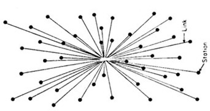
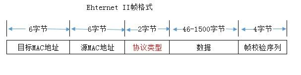
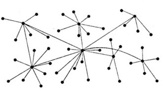
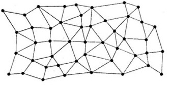
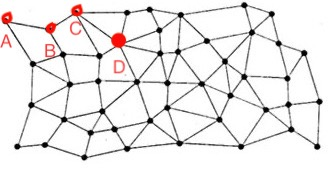
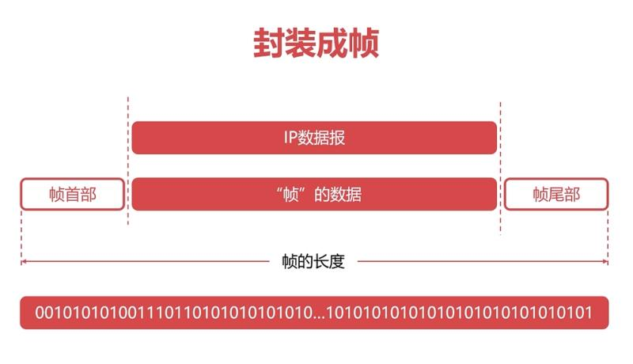
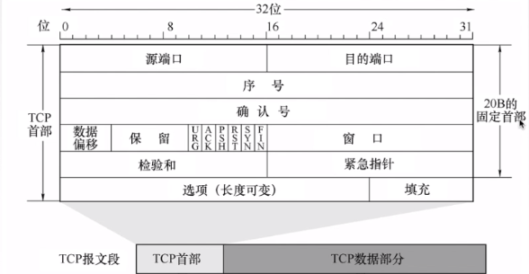
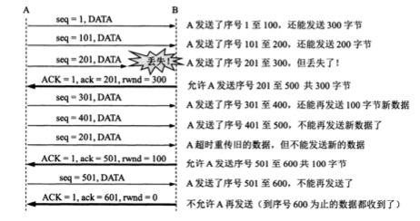

# 一个HTTP请求都做了什么？

> "Without the container, there would be no globalization.", *The Economist*	

## 引言

信息都以二进制数据传输，协议是对二进制数据的**约定**

各种协议通过其约定好的格式，将二进制数据通过物理信道从一台设备传输到另一台设备，接收设备根据约定的格式来获取传递的信息。

各层模型各司其职，数据被封装之后交由下一层处理

网络模型中各层架构都只处理部分功能，每层的数据的实际传输都会交由下一层模型处理，直到传递到物理层。也就是说，传输的数据会经过层层的封装最终交由物理层传输。


网上对网络模型的说法众说纷纭，主要是OSI七层模型和TCP/IP五层模型：


如今对于七层模型中的表示层和会话层基本都已在应用层实现，可统一表示为五层模型中的应用层。但如今很多业务需要对应用层与传输层之间做特定的连接，于是在衍生出很多Socket编程，来弥补表示层和会话层中的部分功能。

本文将模拟向百度发送一个HTTP请求，通过TCP/IP五层模型来简单讲解计算机网络中数据的传输过程，以及计算机网络的发展历史，而所有的所有都要从连接开始。

## 连接

连接是通信技术的保障，任何通信都必须通过物理连接进行。而在计算机网络中，物理层、数据链路层、网络层都可以看作是连接的基础，所以我们就从最底层的物理层说起。

### 物理层

正如引言中所说：

> 传输的数据会经过层层的封装最终交由物理层传输

想要发送一个HTTP请求并得到数据，就首先需要建立物理连接。物理层中的通信方式可以是各种各样的，只要能够将信号和二进制数据进行相互转换即可。比如双绞线、同轴电缆、光纤等。

当物理层成功连接时，对于之后的传输就只需要将数据转换成对于的二进制数据即可。


这个时候每个需要访问百度的用户，只需要将自己的网线连接到百度服务器上，理论上就可以发送请求获取百度首页数据了。根据李彦宏的10亿百度用户的说法，百度只需要准备10亿的物理接口即可。拓扑图大概长这样：




### 数据链路层

10亿个接口确实稍微多了一点。但对于最原始的有线网络，多台计算机之间的连接都是通过网线直接连接。如果计算机数量增多，且需要互相传递数据时，就需要无数根网线在每两台计算机之间进行连接。

为解决这一问题`交换机`随即出现，其可用于连接所有连接在该交换机下的设备（以太网）。且后来出现了核心交换机，可以将交换机连接起来，这样就可以吧多个交换机连接的网络连接起来通信。（局域网）

但是问题来了，如何确定我要发送的数据会被准确的发送到的某台设备？

`网卡`解决了这一问题。网卡在生产的时候会有一个全球唯一的`MAC地址`。这个时候，多台计算机连接在交换机上时，需要先将自己的MAC地址告诉给交换机。所有的数据传输会先被封装到保存有目标MAC地址和源MAC地址的数据帧里，由交换机分配。



这里需要留意一下帧中数据部分的大小。也就是说一个数据帧最多能传输的数据只有1518个字节，且实际传输数据只有1500字节。

这个时候多个以太网可以共用一个信道与百度的服务器进行连接。但是，由于物理层只负责数据，只要接收到有数据就会传输，所以两个数据帧同时传输时就会产生冲突（当然会有相应的协议来解决冲突产生时应当如何处理，比如`CSMA/CD`载波监听多路访问），这也是为什么早期的拨号上网多以时间计费的原因。


现在我们可以不用自己拖一根网线与百度的服务器连接通信了，只需要在跟百度通信时交纳巨额的网费来完成信道的租用。现在拓扑图大概长这样：




### 网络层

但是如果现在想访问搜狗，所有的交换机还需要再牵新网线跟搜狗的服务器连接。且更严重的是某台交换机宕机了其下的6000多台终端都无法与百度连接。

如何才能让每台设备都能独立访问到百度服务器，且所有设备之间通过同一物理信道相互连接？

为了让“自己的计算机网络在受到袭击时，即使部分网络被摧毁，其余部分仍能保持通信联系”美国国防部的高级研究计划局（ARPA）建设了一个军用网，叫做“阿帕网”（ARPAnet）。大概长这样：



在此基础上，1974年，罗伯特·卡恩和文顿·瑟夫提出[TCP/IP](https://zh.wikipedia.org/wiki/TCP/IP)来解决数据传输（IP）与传输控制（TCP）问题。IP协议约定连接的每台主机都保存有一个全球唯一的`IP地址`，在连接其他设备时会交换该地址，并保存，传输数据时通过统一的`IP数据包`传输。IP数据包大概长这样：


这样所有在遵循该协议约定下连接到主机都可以连接到任意一台其他主机。并且每台设备并不需要知道到达目的地址的路径，只需要知道将数据包给谁即可。

比如下图，A并不需要知道将数据包发给D需要经过B，C。只需要知道需要将该数据包发给B即可，因为B也知道将数据包发给D只需要把数据包发给C即可。



`网关`和`子网掩码`就是用于实现这一解决方案的。网关会通过子网掩码和目标地址来确定`网络号`


然后在自己已知的`路由`中查找网段对应的下一台设备，然后将该数据包发送给该设备，由该设备进行下一步的传递。


这里IP协议只解决了数据的传输问题，而诸如传输数据产生冲突等一系列问题已经有数链路层解决，所有只需要将`数据包`封装为`数据帧`中的数据部分，即可不用考虑这些问题。



同时根据数据包格式可以看到，头部最少固定占有20字节的数据，而要将数据包封装到数据帧中，其最多能装载的数据大小就只有1480字节。

对于较大数据的传输，IP协议也允许对传输内容分片，且每个分片所在的数据包可能通过不同的路由到达目标地址。由于实际的网络情况，各个分片数据包很有可能不会按照分片的顺序到达，所以IP协议还在头部约定了总长度、标识、片偏移等信息，目标主机可以通过收到的分片数据包重新组合得到传输的数据。


于是所有这些连接的设备一起形成了今天我们所说的互联网（Internet，也叫因特网，在谢希仁的《计算机网络（第七版）》中改称互联网）至此我们解决了如何跟百度连接的所有问题。接下来就是考虑当在浏览器地址栏输入`www.baidu.com`时，如何让百度返回页面。


## 通信

正如引言提到的:

> 各层模型各司其职

我们不用再考虑数据在网络中的传输。而对于一个HTTP请求来说，一切才刚刚开始。

### 应用层

如今只需要跟百度约定好，当我们发送`www.baidu.com`时，需要返回的是首页的信息。而约定的具体内容就是HTTP协议。


#### **HTTP**

`HTTP`协议是一种 `client-server` 协议，其约定客户端和服务端通过交换各自的消息进行交互，即 `requests`和 `responses`。

根据HTTP协议规定，我们可以在终端通过`curl`工具发送一个最简单的`request`请求，其中包括了`请求头`(第一行)和`请求头`(第二行)：

```bash
$ curl -v "http://www.baidu.com"
> GET / HTTP/1.1
> Host: www.baidu.com
```

按照HTTP协议的约定，该请求通过`HTTP1.1`协议版本，向`www.baidu.com`服务器的`/`  路径发送了一个`GET`请求。

百度接受到请求后，根据请求到内容返回了`response`：

```bash
< HTTP/1.1 200 OK
< Accept-Ranges: bytes
< Cache-Control: private, no-cache, no-store, proxy-revalidate, no-transform
< Connection: keep-alive
< Content-Length: 2381
< Content-Type: text/html
< Date: Mon, 16 Nov 2020 03:49:28 GMT
< Etag: "588604c8-94d"
< Last-Modified: Mon, 23 Jan 2017 13:27:36 GMT
< Pragma: no-cache
< Server: bfe/1.0.8.18
< Set-Cookie: BDORZ=27315; max-age=86400; domain=.baidu.com; path=/
<
<!DOCTYPE html>
<!--STATUS OK--><html> <head><link rel=stylesheet type=text/css href=http://s1.bdstatic.com/r/www/cache/bdorz/baidu.min.css><title>百度一下，你就知道</title></head>
...
</html>
```

返回的信息包括了`响应行`(第一行)、`响应头`(第二行到空行)以及`响应体`(空行之后)

无论请求还是响应其中行信息都包含了最基本的HTTP信息，而头信息里保存的则是协议约定的内容。所以HTTP协议易于扩展。只要服务器和客户端都能识别其中的数据，就可以做出相应的响应。最后请求体和响应体里的信息则是传递的对方需要的数据。


有时可以发现，当在浏览器的地址栏输入`www.baidu.com`并回车时，地址栏自动变成了`http://www.baidu.com`(或者`https://www.baidu.com`)于是我们可以推测，当键入百度的网址时，其实浏览器帮我们**补充**了必要的请求信息并发送，然后接收得到的数据，渲染页面展示。


但是有一个问题，根据引言中提到的:

> 数据被封装之后交由下一层处理

处于应用层的HTTP协议数据肯定会被封装到IP数据包中，IP协议只约定了IP地址作为传输地址，IP数据包并不认识输入的URL地址，所以在向百度发送请求之前肯定通过输入的URL以某种方式获取到了对应的IP地址，这种方式就是DNS域名解析。


#### DNS

`DNS协议`与HTTP协议一样属于应用层协议，用于向DNS服务器请求解析域名对应的IP地址时的数据传输。

其请求和响应的格式一样，通过标识为`QR`来区分。其格式如下：


通过`dig`工具可以看到对`www.baidu.com`域名对解析信息：

```bash
$ dig www.baidu.com +multiline +nocmd +qr +additional
;; Sending:
;; ->>HEADER<<- opcode: QUERY, status: NOERROR, id: 39966
;; flags: rd ad; QUERY: 1, ANSWER: 0, AUTHORITY: 0, ADDITIONAL: 1

;; OPT PSEUDOSECTION:
; EDNS: version: 0, flags:; udp: 4096
;; QUESTION SECTION:
;www.baidu.com.		IN A

;; Got answer:
;; ->>HEADER<<- opcode: QUERY, status: NOERROR, id: 39966
;; flags: qr rd ra; QUERY: 1, ANSWER: 2, AUTHORITY: 0, ADDITIONAL: 0

;; QUESTION SECTION:
;www.baidu.com.		IN A

;; ANSWER SECTION:
www.baidu.com.		206 IN A 180.101.49.11
www.baidu.com.		206 IN A 180.101.49.12
```

通过返回的`answer`信息中的`ANSWER SECTION`，可以看的，通过域名解析返回了百度服务器的IP地址，`180.101.49.11`以及`180.101.49.12`。（这里通过同一域名得到了两个IP地址，将访问分引到不同的服务器，是一种负载均衡的实现方式）


现在通过解析到的IP地址，我们的HTTP请求可以通过IP数据包传输了。

但是这里还有一个问题，HTTP协议和DNS协议并没有对传输数据大小进行限制。但是根据[网络层](#网络层)中提到的IP数据包大小被数据帧限制在1480个字节。

也就是说，如果传输的数据内容超过了1480字节，就必然会被IP协议分片到多个数据包中传输。而网络层仅仅约定了数据的传输方式，并不能保证数据包被准确送达。同时在实际的网络中，数据包很有可能因为某个`路由器`（属于网络层设备，能IP地址来转发数据，同时其网关的作用）来不及处理而被丢弃，这样百度的服务器很有可能不能完整的接受到我们发送的请求，从而做出响应的响应。应该如何保证数据能被准确送达？


### 传输层

正如网络层提到的，IP协议解决了数据传输问题，而`TCP协议`则用于解决传输控制问题。


我们可以先试想一下，当一个符合HTTP协议的数据被分片到多个IP数据包，然后通过不同的路径送到目标主机时，很有可能各个数据包并没有按照原来的顺序到达。这时目标主机如果依照接受顺序将各个IP数据包中的数据再拼接起来，那得到的肯定不是原来发送方发送的数据了。

那我们何不在IP协议的基础上再给每个分片传输的数据约定一个序列号，目标主机接收到数据时根据序列号，而不是数据包到达顺序，重新将数据拼接起来，不就可以得到原来的数据了吗？


#### 可靠传输

顺着这个思路，我们可以通过TCP协议的`报文段`格式来分析，看看该协议是如何实现可靠传输的：



其中最核心的就是`序号`和`确认号`，分别表示发送的数据所在位置，以及已经确认接收的数据的位置。

#### 流量控制

我们当然不能容忍每一个TCP报文段都等到上一个报文段确认之后再发送，在保证传输准确性的情况下，当然是传输的越快越好，所有TCP协议约定了一个可变大小的滑动`窗口`字段来让接收方告诉发送方，自己目前能接受的序号范围，示意图如下（seq表示序号，ack表示确认号）：



可以看到，当`seq=201`的数据丢失时，A会重新发送一个从201序号开始的数据，以确保数据的完整性。

如果因为网络原因，被B认为丢失的`seq=201`的数据包只是迟到了并未缺席，那这时A就有可能发送了两个相同的数据包。

不用担心的是，第二个报文段到达时会被B重复接收，因为B接收第一个报文段时`ack`已经发生变化，后到的报文段已经不满足B接收的条件，从而会被丢弃。而B迟到的确认报文段也会通过算法经过一定时间重新发送A收到如果收到重复报文段也会丢弃后收到的报文段（滑动窗口还可以用来进行拥塞控制，这里就不详叙了，具体可参阅谢希仁编写的《计算机网络（第七版）》的5.8节中的内容）


#### 连接管理

但是需要担心的是，目前为止一旦两个主机通过TCP报文段传输数据之后，序号和确认号就会只增不减，直到有一天32位的序号无法描述该次传输的数据在两台主机曾经传输的所有历史数据中所处的位置，那么传输就再也无法进行了。

所以，我们需要在**适当的时候**将两台主机传输的TCP报文段中的序号和序列号**重新计算**。让下一次数据的传输又是一个新的开始。而从开始发送TCP报文段到头部数据被**重新计算**的整个过程被描述为一次TCP连接。

而我们熟知的借助`ACK`、`SYN`标志位通过三报文握手建立连接的过程就是在协商滑动窗口大小等参数，并确保双方都能应答。


`FIN`标志位则与`ACK`一起用来完成四报文挥手释放连接。


#### 端口

两个http请求，收到数据如何处理？


# 附言

## UDP

dns协议数据过大时也会采用tcp连接

ip数据包并只校验首部，udp校验所有，udp 分用

udp 开销小，不分片，但ip数据包要分片

## Socket


# 相关阅读

 《计算机网络（第7版）》——谢希仁

  [因特网——百度百科](https://baike.baidu.com/item/%E5%9B%A0%E7%89%B9%E7%BD%91)

[《每个前端都该了解的“DNS域名解析”详解》](https://juejin.im/entry/6844903491027091470)

[《在浏览器地址栏输入一个URL后回车，背后会进行哪些技术步骤？》@车小胖 回答](https://www.zhihu.com/question/34873227)

  [牛皮了，头一次见有清华架构师把TCP/IP三次握手四次挥手解释的这么明白](https://www.bilibili.com/video/BV1ai4y1s7sG?from=search&seid=12943997456469060503)

