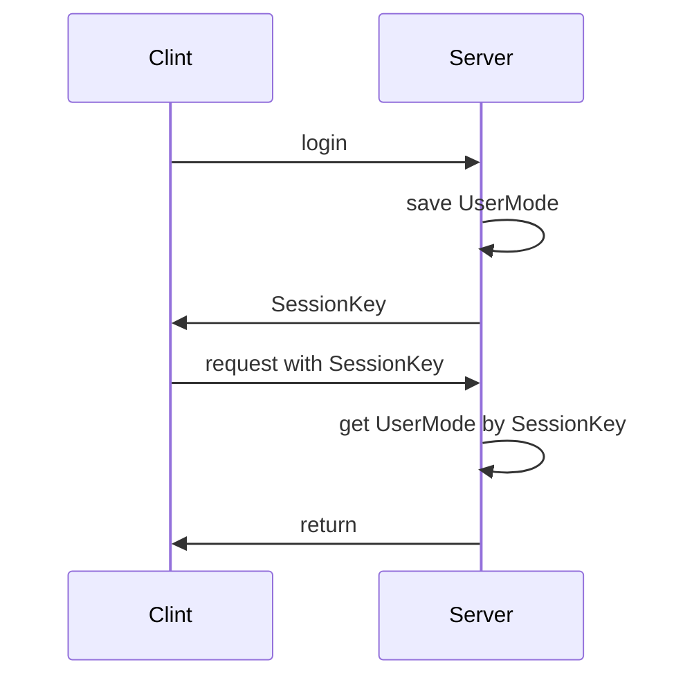
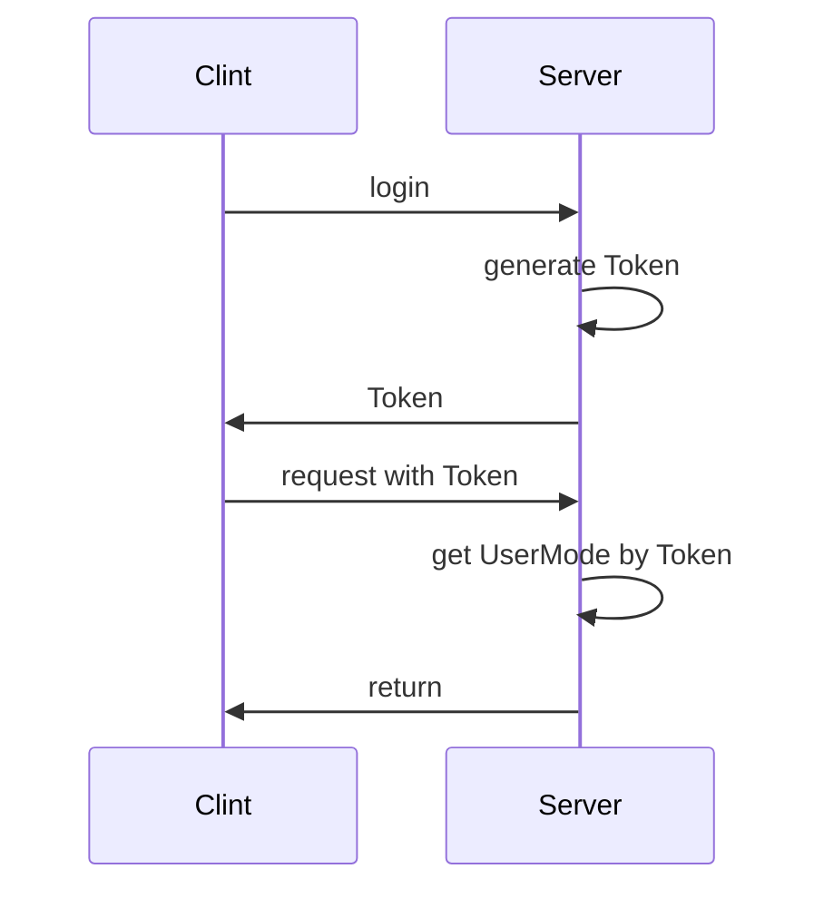

# JWT

> JSON Web Token (JWT)是一个开放标准(RFC 7519)，它定义了一种紧凑的、自包含的方式，用于作为JSON对象在各方之间安全地传输信息。该信息可以被验证和信任，因为它是数字签名的。

## Session vs Token

鉴于HTTP协议的无状态性，对于服务端来说，并不能区分同一客户端的多次请求。

早期的Web应用大多采用基于Session的会话管理的方式记录用户的状态。大致逻辑是，在用户登录时存储用户态并生成唯一的`SessionKey`返回到客户端。此后客户端的每次请求都携带`SessionKey`，服务端通过`SessionKey`去获取对应的用户态。

这种方式主要特点就是**用户态保存在服务端**。




---

基于Token的会话管理与以上方式最大的不同就在于，**`Token`本身可以携带信息**，通过对`Token`的`签名(Sign)`和`加密(Encode)`，以确保下发到客户端的`Token`没有被篡改。客户端请求时携带上`Token`，服务端解密`Token`便可以获取用户态。但其最大的缺点就是，Token一旦下发除非过期，不然没有办法主动令其失效。




## JWT结构

以下代码运行在ruby 2.6.5环境

JWT由三部分构成，分别是`Header`, `Payload`, `Signature`，以`.`分隔，形如：

```
xxxxxx.yyyyyy.zzzzz
```

**Header**

`Header`通常由两部分组成：类型和所使用的签名算法

```ruby
require 'json'
header = {
  'alg': "MD5",
  'typ': "JWT"
}.to_json
```

**Payload**

`Payload`通常保存实际需要传递到数据，有一些标准推荐的值如：exp (expiration time), iat(Issued At)等。可通过[Registered Claim](https://tools.ietf.org/html/rfc7519#section-4.1)查看。当然也可以自由定义

```ruby
require 'json'
payload = {
  'iat': 1532135735,	// 表示 jwt 创建时间
  'exp': 1532136735,	// 表示 jwt 过期时间
  'user_id': 12312		// 用户 id，用以通信
}.to_json
```

**Signature**

通过摘要算法，对前面两部分进行计算，生成摘要，以确保数据没有被篡改

为了避免`Token`的明文传输，应该先将`header`和`payload`通过BASE64编码之后再使用摘要算法进行加密

```ruby
require 'digest'
require 'base64'

# 密码盐
KEY = 'code_salt'

header_payload = "#{Base64.strict_encode64(header)}.#{Base64.strict_encode64(payload)}"
# 添加密码盐，确保伪造数据
str = "#{header_payload}#{KEY}"

signature = Digest::MD5.hexdigest(str)
jwt = "#{header_payload}.#{signatrue}"

puts 'jwt:', jwt
```

通过对以上三部分的简单拼接(以`' . '`分隔)，便得到了JWT

```ruby
"eyJhbGciOiJNRDUiLCJ0eXAiOiJKV1QifQ==.eyJpYXQiOjE1MzIxMzU3MzUsImV4cCI6MTUzMjEzNjczNSwidXNlcl9pZCI6MTIzMTJ9.5f2a3d808e61fdc316afe110b15d1534"
```


## 常见场景

对比`session`和`jwt`的常用场景，以下内容修改自[《JWT 实践应用以及不适用特殊案例思考》](https://shanyue.tech/post/jwt-guide.html#session)

### 用户注销

- `session`: 清除对应用户态
- `jwt`: jwt下发之后便没有办法失效，到期。所以需要使用别的方式清除用户态，比如使用 redis，维护一张黑名单，用户注销时把该 jwt 加入黑名单，过期时间与 jwt 的过期时间保持一致。

### 限制单台设备登录

- `session`: 使用关系型数据库，对用户表添加session_key字段，每次登陆重置该字段
- `jwt`: 同上，另外也可以使用计数器的方法，如下一个问题。

### 限制最近五台设备登录

- `session`: 使用关系型数据库，对用户表添加设备关联表，并添加session_key字段，每次登陆记录该字段，如果超过 5 个，则删除创建时间最早的一行。
- `jwt`: 使用关系型数据库，在用户表中添加字段 count，作为计数器，默认值为 0。每次设备登录 count 字段自增1，并在返回的jwt中设置 current_count 为用户的 count 值。每次请求权限接口时，查用户表获取 count，根据 jwt 获取 current_count， 判断与 current_count 差值是否小于 5。

### 限制最近五台设备登录

- `session`: 在上一个问题的基础上，删掉该设备以外其它所有的记录。
- `jwt`: 在上一个问题的基础上，对 count + 5，并对该设备重新赋值为新的 count。

### 显示该用户登录设备列表 / 踢掉特定用户

- `session`: 在设备关联表中新加列 device
- `jwt`: 在用户表中新加列 device

### 校验码

* `session`: key-value数据库中维护用户校验码。
* `jwt`: 直接下发由密码盐和校验码生成的token，其中包含过期信息和校验码，验证时将payload中的校验码与服务端存放的密码盐一起用于解密token即可。

