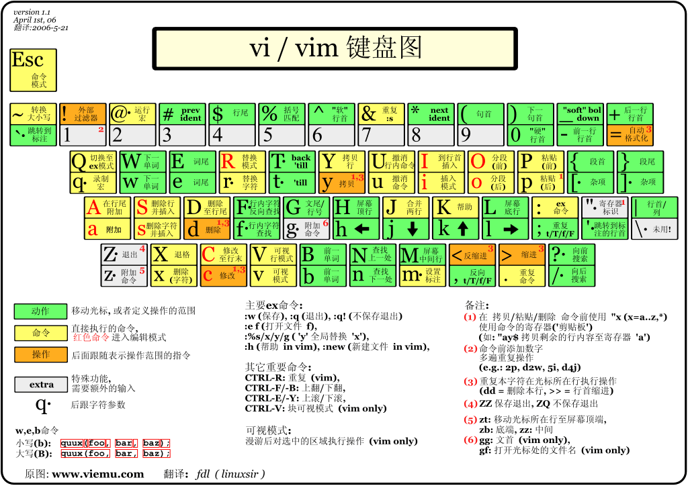

# HotKey

## IDEA

* 代码整理：Command + Option + L
* 返回上一光标：Command + Option + &lt;-
* 折叠所有块：Command + CapsLock + ' - '
* 折叠当前快：Command + '-' / '+'
* 打开所有块：Command + CapsLock + ' + '
* 添加自定义代码块折叠：Command + Option + T  -&gt;  
* 分屏：某文件的Tab栏上右键，选择Split Vertically 或 Split Horizontally
* 查看最近文件：Command + E
* 复制代码位置：Command + Option +  CapsLock + C
* 进入方法/进入方法调用处：Command  + B
* 进入接口实现：Command + Option + B
* 搜索出的内容分屏展示：Shift + Command + F 打开搜索并选中内容后，Shift + Enter
* 运行单元测试：Shift + Control + R
* 文件重命名：Shift + F6
* 代码移行：Shift + Option + 方向上/下
* 定位到当前文件位置：Option + F1，然后数字1
* 查找代码：Command + F，然后Esc可以关闭查找窗口
* 向上一行插入空行：Command + Option + Enter
* 向下一行插入空行：Shift + Enter
* 选中行/当前行 向 上/下 移动：Shift + Option + 方向上/下
* 选中/当前所在方法 与 上/下 一个方法调换位置：Shift + Command + 方向上/下
* 批量修改某参数名：光标选中变量后Shift+F6
* 查找文件：点击Project导航框，直接输入关键字
* 全局查找文件：Shift + Command + O
* 查找类型：Command + O
* 打开Terminal： Option + F12
* 快速生成测试方法：光标在方法上，Command + N
* 使结构体实现某接口：光标选择到结构体，Option + Enter
* 窗口查看方法内容：Command + Y
* 光标跳转到上一个方法：Shift + Ctrl + 方向上/下
* 切换Tool Window：长按Ctrl + Tab 或者 Command + E
* 提取方法：Command  + Option + M
* 在下一行复制选择的代码：Command + D
* 加选当前选中的内容：Ctrl + G
* 光标快速跳转到代码块开始/结束处：Option + 方向上 可以加选代码块，在加方向键左/右 即可
* 光标快速跳转到代码块开始/结束处：Command + Option + `[` or `]`
* 切换窗口： Command + Shift + `
* 复制光标 Caret Cloning： Option + Option(长按) + 方向上/下
* 跳转到指定行：Command + L


## MAC

* Chrome检查：Command + Shift + C
* 重命名文件：选择到文件名的状态下 + Enter
* 打开文件：Command + O
* 打开访达：Command + Option + B
* 反撤销： Command + Shift + Z
* 推出当前程序：Command + Q
* 切换同一应用的不同窗口：Command + `
* 全屏窗口：Command + Control + F
* 锁屏：Command + Control + Q
* Finder查看隐藏文件： Command + Shift + .
* Finder查找文件： Command + Shift + G
* 切换屏幕：Ctrl + 方向


**命令行**

* 整理启动台

  ```bash
  defaults write com.apple.dock ResetLaunchPad -bool tru
  ```

* 图标显示异常

  ```bash
  sudo find /private/var/folders/ \( -name com.apple.dock.iconcache -or -name com.apple.iconservices \) -exec rm -rfv {} \;
  sudo rm -rf /Library/Caches/com.apple.iconservices.store;
  killall Dock
  killall Finder
  ```

  


## iTerm2

* 全屏窗口： Command + Enter
* 新建窗口： Command + T
* 水平分屏： Command + D
* 垂直分屏： Command + Shift + D
* 在最近使用的分屏直接切换.：Command + `[`
* 切换标签页： Command +  &lt;-
* 清屏：Ctrl + L
* 复制字符串：双击添加到粘贴板 or 选中 + Command + 鼠标拖动到指定位置
* 光标跳转下/上一个单词： Esc + F/B
* 光标跳转行首：Ctrl + A
* 光标跳转行尾：Ctrl + E
* 从光标删除到命令行尾：Ctrl + K
* 从光标删除到前一个单词：Ctrl + W
* 撤销删除：Ctrl + `-`
* 在当前目录打开Finder：键入`open .`

## VsCode

* 全局搜索帮助：Command + Shift + P
* 全局搜索文件：Command + P
* 代码格式化：Option + Shift + F
* 折叠当前代码片段：Option + Command + `[ `

## Chrome

* 打开最近关闭的tab页：Command + Shift + T
* 切换tab：Command + Option + <- / ->
* 放回上/下一页：Command + <- / ->
* 聚焦光标到地址栏： Command + L
* 强制刷新(不走304缓存)：Shift + Command + R
* 普通刷新：Command + R

## Postman

* 美化JSON：Command + B
* 发送请求：Command + Enter

## Linux

* 命令行光标移动：

  * 光标移动到行首：Ctrl + A
  * 光标移动到行尾：Ctrl + E
  * 光标移动到上一个单词词首：Esc 然后 + B
  * 光标移动到下一个单词词首：Esc 然后 + F
  * 删除光标后的一个单词：Esc 然后 + D
  * 删除光标前一个单词：Ctrl + W
  * 清除光标后至行尾的内容：Ctrl + K
  * 恢复删除：Ctrl + Y

* 命令参数后置：

  ```bash
  ls $(read && echo $REPLY) | grep .go # 需要手动输入
  ls $(pbpaste) | grep .go
  ```


## Vim

* 跳转行首：Home 或 Shift + ^

* 跳转行尾：End 或 Shift + $

* 跳转到指定行：[行号] + gg / G 或者 :12

* 查找：normal模式下键入 `'/'`，n 查找下一个，N 查找上一个

* 插入新行：normal模式下键入 `'o'`

* 删除：

  ```bash
  dd # 删除一整行
  dw # 删除到下一个单词开头
  de # 删除到下一个单词结尾
  d0 # 删除光标到本行开头
  ```

* 复制/黏贴/撤销：yy / p / u

* 打开文件同时定位到某一内容行: `vim [FILENAME]  +/pattern`

* 打开文件同时定位到某一行: `vim [FILENAME]  +n`

* 


## Alfred

* 使用指定应用打开某文件：

  ```
  1. Alt + Space 打开Alfred搜索栏
  2. 输入 find [文件名] 搜索到对应文件
  3. Ctrl 进入到操作页面，并选择 Open 使用默认应用打开文件 
  ```

  