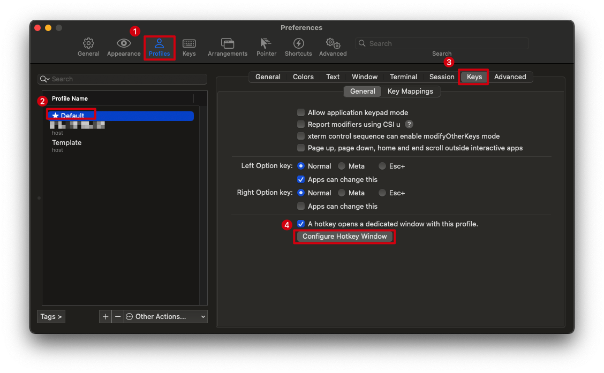
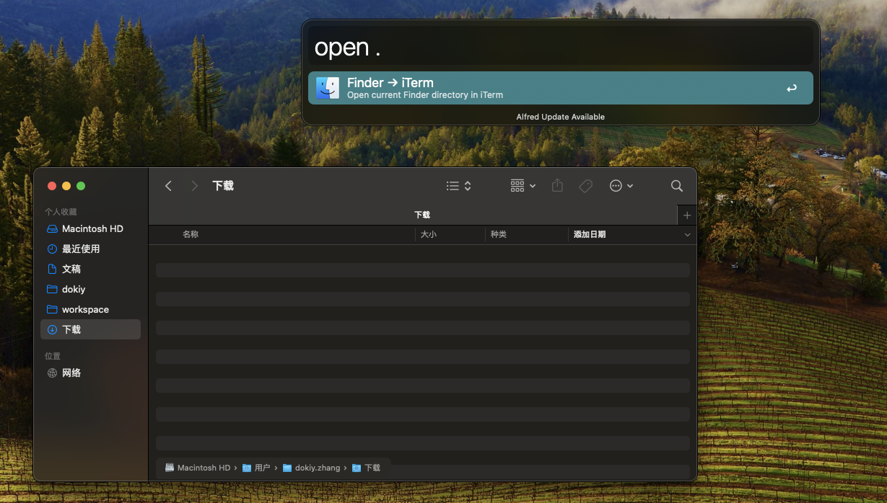

# 工具论

## 便捷统一的终端

终端工具作为我最常用的工具之一，我总是希望它能在我需要的时候非常**便捷**得被唤起，并在使用完后及时隐藏。

我希望的**便捷**是只需要通过最少次数的敲击键盘就能呼出终端窗口并打开我的目标路径。并且这种操作是全局的，不会因为我此时运行的软件而被影响；或者说因为我对终端工具的使用频繁，所以在我的工作环境中需要给它的呼出一个优先级足够高的快捷键。

很幸运，`iTerm`提供了满足以上需求的快捷键：




这样便可以通过双击`Ctrl键`来打开`iTerm`的窗口，再此双击便可以隐藏。`iTerm`的开发者用了一些小技巧以便让以这种方式呼出的窗口能够始终保持在视窗最上层，而不会被其他应用遮挡（这也是我期望的功能之一，因为我希望终端窗口的隐藏/显示都完全由我自己控制），但带来的代价是这种`热键窗口`与普通的`iTerm`终端窗口不能合并，所以有时我会有两个`iTerm`窗口。

我并不总是想打开一个默认在家目录的终端窗口，更常见的情况是我需要在`Finder`的某个文件夹中直接打开一个当前目录的终端窗口。`Alfred`以及社区分享的[插件](https://www.packal.org/workflow/terminalfinder)可以帮我解决这一问题。就如下图一样，我只需要在`Finder`的目录中呼出`Alfred`并输入关键字并回车，就可以打开一个自动进入该目录的终端窗口。（不过这里打开的将会是`iTerm`的标准窗口，即使`热键窗口`存在）



不仅如此，作为一个`Go`开发我常使用的`Goland`，提供了自己的`Terminal`工具。我希望统一使用`iTerm`以减少为适应不同的终端工具带来的额外负担。因此我在`zshrc`中添加了一些脚本，大概思路就是，在每次加载`zsh`配置文件的时候判断，打开当前终端的是不是`Goland`如果是，则使用`iTerm`打开，然后退出当前`tty`。

```zsh
# 在 Goland 中直接打开iterm2
# Goland 首次启动会加载 ~/*rc 文件，因此需要判断再退出
#   https://youtrack.jetbrains.com/articles/IDEA-A-19/Shell-Environment-Loading
# shellcheck disable=SC2154
if [[ $__CFBundleIdentifier == "com.jetbrains.goland" ]]; then
  if [[ $(pwd) != "/" ]]; then
    open -a "iTerm" .
  fi

  if [[ -z $INTELLIJ_ENVIRONMENT_READER ]]; then
    exit
  fi
fi
```

并且这种方式将会自动集成`Goland`中`Open In => Terminal`的操作。