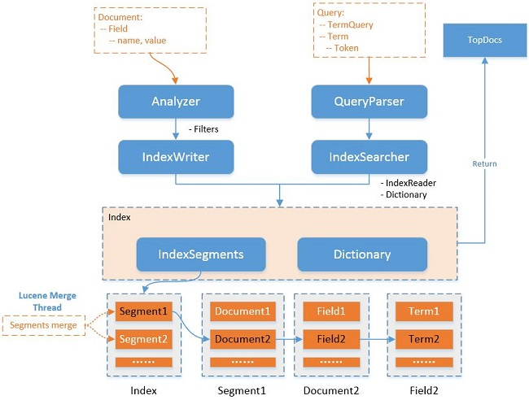

# Elasticsearch

Elasticsearch 是一个开源的搜索引擎，建立在一个全文搜索引擎库 [Apache Lucene™](https://lucene.apache.org/core/) 基础之上。并通过HTTP提供 RESTful API 以进行通信。 它可以被下面这样准确的形容：

- 一个分布式的实时文档存储，*每个字段* 可以被索引与搜索
- 一个分布式实时分析搜索引擎
- 能胜任上百个服务节点的扩展，并支持 PB 级别的结构化或者非结构化数据


## es中的数据

Elasticsearch 不同于传统数据库的是，传统数据库通过行列数据进行检索，而Elasticsearch 中的每一条数据是被称为`文档`的**序列化成 JSON** ，通过`索引`每个文档使其可以检索。这是一种完全不同的思考数据的方式，也是 Elasticsearch 能支持复杂全文检索的原因。


### 映射

Elasticsearch 是基于Lucene 而实现的。在 Lucene 中，一条数据（也被称为文档，但不是Elasticsearch中的文档）由一组简单的键值对组成。 Lucene 不关心这些值是字符串、数字或日期—所有的值都被当做 **不透明字节**。也就是说，Lucene 中是不能存储结构化数据的。

而正是Elasticsearch 帮我们将复杂 JSON 文档**映射**成了 Lucene 需要的扁平化数据的方式。**映射**定义了类型中的域，每个域的数据类型。Elasticsearch 支持如下简单域类型：

- 字符串: `string`
- 整数 : `byte`, `short`, `integer`, `long`
- 浮点数: `float`, `double`
- 布尔型: `boolean`
- 日期: `date`


### 类型

Elasticsearch 还在Lucene 的基础上新增了**类型**的概念。有点类似于多态，Elasticsearch 中通过索引的元数据`_type`来区分相同索引的不同类型。相同索引的不同类型应该拥有相同的映射。


### 分片

索引其实是逻辑上的命名空间，实际上是由一个或多个**分片**组成。每个分片中只保存了一部分数据，一个分片是一个 Lucene 的实例，其本身就是一个完整的搜索引擎。

分片对于使用Elasticsearch 的应用程序来说是最底层的工作单元，应用程序是直接与索引而不是与分片进行交互。


### 数据结构图




## 分片内部原理

### 全文搜索

全文搜索需要做到的是，文本字段中的每个单词都可用被搜索。这意味着需要单个字段有索引多值(这里指单词)的能力。

 [倒排索引](https://www.elastic.co/guide/cn/elasticsearch/guide/2.x/inverted-index.html)便是最好的支持一个字段多个值需求的数据结构之一。其包含一个有序列表，列表包含所有**文档**出现过的不重复个体，或称为**词项** ，对于每一个词项，包含了它所有曾出现过文档的列表。

```
Term  | Doc 1 | Doc 2 | Doc 3 | ...
------------------------------------
brown |   X   |       |  X    | ...
fox   |   X   |   X   |  X    | ...
quick |   X   |   X   |       | ...
the   |   X   |       |  X    | ...
```

 Elasticsearch 中的**文档**是有字段和值的结构化 JSON 文档。实际上，Elasticsearch 文档中的每个被索引的字段都有自己的倒排索引。

Elasticsearch 会根据倒排索引，判断在对应的文档中一个具体词项出现的总次数，词项在文档中的顺序，每个文档的长度，所有文档的平均长度，等等，最终以搜索的相关性展现。

Elasticsearch 将索引设置为不可变的，最主要的原因便是这样不需要在修改时锁（这也是为什么Es中的文档不能够修改）。同时带来的问题是需要重建整个索引才能使文档可被搜索。这要么对一个索引所能包含的数据量造成了很大的限制，要么对索引可被更新的频率造成了很大的限制。

也正是因为这种方式，导致Elasticsearch 不能做到完全的实时更新。


### 近实时搜索

Elasticsearch 使用动态更新索引的方式实现了**近实时更新**。其通过增加新的索引来反映新近的修改，而不是直接重写整个倒排索引。查询时轮流查询每一个倒排索引，然后再对结果进行合并。

Lucene 中引入了**按段搜索**这个概念，每个段本身也是一个倒排索引。而Elasticsearch 中的索引在**段**的概念之上添加了提交点（Commit point）的概念—— 一个列出了所有已知段的文件。新的文档提交时会先将包含新文档的Lucene 索引存入内存缓存中：


值得注意的是，这里新建的段并没有被直接保存在磁盘上。磁盘上的保存才能使数据持久化，但是如果直接将新建的段保存在磁盘上，需要一个 [`fsync`](http://en.wikipedia.org/wiki/Fsync) 来确保段被物理性地写入磁盘，这将极大的影响性能。

Lucene 允许其包含的文档在未进行一次完整提交时便对搜索可见。所以Elasticsearch 采用的做法是再内存缓存于磁盘之间添加文件系统缓存。而待提交的段则是被存储于文件系统缓存。


这个写入和打开一个新段的轻量的过程叫被叫做`refresh`，默认情况下每个分片会每秒自动刷新一次。


### 持久化变更

为了使文档的变更能保存到磁盘，Elasticsearch 增加了一个事务日志（translog），在每一次对 Elasticsearch 进行操作时进行日志记录。整个流程大致如下：

1. 新的文档被添加到内存缓冲区并且被追加到了事务日志

   

2. 刷新（refresh）完成后, 缓存被清空但是事务日志不会

   

3. 更多的文档被添加

   

4. 全量提交被执行，一个新的 translog 被创建。

   

   全量提交执行以下步骤：

   - 所有在内存缓冲区的文档都被写入一个新的段。
   - 缓冲区被清空。
   - 一个提交点被写入硬盘。
   - 文件系统缓存通过 `fsync` 被刷新（flush）。
   - 老的 translog 被删除。

   Elasticsearch 启动的时候， 它会从磁盘中使用最后一个提交点去恢复已知的段，并且会重放 translog 中所有在最后一次提交后发生的变更操作。

这个执行一个提交并且截断 translog 的行为在 Elasticsearch 被称作一次`flush` 。 分片每30分钟被自动刷新（flush），或者在 translog 太大的时候也会刷新。


### 删除与段合并

段是不可改变的，所以既不能从把文档从旧的段中移除，也不能修改旧的段来进行反映文档的更新。Elasticsearch 的做法是在每个提交点会包含一个 `.del` 文件，文件中会列出这些被删除文档的段信息，并在**段合并**时清除。

每一个段都会消耗文件句柄、内存和cpu运行周期。而且搜索请求会遍历每个段，所以段过多时将会严重影响性能。Elasticsearch 通过在后台进行段合并来解决这个问题。段合并的时候会将那些旧的已删除文档从文件系统中清除。

段合并对用户来说是无感的，其大致流程如下：

1.  索引时刷新（refresh）操作会创建新的段并将段打开以供搜索。
2. 并进程会在不中断索引和搜索的请空下，选择一小部分大小相似的段，并且在后台将它们合并到更大的段中。
   
3. 新的段被刷新（flush）到了磁盘，写入一个新的提交点，新段打开，老段删除。
   


## es与分布式

Elasticsearch 的主旨是随时可用和按需扩容，其天生就是**分布式的**。 一个运行中的 Elasticsearch 实例称为一个节点，而集群是由一个或者多个拥有相同 `cluster.name` 配置的节点组成。任意节点都可用接收客户端请求，并从对应节点找到所需的文档返回给客户端，并且这一切的管理对客户端都是透明的。

当集群规模扩大或缩小时， Elasticsearch 会自动在各节点中迁移保存有文档的分片，使得数据均匀分布在集群里。

分片分为`主分片`和`副本分片`，索引建立时就已经确定了主分片数，并且索引内的任意一个文档都归属于一个主分片。副本分片作为冗余备份，并为搜索和返回文档等读操作提供服务。


### 扩容于缩容

拥有两个节点的集群示意图如下：


当对集群进行水平扩容时，`Node 1` 和 `Node 2` 上各有一个分片被迁移到了新的 `Node 3` 节点，现在每个节点上都拥有2个分片：


扩容后每个节点的硬件资源（CPU, RAM, I/O）将被更少的分片所共享，每个分片的性能将会得到提升，所以提高副本数量也能够提升Elasticsearch 性能。

当关闭一个节点后，将会自动重新选择主节点：


### 文档存储

当索引一个文档的时候，文档会被存储到一个主分片中。Elasticsearch 会通过以下公式计算文档应该被存储于哪个分片：

```
shard = hash(routing) % number_of_primary_shards
```

`routing` 是一个可变值，默认是文档的 `_id`，也可以设置成一个自定义的值。 

新建、索引和删除等**写操作**请求会现在主分片上完成，然后再复制到相关的副本分片：


1. 客户端向 `Node 1` 发送新建、索引或者删除请求。
2. 节点通过文档的 `_id` 确定文档属于分片 0 。请求被转发到 `Node 3`。
3. `Node 3` 在主分片上面执行请求，然后将请求并行转发到 `Node 1` 和 `Node 2` 的副本分片上。当所有的副本分片都报告成功之后， `Node 3` 向协调节点报告成功，协调节点向客户端报告成功。

局部更新文档时于新建、索引和删除等操作类似。但考虑到并发更新的情况，如果去判断文档是否被另一个进程修改，并重新尝试，直到超过的`retry_on_conflict`次数。如下图中步骤3：


同时，对于文档的更新Elasticsearch 并不会转发更新请求，而是直接转发更新成功的新版本文档，以防止网络延迟等原因使得更新请求以错误的顺序到达其他节点从而导致脏数据产生。

`bulk` API 允许单个请求执行多个创建、更新等操作。其步骤于单个文档更新类似，也是会通过**协调节点**（接收请求的节点）来分发请求到各个分页然后等待各节点汇报结果，然后返回给客户端。只不过这个过程对应的是多个分发到节点的请求。

如果了解`bulk` API会发现，其请求体需要通过换行符换行，而不是直接使用JSON数组：

```bash
curl -X POST "localhost:9200/_bulk?pretty" -H 'Content-Type: application/json' -d'
{ "delete": { "_index": "website", "_type": "blog", "_id": "123" }} 
{ "create": { "_index": "website", "_type": "blog", "_id": "123" }}
{ "title":    "My first blog post" }
{ "index":  { "_index": "website", "_type": "blog" }}
{ "title":    "My second blog post" }
{ "update": { "_index": "website", "_type": "blog", "_id": "123", "_retry_on_conflict" : 3} }
{ "doc" : {"title" : "My updated blog post"} }
'
```

其原因在于，每个文档可能属于不同的分片。这样在协调节点就可以确定每行的数据应该被分到哪个分片，而不用解析整个JSON数组，再将对应元素序列化为内部传输格式并发送到对应分片。


### 分布式检索

检索使用了比存储更加复杂的执行模型，因为文档有可能在集群的任何分片上。 一个搜索请求必须遍历我们所检索索引的所有分片（或任一副本），来确定它们是否含有任何匹配的文档，最后将结果合并起来返回。这被称为**query then fetch**

#### Query

查询会广播到索引中每一个分片拷贝，每个分片在本地执行搜索并构建一个匹配文档的 **优先队列**。

其大小取决于分页参数 `from` 和 `size` ，以此来减少不必要的查询，从而提高性能。例如，如下搜索请求将需要足够大的优先队列来放入100条文档（因为需要将各分片的结果合并然后找出第91-100个文档）：

```bash
GET /_search
{
    "from": 90,
    "size": 10
}
```

查询阶段的过程如图：


1. 客户端发送一个 `search` 请求到 `Node 3` ， `Node 3` 会创建一个大小为 `from + size` 的空优先队列。
2. `Node 3` 将查询请求转发到索引的每个主分片或副本分片中。每个分片在本地执行查询并添加结果到大小为 `from + size` 的本地有序优先队列中。
3. 每个分片返回各自优先队列中所有**文档的 ID** 和**排序值**给协调节点 `Node 3` ，协调节点 `Node 3` 合并这些值到自己的优先队列中来产生一个全局排序后的结果列表。

#### Fetch

在收集到各分片的数据后，协调节点会根据**排序值**进行排序，然后最终选出需要的**文档ID**，然后向对应的分片获取文档：


1. 协调节点整理之后，向相关的分片提交多个 `GET` 请求取回需要的文档。
2. 每个分片加载文档，并返回给协调节点。
3. 当所有的文档都被取回时，协调节点返回结果给客户端。

通过以上的模型我们可以看到，如果需要查询的文档分页过深，例如10,000 到 10,010，实际上每个分片都会查询出10,010条结果，排序过程将会使用大量的CPU、内存和带宽。所以Elasticsearch **不建议使用深分页**。如果确实需要从你的集群取回大量的文档，可以通过用 `scroll` 查询禁用排序，使这个取回行为更有效率。

同时，由于协调节点需要等待所有的节点返回数据，所以存在短板效应，即一次请求所花费的时间是最慢分片的处理时间加结果合并的时间。请求添加参数 `timeout`会在请求超时时返回已有的数据。

