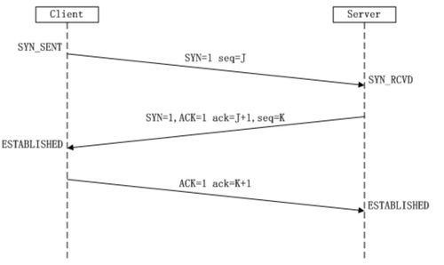

# Java网络编程

## I/O流

I/O：Input/Output，用于处理设备间的数据传输。如文件读写，网络通讯等。

**流的分类**

* 数据单位区分：**字节流(8 bit，一般用于文件)** ，**字符流(16 bit，一般用于文本)**
* 流向区分：输入流，输出流
* 流的角色区分：**节点流[^1]，处理流[^2]**


### I/O流体系

| 分类       |      字节输入流       |       字节输出流       |     字符输入流      | 字符输出流           |
| ---------- | :-------------------: | :--------------------: | :-----------------: | :------------------- |
| 抽象基类   |     `InputStream`     |     `OutputStream`     |      `Reader`       | `Writer`             |
| 文件流[^3] |   `FileInputStream`   |   `FileOutputStream`   |    `FileReader`     | `FileWriter`         |
| 缓冲流[^4] | `BufferedInputStream` | `BufferedOutputStream` |  `BufferedRTeader`  | `BufferedWriter`     |
| 转换流     |                       |                        | `InputStreamReader` | `OutputStreamWriter` |
| 对象流     |  `ObjectInputStream`  |  `ObjectOutputStream`  |                     |                      |


### 字符流

用于文本文件(.txt,.hava,.c,.cpp等)

#### FileReader

读取`hello.txt`文件 

~~~JAVA
//JVM无法关闭物理连接，如数据库连接，输入输出流，Socket连接，所以一定要手动关闭流
//异常处理：为保证资源一定可以关闭。使用try-catch-finally处理异常。
FileReader fileReader = null;
try {
    //1、实例化File类对象
    File file = new File("hello.txt");
    //2、提供具体的操作流
    fileReader = new FileReader(file);
    //3、数据的读入 read():返回读入的一个字符、如果达到文件末尾，返回-1
    int data;
    while ((data = fileReader.read()) != -1) {
        System.out.println((char) data);
        data = fileReader.read();
    }
}catch(FileNotFoundException e) {
    e.printStackTrace();
} catch (IOException e) {
    e.printStackTrace();
}finally {
    //4、关闭流
    try {
        if(fileReader != null) fileReader.close();
    } catch (IOException e) {
        e.printStackTrace();
    }
}
~~~

其他`read()`的重载方法

```java
//按照指定长度的char数组读取。
char[] cbuf = new char[5];
fileReader.read(char[] cbuf); //读取的字符会一次写入char数组并覆盖值。
```

#### FileWriter

写出数据到硬盘文件

```java
FileWriter fileWriter = null;
try {
    //1、提供Fiel类的对象，如果不存在则自动闯江湖
    File file = new File("hello.txt");
    //2、new FileWriter对象，用于数据写出
    fileWriter = new FileWriter(file);
    //new FileWriter(file,true); FileWriter的构造函数可以指定对文件覆盖还是接着写。
    //3、写出
    fileWriter.write("Hello \n");// "\n"换行
    fileWriter.write("World!");

}catch-finally {
    //4、判断如果不为空关闭流
    fileInputStream.close();
    fileOutputStream.close();
}
```


### 字节流

对于非文本文件(.jpg,.mp3,.doc等)，用字节流处理。

#### FileInputStream & FileOutputStream

使用字节流复制图片

```java
FileInputStream fileInputStream = null;
FileOutputStream fileOutputStream = null;
try {
    //1、实例化File类对象
    File srcFile = new File("ima1.jpg");
    File targetFile = new File("ima2.jpg");
    //2、提供具体的操作流
    fileInputStream = new FileInputStream(srcFile);
    fileOutputStream = new FileOutputStream(targetFile);
    //3、复制
    byte[] buffer = new byte[5]; //字节流采用byte数组读取
    int len;
    while ((len = fileInputStream.read(buffer)) != -1) {
        fileOutputStream.write(buffer,0,len);//从byte数组中的第0个位置写出len个长度
    }
}catch-finally {
    //4、判断如果不为空关闭流
    fileInputStream.close();
    fileOutputStream.close();
}

```


### 缓冲流

`BufferedInputStream`  `BufferedOutputStream`  `BufferedRTeader`  `BufferedWriter`

相较于节点流的读取，写入有速度提升。

~~~java
BufferedInputStream bufferInStream = null;
BufferedOutputStream bufferOutStream = null;
try {
    //1、实例化File类对象
    File srcFile = new File("ima1.jpg");
    File targetFile = new File("ima1.jpg");
    //2.1、提供具体的操作流
    FileInputStream fileInputStream = new FileInputStream(srcFile);
    FileOutputStream fileOutputStream = new FileOutputStream(targetFile);
    //2.2、new 缓冲流实例
    bufferInStream = new BufferedInputStream(fileInputStream);
    bufferOutStream = new BufferedOutputStream(fileOutputStream);
    //3、复制
    byte[] buffer = new byte[10];
    int len;
    while ((len = bufferInStream.read(buffer)) != -1) {
        bufferOutStream.write(buffer,0,len);
        //bufferOutStream.flush(); 用于手动刷新缓冲区。缓冲区size满了时会自动刷新
        //bufferReaer.readLine(); 可以用于读取文本文件中的一行数据。
    }
}catch-finally {
    //4、判断如果不为空关闭流。关闭处理流时应先关闭外出流，再关闭里层
    //但处理流的close方法会调用其内部节点流的close方法，无需我们再关闭。
    bufferInStream.close();
    bufferOutStream.close();
}
~~~


**注：**利用I/O流复制文件时可以通过利用以下方式异或加密/解密文件；

> c =  a ^ b ;   #其中^为异或符号
>
> a =  c ^ b ;

其他运算符 >> 、<<  、>>> 、<<< 即位运算，对某数的二进制**补码[^5]**进行位运算。

> 其中<< 低位补0 ；
>
> 其中>>为正数时高位补0，负数时高位补1；
>
> 而>>>、<<<则缺位都补0


### 转换流 

提供字节流与字符流之间的转换。属于字符流。

* `InputStreamReader`:将一个字节的输入流转换为字符的输入流；
* `OutputStreamWriter`:将一个字符的输出流转换成字节的输出流；

~~~java
FileInputStream fis = new FileInputStream("hello.txt");
//将要一个InputStream传入构造器，第二个参数设置字符集，默认为系统字符集。
InputStreamReader isr = new InputStreamReader(fis,"UTF-8");

FileOutputStream fos = new FileOutputStream("hello.txt");
OutputStreamWriter osw = new OutputStreamWriter(fos,"gbk");

~~~

**注：** ASCALL码数字 ‘ 0 ’ = 48;' A ' = 65;' a ' = 97 


### 标准流

详见<a id="standerStream" href="#test2">常见算法题2</a>


### 对象流

`ObjectoutputStream`和`ObjectInputStream`用于存储和读取**基本数据类型**数据或**对象**类型数据的处理。可以将Java中的对象写入到数据源中，也可以把对象从数据源中还原回来。

* **序列化**：用`ObjectoutputStream`类保存基本数据类型或对象的过程。
* **反序列化**：用`ObjectInputStream`类读取基本数据类型或对象的过程。

**注：**`ObjectoutputStream`和`ObjectInputStream`都不能序列化`static`和`transient[^6]修饰的成员变量。

**对象序列化机制**允许把内存中的Java对象转换成与平台无关的二进制流，从而允许将其保存到磁盘或进行网络传输。当其他程序获取这种二进制流，就可以恢复成原来的Java对象。

任何实现了`Serializable`接口的对象都可以被转换成字节数据，在保存和传输时可被还原。

* `Serializable`接口为标识接口，其中没有任何方法需要实现。
* 实现`Serializable`接口必须提供一个`static`和`final`标识且名为的`serialVersionUID`的`long`型属性以识别不同的类。

* 如果没有显示提供`serialVersionUID`Java会自动生成一个值。但如果对类序列化之后修改类，则在反序列化过程中会报`InvalidClassException`的异常。
* 需要序列化的类其所有属性都需要实现序列化接口。（默认情况下，基本属性类型可序列化）


### 常见算法题

统计某字符串或文本上每个字符出现的次数。

```java
String s = "12dfakaldjkl";
//将字符串转换为字符数组
char[] arr = s.toCharArray();
//利用Map记录出现次数
Map<Character, Integer> map = new HashMap<Character, Integer>();
for (char c : arr) {
    map.put(c, !map.containsKey(c) ? 1 : map.get(c) + 1);
}
//利用Iterator遍历Map
Iterator<Map.Entry<Character, Integer>> iterator = map.entrySet().iterator();
while (iterator.hasNext()){
    Map.Entry<Character, Integer> entry = iterator.next();
    System.out.println(entry.getKey()+":"+entry.getValue());
}
```

读取控制台输入的整行字符串并转换成大写输出。<a id="test2" href="#standerStream">↵</a>

```java
BufferedReader br = null;
try {
    //将标准输入流System.in -> 转化流InputStreamReader -> BufferedReader
    InputStreamReader isr = new InputStreamReader(System.in);
    br = new BufferedReader(isr);
    while (true) {
        String s = br.readLine();//每读取到换行符就结束
        if ("exit".equals(s))
            break;
        System.out.println(s.toUpperCase());
    }
}catch-finally {
    //判断如果不为空关闭流
    br.close();
}
```

***


[^1]: 最基础的直接作用于数据的流。
[^2]: 内嵌节点流的流，可以对节点流进行处理的流。
[^3]: 节点流。**所有处理流都必须将对应节点流传入才可使用**
[^4]: 处理流的一种，作用于对应节点流。
[^5]: 即反码+1，正数原码，反码，补码都一样。负数反码为原码除符号位其他位取反。
[^6]: `transient`关键字用于指定属性不可以被序列化。

***


## 网络编程

Java提供了对网络应用程序的支持。其提供的网络类库可以实现无痛 的网络连接，底层的细节由JVM控制。并且Java实现了要给跨平台的网络库。

网络编程目的：直接或简介的通过网络协议与其他计算机通讯，实现数据交换。


### 通讯要素

#### IP和端口号

Java中使用`InetAddress`类封装IP。常用方法如下：

```java
try {
    //IP地址获取
    InetAddress inetAddress1 = InetAddress.getByName("192.168.12.16");
    //域名获取
    InetAddress inetAddress2 = InetAddress.getByName("www.4399.com");
    //获取本机地址
    InetAddress localHost = InetAddress.getLocalHost();

    //常用方法
    localHost.getHostName();    //获取域名 
    localHost.getAddress();     //获取地址
} catch (UnknownHostException e) {
    e.printStackTrace();
}
```

端口号标识正在计算机上运行的进程（程序）。

* 不同进程有不同的端口号
* 被稳定为一个16位的整数0~65535
* 端口分类：
  * 公认端口：0~1023.预先被定义的服务通信占用。
  * 注册端口：1024~49151：分配给用户进程或应用程序。
  * 动态/私有端口：49152~65535.

端口号和IP地址组合得到网络套接字：**Socket**


### 网络协议

计算机网络中实现通信的一些约定。

**TCP协议**

TCP协议报文格式


通过“**三次握手**”建立点对点，**可靠**连接，形成传输数据通道。



传输完毕通过”**四次挥手**“释放以建立的连接。


**UDP协议**

* 不需要建立连接，不需要确认，不可靠。
* 数据报大小限制再64K。


### TCP网络编程

单元测试模拟客户端和服务器通信。客户端上传图片给服务器，服务器接收后返回确认信息并关闭连接。Java1.7之后多用<a id="tcpCode" href="#nioCode">NIO</a>实现

```java
@Test
public void server(){
    //创建ServerSocket对象，指明开放端口。
    serverSocket = new ServerSocket(8899);

    //开启循环，让服务器一直监听8899端口以接收上传
    while(true) {
        //通过serverSocket获取Socket对象
        socket = serverSocket.accept();
        //读取输入流
        inputStream = socket.getInputStream();

        //读取数据
        fileOutputStream = new FileOutputStream(new File("src/image.jpg"));
        byte[] buffer = new byte[1024];
        int len;
        while ((len = inputStream.read(buffer)) != -1) {
            fileOutputStream.write(buffer, 0, len);
        }

        //返回客户端完成信息
        OutputStream outputStream = socket.getOutputStream();
        outputStream.write("上传成功！".getBytes());
        socket.shutdownOutput();
    }
    //对所有流判读如果流不为空则关闭流
    try-catch-finally... stream.close();
}
```

```java
@Test
public void client(){
    //指定访问的主机的IP地址，创建Socket对象
    InetAddress inetAddress = InetAddress.getByName("127.0.0.1");
    socket = new Socket(inetAddress, 8899);

    //通过Socket获取输出流（向服务器发送数据）和输入流（接收服务器发回的信息）
    outputStream = socket.getOutputStream();
    inputStream = socket.getInputStream();

    //上传图片到服务器
    fileInputStream = new FileInputStream(new File("src/1.jpg"));
    byte[] buffer = new byte[1024];
    int len;
    while((len = fileInputStream.read(buffer)) != -1){
        outputStream.write(buffer,0,len);//向客户端发送数据
    }
    //客户端关闭socket的输出
    socket.shutdownOutput();

    //将服务器返回的数据输出到控制台
    //ByteArrayOutputStream类可以通过内嵌的可变byte数组保存字节数据，并一次性写出。
    baoStream = new ByteArrayOutputStream();
    while ((len = inputStream.read(buffer)) != -1){
        baoStream.write(buffer,0,len);//将字节数据保存到baoStream中
    }
    System.out.println(baoStream.toString());
    //对所有流判读如果流不为空则关闭流
    try-catch-finally... stream.close();
}
```


### UDP网络编程

单元测试模拟接收，发送数据。

```java
@Test
public void Receptor(){
    DatagramSocket datagramSocket = null;
    try {
        //实例化UDEP连接的DatagramSocket对象
        datagramSocket = new DatagramSocket(8899);

        //实例化数据报对象DatagramPacket
        byte[] data = new byte[1024];
        DatagramPacket datagramPacket = new DatagramPacket(data,0,data.length);

        while (true) {//循环接收数据，并输出到控制台
            datagramSocket.receive(datagramPacket);
            System.out.println(new String(datagramPacket.getData()));
        }
    }
    //对所有资源判断不为空则关闭
    try-catch-finally... datagramSocket.close();
}
```

```java
@Test
public void Sender(){
    DatagramSocket datagramSocket = null;
    try {
        //实例化UDEP连接的DatagramSocket对象
        datagramSocket = new DatagramSocket();

        //实例化数据报
        byte[] data = "Hello World！".getBytes();
        InetAddress inetAddress = InetAddress.getLocalHost();
        DatagramPacket datagramPacket = new DatagramPacket(data,0,data.length,inetAddress,8899);

        //发送数据
        datagramSocket.send(datagramPacket);
    } 
    //对所有资源判断不为空则关闭
    try-catch-finally... datagramSocket.close();
}
```


### URL类

URL(Uniform Resource Locator)：统一资源定位符，表示Internet上某一资源的地址。

格式：

http://192.168.100:8080/helloworld/index.html?username=Tom

协议		地址		端口号				资源地址				参数列表

```java
try {
    //实例化URL对象
    URL url = new URL("http://www.baidu.com");
    //建立连接
    httpURLConnection = (HttpURLConnection) url.openConnection();
    httpURLConnection.connect();

    //获取数据
    inputStream = httpURLConnection.getInputStream();

    //将数据写入磁盘
    fileOutputStream = new FileOutputStream(new File("index.html"));
    byte[] data = new byte[1024];
    int len;
    while((len = inputStream.read(data)) != -1){
        fileOutputStream.write(data,0,len);
    }
} 
//对所有资源判断不为空则关闭
try-catch-finally... datagramSocket.close();
```


## NIO

Java 1.4之后开始引入的一套新的IO API，与原来的IO作用和目的相同，但使用方式不同。可以替代标准的Java IO API。

IO是面向流的。NIO支持面向缓冲区、基于通道的IO操作。

相较于传统IO。NIO是非阻塞式的。 

Java NIO核心在于通道（Channel）和缓冲区（Buffer）。通道表示打开对IO设备（文件、套接字等）的连接。然后操作缓冲区，对数据进行处理。即**Channel负责传输，Buffer负责存储**。

### 缓冲区（Buffer）

缓冲区（Buffer）：在Java NIO中负责数据的存取。

* 底层实现是数组。

* 除`boolean`类型外，所有基本数据类型都有对应的缓冲区。

直接缓冲区：通过`allocatedDirect()`方法分配，将缓冲区建立再物理内存中。

非直接缓冲区：通过`allocated()`方法分配，建立再JVM内存中。

常用方法：

```java
 /** Buffer中的四个指针
  * private int mark = -1;       //用于标记位置，以供position跳转
  * private int position = 0;    //正在操作数据的位置
  * private int limit;           //读取数据时，可操作数据的大小
  * private int capacity;        //buffer容量
  */
ByteBuffer buffer = ByteBuffer.allocate(1024);
ByteBuffer directBuffer = ByteBuffer.allocateDirect(1024);

//存入数据
buffer.put("abcd".getBytes());
buffer.put("efg".getBytes());	//不会覆盖之前的信息。

//切换为读取数据模式
buffer.flip();

//读取缓冲区数据
byte[] data = new byte[buffer.limit()];
buffer.get(data);

//恢复可读指针limit
buffer.rewind();

//重置缓冲区，其数据并未删除，单指针已经重置
buffer.clear();

//mark标记当前position位置，reset让position跳转到上一次mark表级的位置
buffer.mark();
buffer.reset();

//查看缓冲区是否有剩余
if(buffer.hasRemaining()){
    System.out.println(buffer.remaining());
}
```

### 通道（Channel）

通道（Channel）:由java.nio.channels包定义的，表示IO源与目标打开的连接。

* 通道不能直接访问数据，只能与Buffer进行交互。
* **主要实现类**:

```java
java.nio.channels.Channel
    |==SelectableChannel
	    |--SocketChannel
    	|--ServerSocketChannel
    	|--DatagramChannel
    
    	|--Pipe.SinkChannel
    	|--Pipe.SourceChannel
    |--FileChannel
```


#### 获取Channel的方式

1. 对应流的`getChannel()`方法获得对应的`Channel`

```java
FileInputStream fileInputStream = new FileInputStream("1.jpg");
FileOutputStream fileOutputStream = new FileOutputStream("2.jpg");
//获得Channel
FileChannel inChannel = fileInputStream.getChannel(); 	//底层也是调用open()方法
FileChannel outchannel = fileOutputStream.getChannel();
```

2. 各通道实现类的静态方法`open()`获得

```java
//获取可读通道，open()方法第二个参数为可变参数，可以通过StanderOpenOption枚举添加操作限权
FileChannel inChannel = FileChannel.open(Paths.get("src/1.jpg"), StandardOpenOption.READ);
//获取可写通道
FileChannel outChannel = FileChannel.open(Paths.get("src/2.jpg"), StandardOpenOption.READ, StandardOpenOption.WRITE, StandardOpenOption.CREATE);
```

3. `Files`工具类的`newByteChannel()`方法

```java
FileChannel inChannel = Files.newByteChannel(Paths.get("src/1.jpg"), StandardOpenOption.READ);
```


#### Channel传输数据的方式

1. 通过`Buffer`传输

```java
//获得Buffer
ByteBuffer buffer = ByteBuffer.allocate(1024);
while(inChannel.read(buffer) != -1){
    buffer.flip();              //切换buffer模式
    outchannel.write(buffer);   //写入
    buffer.clear();             //请空buffer
}
```

2. 通过Channel的`transferFrom()`和`transferTo()`方法

```java
inChannel.transferTo(0,inChannel.size(),outChannel);
outChannel.transferFrom(inChannel,0,inChannel.size());
```

**注：**其channel底层实现也是通过方式一。

3. 通过直接缓冲区传输

```java
//获取直接缓冲区
MappedByteBuffer inMapBuffer = inChannel.map(FileChannel.MapMode.READ_ONLY, 0, inChannel.size());
MappedByteBuffer outMapBuffer = outChannel.map(FileChannel.MapMode.READ_WRITE, 0, inChannel.size());

//存入数据方式一
outMapBuffer.put(inMapBuffer);

//存入数据方式二
byte[] data = new byte[inMapBuffer.limit()];
inMapBuffer.get(data);
outMapBuffer.put(data);			
```


### 字符集（Charset）
* 编码`Encoder`： 字符串 -> 字节数组
* 解码`Decider`： 字节数组 -> 字符串

```java
//获取字符集，编码器，解码器
Charset charset = Charset.forName("GBK");
CharsetEncoder encoder = charset.newEncoder();
CharsetDecoder decoder = charset.newDecoder();

CharBuffer charBuffer = CharBuffer.allocate(1024);
charBuffer.put("Hello world!");
charBuffer.flip();

ByteBuffer byteBuffer = encoder.encode(charBuffer); //编码
CharBuffer decode = decoder.decode(byteBuffer);     //解码
```


### NIO实现网络通信（阻塞式）

单元测试模拟通过NIO实现网络通信，与<a id="nioCode" href="#tcpCode">TCP网络编程</a>基本类似

```java
@Test
public void Server(){
    //获取服务端的SocketChannel
    ServerSocketChannel serverSocket = ServerSocketChannel.open();
    serverSocket.bind(new InetSocketAddress(8899));
    SocketChannel socket = serverSocket.accept();

    FileChannel fileChannel = FileChannel.open(Paths.get("src/2.jpg"), StandardOpenOption.READ, StandardOpenOption.WRITE,StandardOpenOption.CREATE);

    //存数据
    ByteBuffer buffer = ByteBuffer.allocate(1024);
    while (socket.read(buffer) != -1){
        buffer.flip();
        fileChannel.write(buffer);
        buffer.clear();
    }

    //返回客户端结果
    buffer.put("Success!".getBytes());
    buffer.flip();
    socket.write(buffer);
    socket.shutdownOutput();
    try-catch-finally... //关闭通道
}
```

```java
@Test
public void Client() throws IOException {
    //获取SocketChannel
    SocketChannel socket = SocketChannel.open(new InetSocketAddress("127.0.0.1",8899));

    //获取FileChannel
    FileChannel fileChannel = FileChannel.open(Paths.get("src/1.jpg"), StandardOpenOption.READ);

    //向服务器传输数据
    ByteBuffer buffer = ByteBuffer.allocate(1024);
    while (fileChannel.read(buffer) != -1){
        buffer.flip();
        socket.write(buffer);
        buffer.clear();
    }
    //关闭输出
    socket.shutdownOutput();

    //接收服务端返回消息
    while (socket.read(buffer) != -1){
        buffer.flip();
        System.out.println(new String(buffer.array(),0,buffer.limit()));
    }
    try-catch-finally... //关闭通道
}
```


### NIO实现网络通信（非阻塞式）

#### Selector（选择器）

利用`Selector`（选择器）检查一个或多个NIO `Channel`（通道）的状态。如此可以实现单线程管理多个`Channels`，以管理多个网络链接。

```java
@Test
public void Server() throws IOException {
    //获取服务端通道并绑定端口
    ServerSocketChannel serverSocket = ServerSocketChannel.open();
    serverSocket.configureBlocking(false); //设置非阻塞模式
    serverSocket.bind(new InetSocketAddress(8899));

    //获取选择器
    Selector selector = Selector.open();
    /**
     *SelectionKey.OP_CONNECT     连接就绪事件，表示客户都和服务器的连接已经建立成功
     *SelectionKey.OP_ACCEPT      接收连接事件，表示服务器可以接收客户端连接
     *SelectionKey.OP_READ        读就绪事件，表示可以从通道取出数据
     *SelectionKey.OP_WRITE      写就绪事件，表示可以向通道写入数据
     */
    //将通道注册在选择器上，并指定监听事件
    serverSocket.register(selector, SelectionKey.OP_ACCEPT);
    
    //selector的select()方法会在至少有一个channel准备就绪时返回值，否则一直等待
    while(selector.select() > 0){

        //selectedKey表示SelectableChannel再Selector中的注册的标记/句柄
        //可以通过selectedKey获得Channel和Selector
        //Set<SelectionKey> keys = selector.keys();     //获取所有selectedKey

        //获取相关事件已经被Selector捕获的SelectionKey
        Iterator<SelectionKey> iterator = selector.selectedKeys().iterator();

        //遍历所有selectedKey
        while(iterator.hasNext()){
            SelectionKey selectionKey = iterator.next();

            //当有请求连接时
            if(selectionKey.isAcceptable()){
                //与客户端建立SocketChannel连接
                ServerSocketChannel channel = (ServerSocketChannel) selectionKey.channel();
                SocketChannel socketChannel = channel.accept();

                //设置为非阻塞模式并注册到selector中
                socketChannel.configureBlocking(false);
                socketChannel.register(selector,SelectionKey.OP_READ);

                //返回客户端连接成功信息。
                socketChannel.write(getByteBufferMsg("连接成功"));
                socketChannel.shutdownOutput();
            }
            //当客户端有数据传输过来时
            else if(selectionKey.isReadable()){
                //获得SocketChannel
                SocketChannel channel = (SocketChannel) selectionKey.channel();

                //输出信息到控制台
                printMsg(channel);
                channel.close();
            }
            //将处理好的SelectedKey清除
            iterator.remove();
        }
    }
}
```

```java
@Test
public void Client() throws IOException {
    //请求与服务器建立连接
    SocketChannel socketChannel = SocketChannel.open(new InetSocketAddress("127.0.0.1", 8899));

    //设置SocketChannel为非阻塞模式
    socketChannel.configureBlocking(false);

    //注册到Selector中
    Selector selector = Selector.open();
    socketChannel.register(selector,SelectionKey.OP_READ);

    main: //跳出循环所用的label，continue和break都可用
    //Selector循环监听事件
    while(selector.select() > 0) {
        //获取所有SelectionKey并遍历
        Iterator<SelectionKey> iterator = selector.selectedKeys().iterator();
        while (iterator.hasNext()){
            SelectionKey selectionKey = iterator.next();

            //当服务端有信息发过来时
            if(selectionKey.isReadable()){
                //获得SocketChannel
                SocketChannel channel = (SocketChannel) selectionKey.channel();

                //输出接收的信息
                printMsg(channel);
                channel.shutdownInput();

                //注册当前SocketChannel可向服务端写出数据
                channel.register(selector,SelectionKey.OP_WRITE);
            }
            //当已经注册可向服务端发送数据时
            else if(selectionKey.isWritable()){

                //向服务端发送信息。
                socketChannel.write(getByteBufferMsg("Hello world!"));
                socketChannel.close();

                //结束程序
                break main;
            }
            iterator.remove();
        }
    }
}
```

以上连接是基于TCP的，对与UDP的连接来说，只需通过`DatagramChannel.open()`方法即可获取到对应的`DatagramChannal`通道。并且作为单向传输的协议，发送端不要设置端口号，只需要指定接收端的地址和端口号即可。

```java
//发送端：
//获取Channel
DatagramChannel channel = DatagramChannel.open();
//向目标地址发送
channel.send(buffer,new InetSocketAddress("127.0.0.1",8899));
```

```java
//接收端
//绑定端口
channel.bind(new InetSocketAddress(8899));
//将通道注册在选择器上，并指定监听事件
channel.register(selector, SelectionKey.OP_ACCEPT);
```


### 管道（Pipe)

Java NIO管道是两个线程之间的单向数据连接。通过`Pipe`有一个提供写入数据的`Sink`通道和一个提供数据读取的`Source`通道。

```java
//获取Pipe
Pipe pipe = Pipe.open();

//获取SinkChannel
Pipe.SinkChannel sink = pipe.sink();
sink.write(buffer);

//获取SourceChannel
Pipe.SourceChannel source = pipe.source();
source.read(buffer);
```


***


