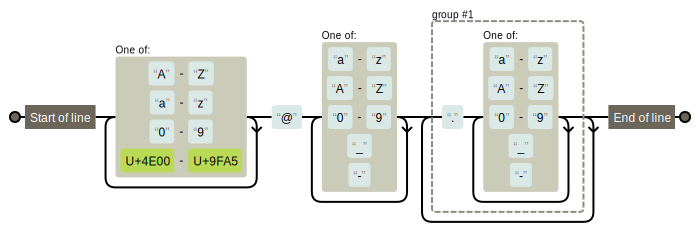

# REGEXP正则表达式

> `Regular Expressions`使用单个字符串来描述、匹配一系列匹配某个句法规则的字符串由一类特殊字符及文本字符。

正则表达式通过专门的软件模块进行编译，执行处理，比如`PCRE`。

正则表达式中的匹配元字符大概分为四类：字符匹配、匹配次数、位置锚定、分组

Linux下可以通过`man 7 regex`查看相关帮助。

分为基本正则表达式`BRE`和扩展正则表达式`ERE`。`ERE`相较于`BRE`不需要对如`(`,`)`,`[`,`]`,`+`,`|`等元字符转义，但部分语言不支持`ERE`。

**注：**Linux下的通配符用于匹配文件名，正则表达式可以用于匹配文件名，但更多的是用于文本的匹配


## 字符匹配

> `.`：匹配除了`/n`,`/r`的任意一个字符
>
> `[]`：匹配指定返回内的任意一个字符，如：`[wang]`， `[0-9]`，`[a-zA-Z]`
>
> `[^]`：匹配范围外的任意字符
>
> `[:alnum:]`：匹配单个字母和数字
>
> `[:alpha:]`：匹配单个字母
>
> `[:lower:]`：匹配单个小写字母`[:upper:]`：匹配大写字母
>
> `[:blank:]`：匹配 空格 和 制表符
>
> `[:digit:]`：匹配十进制数字`[:xdigit:]`：匹配十六进制数字
>
> `[:punct:]`：匹配标点符号

**注：**`'.'`表示匹配单个任意字符，而在`[]`中表示字符`'.'`。如果想要不在`[]`中匹配字符`'.'`可以使用`\`对`'.'`进行转义

示例：

> `“a.b”` => 包含`a + 任意字符 + b`的行
>
> `"[^abc]"` => 包含除了`a`,`b`,`c`有任意字符的行
>
> ` "[[:digit:]]"` => 匹配单个数字


## 匹配次数

在指定字符后添加可以指定该字符出现的次数：

> `*`：匹配任意次数，包括 0 次
>
> `\?`：匹配 0 或 1 次
>
> `\+`：至少匹配 1 次
>
> `\{n\}`：匹配 n 次
>
>  `\{m,n\}`：至少匹配 m 次，至多匹配 n 次
>
> `\{,n\}`：至多匹配 n 次
>
> `\{n,\}`：至少匹配 n 次

示例：

> `"g.*gle"` => 匹配`g + 任意个数字符 + gle`
>
> `go\{2,3\}gle` => 匹配`g + 2-3个o + gle`


## 位置锚定

对匹配字符的位置进行锚定：

> `^`：行首
>
> `$`：行尾
>
> ​      `^PATTERN$`：`^`和`$`联用可以整行匹配
>
> ​      `^&`：表示空行
>
> ​      `^[[:space:]]*&`：表示空白行
>
> `\<`：单词开头，`\>`：单词结尾（数字，字母，下划线都会被算入单词）两个符号都可以用`\b`替换

特别注意的是，如果没有添加`\<`和`\>`，单词中间符合匹配模式的字符串也会被查出来，比如查询"123"，在"01234"中也会被查出来，如果不希望查出，请务必添加该锚定。

> `"^goo"` => 匹配以`goo`开头的一行
>
> `"^google&"` => 匹配内容仅为`google`的一行


## 分组

想要对某个字符串进行匹配可以用`()`将匹配的内容括起来匹配，但`(`和`)`都属于特殊字符，需要转义，即使用`\( \)`即可。

正则表达式引擎会将分组中模式匹配的内容存入内部变量中，命名方式为`\1`,`\2`,`\3`... 这通常称为后项引用

需要注意的是，后项引用所指向的是第 n 组匹配的值，而非匹配模式，例如：

> `\([0-9]\{3\}\).*\1` => 表示的是匹配三个数字，并且该行之后再次出现了这三个数字的行

且，当有嵌套关系的时候`\n`表示从左边起，第 n 个括号中的内容：

> `\(string_a\+\(string_b\)\)`
> `\1` => `string_a\+\(string_b\)`
> `\2` => `string_b`

可以使用`\|`将相同匹配模式的分组合并，例如匹配`a`或`b`开头的行

> `^\(a\|b\)`


## 其他特殊元字符

| 字符 | 描述                                                         |
| ---- | ------------------------------------------------------------ |
| \B   | 匹配非单词边界。'er\B' 能匹配 "verb" 中的 'er'，但不能匹配 "never" 中的 'er'。 |
| \cx  | 匹配由 x 指明的控制字符。例如， \cM 匹配一个 Control-M 或回车符。x 的值必须为 A-Z 或 a-z 之一。否则，将 c 视为一个原义的 'c' 字符。 |
| \d   | 匹配一个数字字符。等价于 [0-9]。                             |
| \D   | 匹配一个非数字字符。等价于 \[^0-9]。                         |
| \f   | 匹配一个换页符。等价于 \x0c 和 \cL。                         |
| \n   | 匹配一个换行符。等价于 \x0a 和 \cJ。                         |
| \r   | 匹配一个回车符。等价于 \x0d 和 \cM。                         |
| \s   | 匹配任何空白字符，包括空格、制表符、换页符等等。等价于 [ \f\n\r\t\v]。 |
| \S   | 匹配任何非空白字符。等价于 [\^ \f\n\r\t\v]。                 |
| \t   | 匹配一个制表符。等价于 \x09 和 \cI。                         |
| \v   | 匹配一个垂直制表符。等价于 \x0b 和 \cK。                     |
| \w   | 匹配字母、数字、下划线。等价于'[A-Za-z0-9_]'。               |
| \W   | 匹配非字母、数字、下划线。等价于 '\[^A-Za-z0-9_]'。          |
| \xn  | 匹配 n，其中 n 为十六进制转义值。十六进制转义值必须为确定的两个数字长。例如，'\x41' 匹配 "A"。'\x041' 则等价于 '\x04' & "1"。正则表达式中可以使用 ASCII 编码。 |
| \num | 匹配 num，其中 num 是一个正整数。对所获取的匹配的引用。例如，'(.)\1' 匹配两个连续的相同字符。 |
| \n   | 标识一个八进制转义值或一个向后引用。如果 \n 之前至少 n 个获取的子表达式，则 n 为向后引用。否则，如果 n 为八进制数字 (0-7)，则 n 为一个八进制转义值。 |
| \nm  | 标识一个八进制转义值或一个向后引用。如果 \nm 之前至少有 nm 个获得子表达式，则 nm 为向后引用。如果 \nm 之前至少有 n 个获取，则 n 为一个后跟文字 m 的向后引用。如果前面的条件都不满足，若 n 和 m 均为八进制数字 (0-7)，则 \nm 将匹配八进制转义值 nm。 |
| \nml | 如果 n 为八进制数字 (0-3)，且 m 和 l 均为八进制数字 (0-7)，则匹配八进制转义值 nml。 |
| \un  | 匹配 n，其中 n 是一个用四个十六进制数字表示的 Unicode 字符。例如， \u00A9 匹配版权符号 (?)。 |


# 常用示例

推荐Regex可视化工具：[Regexper](https://regexper.com/) 

其可将正则表达式输入查看执行过程：

```regex
^[A-Za-z0-9\u4e00-\u9fa5]+@[a-zA-Z0-9_-]+(\.[a-zA-Z0-9_-]+)+$
```




**截取文件基名：**

通过以下方式匹配文件的后缀名，然后替换为空，即可

```bash
\.[^.]*$
```


以下内容取自[](https://github.com/cdoco/common-regex)，删除了其中的正则可视图片

## 目录

- [邮箱](#邮箱)
- [电话](#电话)
- [域名](#域名)
- [IP](#ip)
- [帐号校验](#帐号校验)
- [字符校验](#字符校验)
  - [汉字](#汉字)
  - [英文和数字](#英文和数字)
  - [长度为3-20的所有字符](#长度为3-20的所有字符)
  - [英文字符](#由英文字符)
    - [由26个英文字母组成的字符串](#由26个英文字母组成的字符串)
    - [由26个大写英文字母组成的字符串](#由26个大写英文字母组成的字符串)
    - [由26个小写英文字母组成的字符串](#由26个小写英文字母组成的字符串)
    - [由数字和26个英文字母组成的字符串](#由数字和26个英文字母组成的字符串)
    - [由数字、26个英文字母或者下划线组成的字符串](#由数字26个英文字母或者下划线组成的字符串)
  - [中文、英文、数字包括下划线](#中文英文数字包括下划线)
  - [中文、英文、数字但不包括下划线等符号](#中文英文数字但不包括下划线等符号)
  - [禁止输入含有^%&',;=?$\"等字符](#禁止输入含有等字符)
  - [禁止输入含有~的字符](#禁止输入含有的字符)
- [数字正则](#数字正则)
  - [整数](#整数)
    - [正整数](#正整数)
    - [负整数](#负整数)
    - [非负整数](#非负整数)
    - [非正整数](#非正整数)
  - [浮点数](#浮点数)
    - [正浮点数](#正浮点数)
    - [负浮点数](#负浮点数)
    - [非负浮点数](#非负浮点数)
    - [非正浮点数](#非正浮点数)

## 邮箱

`gaozihang-001@gmail.com` 只允许英文字母、数字、下划线、英文句号、以及中划线组成

```regex
^[a-zA-Z0-9_-]+@[a-zA-Z0-9_-]+(\.[a-zA-Z0-9_-]+)+$
```


`高子航001Abc@bowbee.com.cn` 名称允许汉字、字母、数字，域名只允许英文域名

```regex
^[A-Za-z0-9\u4e00-\u9fa5]+@[a-zA-Z0-9_-]+(\.[a-zA-Z0-9_-]+)+$
```


## 电话

`13012345678` 手机号

```regex
^1(3|4|5|6|7|8|9)\d{9}$
```


`XXX-XXXXXXX` `XXXX-XXXXXXXX` 固定电话

```regex
(\(\d{3,4}\)|\d{3,4}-|\s)?\d{8}
```


## 域名

`https://google.com/`

```regex
^((http:\/\/)|(https:\/\/))?([a-zA-Z0-9]([a-zA-Z0-9\-]{0,61}[a-zA-Z0-9])?\.)+[a-zA-Z]{2,6}(\/)
```


## IP

`127.0.0.1`

```regex
((?:(?:25[0-5]|2[0-4]\d|[01]?\d?\d)\.){3}(?:25[0-5]|2[0-4]\d|[01]?\d?\d))
```


## 帐号校验

`gaozihang_001` 字母开头，允许5-16字节，允许字母数字下划线

```regex
^[a-zA-Z][a-zA-Z0-9_]{4,15}$
```


## 字符校验

### 汉字

`高子航`

```regex
^[\u4e00-\u9fa5]{0,}$
```


### 英文和数字

```regex
^[A-Za-z0-9]+$
```


### 长度为3-20的所有字符

```regex
^.{3,20}$
```


### 英文字符

#### 由26个英文字母组成的字符串

```regex
^[A-Za-z]+$
```


#### 由26个大写英文字母组成的字符串

```regex
^[A-Z]+$
```


#### 由26个小写英文字母组成的字符串

```regex
^[a-z]+$
```


#### 由数字和26个英文字母组成的字符串

```regex
^[A-Za-z0-9]+$
```


#### 由数字、26个英文字母或者下划线组成的字符串 

```regex
^\w+$
```


### 中文、英文、数字包括下划线

```regex
^[\u4E00-\u9FA5A-Za-z0-9_]+$
```


### 中文、英文、数字但不包括下划线等符号

```regex
^[\u4E00-\u9FA5A-Za-z0-9]+$
```


### 禁止输入含有%&',;=?$\"等字符

```regex
[^%&',;=?$\x22]+
```


### 禁止输入含有~的字符

```regex
[^~\x22]+
```


## 数字正则

### 整数

```regex
^-?[1-9]\d*$
```


#### 正整数

```regex
^[1-9]\d*$
```


#### 负整数

```regex
^-[1-9]\d*$
```


#### 非负整数

```regex
^[1-9]\d*|0$
```


#### 非正整数

```regex
^-[1-9]\d*|0$
```


### 浮点数

```regex
^-?([1-9]\d*\.\d*|0\.\d*[1-9]\d*|0?\.0+|0)$
```


#### 正浮点数

```regex
^[1-9]\d*\.\d*|0\.\d*[1-9]\d*$
```


#### 负浮点数

```regex
^-([1-9]\d*\.\d*|0\.\d*[1-9]\d*)$
```


#### 非负浮点数

```regex
^[1-9]\d*\.\d*|0\.\d*[1-9]\d*|0?\.0+|0$
```


#### 非正浮点数

```regex
^(-([1-9]\d*\.\d*|0\.\d*[1-9]\d*))|0?\.0+|0$
```

